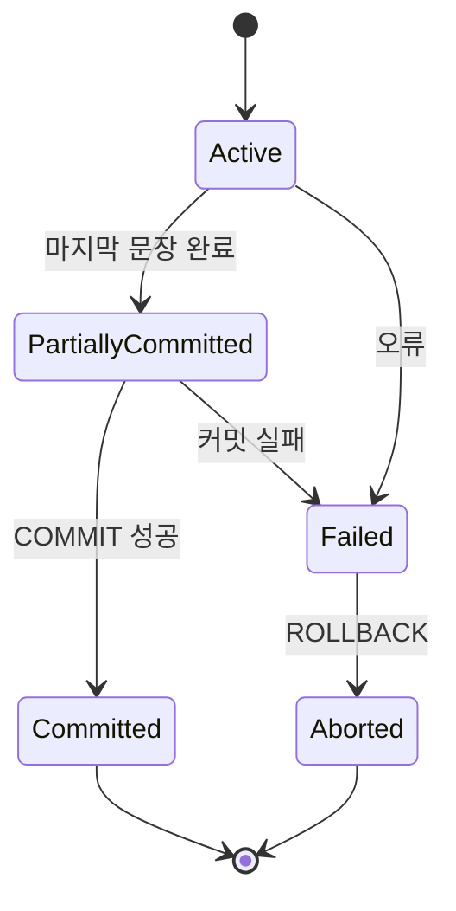

# 데이터 무결성, 트랜잭션

> 데이터가 잘못된 상태로 저장되지 않도록 무결성 규칙 설계, 재화 차감과 아이템 지급처럼 여러 변경을 하나의 트랜잭션으로 안전하게 처리, 격리 수준, 비관적·낙관적 잠금, 데드락, 중복 요청 방지까지 이해

---

## 8장, 9장 차이

- 8장에서 `INSERT`, `UPDATE`, `DELETE`로 데이터를 변경하는 방법. 여러 변경이 동시에 실행될 때도 데이터가 깨지지 않게 만드는 규칙을 다룬다.

게임 서버의 아이템 구매는 쉽게 끝나지 않는다.

1. 이미 처리한 요청인지 확인
2. 플레이어 재화를 차감
3. 인벤토리에 아이템을 지급
4. 구매 기록을 남김

이 중 일부만 반영되면 다음과 같은 문제가 발생한다.

- 재화만 차감되고 아이템이 지급되지 않는 부분
- 아이템은 지급되었지만 재화가 차감되지 않는 것
- 네트워크 재시도로 동일 아이템이 두 번 지급
- 동시에 들어온 요청이 서로의 변경을 덮어쓰는 것

이 문제를 해결하는 부분은 제약조건, 트랜잭션, 잠금, 조건부 갱신, 멱등성(Idempotency)이다.

---

## 스키마 준비

### `players`에 재화 열 추가

```sql
ALTER TABLE players
ADD COLUMN gold BIGINT UNSIGNED NOT NULL DEFAULT 0;
```

- `gold`: 플레이어가 가진 재화
- `version`: 낙관적 잠금에서 충돌을 감지하기 위한 버전, 8장에서 추가

### 아이템 보유 테이블 구조 확인

- 이미 테이블이 있다면 실행하지 말고 `SHOW CREATE TABLE player_items`로 비교

```sql
CREATE TABLE player_items (
  player_id BIGINT UNSIGNED NOT NULL,
  item_id BIGINT UNSIGNED NOT NULL,
  quantity INT UNSIGNED NOT NULL DEFAULT 1,
  acquired_at DATETIME NOT NULL DEFAULT CURRENT_TIMESTAMP,

  PRIMARY KEY (player_id, item_id),

  CONSTRAINT fk_player_items_player
    FOREIGN KEY (player_id) REFERENCES players(id)
    ON DELETE CASCADE,

  CONSTRAINT fk_player_items_item
    FOREIGN KEY (item_id) REFERENCES items(id)
    ON DELETE RESTRICT,

  CONSTRAINT chk_player_items_quantity
    CHECK (quantity > 0)
) ENGINE = InnoDB;
```

### 중복 요청 방지 테이블

```sql
CREATE TABLE purchase_requests (
  request_id VARCHAR(64) PRIMARY KEY,
  player_id BIGINT UNSIGNED NOT NULL,
  item_id BIGINT UNSIGNED NOT NULL,
  price BIGINT UNSIGNED NOT NULL,
  created_at DATETIME NOT NULL DEFAULT CURRENT_TIMESTAMP,

  CONSTRAINT fk_purchase_requests_player
    FOREIGN KEY (player_id) REFERENCES players(id),

  CONSTRAINT fk_purchase_requests_item
    FOREIGN KEY (item_id) REFERENCES items(id)
) ENGINE = InnoDB;
```

- 클라이언트나 서버가 구매 요청마다 고유한 `request_id`를 만들고, 같은 요청이 재시도되더라도 기본키 충돌로 중복 처리 방지

---

## 데이터 무결성

- 데이터 무결성(Integrity)은 데이터가 정확하고 일관된 상태를 유지하는 성질

| 종류                                | 지키려는 규칙                         | MySQL 구현                            |
| ----------------------------------- | ------------------------------------- | ------------------------------------- |
| 개체 무결성 (Entity Integrity)      | 각 행을 유일하게 식별                 | `PRIMARY KEY`                         |
| 참조 무결성 (Referential Integrity) | 참조하는 부모 행이 실제로 존재        | `FOREIGN KEY`                         |
| 도메인 무결성 (Domain Integrity)    | 값이 허용된 자료형, 범위, 형식을 만족 | 자료형, `NOT NULL`, `CHECK`           |
| 고유성 (Uniqueness)                 | 중복되면 안 되는 값의 중복을 막는다   | `UNIQUE`                              |
| 업무 규칙 (Business Rule)           | 서비스가 정한 상태 전이와 조건을 지킴 | 제약조건, 트랜잭션, 애플리케이션 검증 |

### 제약조건으로 규칙 강제

```sql
CREATE TABLE players_example (
  id BIGINT UNSIGNED AUTO_INCREMENT PRIMARY KEY,
  nickname VARCHAR(50) NOT NULL,
  email VARCHAR(100) NOT NULL UNIQUE,
  level INT UNSIGNED NOT NULL DEFAULT 1,
  vip_grade TINYINT UNSIGNED NOT NULL DEFAULT 0,
  guild_id BIGINT UNSIGNED NULL,

  CONSTRAINT chk_players_example_level
    CHECK (level >= 1),

  CONSTRAINT chk_players_example_vip_grade
    CHECK (vip_grade BETWEEN 0 AND 5),

  CONSTRAINT fk_players_example_guild
    FOREIGN KEY (guild_id) REFERENCES guilds(id)
    ON DELETE SET NULL
) ENGINE = InnoDB;
```

### 제약조건 설계 시 주의

- `CHECK`만으로 값의 필수 여부가 보장되는 것은 아니다. 필수 열에 `NOT NULL`도 사용
- 외래키의 자료형과 `UNSIGNED` 여부는 참조 대상 키와 맞춘다.
- 이메일, 요청 ID처럼 중복이 허용되지 않는 값은 애플리케이션 검사만 하지 말고 `UNIQUE`로 최종 방어
- MySQL은 `CHECK` 제약조건을 실제로 검사. 그보다 이전 버전은 문법을 받아들이고 무시할 수 있어 운영 버전을 확인한다.
- 제약조건 오류는 숨기지 말고 업무 오류로 변환해 호출자에게 명확히 전달

---

## MongoDB 무결성

- MongoDB의 `_id`에 기본적으로 고유 인덱스가 있으나, 관계형 데이터베이스의 외래키와 같은 참조 무결성을 자동으로 강제하지 않음

| 무결성            | MongoDB에서 구현                     |
| ----------------- | ------------------------------------ |
| 문서 식별         | `_id`의 고유성                       |
| 필드 자료형, 범위 | 컬렉션 Validator와 `$jsonSchema`     |
| 추가 고유성       | `createIndex(..., { unique: true })` |
| 컬렉션 간 참조    | 애플리케이션 검증 또는 트랜잭션      |

```js
await db.createCollection("players", {
  validator: {
    $jsonSchema: {
      bsonType: "object",
      required: ["nickname", "email", "level", "vipGrade", "gold"],
      properties: {
        nickname: {
          bsonType: "string",
          minLength: 1,
          maxLength: 50,
        },
        email: {
          bsonType: "string",
          pattern: "^.+@.+$",
        },
        level: {
          bsonType: "int",
          minimum: 1,
        },
        vipGrade: {
          bsonType: "int",
          minimum: 0,
          maximum: 5,
        },
        gold: {
          bsonType: ["int", "long", "decimal"],
          minimum: 0,
        },
        guildId: {
          bsonType: ["objectId", "null"],
        },
      },
    },
  },
  validationLevel: "strict",
  validationAction: "error",
});

await db.collection("players").createIndex({ email: 1 }, { unique: true });
```

- Validator는 잘못된 필드 타입과 범위를 막을 수 있으나 `guildId`가 실제 `guilds` 문서를 가리키는지 자동으로 확인되지 않는다.

> Validator를 새로 추가해도 기존 문서가 즉시 전부 검증되는 것은 아니다. 기존 데이터는 별도의 점검과 정리 작업이 필요

---

## 트랜잭션이란?

- 트랜잭션(Transaction)은 여러 데이터 작업을 하나의 논리적 작업 단위로 묶는 기능

```sql
START TRANSACTION;

UPDATE players
SET gold = gold - 100
WHERE id = 1
  AND gold >= 100;

SELECT ROW_COUNT() AS debit_count;

-- debit_count가 1일 때 아래 지급을 실행
-- 0이면 아이템을 지급하지 말고 ROLLBACK 한다.

INSERT INTO player_items (player_id, item_id, quantity)
VALUES (1, 1, 1)
ON DUPLICATE KEY UPDATE
  quantity = quantity + 1;

COMMIT;
```

- 트랜잭션은 영향 행이 0개인 문장을 자동 오류로 처리하지 않는다. 조건부 차감의 결과가 1개인지 애플리케이션에서 확인한 뒤 아이템 지급과 `COMMIT`을 진행해야 한다.
- 중간 작업이 실패하면 다음과 같이 전체 변경을 취소

```sql
ROLLBACK;
```

### 자동 커밋

MySQL은 기본적으로 `autocommit`이 활성화되어 있어 트랜잭션을 명시하지 않은 각 SQL 문이 하나의 트랜잭션처럼 커밋된다.

```sql
SELECT @@autocommit;
```

- 여러 문장을 하나의 작업으로 묶으면 `START TRANSACTION`부터 `COMMIT` 또는 `ROLLBACK`까지 같은 연결(Connection)에서 실행해야 한다.

---

## ACID

| 속성                 | 의미                                                    | 아이템 구매 예                              |
| -------------------- | ------------------------------------------------------- | ------------------------------------------- |
| 원자성 (Atomicity)   | 전부 성공하거나 전부 취소                               | 재화 차감과 아이템 지급이 함께 반영         |
| 일관성 (Consistency) | 작업 전후에 정의된 규칙이 유지                          | 재화가 음수가 되지 않고 참조가 유효         |
| 격리성 (Isolation)   | 동시 트랜잭션 중간 상태가 부적절하게 섞이지 않는다      | 동시에 구매해도 재화가 이중 사용되지 않는다 |
| 지속성 (Durability)  | 성공적으로 커밋한 결과가 설정된 내구성 정책에 따라 보존 | 커밋된 구매 결과가 장애 복구 후에도 남는다  |

### 원자성

- 재화 차감 후 아이템 지급이 실패하면 재화 차감도 되돌려야 한다.

### 일관성

- 트랜잭션이 업무 규칙을 자동으로 만들어주는 것은 아니다. 기본키, 외래키, `CHECK`와 애플리케이션 검증으로 규칙을 정의하고, 트랜잭션은 규칙을 깨뜨리는 부분 반영을 막는다.

### 격리성

- 격리 수준과 잠금 전략을 통해 동시 실행 사이에 허용할 간섭 범위를 정한다. 격리를 강하게 할수록 항상 빠른 것은 아니며 경합과 대기 시간이 늘 수 있다.

### 지속성

- MySQL InnoDB는 복구 구조를 사용. 지속성의 실제 강도는 스토리지 엔진과 로그, 동기화 설정, 복제 및 백업 정책까지 함께 봐야 한다.

---

## 트랜잭션 상태와 제어어



| 상태                | 의미                                                  |
| ------------------- | ----------------------------------------------------- |
| Active              | 트랜잭션의 문장을 실행 중인 상태                      |
| Partially Committed | 마지막 문장은 끝났으나 커밋이 완전히 확정되기 전 상태 |
| Committed           | 변경이 성공적으로 확정된 상태                         |
| Failed              | 정상 진행이 불가능한 오류 상태                        |
| Aborted             | 변경이 취소된 상태                                    |

### `SAVEPOINT`

- `SAVEPOINT`는 트랜잭션 전체가 아니라 지정 지점 이후의 변경만 되돌릴 때 사용

```sql
START TRANSACTION;

UPDATE players
SET level = level + 1
WHERE id = 1;

SAVEPOINT after_first_update;

UPDATE players
SET level = level + 1
WHERE id = 2;

ROLLBACK TO SAVEPOINT after_first_update;

RELEASE SAVEPOINT after_first_update;

COMMIT;
```

- `ROLLBACK TO SAVEPOINT`는 트랜잭션을 끝내지 않고, `COMMIT` 또는 전체 `ROLLBACK`이 필요
- MongoDB의 멀티 문서 트랜잭션은 MySQL `SAVEPOINT`와 같은 부분 롤백 기능이 없어 전체 커밋 또는 전체 중단을 기준으로 로직을 설계

---

## 동시에 실행될 때 생기는 문제

| 문제                | 설명                                                    | 예시                                                       |
| ------------------- | ------------------------------------------------------- | ---------------------------------------------------------- |
| Dirty Read          | 커밋되지 않은 다른 트랜잭션의 값을 읽는다               | 곧 롤백될 재화를 조회                                      |
| Non-repeatable Read | 같은 트랜잭션에서 같은 행을 다시 읽었는데 값이 달라진다 | 같은 플레이어의 재화가 달라진다                            |
| Phantom Read        | 같은 조건 조회에서 행의 집합이 달라짐                   | 조건을 만족하는 구매 행이 새로 나타남                      |
| Lost Update         | 동시 수정 중 한쪽 결과가 다른 쪽 결과를 덮어쓴다        | 두 번의 재화 변경 중 하나가 사라진다                       |
| Deadlock            | 트랜잭션들이 서로 가진 잠금을 기다림                    | A는 플레이어, B는 아이템을 잠근 뒤 서로 반대 자원을 기다림 |

---

## MySQL InnoDB 격리

```sql
SELECT @@transaction_isolation;

SET SESSION TRANSACTION ISOLATION LEVEL READ COMMITTED;
```

- InnoDB의 기본 격리 수준은 `REPEATABLE READ`

| 격리 수준          | Dirty Read | Non-repeatable Read |    Phantom Read |
| ------------------ | ---------: | ------------------: | --------------: |
| `READ UNCOMMITTED` |       가능 |                가능 |            가능 |
| `READ COMMITTED`   |       방지 |                가능 |            가능 |
| `REPEATABLE READ`  |       방지 |                방지 | SQL 표준상 가능 |
| `SERIALIZABLE`     |       방지 |                방지 |            방지 |

- 격리 수준을 설명하는 일반적인 기준이며, MySQL InnoDB 실제 동작에는 다음 특성이 있다.
- `REPEATABLE READ`의 일반 `SELECT`는 같은 트랜잭션에서 일관된 스냅샷을 읽는다.
- `SELECT ... FOR UPDATE`, `UPDATE`, `DELETE` 같은 잠금 읽기, 쓰기는 최신 상태를 기준으로 잠금을 건다.
- 범위 조건의 잠금 읽기에 Next-key Lock과 Gap Lock이 삽입을 제한해 팬텀을 방지할 수 있다.
- `READ COMMITTED`에서는 일반 조회마다 새 스냅샷을 만들고, 범위 삽입에 대한 Gap Lock 사용도 더 제한적이다.
- 격리 수준만 보고 결과를 단정하지 말고, 일반 조회인지 잠금 조회인지와 사용 인덱스까지 함께 확인

---

## 비관적 잠금

- 비관적 잠금(Pessimistic Lock)은 충돌 가능성이 높다고 보고 데이터를 읽는 시점에 잠근다.

```sql
START TRANSACTION;

SELECT id, gold
FROM players
WHERE id = 1
FOR UPDATE;

UPDATE players
SET gold = gold - 100
WHERE id = 1;

COMMIT;
```

### `FOR UPDATE` 이해

- 명시적 트랜잭션 안에서 사용해야 잠금의 의미가 유지
- 검색에 사용된 인덱스 레코드 또는 스캔 범위를 잠근다.
- 같은 행을 변경하려는 다른 `UPDATE`나 충돌하는 잠금 읽기는 대기할 수 있음
- 다른 세션의 일반 비잠금 `SELECT`는 MVCC 스냅샷을 읽을 수 있어 반드시 차단되는 것은 아님
- 적절한 인덱스가 없으면 예상보다 넓은 범위가 잠길 수 있음

→ 대기하지 않고 즉시 실패시키거나 잠긴 행을 건너뛰는 선택지도 있다.

```sql
SELECT id
FROM purchase_jobs
WHERE status = 'READY'
ORDER BY id
LIMIT 1
FOR UPDATE SKIP LOCKED;
```

`SKIP LOCKED`는 일관되지 않은 일부 결과를 반환할 수 있어 일반 업무 조회보다 여러 워커가 처리할 큐 형태의 작업에 적합

---

## 조건부 원자 갱신

- 단순 재화 차감은 값을 먼저 읽은 뒤 계산하기보다 조건을 포함한 한 문장으로 처리할 수 있다.

```sql
UPDATE players
SET gold = gold - 100
WHERE id = 1
  AND gold >= 100;
```

- 영향받은 행이 1개면 성공, 0개면 플레이어가 없거나 재화가 부족한 상태

```js
// 피해야 할 패턴
const nextGold = player.gold - price;

await connection.execute("UPDATE players SET gold = ? WHERE id = ?", [
  nextGold,
  playerId,
]);
```

- 두 요청이 같은 이전 값을 읽으면 나중 저장이 먼저 저장한 결과를 덮어쓸 수 있다. `gold = gold - ?` 같은 DB 내부 연산과 조건부 갱신을 우선 검토

---

## 낙관적 잠금

- 낙관적 잠금(Optimistic Lock)은 충돌이 드물다고 가정하고, 읽었던 버전이 그대로인지 검사

```sql
SELECT id, nickname, level, version
FROM players
WHERE id = 1;
```

- 조회할 때 `version = 5`였다면 다음과 같이 수정

```sql
UPDATE players
SET
  nickname = 'Neo2',
  level = 43,
  version = version + 1
WHERE id = 1
  AND version = 5;
```

- 영향 행 1개: 수정 성공
- 영향 행 0개: 다른 요청이 먼저 수행했거나 대상이 없다.

→ 충돌이 발생하면 최신 값을 다시 읽고 재시도하거나 사용자에게 충돌을 알릴지 업무 규칙에 따라 결정

---

## Node.js에서 안전한 구매 트랜잭션

```js
async function purchaseItem({ pool, requestId, playerId, itemId, price }) {
  const connection = await pool.getConnection();

  try {
    await connection.beginTransaction();

    await connection.execute(
      `INSERT INTO purchase_requests
         (request_id, player_id, item_id, price)
       VALUES (?, ?, ?, ?)`,
      [requestId, playerId, itemId, price],
    );

    const [debitResult] = await connection.execute(
      `UPDATE players
       SET gold = gold - ?
       WHERE id = ?
         AND gold >= ?`,
      [price, playerId, price],
    );

    if (debitResult.affectedRows !== 1) {
      throw new Error("플레이어가 없거나 재화가 부족하다.");
    }

    await connection.execute(
      `INSERT INTO player_items
         (player_id, item_id, quantity)
       VALUES (?, ?, 1)
       ON DUPLICATE KEY UPDATE
         quantity = quantity + 1`,
      [playerId, itemId],
    );

    await connection.commit();

    return {
      success: true,
      duplicated: false,
    };
  } catch (error) {
    await connection.rollback();

    if (error.code === "ER_DUP_ENTRY") {
      return {
        success: true,
        duplicated: true,
      };
    }

    throw error;
  } finally {
    connection.release();
  }
}
```

### 예제 분석

- 트랜잭션의 모든 SQL은 같은 `connection`에서 실행
- 요청 ID의 기본키로 동일 요청의 중복 처리를 막는다.
- 재화 충분 여부와 차감을 하나의 `UPDATE`로 처리
- `affectedRows`를 검사
- 성공 시 `commit`, 실패 시 `rollback`한다.
- 연결 풀의 커넥션은 `end()`가 아닌 `release()`로 반환

> 트랜잭션 안에서 이메일 전송, 외부 결제 API 호출처럼 DB가 롤백할 수 없는 부수 효과를 바로 실행하면 안 된다. 커밋 후 실행하거나 Outbox Pattern 같은 구조를 검토

---

## 데드락과 재시도

- 데드락은 두 트랜잭션이 서로 가진 잠금의 해제를 기다리는 상태. InnoDB는 데드락을 감지하면 한 트랜잭션을 희생자로 선택해 롤백할 수 있다.

### 데드락을 줄이는 것

1. 여러 행을 잠글 때 항상 같은 순서로 접근
2. 트랜잭션 안의 작업을 최소화하고 빠르게 종료
3. 사용자 입력이나 외부 API를 기다리지 않는다.
4. 조건 열에 적절한 인덱스를 두어 잠금 범위를 줄인다.
5. 한 번에 지나치게 많은 행을 수정하지 않음
6. 데드락 오류는 전체 트랜잭션을 처음부터 제한적으로 재시도

```js
async function runWithDeadlockRetry(work, maxAttempts = 3) {
  for (let attempt = 1; attempt <= maxAttempts; attempt += 1) {
    try {
      return await work();
    } catch (error) {
      const isDeadlock = error.code === "ER_LOCK_DEADLOCK";

      if (!isDeadlock || attempt === maxAttempts) {
        throw error;
      }

      const delayMs = 500 * attempt;

      await new Promise((resolve) => setTimeout(resolve, delayMs));
    }
  }
}
```

- 재시도할 작업은 멱등성을 가져야 하며, 무제한 재시도하면 장애를 확대할 수 있다.

---

## MongoDB의 원자적 갱신

- MongoDB의 단일 문서 쓰기는 여러 필드를 바꾸더라도 문서 단위로 원자적이다. 재화 차감 조건을 포함할 수 있다.

```js
const debitResult = await db.collection("players").updateOne(
  {
    _id: playerId,
    gold: { $gte: price },
  },
  {
    $inc: { gold: -price },
  },
);

if (debitResult.matchedCount !== 1) {
  throw new Error("플레이어가 없거나 재화가 부족하다.");
}
```

- `find -> 계산 -> update`보다 조건부 `$inc`를 사용하면 동시 갱신 손실을 줄일 수 있다. 여러 값이 항상 함께 바뀌면 같은 문서에 포함하는 모델이 멀티 문서 트랜잭션보다 단순하고 빠를 수 있다.

---

## MongoDB 멀티 문서 트랜잭션

- 플레이어 문서, 인벤토리 문서, 요청 문서를 함께 변경해야 하면 트랜잭션을 사용

```js
async function purchaseItemWithMongo({
  client,
  requestId,
  playerId,
  itemId,
  price,
}) {
  const session = client.startSession();

  const db = client.db("game_db");

  try {
    await session.withTransaction(async () => {
      await db.collection("purchaseRequests").insertOne(
        {
          _id: requestId,
          playerId,
          itemId,
          price,
          createdAt: new Date(),
        },
        { session },
      );

      const debitResult = await db.collection("players").updateOne(
        {
          _id: playerId,
          gold: { $gte: price },
        },
        {
          $inc: { gold: -price },
        },
        { session },
      );

      if (debitResult.matchedCount !== 1) {
        throw new Error("플레이어가 없거나 재화가 부족하다.");
      }

      await db.collection("playerItems").updateOne(
        {
          playerId,
          itemId,
        },
        {
          $inc: { quantity: 1 },
          $setOnInsert: { acquiredAt: new Date() },
        },
        {
          upsert: true,
          session,
        },
      );
    });

    return {
      success: true,
      duplicated: false,
    };
  } catch (error) {
    if (error.code === 11000) {
      return {
        success: true,
        duplicated: true,
      };
    }

    throw error;
  } finally {
    await session.endSession();
  }
}
```

### MongoDB 트랜잭션 주의

- 트랜잭션은 Replica Set과 Sharded Cluster에서 지원되며 Standalone 서버에서는 사용할 수 없다.
- 트랜잭션 콜백은 드라이버에 의해 재시도될 수 있어 외부 API 호출 같은 비멱등 부수 효과를 넣지 않는다.
- 멀티 문서 트랜잭션은 단일 문서 쓰기보다 비용이 크다.
- 트랜잭션을 스키마 설계의 대체물로 생각하지 않는다.
- 같은 세션을 모든 트랜잭션 작업에 전달

→ 로컬에서 테스트하려면 MongoDB를 Replica Set으로 구성하고 초기화해야 한다.

---

## Redis 분산 락은 언제 사용하는지

- 서버 인스턴스가 여러 개일 때 동일 스케줄 실행, 특정 사용자 작업의 동시 진입 제한처럼 앱 차원의 조정이 필요하면 Redis 분산 락 검토

Redis 락은 DB 트랜잭션과 제약조건을 대체하지 않음

- DB의 고유키와 조건부 갱신을 최종 안전장치로 한다.
- 락에는 만료 시간을 둔다.
- 락 획득 시 고유 토큰을 저장하고, 자신이 획득한 토큰일 때만 해제
- 네트워크 분할, 장애 복구, Redis 복제 방식에 따라 상호 배제가 깨질 가능성을 검토
- 결제, 재화처럼 중요한 작업에는 멱등 키와 DB 트랜잭션을 함께 사용

분산 락은 중복 진입을 줄이는 조정 수단이며, 데이터의 최종 정합성은 저장소의 원자성, 제약조건, 멱등성으로 지키는 것이 안전

---

## 점검표

### 무결성

- 기본키와 필요한 고유키가 있는지
- 외래키의 자료형과 삭제 정책이 올바른지
- `NOT NULL`, `CHECK`, 자료형의 범위가 업무 규칙과 맞는지
- 앱 검증만 믿고 DB 제약조건을 빠뜨렸는지 확인

### 트랜잭션

- 성공해야 하는 작업이 같은 트랜잭션과 연결에서 실행되는지
- 성공 경로에 `COMMIT`, 실패 경로에 `ROLLBACK`이 있는지
- 트랜잭션이 필요 이상으로 긴지
- 외부 API 호출을 트랜잭션 안에서 기다리고 있는지

### 동시성

- 먼저 읽고 덮어쓰는 대신 조건부 원자 갱신을 사용할 수 있는지
- 잠금 조회에 적절한 인덱스가 있는지
- 여러 자원을 항상 같은 순서로 잠그는지
- 데드락 재시도가 제한적이고 멱등한지

### 중복 요청

- 요청마다 고유한 멱등 키가 있는지
- DB 고유키로 중복을 최종 방어하는지
- 타임아웃 후 재시도되어도 결과가 한 번만 반영되는지

---

## 정리

- 무결성은 기본키, 외래키, 고유키, 자료형, 제약조건과 같은 업무 규칙을 지킨다.
- 트랜잭션은 여러 변경을 전부 성공 또는 전부 실패하게 만든다.
- 일관성은 트랜잭션이 규칙을 자동 생성한다는 뜻이 아닌, 정의된 규칙을 유지하는 성질
- MySQL InnoDB 기본 격리 수준은 `REPEATABLE READ`
- `SELECT ... FOR UPDATE`는 충돌하는 쓰기와 잠금 읽기를 제어하나 일반 스냅샷 조회까지 항상 막는 것은 아님
- 간단한 수량, 재화 변경에는 조건부 원자 갱신이 효과적
- 낙관적 잠금은 버전 불일치, 영향 행 수로 충돌을 감지
- 데드락은 줄이고, 감지된 경우 멱등하게 제한적으로 재시도
- MongoDB는 단일 문서 쓰기가 원자적이며, 멀티 문서 트랜잭션은 Replica Set 또는 Sharded Cluster가 필요
- Redis 분산 락은 보조 조정 수단이며 DB 제약조건, 트랜잭션, 멱등성을 대신하지 않음

---

## 복습 문제

### 1. 개체 무결성, 참조 무결성, 도메인 무결성 차이를 설명

- 개체 무결성 기본키는 `NULL`이 안 되고 중복될 수 없음, 참조 무결성은 외래키의 참조 대상이 존재해야 하고, 도메인 무결성은 컬럼 값이 정의된 타입에 있어야 한다는 차이점이 있음

- 개체 무결성: 각 행을 유일하게 식별할 수 있어야 하고 `PRIMARY KEY`는 `NULL`이거나 중복될 수 없다.

- 참조 무결성: 외래키가 참조하는 부모 데이터가 실제로 존재

- 도메인 무결성: 컬럼 값이 정의된 자료형뿐만 아니라 허용 범위, `NULL` 여부 등의 규칙을 만족

### 2. 아이템 구매에 원자성이 깨졌을 때 발생할 수 있는 문제 두 가지

- 재화 차감과 인벤토리에 아이템 추가가 함께 성공하거나 실패하는 것과 연관이 있다.

1. 재화는 차감되나 아이템이 지급되지 않을 수 있음
2. 아이템은 지급됐지만 재화가 차감되지 않을 수 있음

### 3. `Consistency`가 단순히 트랜잭션을 사용하면 모든 업무 규칙이 자동 보장된다는 뜻이 아닌 이유는

- 트랜잭션은 여러 변경을 안전하게 묶어주는 기능이고 업무 규칙 자체를 자동으로 만들어주는 기능이 아님. `CHECK`, `NOT NULL`, `UNIQUE`, `FOREIGN KEY`

→ 우리가 정의한 규칙을 작업 전후에도 유지

### 4. `READ COMMITTED`와 `REPEATABLE READ`의 스냅샷 차이를 설명

- 뒷부분은 일관된 스냅샷을 읽고, 앞부분은 일반 조회마다 스냅샷을 읽는 차이

- `READ COMMITTED`: 일반 `SELECT`를 실행할 때 새로운 일관된 스냅샷을 사용

- `REPEATABLE READ`: 같은 트랜잭션 안의 일반적인 일관된 읽기에서 동일한 스냅샷을 유지

### 5. `SELECT ... FOR UPDATE`가 다른 세션 일반 `SELECT`를 반드시 막지 않는 이유는?

- `FOR UPDATE`는 레코드에 잠금을 걸어 다른 `UPDATE`나 충돌하는 잠금 읽기를 대기시킨다. 일반 `SELECT`는 잠금이 해제될 때까지 기다리는 것이 아니라 적절한 이전 버전의 데이터를 스냅샷으로 읽을 수 있다.

- `FOR UPDATE` → 잠금 읽기

- `SELECT` → MVCC 기반 비잠금 읽기 가능

### 6. 다음 코드를 조건부 원자 갱신으로 바꿔라.

```js
const nextGold = player.gold - price;

await connection.execute("UPDATE players SET gold = ? WHERE id = ?", [
  nextGold,
  playerId,
]);
```

→

```js
const [result] = await connection.execute(
  `UPDATE players
   SET gold = gold - ?
   WHERE id = ?
     AND gold >= ?`,
  [price, playerId, price],
);

if (result.affectedRows !== 1) {
  throw new Error("플레이어가 없거나 재화가 부족하다.");
}
```

- 두 요청이 같은 값을 읽으면 데이터를 분실할 수 있어 조건부 원자 갱신은 `SET gold = gold - ?` 계산을 DB 내부에서 수행하고, `AND gold >= ?`로 재화 부족 여부까지 동시에 검사한다.

### 7. 낙관적 잠금에서 `affectedRows = 0`이 의미할 수 있는 상황을 설명

- 다른 요청이 먼저 수행했거나 대상이 없음
- 조건을 만족하는 행이 없다.

### 8. 데드락을 줄이는 방법을 세 가지 작성

- 여러 행을 잠글 때 항상 같은 순서로 접근
- 트랜잭션 안의 작업을 최소화하고 빠르게 종료
- 사용자 입력이나 외부 API를 기다리지 않는다.

추가로,

- 적절한 인덱스를 사용해 잠금 범위를 줄인다.
- 한 번에 너무 많은 행을 잠그지 않는다.
- 데드락 발생 시 제한적으로 재시도한다.

### 9. 멱등 키를 DB 고유키로 저장하는 이유는

- 동일한 요청이 네트워크 재시도 등으로 여러 번 들어와도 DB의 `PRIMARY KEY` 또는 `UNIQUE` 제약조건을 이용해 동일한 멱등 키가 한 번만 저장되도록 만들기 위해서다.

### 10. MongoDB 멀티 문서 트랜잭션이 Standalone 서버에서 동작하지 않는 이유와 필요한 구성을 작성

- 멀티 문서 트랜잭션은 트랜잭션 상태와 작업을 안정적으로 관리할 수 있는 Replica Set 혹은 Sharded Cluster 환경을 전제로 한다.
- Standalone 서버에서는 멀티 문서 트랜잭션을 사용할 수 없다.
- 따라서 Replica Set 또는 Sharded Cluster 구성이 필요하다.
