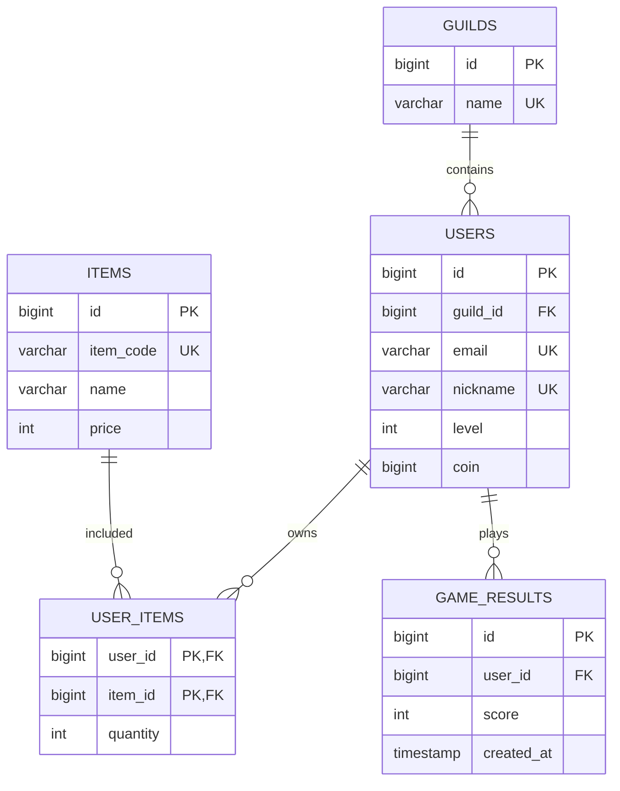

# 데이터베이스

> 데이터베이스 정규화, 트랜잭션, 인덱스, 조인 정리

---

## 데이터베이스

### 데이터베이스는?

**데이터베이스(Database)**는 여러 사용자가 공유할 수 있도록 체계적으로 저장하고 관리하는 데이터 집합

데이터베이스는 일반적으로 **DBMS(Database Management System)**를 통해 관리

대표적인 DBMS는 아래와 같음

- MySQL
- PostgreSQL
- Microsoft SQL Server
- MongoDB
- Redis

DBMS의 주요 역할

- 데이터 저장과 조회
- 데이터 수정과 삭제
- 사용자 권한 관리
- 동시성 제어
- 트랜잭션 처리
- 데이터 무결성 유지
- 백업과 복구
- 장애 대응

---

### 엔터티

**엔터티(Entity)**는 데이터베이스에 관리하려는 독립적인 대상을 의미

게임 서버에는 다음과 같은 대상을 엔터티로 볼 수 있다

- 사용자
- 길드
- 아이템
- 게임 결과
- 구매 기록
- 랭킹
- 이벤트

```text
사용자 엔터티
- 사용자 ID
- 이메일
- 닉네임
- 레벨
- 보유 재화

아이템 엔터티
- 아이템 ID
- 아이템 코드
- 아이템 이름
- 가격
```

엔터티는 관계형 데이터베이스에 일반적으로 테이블로 구현

```sql
CREATE TABLE users (
  id BIGINT UNSIGNED NOT NULL AUTO_INCREMENT,
  email VARCHAR(255) NOT NULL,
  nickname VARCHAR(50) NOT NULL,
  level INT UNSIGNED NOT NULL DEFAULT 1,
  coin BIGINT UNSIGNED NOT NULL DEFAULT 0,
  created_at TIMESTAMP NOT NULL DEFAULT CURRENT_TIMESTAMP,
  updated_at TIMESTAMP NOT NULL
    DEFAULT CURRENT_TIMESTAMP
    ON UPDATE CURRENT_TIMESTAMP,

  PRIMARY KEY (id),
  UNIQUE KEY uq_users_email (email),
  UNIQUE KEY uq_users_nickname (nickname),
  CONSTRAINT chk_users_level CHECK (level >= 1)
) ENGINE = InnoDB;
```

---

### 릴레이션

관계형 데이터베이스에서 **릴레이션(Relation)**은 데이터를 행과 열의 형태로 나타낸 구조

실제 DBMS에는 일반적으로 릴레이션을 **테이블(Table)**이라 부른다

| 관계형 모델 | 일반적인 DBMS           |
| ----------- | ----------------------- |
| 릴레이션    | 테이블                  |
| 튜플        | 행, 레코드              |
| 속성        | 열, 컬럼                |
| 도메인      | 컬럼에 허용되는 값 범위 |

예를 들어 `users` 테이블은 사용자 엔터티를 저장하는 릴레이션이다

```text
users

| id | email | nickname | level |
| 1 | kim@example.com | yohan | 10 |
| 2 | lee@example.com | player02 | 7 |
```

관계형 모델에서 행의 순서는 보장되지 않음. 조회 결과의 순서가 필요하면 반드시 `ORDER BY`를 사용

```sql
SELECT
  id,
  nickname,
  level
FROM users
ORDER BY level DESC, id ASC;
```

---

### 속성

**속성(Attribute)**은 엔터티가 가진 특성이나 정보를 의미

테이블에서 일반적으로 컬럼으로 구현

```text
사용자 엔터티 속성

- id
- email
- nickname
- level
- coin
- created_at
- updated_at
```

각 속성에 다음과 같은 정보가 포함될 수 있음

- 컬럼 이름
- 데이터 타입
- `NULL` 허용 여부
- 기본값
- 제약조건
- 인덱스

```sql
nickname VARCHAR(50) NOT NULL
```

위 컬럼은 다음 의미를 가짐

```text
컬럼 이름: nickname
데이터 타입: VARCHAR
최대 길이: 50
NULL 허용: 허용하지 않음
```

---

### 도메인

**도메인(Domain)**은 하나의 속성이 가질 수 있는 값의 범위와 규칙을 의미

```text
level의 도메인
- 정수
- 1 이상

status의 도메인
- READY
- PLAYING
- DONE
```

MySQL에는 데이터 타입과 제약조건을 이용해 도메인을 표현할 수 있음

```sql
CREATE TABLE game_results (
  id BIGINT UNSIGNED NOT NULL AUTO_INCREMENT,
  user_id BIGINT UNSIGNED NOT NULL,
  score INT UNSIGNED NOT NULL,
  status VARCHAR(20) NOT NULL,
  created_at TIMESTAMP NOT NULL DEFAULT CURRENT_TIMESTAMP,

  PRIMARY KEY (id),

  CONSTRAINT chk_game_results_status
    CHECK (status IN('READY', 'PLAYING', 'DONE')),

  CONSTRAINT fk_game_results_user
    FOREIGN KEY (user_id)
    REFERENCES users (id)
    ON DELETE CASCADE
) ENGINE = InnoDB;
```

NestJS DTO로 요청 값을 검증할 수 있음

```bash
npm install class-validator class-transformer
```

```ts
import { IsIn, IsInt, Min } from "class-validator";

export class CreateGameResultDto {
  @IsInt()
  @Min(0)
  score: number;

  @IsIn(["READY", "PLAYING", "DONE"])
  status: "READY" | "PLAYING" | "DONE";
}
```

`main.ts`:

```ts
import { ValidationPipe } from "@nestjs/common";
import { NestFactory } from "@nestjs/core";
import { AppModule } from "./app.module";

async function bootstrap(): Promise<void> {
  const app = await NestFactory.create(AppModule);

  app.useGlobalPipes(
    new ValidationPipe({
      whitelist: true,
      transform: true,
      forbidNonWhitelisted: true,
    }),
  );

  await app.listen(3000);
}

void bootstrap();
```

앱 검증만으로 데이터베이스 무결성이 완전히 보장되는건 아니다

앱이나 직접 실행한 SQL로 데이터 변경될 수 있어, 데이터베이스 제약조건도 함께 사용하는 것이 좋다

---

### 필드와 레코드

#### 레코드

**레코드(Record)**는 테이블 하나의 행을 의미

```text
id: 1
email: kim@example.com
nickname: yohan
level: 10
```

관계형 모델에서 레코드를 **튜플(Tuple)**이라고 한다

---

#### 필드

**필드(Field)**는 레코드에 포함된 각각의 값을 의미하는 용어로 사용

```text
nickname 필드의 값: yohan
level 필드의 값: 10
```

실무에서 필드와 컬럼을 비슷한 의미로 사용

정확한 관계형 모델은

```text
테이블 -> 릴레이션
행    -> 튜플
열    -> 속성
```

---

### 관계

데이터베이스 관계는 엔터티 사이의 연결을 의미

대표적인 관계는 다음과 같다

- 일대일 관계
- 일대다 관계
- 다대다 관계

---

#### 일대일 관계

한 엔터티가 다른 엔터티 하나와만 연결되는 관계

```text
사용자 1명 -> 사용자 프로필 1개
```

```sql
CREATE TABLE user_profiles (
  user_id BIGINT UNSIGNED NOT NULL,
  introduction VARCHAR(500),
  profile_image_url VARCHAR(500),

  PRIMARY KEY (user_id),

  CONSTRAINT fk_user_profiles_user
    FOREIGN KEY (user_id)
    REFERENCES users (id)
    ON DELETE CASCADE
) ENGINE = InnoDB;
```

`user_id`가 기본키이면서 외래 키이므로 사용자 한 명당 프로필 하나만 저장할 수 있음

---

#### 일대다 관계

한 엔터티가 여러 개의 다른 엔터티와 연결되는 관계

```text
길드 1개 -> 사용자 여러 명
사용자 1명 -> 게임 결과 여러 개
```

```sql
CREATE TABLE guilds (
  id BIGINT UNSIGNED NOT NULL AUTO_INCREMENT,
  name VARCHAR(100) NOT NULL,
  created_at TIMESTAMP NOT NULL DEFAULT CURRENT_TIMESTAMP,

  PRIMARY KEY (id),
  UNIQUE KEY uq_guilds_name (name)
) ENGINE = InnoDB;
```

```sql
ALTER TABLE users
  ADD COLUMN guild_id BIGINT UNSIGNED NULL,
  ADD KEY idx_users_guild_id (guild_id),
  ADD CONSTRAINT fk_users_guild
    FOREIGN KEY (guild_id)
    REFERENCES guilds (id)
    ON DELETE SET NULL;
```

하나의 길드는 여러 사용자를 가질 수 있고, 사용자는 하나의 길드만 가입한다고 가정한 구조

#### 다대다 관계

여러 엔터티가 서로 여러 개의 엔터티와 연결되는 관계

```text
사용자 여러 명 <-> 아이템 여러 개
```

관계형 데이터베이스에는 다대다 관계를 중간 테이블로 분리

```sql
CREATE TABLE items (
  id BIGINT UNSIGNED NOT NULL AUTO_INCREMENT,
  item_code VARCHAR(50) NOT NULL,
  name VARCHAR(100) NOT NULL,
  price INT UNSIGNED NOT NULL DEFAULT 0,
  created_at TIMESTAMP NOT NULL DEFAULT CURRENT_TIMESTAMP,

  PRIMARY KEY (id),
  UNIQUE KEY uq_items_item_code (item_code)
) ENGINE = InnoDB;
```

```sql
CREATE TABLE user_items (
  user_id BIGINT UNSIGNED NOT NULL,
  item_id BIGINT UNSIGNED NOT NULL,
  quantity INT UNSIGNED NOT NULL DEFAULT 1,
  acquired_at TIMESTAMP NOT NULL DEFAULT CURRENT_TIMESTAMP,

  PRIMARY KEY (user_id, item_id),

  CONSTRAINT fk_user_items_user
    FOREIGN KEY (user_id)
    REFERENCES users (id)
    ON DELETE CASCADE,

  CONSTRAINT fk_user_items_item
    FOREIGN KEY (item_id)
    REFERENCES items (id)
    ON DELETE RESTRICT,

  CONSTRAINT chk_user_items_quantity
    CHECK (quantity > 0)
) ENGINE = InnoDB;
```

`user_items`는 사용자와 아이템의 다대다 관계를 해소하는 연결 테이블

---

### 키

키는 테이블 레코드를 식별하거나 테이블 사이의 관계를 표현하는 속성

#### 슈퍼 키

**슈퍼 키(Super Key)**는 하나의 행을 유일하게 식별할 수 있는 하나 이상의 속성 집합

```text
{id}
{email}
{id, email}
{id, nickname}
```

행을 유일하게 구분할 수 있으나 불필요한 속성을 포함할 수 있음

#### 후보 키

**후보 키(Candidate Key)**는 슈퍼 키 중에서 행을 식별하는 데 필요한 최소한의 속성만 가진 키

```text
{id}
{email}
{nickname}
```

`{id, email}`은 `id`만으로 행을 식별할 수 있어 최소성을 만족하지 않음

#### 기본 키

**기본 키(Primary key)**는 후보 키 중 대표로 선택한 키

기본 키는 다음 조건을 만족

- 중복될 수 없음
- `NULL`일 수 없음
- 가능하면 변경되지 않아야 함
- 가능하면 크기가 작아야 함

```sql
PRIMARY KEY (id)
```

#### 대체 키

대체 키(Alternate Key)는 후보 키 중에서 기본 키로 선택되지 않은 키다

```text
기본 키: id
대체 키: email, nickname
```

일반적으로 `UNIQUE` 제약조건으로 표현

```sql
UNIQUE KEY uq_users_email (email)
```

MySQL에서 `UNIQUE` 컬럼이 `NULL`을 허용하면 여러 개의 `NULL`이 저장될 수 있다. 반드시 값이 존재하면서 중복하면 안 되는 칼럼에 `NOT NULL`도 함께 지정해야 한다

#### 외래 키

**외래 키(Foreign Key)**는 다른 테이블의 기본 키나 유일 키를 참조하는 키다

```sql
FOREIGN KEY (guild_id)
REFERENCES guilds (id)
```

외래 키는 테이블 사이의 참조 무결성을 보장

#### 복합 키

복합 키(Composite Key)는 두 개 이상의 컬럼으로 구성된 키

```sql
PRIMARY KEY (user_id, item_id)
```

`user_items` 테이블에서 같은 사용자와 같은 아이템 조합이 중복될 수 없음

#### 자연 키와 대리 키

| 구분    | 설명                       | 예                 |
| ------- | -------------------------- | ------------------ |
| 자연 키 | 업무적인 의미가 있는 값    | 이메일, 상품 코드  |
| 대리 키 | 식별을 위해 별도로 만든 값 | 자동 증가 ID, UUID |

이메일과 닉네임은 변경될 수 있어 기본 키보다는 별도의 대리 키를 사용하는 경우가 많다

---

#### JavaScript에서 BIGINT 사용 시 주의

MySQL `BIGINT`는 JS의 안전한 정수 범위를 초과할 수 있음

JS의 안전한 정수 범위는 다음과 같다

```ts
console.log(Number.MAX_SAFE_INTEGER);
// 9007199254740991
```

큰 `BIGINT`값을 `number`로 변환하면 정밀도가 손실될 수 있다

```ts
import mysql from "mysql2/promise";

export const pool = mysql.createPool({
  host: process.env.DB_HOST,
  port: Number(process.env.DB_PORT ?? 3306),
  user: process.env.DB_USER,
  password: process.env.DB_PASSWORD,
  database: process.env.DB_DATABASE,

  supportBigNumbers: true,
  bigNumberStrings: true,

  waitForConnections: true,
  connectionLimit: 10,
  queueLimit: 0,
});
```

해당 설정에서 큰 정수 값이 문자열로 반환될 수 있음

```ts
interface UserRow {
  id: string;
  nickname: string;
  coin: string;
}
```

API에서 ID를 문자열로 전달하는 것도 고려할 수 있음

```json
{
  "id": "9007199254740993",
  "nickname": "yohan"
}
```

---

## ERD와 정규화

### ERD를 사용하는 이유

**ERD(Entity Relationship Diagram)**는 엔터티, 속성, 키, 관계를 시각적으로 표현한 다이어그램

ERD를 작성하면 다음 내용을 파악하기 쉽다

- 어떤 테이블이 필요한지?
- 각 테이블은 어떤 컬럼을 가지는지
- 기본 키와 외래 키는 무엇인지?
- 테이블 사이의 관계는 무엇인지?
- 관계가 일대일, 일대다, 다대다 중 무엇인지?
- 삭제와 수정이 다른 테이블에 어떤 영향을 주는지

ERD만으로 데이터베이스의 모든 구성을 표현할 수 있는 것은 아님

다음 내용은 별도로 관리해야 할 수 있음

- 인덱스 설계
- 트랜잭션 범위
- 동시성 제어
- 파티셔닝
- 데이터 보관 기간
- 샤딩 정책
- 조회 패턴

### ERD 예제



관계는 아래와 같음

```text
길드 1개 : 사용자 여러 명
사용자 1명: 게임 결과 여러 개
사용자 여러 명: 아이템 여러개
```

사용자와 아이템의 다대다 관계는 `user_items` 중간 테이블을 통해 표현

---

### TypeORM 엔터티 예시

#### User 엔터티

```ts
import {
  Column,
  CreateDateColumn,
  Entity,
  Index,
  ManyToOne,
  OneToMany,
  PrimaryGeneratedColumn,
  UpdateDateColumn,
} from "typeorm";
import { Guild } from "./guild.entity";
import { UserItem } from "./user-item.entity";

@Entity({
  name: "users",
})
export class User {
  @PrimaryGeneratedColumn({
    type: "bigint",
    unsigned: true,
  })
  id: string;

  @Index({
    unique: true,
  })
  @Column({
    type: "varchar",
    length: 255,
  })
  email: string;

  @Index({
    unique: true,
  })
  @Column({
    type: "varchar",
    length: 50,
  })
  nickname: string;

  @Column({
    type: "int",
    unsigned: true,
    default: 1,
  })
  level: number;

  @Column({
    name: "guild_id",
    type: "bigint",
    unsigned: true,
    nullable: true,
  })
  guildId: string | null;

  @ManyToOne(() => Guild, (guild) => guild.users, {
    nullable: true,
    onDelete: "SET NULL",
  })
  guild: Guild | null;

  @OneToMany(() => UserItem, (userItem) => userItem.user)
  userItems: UserItem[];

  @CreateDateColumn({
    name: "created_at",
  })
  createdAt: Date;

  @UpdateDateColumn({
    name: "updated_at",
  })
  updatedAt: Date;
}
```

#### Guild 엔터티

```ts
import {
  Column,
  Entity,
  Index,
  OneToMany,
  PrimaryGeneratedColumn,
} from "typeorm";
import { User } from "./user.entity";

@Entity({
  name: "guilds",
})
export class Guild {
  @PrimaryGeneratedColumn({
    type: "bigint",
    unsigned: true,
  })
  id: string;

  @Index({
    unique: true,
  })
  @Column({
    type: "varchar",
    length: 100,
  })
  name: string;

  @OneToMany(() => User, (user) => user.guild)
  users: User[];
}
```

#### UserItem 엔터티

```ts
import { Column, Entity, JoinColumn, ManyToOne, PrimaryColumn } from "typeorm";
import { Item } from "./item.entity";
import { User } from "./user.entity";

@Entity({
  name: "user_items",
})
export class UserItem {
  @PrimaryColumn({
    name: "user_id",
    type: "bigint",
    unsigned: true,
  })
  userId: string;

  @PrimaryColumn({
    name: "item_id",
    type: "bigint",
    unsigned: true,
  })
  itemId: string;

  @Column({
    type: "int",
    unsigned: true,
    default: 1,
  })
  quantity: number;

  @ManyToOne(() => User, (user) => user.userItems, {
    onDelete: "CASCADE",
  })
  @JoinColumn({
    name: "user_id",
  })
  user: User;

  @ManyToOne(() => Item, {
    onDelete: "RESTRICT",
  })
  @JoinColumn({
    name: "item_id",
  })
  item: Item;
}
```

TypeORM 엔터티는 앱 객체 관계를 표현

---

### 정규화 과정

**정규화(Normalization)**는 데이터 중복과 이상 현상을 줄이기 위해 테이블을 구조적으로 분리하는 과정

정규화의 목적은 다음과 같음

- 데이터 중복 감소
- 삽입 이상 방지
- 수정 이상 방지
- 삭제 이상 방지
- 데이터 일관성 유지

---

#### 삽입 이상

특정 데이터를 저장하려면 관계없는 다른 데이터까지 입력해야 하는 문제, 사용자 아이템 테이블에 아이템 정보까지 모두 저장하면, 아무도 보유하지 않은 신규 아이템을 등록하기 어려움

#### 수정 이상

중복된 데이터 중 일부만 변경되어 값이 달라지는 문제

```text
user_id | nickname | item_id | item_name
1       | yohan    | 101     | 골드 티켓
1       | yohan2   | 102     | 실버 티켓
```

동일한 사용자의 닉네임이 행마다 다르게 저장될 수 있음

#### 삭제 이상

특정 데이터를 삭제하고 유지해야 할 다른 데이터까지 사라지는 문제다, 마지막 사용자의 아이템 보유 기록을 삭제했더니 아이템의 이름과 가격 정보까지 사라지는 경우다

---

### 제1정규형

**제1정규형(1NF)**은 모든 속성이 원자적인 값을 가지도록 구성한 형태다

다음 구조는 하나의 컬럼에 여러 값을 저장하여 제1정규형을 만족하지 않음

```text
user_id | item_ids
1       | 101, 102, 103
```

각 값을 별도의 행으로 분리

```text
user_id | item_id
1       | 101
1       | 102
1       | 103
```

---

### 제2정규형

**제2정규형(2NF)**은 제1정규형을 만족하며 기본 키의 일부에만 종속되는 부분 함수 종속을 제거한 형태

다음 테이블의 기본 키가 `(user_id, item_id)`라고 가정

```text
user_id | item_id | user_name | item_name | quantity
```

함수 종속은 다음과 같다

```text
user_id -> user_name
item_id -> item_name
(user_id, item_id) -> quantity
```

다음과 같이 분리

```text
users
- user_id
- user_name

items
- item_id
- item_name

user_items
- user_id
- item_id
- quantity
```

기본 키가 단일 컬럼이면 부분 함수 종속이 발생하지 않아 제1정규형을 만족하는 테이블은 일반적으로 제2정규형도 만족

---

### 제3정규형

**제3정규형(3NF)**은 제2정규형을 만족하여 기본 키가 아닌 속성 사이의 이행 함수 종속을 제거한 형태

```text
user_id -> guild_id
guild_id -> guild_name
```

다음처럼 사용자 테이블에 길드 이름까지 저장하면 이행 함수 종속이 발생

```text
users
- user_id
- guild_id
- guild_name
```

길드 정보를 별도의 테이블로 분리

```text
users
- user_id
- guild_id

guilds
- guild_id
- guild_name
```

---

### BCNF

**BCNF(Boyce-Codd Normal Form)**는 모든 결정자가 후보 키가 되도록 구성한 정규형이다

제3정규형보다 엄격한 형태, 복잡한 후보 키와 함수 종속이 존재할 때 검토

### 정규화와 반정규화

정규화는 데이터 중복과 이상 현상을 줄이나 테이블이 많이 분리되어 조인이 증가할 수 있음

조회 성능이나 운영 편의를 위해 의도적으로 데이터를 중복 저장하는 것을 **반정규화 또는 비정규화(Denormalization)**이라 한다.

예는 아래와 같음

- 게시글 테이블에 댓글 수 저장
- 사용자 테이블에 누적 점수 저장
- 랭킹 테이블에 닉네임 스냅샷 저장
- 주문 테이블에 구매 당시의 상품명과 가격 저장

반정규화를 적용하기 전 다음을 확인해야 한다

- 실제 성능 문제가 측정되었는지?
- 중복 데이터의 갱신 책임이 명확한지?
- 데이터 불일치가 발생했을 때 복구할 수 있는지?
- 인덱스나 캐시로 해결할 수 없는지

---

## 트랜잭션과 무결성

### 트랜잭션

**트랜잭션(Transaction)**은 데이터베이스에 하나의 논리적인 작업 단위로 처리해야 하는 연산의 집합

아이템 구매는 다음 작업으로 구성될 수 있음

1. 아이템 가격을 확인
2. 사용자 재화를 차감
3. 사용자 인벤토리에 아이템을 추가
4. 구매 기록을 저장

하나라도 실패하면 전체 작업을 취소

### 트랜잭션 기본 SQL

```sql
START TRANSACTION;

UPDATE users
SET coin = coin - 100 WHERE id = 1 AND coin >= 100;

INSERT INTO user_items (
  user_id, item_id, quantity
)
VALUES (
  1, 101, 1
)
ON DUPLICATE KEY UPDATE quantity = quantity + 1;

COMMIT;
```

재화 차감 쿼리의 영향받은 행이 0개면 사용자가 없거나 재화가 부족한 경우일 수 있다

이때 앱은 다음을 실행해야 한다

```sql
ROLLBACK;
```

### ACID

| 속성        | 의미                                                     |
| ----------- | -------------------------------------------------------- |
| Atomicity   | 트랜잭션의 작업이 모두 성공하거나 모두 실패해야 함       |
| Consistency | 트랜잭션 전후에 데이터 규칙이 유지되어야 함              |
| Isolation   | 동시에 실행되는 트랜잭션이 부적절하게 간섭하지 않아야 함 |
| Durability  | 커밋된 결과가 장애 이후에도 보존되어야 한다              |

---

#### 원자성

트랜잭션에 포함된 작업은 전부 반영되거나 취소되어야 한다

```text
재화 차감 성공, 아이템 지급 실패 -> 재화 차감까지 롤백
```

#### 일관성

트랜잭션 전후에 데이터가 정의된 규칙을 만족해야 한다

```text
coin >= 0
quantity > 0
존재하지 않는 사용자의 아이템 기록은 생성하지 않음
```

일관성은 DBMS가 규칙을 자동으로 이해하는 의미가 아닌 앱 로직과 데이터베이스 제약조건이 올바르게 작성되어야 한다

#### 격리성

동시에 실행되는 트랜잭션이 다른 트랜잭션의 중간 상태를 부적절하게 확인하거나 변경하지 않도록 한다

#### 지속성

트랜잭션이 커밋되면 결과가 영구적으로 저장되어야 한다, DBMS는 Log, 디스크 저장, 복제 등을 사용해 지속성을 지원

---

### Node.js 트랜잭션

`database.ts` :

```ts
import mysql from "mysql2/promise";

export const pool = mysql.createPool({
  host: process.env.DB_HOST,
  port: Number(process.env.DB_PORT ?? 3306),
  user: process.env.DB_USER,
  password: process.env.DB_PASSWORD,
  database: process.env.DB_DATABASE,

  supportBigNumbers: true,
  bigNumberStrings: true,

  waitForConnections: true,
  connectionLimit: 10,
  queueLimit: 0,
});
```

`purchase-item.ts`:

```ts
import { ResultSetHeader, RowDataPacket } from "mysql2";
import { pool } from "./database";

interface ItemPriceRow extends RowDataPacket {
  price: number;
}

export async function purchaseItem(
  userId: string,
  itemId: string,
): Promise<void> {
  const connection = await pool.getConnection();

  try {
    await connection.beginTransaction();

    const [itemRows] = await connection.execute<ItemPriceRow[]>(
      `
        SELECT price
        FROM items
        WHERE id = ?
      `,
      [itemId],
    );

    const item = itemRows[0];

    if (!item) {
      throw new Error("아이템을 찾을 수 없다.");
    }

    const [updateUserResult] = await connection.execute<ResultSetHeader>(
      `
        UPDATE users
        SET coin = coin - ?
        WHERE id = ? AND coin >= ?
      `,
      [item.price, userId, item.price],
    );

    if (updateUserResult.affectedRows !== 1) {
      throw new Error("사용자가 없거나 보유 재화가 부족하다.");
    }

    await connection.execute<ResultSetHeader>(
      `
        INSERT INTO user_items (
          user_id,
          item_id,
          quantity
        )
        VALUES (?, ?, 1)
        ON DUPLICATE KEY UPDATE quantity = quantity + 1
      `,
      [userId, itemId],
    );
    await connection.commit();
  } catch (error: unknown) {
    await connection.rollback();
    throw error;
  } finally {
    connection.release();
  }
}
```

트랜잭션 작업은 반드시 같은 커넥션에서 실행해야 하고, 다음과 같이 쿼리마다 풀에서 다른 커넥션을 가져오면 하나의 트랜잭션으로 처리되지 않을 수 있음

```ts
// 잘못된 예시

await pool.query("START TRANSACTION");
await pool.query("UPDATE users ...");
await pool.query("INSERT INTO user_items ...");
await pool.query("COMMIT");
```

`pool.query()`가 매번 같은 커넥션을 사용한다고 보장할 수 없기 때문

```text
pool.getConnection()
-> beginTransaction()
-> 같은 connection으로 모든 쿼리 실행
-> commit() 또는 rollback() -> release()
```

---

### NestJS TypeORM

패키지 설치:

```bash
npm install @nestjs/typeorm typeorm mysql2
```

`app.module.ts`:

```ts
import { Module } from "@nestjs/common";
import { TypeOrmModule } from "@nestjs/typeorm";
import { ItemPurchaseModule } from "./item-purchase/item-purchase.module";

@Module({
  imports: [
    TypeOrmModule.forRoot({
      type: "mysql",
      host: process.env.DB_HOST,
      port: Number(process.env.DB_PORT ?? 3306),
      username: process.env.DB_USER,
      password: process.env.DB_PASSWORD,
      database: process.env.DB_DATABASE,

      autoLoadEntities: true,

      synchronize: false,

      supportBigNumbers: true,
      bigNumberStrings: true,

      extra: {
        connectionLimit: 10,
      },
    }),

    ItemPurchaseModule,
  ],
})
export class AppModule {}
```

운영 환경에서는 엔터티 변경에 따라 의도하지 않은 스키마 변경이 발생할 수 있음

---

### NestJS TypeORM 트랜잭션

`item-purchase.service.ts`:

```ts
import {
  Injectable,
  NotFoundException,
  UnprocessableEntityException,
} from "@nestjs/common";
import { DataSource, EntityManager } from "typeorm";

interface ItemPriceRow {
  price: number;
}

interface UpdateResultPacket {
  affectedRows: number;
}

@Injectable()
export class ItemPurchaseService {
  constructor(private readonly dataSource: DataSource) {}

  async purchaseItem(userId: string, itemId: string): Promise<void> {
    await this.dataSource.transaction(
      async (manager: EntityManager): Promise<void> => {
        const itemRows = await manager.query<ItemPriceRow[]>(
          `
            SELECT price
            FROM items
            WHERE id = ?
          `,
          [itemId],
        );

        const item = itemRows[0];

        if (!item) {
          throw new NotFoundException("아이템을 찾을 수 없다");
        }

        const updateResult = await manager.query<UpdateResultPacket>(
          `
              UPDATE users
              SET coin = coin - ?
              WHERE id = ? AND coin >= ?
            `,
          [item.price, userId, item.price],
        );

        if (updateResult.affectedRows !== 1) {
          throw new UnprocessableEntityException("보유 재화가 부족하다");
        }

        await manager.query(
          `
              INSERT INTO user_items (
                user_id,
                item_id,
                quantity
              )
              VALUES (?, ?, 1)
              ON DUPLICATE KEY UPDATE quantity = quantity + 1
            `,
          [userId, itemId],
        );
      },
    );
  }
}
```

TypeORM `DataSource.transaction()` 콜백이 정상 종료되면 커밋하고 예외가 발생하면 롤백

트랜잭션 콜백 안에서 전달받은 `manager`를 사용

```ts
await this.dataSource.transaction(async (manager) => {
  await manager.query("UPDATE users SET ... ");
});
```

다음처럼 트랜잭션 밖에서 주입받은 Repository나 전역 DataSource를 사용하면 다음 작업이 같은 트랜잭션에 포함되지 않을 수 있다

```ts
await this.dataSource.transaction(async () => {
  await this.userRepository.update(userId, {
    nickname: "new-name",
  });
});
```

트랜잭션용 `EntityManager`에서 Repository를 가져올 수 있음

```ts
await this.dataSource.transaction(async (manager) => {
  const userRepository = manager.getRepository(User);

  await userRepository.update(
    {
      id: userId,
    },
    {
      nickname: "new-name",
    },
  );
});
```

---

### QueryRunner

트랜잭션 시작, 커밋, 롤백을 직접 제어하려면 `QueryRunner`를 사용

```ts
import { Injectable, UnprocessableEntityException } from "@nestjs/common";
import { DataSource } from "typeorm";

interface UpdateResultPacket {
  affectedRows: number;
}

@Injectable()
export class CoinService {
  constructor(private readonly dataSource: DataSource) {}

  async useCoin(userId: string, amount: number): Promise<void> {
    const queryRunner = this.dataSource.createQueryRunner();

    await queryRunner.connect();
    await queryRunner.startTransaction();

    try {
      const result = await queryRunner.query<UpdateResultPacket>(
        `
            UPDATE users
            SET coin = coin - ?
            WHERE id = ? AND coin >= ?
          `,
        [amount, userId, amount],
      );

      if (result.affectedRows !== 1) {
        throw new UnprocessableEntityException("보유 재화가 부족하다.");
      }

      await queryRunner.commitTransaction();
    } catch (error: unknown) {
      await queryRunner.rollbackTransaction();
      throw error;
    } finally {
      await queryRunner.release();
    }
  }
}
```

`QueryRunner`를 사용할 때 `release()`를 누락하지 않도록 `finally`에서 처리

---

### 트랜잭션 격리 수준

격리 수준은 다음과 같음

| 격리 수준        | Dirty Read | Non-Repeatable Read | Phantom Read     |
| ---------------- | ---------- | ------------------- | ---------------- |
| READ UNCOMMITTED | 발생 가능  | 발생 가능           | 발생 가능        |
| READ COMMITTED   | 방지       | 발생 가능           | 발생 가능        |
| REPEATABLE READ  | 방지       | 방지                | 표준상 발생 가능 |
| SERIALIZABLE     | 방지       | 방지                | 방지             |

MySQL InnoDB의 기본 격리 수준은 일반적으로 `REPEATABLE READ`다

```sql
SELECT @@transaction_isolation;
```

TypeORM 트랜잭션 격리 수준 지정

```ts
await this.dataSource.transaction("READ COMMITTED", async (manager) => {
  await manager.query(
    `
        UPDATE users
        SET coin = coin - 100 WHERE id = ? AND coin >= 100
      `,
    [userId],
  );
});
```

#### Dirty Read

다른 트랜잭션이 커밋하지 않은 데이터를 읽는 현상

```text
트랜잭션 A: coin을 1,000에서 500으로 변경
트랜잭션 B: 커밋되지 않은 500을 조회
트랜잭션 A: 롤백
```

트랜잭션 B는 실제로 존재하지 않게 된 값을 읽은 것

#### Non-Repeatable Read

하나의 트랜잭션에 같은 행을 두 번 읽었는데 값이 달라지는 현상

```text
트랜잭션 A: 사용자 레벨 10 조회
트랜잭션 B: 사용자 레벨을 11로 변경 후 커밋
트랜잭션 A: 다시 조회했을 때 레벨 11
```

#### Phantom Read

같은 조건으로 여러 번 조회했는데 행의 집합이 달라지는 현상

```text
트랜잭션 A: level >= 10 사용자 조회
트랜잭션 B: level 15 사용자 추가 후 커밋
트랜잭션 A: 다시 조회했을 때 새로운 행이 나타난다
```

일관 읽기와 잠금 읽기의 동작이 달라 격리 수준만으로 모든 동시성 문제가 자동으로 해결되는 것이 아님

---

### MVCC

**MVCC(Multi-Version Concurrency Control)**는 하나의 데이터에 여러 버전을 유지해 읽기와 쓰기의 충돌을 줄이는 방식

다음 문제를 고려

- Lost Update
- 재고 및 재화 중복 차감
- 잠금 대기
- 교착 상태
- 긴 트랜잭션
- 오래된 버전 데이터 유지

---

### 비관적 락

**비관적 락(Pessimistic Lock)**은 데이터를 먼저 잠그는 방식

```sql
START TRANSACTION;

SELECT
  id,
  coin
FROM users
WHERE id = 1
FOR UPDATE;

UPDATE users SET coin = coin - 100 WHERE id = 1;

COMMIT;
```

TypeORM의 활용

```ts
await this.dataSource.transaction(async (manager) => {
  const user = await manager
    .getRepository(User)
    .createQueryBuilder("user")
    .setLock("pessimistic_write")
    .where("user.id = :userId", {
      userId,
    })
    .getOne();

  if (!user) {
    throw new Error("사용자를 찾을 수 없다.");
  }

  const currentCoin = BigInt(user.coin);
  const price = 100n;

  if (currentCoin < price) {
    throw new Error("보유 재화가 부족하다.");
  }

  user.coin = (currentCoin - price).toString();

  await manager.save(user);
});
```

비관적 락을 사용하려면 반드시 트랜잭션 안에서 실행해야 한다

---

### 낙관적 락

**낙관적 락(Optimistic Lock)**은 충돌이 자주 발생하지 않는다고 보고 수정 시점에 버전이 변경되었는지 확인하는 방식

```sql
ALTER TABLE users
ADD COLUMN version BIGINT UNSIGNED NOT NULL DEFAULT 0;
```

```sql
UPDATE users
SET
  nickname = 'new-name', version = version + 1
WHERE id = 1 AND version = 5;
```

영향받은 행이 0개면 다른 요청이 먼저 데이터를 변경했을 가능성도 있다

TypeORM에서 `@VersionColumn()`을 사용할 수 있다

```ts
import { Entity, PrimaryGeneratedColumn, VersionColumn } from "typeorm";

@Entity({
  name: "users",
})
export class User {
  @PrimaryGeneratedColumn({
    type: "bigint",
    unsigned: true,
  })
  id: string;

  @VersionColumn()
  version: number;
}
```

낙관적 락을 적용할 때 Repository의 저장 방식, TypeORM 버전에 따른 동작을 테스트

### 교착 상태

**교착 상태(Deadlock)**는 둘 이상의 트랜잭션이 서로 상대방의 잠금이 해제되기를 기다리는 상태

```text
트랜잭션 A: 사용자 1 잠금
트랜잭션 B: 사용자 2 잠금

트랜잭션 A: 사용자 2 잠금 대기
트랜잭션 B: 사용자 1 잠금 대기
```

교착 상태를 줄이는 방법은

- 항상 같은 순서로 행에 접근한다
- 트랜잭션을 짧게 유지
- 트랜잭션 안에서 외부 API를 호출하지 않음
- 적절한 인덱스를 사용해 잠금 범위를 줄인다
- 한 번에 너무 많은 행을 수정하지 않음
- 교착 상태가 발생하면 트랜잭션 전체를 재시도

```ts
interface MySqlError {
  code?: string;
}

function isDeadlockError(error: unknown): boolean {
  if (typeof error !== "object" || error === null) {
    return false;
  }

  const mysqlError = error as MySqlError;

  return mysqlError.code === "ER_LOCK_DEADLOCK";
}
```

모든 오류를 재시도하면 잘못된 요청이나 데이터 검증 오류까지 반복할 수 있음

### 무결성

**무결성(Integrity)**은 데이터가 정확하고 일관된 상태를 유지하는 성질

---

#### 개체 무결성

기본 키는 중복될 수 없고 `NULL`일 수 없다

```sql
PRIMARY KEY (id)
```

#### 참조 무결성

외래 키가 참조하는 값은 부모 테이블에 존재해야 한다

```sql
FOREIGN KEY (user_id)
REFERENCES users (id)
```

부모 데이터를 삭제할 때 사용할 수 있는 정책은 다음과 같음

| 정책        | 설명                                   |
| ----------- | -------------------------------------- |
| `RESTRICT`  | 자식 데이터가 있으면 부모 삭제 거부    |
| `CASCADE`   | 부모 삭제 시 자식 데이터도 삭제        |
| `SET NULL`  | 부모 삭제 시 외래 키를 `NULL`로 변경   |
| `NO ACTION` | DBMS에 따라 `RESTRICT`와 유사하게 동작 |

`CASCADE`는 편리하나 예상보다 많은 데이터가 삭제될 수 있어 신중하게 사용

#### 도메인 무결성

컬럼에 정의된 데이터 타입, 범위, 형식을 지키도록 한다

```sql
level INT UNSIGNED NOT NULL DEFAULT 1
```

```sql
CHECK (level >= 1)
```

#### 고유 무결성

특정 컬럼이나 컬럼 조합의 중복을 방지

```sql
UNIQUE KEY uq_users_email (email)
```

```sql
PRIMARY KEY (user_id, item_id)
```

#### 사용자 정의 무결성

서비스의 업무 규칙에 따라 정의하는 무결성

```text
보유 재화는 0보다 작을 수 없다. 아이템 수량은 1 이상이어야 한다
하루 구매 횟수는 5회를 넘을 수 없다, 완료된 시즌 랭킹은 다시 수정할 수 없다
```

---

## 데이터베이스의 종류

### 관계형 데이터베이스

**관계형 데이터베이스(RDBMS)**는 데이터를 테이블 형태로 저장하고 관계를 통해 연결

대표적 관계형 데이터베이스는

- MySQL
- PostgreSQL
- Oracle Database
- Microsoft SQL Server
- MariaDB

관계형 데이터베이스의 특징은 다음과 같음

- 정형화된 스키마
- SQL 사용
- 테이블 사이의 관계 표현
- 트랜잭션 지원, 제약조건 지원
- 조인을 통한 데이터 결합

관계형 데이터베이스가 적합한 경우는 다음과 같음

- 데이터 구조가 비교적 명확한 경우
- 데이터 일관성이 중요한 경우
- 복잡한 검색과 조인이 필요한 경우
- 트랜잭션이 중요한 경우
- 사용자 재화, 결제, 주문처럼 정확성이 필요한 경우

### Node.js MySQL 연결

```ts
import mysql from "mysql2/promise";

const pool = mysql.createPool({
  host: process.env.DB_HOST,
  port: Number(process.env.DB_PORT ?? 3306),
  user: process.env.DB_USER,
  password: process.env.DB_PASSWORD,
  database: process.env.DB_DATABASE,

  waitForConnections: true,
  connectionLimit: 10,
});

const [rows] = await pool.execute(
  `
    SELECT
      id,
      nickname,
      level
    FROM users
    WHERE level >= ?
    ORDER BY level DESC
    LIMIT ?
  `,
  [10, 100],
);

console.log(rows);

await pool.end();
```

```ts
const [rows] = await pool.execute(
  `
    SELECT
      id,
      nickname
    FROM users
    WHERE nickname = ?
  `,
  [nickname],
);
```

### NoSQL 데이터베이스

**NoSQL(Not Only SQL)**은 관계형 모델 이외 다양한 데이터 저장 방식을 사용하는 데이터베이스를 의미

NoSQL이라해서 스키마가 전혀 없거나 트랜잭션을 지원하지 않는다는 뜻은 아님

#### 키-값 데이터베이스

키를 이용해 값을 저장하고 조회

```text
Key: game:user:1:session
Value: {"serverId": 3, "channelId": 10}
```

대표적

- Redis
- Amazon DynamoDB
- Riak

적합 용도:

- 캐시
- 세션
- 인증 토큰
- 실시간 랭킹
- 임시 상태, 분산 락

### Node.js Redis

패키지 설치:

```bash
npm install ioredis
```

```ts
import Redis from "ioredis";

const redis = new Redis({
  host: process.env.REDIS_HOST,
  port: Number(process.env.REDIS_PORT ?? 6379),
});

interface UserSession {
  serverId: number;
  channelId: number;
}

const session: UserSession = {
  serverId: 3,
  channelId: 10,
};

await redis.set("game:user:1:session", JSON.stringify(session), "EX", 3000);

const cachedSession = await redis.get("game:user:1:session");

if (cachedSession) {
  const parsedSession = JSON.parse(cachedSession) as UserSession;

  console.log(parsedSession);
}

await redis.quit();
```

`JSON.parse()`의 타입 단언은 런타임 검증을 수행하지 않음.

#### 문서형 데이터베이스

JSON과 문서 형태로 데이터를 저장한다

```json
{
  "_id": 1,
  "nickname": "yohan",
  "inventory": [
    {
      "itemId": 101,
      "quantity": 3
    }
  ]
}
```

- MongoDB
- Couchbase

문서에 관련 데이터를 포함하면 한 번의 조회로 함께 가져올 수 있음

배열이 무제한으로 커지거나 여러 문서에서 동일한 데이터를 중복 저장하면 관리가 어려워질 수 있음

---

### RDBMS, NoSQL 비교

| 구분        | RDBMS                   | NoSQL                          |
| ----------- | ----------------------- | ------------------------------ |
| 데이터 구조 | 테이블                  | 키-값, 문서, 그래프 등         |
| 스키마      | 비교적 엄격             | 각각 유연                      |
| 관계        | 외래 키와 조인          | 포함, 참조, 앱 조합            |
| 트랜잭션    | 강력하게 지원           | 범위가 다름                    |
| 확장        | 수직 확장과 읽기 복제   | 수평 확장을 고려한 모델이 많음 |
| 적합한 용도 | 결제, 주문, 사용자 재화 | 캐시, 세션, 로그, 분산 데이터  |

게임 서버에서 다음처럼 함께 사용할 수 있음

```text
MySQL
- 사용자
- 결제
- 보유 아이템
- 구매 기록
- 영구 게임 결과

Redis
- 세션
- 캐시
- 실시간 랭킹
- 임시 매칭 상태, 요청 제한
```

---

### CAP 정리

| 속성                | 의미                                   |
| ------------------- | -------------------------------------- |
| Consistency         | 모든 노드가 같은 데이터를 제공         |
| Availability        | 모든 요청이 성공 또는 실패 응답을 받음 |
| Partition Tolerance | 네트워크 단절이 발생해도 시스템이 동작 |

CAP는 세 가지 중 두 개를 선택한다는 의미가 아님

> 네트워크 파티션이 발생한 상황에서 일관성을 우선할지 가용성을 우선할지 선택해야 한다

---

## 인덱스

### 인덱스의 필요성

**인덱스(Index)**는 테이블의 데이터를 빠르게 찾을 수 있도록 별도로 구성한 자료 구조

```text
인덱스가 없는 경우 -> 조건에 맞는 행을 찾기 위해 많은 행을 확인

인덱스가 있는 경우 -> 인덱스에서 위치를 찾은 뒤 필요한 행에 접근
```

인덱스는 다음 작업에 도움을 줄 수 있음

- `WHERE`
- `JOIN`
- `ORDER BY`
- `GROUP BY`
- 중복 방지
- 범위 조회

인덱스의 단점은

- 추가 저장 공간 사용
- `INSERT` 비용 증가
- `UPDATE` 비용 증가
- `DELETE` 비용 증가
- 인덱스 페이지 분할 가능
- 불필요한 인덱스 관리 비용 증가

### B-트리

MySQL InnoDB 인덱스는 일반적으로 **B+Tree 계열**로 이해할 수 있음

```text
Root -> Internal Node -> Leaf Node
```

특징은 다음과 같음

- 트리의 높이가 비교적 낮다
- 검색 시간이 일반적으로 `O(log N)`이다
- 리프 노드에 인덱스 엔트리가 저장
- 리프 노드가 순서대로 연결되어 범위 검색에 유리

### 클러스터형 인덱스

클러스터형 인덱스의 리프 페이지에는 실제 행 데이터가 저장

```text
Primary Key B+Tree -> 실제 행
```

InnoDB 테이블에 클러스터형 인덱스가 하나만 존재

### 보조 인덱스

기본 키 이외의 인덱스를 **보조 인덱스(Secondary Index)**라고 한다

InnoDB 보조 인덱스의 리프 엔트리에 일반적으로 기본 키 값이 함께 저장

```text
nickname 보조 인덱스 -> 기본 키 확인 -> 클러스터형 인덱스에서 실제 행 조회
```

### 인덱스 만드는 방법

단일 컬럼 인덱스:

```sql
CREATE INDEX idx_game_results_score ON game_results (score);
```

복합 인덱스:

```sql
CREATE INDEX idx_game_results_user_created ON game_results (
  user_id, created_at DESC
);
```

고유 인덱스:

```sql
CREATE UNIQUE INDEX uq_users_email ON users (email);
```

인덱스 확인:

```sql
SHOW INDEX FROM game_results;
```

인덱스 삭제:

```sql
DROP INDEX idx_game_results_score ON game_results;
```

### 실행 계획 확인

```sql
EXPLAIN
SELECT
  id,
  user_id,
  score,
  created_at
FROM game_results WHERE user_id = 1
ORDER BY created_at DESC LIMIT 10;
```

### NestJS에서 실행 계획 확인

```ts
import { Injectable } from "@nestjs/common";
import { DataSource } from "typeorm";

interface ExplainRow {
  id: number;
  select_type: string;
  table: string;
  type: string;
  possible_keys: string | null;
  key: string | null;
  rows: number;
  Extra: string | null;
}

@Injectable()
export class QueryAnalysisService {
  constructor(private readonly dataSource: DataSource) {}

  async explainUserResults(userId: string): Promise<ExplainRow[]> {
    return this.dataSource.query<ExplainRow[]>(
      `
        EXPLAIN
        SELECT
          id,
          user_id,
          score,
          created_at
        FROM game_results
        WHERE user_id = ?
        ORDER BY created_at DESC
        LIMIT 20
      `,
      [userId],
    );
  }
}
```

### 인덱스 최적화 기법

#### 복합 인덱스 컬럼 순서

```sql
CREATE INDEX idx_results_user_created_status
ON game_results (
  user_id,
  created_at,
  status
);
```

인덱스를 활용하기 쉬운 것

```sql
WHERE user_id = 1
```

```sql
WHERE user_id = 1 AND created_at >= '2026-09-01'
```

선두 컬럼을 사용하지 않아 효율적으로 사용하지 못할 수 있음

```sql
WHERE created_at >= '2026-09-01'
```

이를 최좌측 접두사 원칙이라 한다

#### 등호 조건과 범위 조건

다음 조회를 자주 사용 가정

```sql
WHERE user_id = ?
  AND status = ?
  AND created_at >= ?
ORDER BY created_at DESC
```

다음 인덱스를 고려

```sql
CREATE INDEX idx_results_user_status_created
ON game_results (
  user_id,
  status,
  created_at DESC
);
```

동등 비교 컬럼을 앞에 두고 범위 조건이나 정렬 컬럼을 뒤에 두는 방식을 고려

#### 커버링 인덱스

쿼리에 필요한 모든 컬럼이 인덱스에 포함되어 테이블 행을 추가로 읽지 않아도 되는 경우를 \\*\\*커버링 인덱스(Covering Index)\*\*라고 한다

```sql
CREATE INDEX idx_results_user_created_score
ON game_results (
  user_id,
  created_at,
  score
);
```

```sql
SELECT
  created_at,
  score
FROM game_results
WHERE user_id = 1
ORDER BY created_at DESC
LIMIT 20;
```

#### 컬럼에 함수 사용하지 않기

일반 인덱스를 효율적으로 사용하지 못할 수 있음

```sql
SELECT *
FROM game_results
WHERE DATE(created_at) = '2026-09-23';
```

범위 조건으로 변경

```sql
SELECT *
FROM game_results
WHERE created_at >= '2026-09-23 00:00:00'
  AND created_at < '2026-09-24 00:00:00'
```

##### TypeScript 날짜 범위 계산

타임존 일치

```ts
function getUtcDayRange(dateText: string): {
  startAt: Date;
  endAt: Date;
} {
  const startAt = new Date(`${dateText}T00:00:00.000Z`);

  const endAt = new Date(startAt.getTime() + 24 * 60 * 60 * 1000);

  return {
    startAt,
    endAt,
  };
}
```

```ts
const { startAt, endAt } = getUtcDayRange("2026-09-23");

const results = await dataSource.query(
  `
      SELECT *
      FROM game_results
      WHERE created_at >= ?
        AND created_at < ?
    `,
  [startAt, endAt],
);
```

서비스 타임존에 맞게 범위를 계산해야 한다

#### LIKE 검색

앞부분이 고정된 검색은 B+Tree 인덱스 사용

```sql
WHERE nickname LIKE 'yo%'
```

앞부분이 와일드카드면 효율적으로 사용하기 어려움

```sql
WHERE nickname LIKE '%han'
```

#### OFFSET 페이지네이션

다음 쿼리는 페이지가 뒤로 갈수록 많은 행을 건너뛰어야 한다

```sql
SELECT *
FROM game_results
ORDER BY id DESC
LIMIT 100000, 20;
```

마지막으로 조회한 ID를 사용하는 커서 방식 페이지네이션을 고려

```sql
SELECT
  id,
  user_id,
  score,
  created_at
FROM game_results
WHERE id < ?
ORDER BY id DESC
LIMIT 20;
```

NestJS 서비스:

```ts
import { Injectable } from "@nestjs/common";
import { DataSource } from "typeorm";

interface GameResultRow {
  id: string;
  user_id: string;
  score: number;
  created_at: Date;
}

@Injectable()
export class GameResultService {
  constructor(private readonly dataSource: DataSource) {}

  async findPage(
    cursor: string | null,
    limit: number,
  ): Promise<GameResultRow[]> {
    const safeLimit = Math.min(Math.max(limit, 1), 100);

    if (!cursor) {
      return this.dataSource.query<GameResultRow[]>(
        `
          SELECT
            id,
            user_id,
            score,
            created_at
          FROM game_results
          ORDER BY id DESC
          LIMIT ?
        `,
        [safeLimit],
      );
    }

    return this.dataSource.query<GameResultRow[]>(
      `
        SELECT
          id,
          user_id,
          score,
          created_at
        FROM game_results
        WHERE id < ?
        ORDER BY id DESC
        LIMIT ?
      `,
      [cursor, safeLimit],
    );
  }
}
```

---

## 조인의 종류

조인은 두 개 이상의 테이블을 공통 컬럼을 기준으로 결합하는 연산

```text
guilds
- id
- name

users
- id
- nickname
- guild_id
```

### 내부 조인

내부 조인은 양쪽 테이블에 조건이 일치하는 행만 반환

```sql
SELECT
  users.id AS user_id,
  users.nickname,
  guilds.id AS guild_id,
  guilds.name AS guild_name
FROM users
INNER JOIN guilds
  ON guilds.id = users.guild_id;
```

길드에 가입하지 않은 사용자는 결과에 포함되지 않고 `INNER`는 생략할 수 있다

```sql
SELECT
  users.nickname,
  guilds.name AS guild_name
FROM users
JOIN guilds
  ON guilds.id = users.guild_id;
```

### 왼쪽 조인

왼쪽 조인(LEFT OUTER JOIN)은 왼쪽 테이블의 모든 행과 오른쪽 테이블에서 조건이 일치하는 행을 반환

```sql
SELECT
  users.id,
  users.nickname,
  guilds.name AS guild_name
FROM users
LEFT JOIN guilds
  ON guilds.id = users.guild_id;
```

길드에 가입하지 않은 사용자도 결과에 포함, 이 경우 `guild_name`은 `NULL`이다

---

#### ON, WHERE 차이

```sql
SELECT
  users.id,
  users.nickname,
  guilds.name
FROM users
LEFT JOIN guilds
  ON guilds.id = users.guild_id
WHERE guilds.name = '개발자 길드';
```

오른쪽 테이블에 대한 조건을 `WHERE`에 지정하여 `NULL` 행이 제거, 내부 조인처럼 동작할 수 있다. 왼쪽 행을 유지하며 특정 길드만 결합하려면 조건을 `ON`에 작성

```sql
SELECT
  users.id,
  users.nickname,
  guilds.name
FROM users
LEFT JOIN guilds
  ON guilds.id = users.guild_id
 AND guilds.name = '개발자 길드';
```

---

### 오른쪽 조인

오른쪽 조인(RIGHT OUTER JOIN)은 오른쪽 테이블의 모든 행과 왼쪽 테이블에 일치하는 행을 반환

```sql
SELECT
  users.nickname,
  guilds.name AS guild_name
FROM users
RIGHT JOIN guilds
  ON guilds.id = users.guild_id;
```

오른쪽 조인은 테이블 순서를 바꾸어 왼쪽 조인으로 표현한다

```sql
SELECT
  users.nickname,
  guilds.name AS guild_name
FROM guilds
LEFT JOIN users
  ON users.guild_id = guilds.id;
```

### 합집합 조인

FULL OUTER JOIN은 양쪽 테이블의 모든 행을 반환, 왼쪽 조인과 오른쪽에만 존재하는 행을 `UNION ALL`을 결합

```sql
SELECT
  users.id AS user_id,
  users.nickname,
  guilds.id AS guild_id,
  guilds.name AS guild_name
FROM users
LEFT JOIN guilds
  ON guilds.id = users.guild_id

UNION ALL

SELECT
  NULL AS user_id,
  NULL AS nickname,
  guilds.id AS guild_id,
  guilds.name AS guild_name
FROM guilds
LEFT JOIN users
  ON users.guild_id = guilds.id
WHERE users.id IS NULL;
```

### CROSS JOIN

**CROSS JOIN**은 양쪽 테이블 모든 행 조합을 반환

```sql
SELECT
  users.nickname,
  items.name AS item_name
FROM users
CROSS JOIN items;
```

### NestJS 조인 조회

```ts
import { Injectable } from "@nestjs/common";
import { DataSource } from "typeorm";

interface UserGuildRow {
  userId: string;
  nickname: string;
  guildId: string | null;
  guildName: string | null;
}

@Injectable()
export class UserQueryService {
  constructor(private readonly dataSource: DataSource) {}

  async findUsersWithGuild(): Promise<UserGuildRow[]> {
    return this.dataSource.query<UserGuildRow[]>(
      `
        SELECT
          users.id AS userId,
          users.nickname,
          guilds.id AS guildId,
          guilds.name AS guildName
        FROM users
        LEFT JOIN guilds
          ON guilds.id = users.guild_id
        ORDER BY users.id DESC
      `,
    );
  }
}
```

QueryBuilder로 작성할 수 있음

```ts
const users = await userRepository
  .createQueryBuilder("user")
  .leftJoinAndSelect("user.guild", "guild")
  .orderBy("user.id", "DESC")
  .getMany();
```

응답에 필요한 관계만 명시적으로 조회하는 것이 좋음

### N+1 문제

사용자 목록을 조회한 뒤 사용자마다 길드나 아이템을 다시 조회하여 N+1 문제가 발생할 수 있음

```ts
const users = await userRepository.find();

for (const user of users) {
  const items = await userItemRepository.find({
    where: {
      userId: user.id,
    },
  });

  console.log(items);
}
```

사용자 100명을 조회하면 다음과 같이 쿼리가 실행될 수 있음

```text
사용자 목록 조회: 1회
각 사용자 아이템 조회: 100회

전체: 101회
```

조인이나 `IN` 조건을 사용해 한 번에 조회할 수 있음

```ts
const users = await userRepository
  .createQueryBuilder("user")
  .leftJoinAndSelect("user.userItems", "userItem")
  .leftJoinAndSelect("userItem.item", "item")
  .getMany();
```

다만 일대다 관계를 여러 개 조인하면 행이 과도하게 증가할 수 있음

- 관계별 배치 조회
- `IN` 조건 조회
- DataLoader 패턴
- 페이지 단위 조회
- 별도의 집계 쿼리

### 조인의 원리

SQL에 작성하는 `INNER JOIN`, `LEFT JOIN`은 논리적인 조인의 종류

DBMS가 데이터를 결합할 때 실행 계획에 따라 여러 조인 알고리즘을 사용할 수 있음

- 중첩 루프 조인
- 정렬 병합 조인
- 해시 조인

- 테이블 크기
- 인덱스 존재 여부
- 조인 조건
- 정렬 상태
- 사용 가능한 메모리
- 통계 정보
- DBMS 종류와 버전

### 중첩 루프 조인

**중첩 루프 조인(Nested Loop Join)**은 바깥쪽 테이블의 행을 하나씩 읽고 안쪽 테이블에서 일치하는 행을 찾는 방식

```text
for each user:
  find matching guild
```

단순한 형태의 비용은 다음과 같이 커질 수 있음

```text
O(N x M)
```

안쪽 테이블 조인 컬럼에 인덱스가 있다면 빠르게 일치하는 행을 찾을 수 있음

```sql
SELECT
  users.nickname,
  guilds.name
FROM users
JOIN guilds
  ON guilds.id = users.guild_id;
```

`guilds.id`가 기본 키이므로 사용자마다 길드를 빠르게 찾을 수 있음

### 정렬 병합 조인

정렬 병합 조인은 두 입력을 조인 키 기준으로 정렬한 뒤 순서대로 비교하며 병합하는 방식

```text
테이블 A를 조인 키로 정렬
테이블 B를 조인 키로 정렬
두 결과를 순서대로 비교하며 병합
```

특징은 다음과 같다

- 정렬된 대량 데이터 처리에 유리할 수 있음
- 일부 범위 조건에 활용할 수 있음
- 데이터가 정렬되지 않았으면 정렬 비용이 발생
- 정렬 과정에서 메모리나 디스크를 사용할 수 있음

### 해시 조인

해시 조인은 한쪽 테이블의 조인 키로 해시 테이블을 만든 뒤 다른 테이블을 읽으며 일치하는 값을 찾는 방식

```text
작은 테이블로 해시 테이블 생성 -> 큰 테이블을 읽으며 해시 검색
```

평균적인 처리 비용은 다음과 같이 설명할 수 있음

```text
O(N + M)
```

해시 조인은 일반적으로 동등 비교 조인에 적합

```sql
SELECT
  users.nickname,
  event_participations.event_id
FROM users
JOIN event_participations
  ON event_participations.user_id = users.id;
```

특징은 다음과 같다

- 동등 조인에 유리
- 인덱스가 없는 대량 데이터 조인에서 유리할 수 있음
- 해시 테이블을 위한 메모리가 필요
- 메모리가 부족하면 디스크 사용으로 성능이 저하될 수 있음
- 범위 조인에는 일반적으로 적합하지 않음

### 조인 알고리즘 비교

| 방식           | 상황                                          | 비용               |
| -------------- | --------------------------------------------- | ------------------ |
| 중첩 루프 조인 | 외부 결과가 적고 내부 조인 키에 인덱스가 있음 | 반복적인 내부 조회 |
| 정렬 병합 조인 | 정렬된 대량 데이터 또는 일부 범위 조인        | 정렬 비용          |
| 해시 조인      | 대량의 동등 조인                              | 해시 테이블 메모리 |

---

## 질문, 답변

### 기본 키와 유일 키의 차이는?

> 기본 키와 유일 키 모두 중복을 제한할 수 있다. 기본 키는 테이블을 대표하는 식별자로 테이블당 하나만 정의할 수 있고 NULL을 허용하지 않는다. 유일 키는 여러 개 정의할 수 있고 MySQL에 컬럼이 NULL을 허용하면 여러 NULL 값이 저장될 수 있다.

### 자연 키와 대리 키의 차이는?

> 자연 키는 이메일이나 상품 코드처럼 업무적인 의미가 있는 값이고, 대리 키는 식별을 위해 별도로 만든 자동 증가 ID, UUID이다. 자연 키는 변경 가능성이 있거나 크기가 클 수 있어 별도의 대리 키를 기본 키로 사용하는 경우가 많다

### 정규화를 하는 이유는?

> 정규화는 데이터 중복을 줄이고 삽입, 수정, 삭제 이상을 방지하기 위해 테이블을 구조적으로 분리하는 과정이다. 테이블이 과도하게 분리되면 조인이 증가할 수 있어 조회 패턴과 데이터 일관성을 함께 고려해야 한다

### 제2정규형과 제3정규형 차이는?

> 제2정규형은 복합 키의 일부에만 종속되는 부분 함수 종속을 제거한 형태이다. 제3정규형은 기본 키가 아닌 속성 사이의 이행 함수 종속을 제거한 형태이다

### 트랜잭션의 ACID에 대해 설명

> 원자성은 작업이 모두 성공하거나 모두 실패해야 한다는 의미. 일관성은 트랜잭션 전후에 데이터 규칙이 유지되어야 한다는 뜻. 격리성은 동시에 실행되는 트랜잭션이 부적절하게 간섭하지 않도록 하는 성질. 지속성은 커밋된 결과가 장애 이후에도 보존되어야 한다는 의미다.

### Node.js에서 트랜잭션을 사용할 때 주의할 점은

> 하나의 트랜잭션에 포함되는 쿼리는 반드시 같은 데이터베이스 커넥션에서 실행해야 한다. 커넥션 풀에서 커넥션을 하나 가져 온 뒤 트랜잭션을 시작, 모든 쿼리를 해당 커넥션으로 실행한 다음 커밋 또는 롤백해야 한다. 마지막에 finally에서 커넥션을 반환해야 한다.

### NestJS, TypeORM에서 트랜잭션을 어떻게 처리하는지

> DataSource의 transaction 메서드나 QueryRunner를 사용할 수 있다. transaction 콜백 안에서 전달받은 EntityManager를 사용해야 같은 트랜잭션에 포함된다.

### 인덱스를 사용하면 조회가 빨라지는 이유는?

> 전체 테이블을 순차적으로 확인하지 않고 B+Tree 같은 자료 구조에서 조건에 맞는 위치를 빠르게 찾을 수 있기 때문이다. 인덱스를 유지해야 하므로 INSERT, UPDATE, DELETE 비용과 저장 공간은 증가한다.

### INNER JOIN, LEFT JOIN의 차이는

> INNER JOIN은 양쪽 테이블에 조건이 일치하는 행만 반환. LEFT JOIN은 왼쪽 테이블의 모든 행을 반환, 오른쪽에 일치하는 행이 없으면 오른쪽 컬럼을 NULL로 반환

### LEFT JOIN에 오른쪽 테이블 조건을 WHERE에 작성하면

> 오른쪽 테이블의 값이 없는 행은 NULL으로 WHERE 조건에서 제거될 수 있다. LEFT JOIN이 사실상 INNER JOIN처럼 동작할 수 있다. 왼쪽 행을 유지하려면 조건을 ON 절에 작성해야 한다

### N+1 문제가 무엇인지

> 목록을 한 번 조회한 뒤 각 행의 연관 데이터를 다시 개별 조회하면서 쿼리가 N번 추가 실행되는 문제이다. 조인, IN 조건 배치 조회, DataLoader 패턴 등을 이용해 개선할 수 있다. 다만 일대다 관계를 여러 개 조인하면 결과 행이 과도하게 증가할 수 있어 조회 형태에 맞게 선택해야 한다

### RDBMS, NoSQL의 선택 기준

> 데이터 일관성, 관계, 트랜잭션이 중요하면 RDBMS / 캐시, 세션, 유연한 문서 구조, 대규모 분산 처리가 중요하면 목적에 맞는 NoSQL을 고려.

---

## 정리

- 엔터티는 관리 대상, 속성은 엔터티의 특성
- 릴레이션은 테이블, 튜플은 행, 속성은 컬럼에 대응
- 기본 키는 행을 식별, 외래 키는 테이블 사이의 관계를 표현
- 다대다 관계는 일반적으로 중간 테이블을 사용해 해소
- 정규화는 중복과 삽입, 수정, 삭제 이상을 줄이기 위한 과정
- 트랜잭션은 여러 작업을 하나의 논리적인 작업 단위로 처리
- Node.js 트랜잭션은 반드시 같은 커넥션에서 실행해야 한다
- NestJS TypeORM 트랜잭션에서 전달받은 EntityManager를 사용해야 한다
- QueryRunner를 사용하면 반드시 `release()` 해야 한다
- 격리 수준만으로 모든 동시성 문제가 자동으로 해결되지 않는다
- 인덱스는 조회를 빠르게 하나 저장 공간과 쓰기 비용을 증가시킨다
- 복합 인덱스는 컬럼 순서와 실제 조회 조건이 중요하다
- INNER JOIN은 일치하는 행만 반환
- LEFT JOIN은 왼쪽 테이블의 모든 행을 반환
