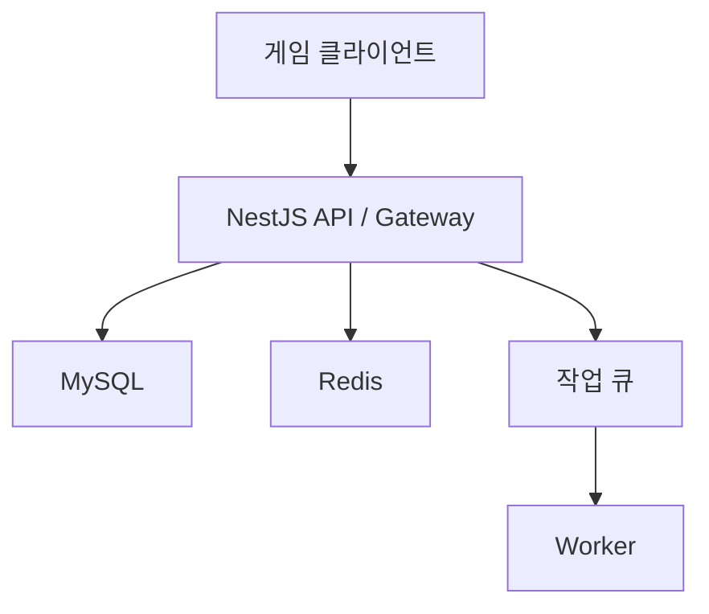

````markdown
# 포트폴리오 · 면접 준비

---

## 1. 포트폴리오에서 확인하는 부분

포트폴리오는 단순히 사용한 기술을 나열하는 문서가 아니다.

다음 내용을 확인할 수 있어야 한다.

1. 어떤 문제를 맡았는지
2. 왜 그 기술과 구조를 선택했는지
3. 구체적으로 무엇을 했는지
4. 결과를 어떤 근거로 검증했는지
5. 실패, 한계, 다음 개선점을 알고 있는지

결국 중요한 것은 자신의 **경험과 판단 과정을 일관되게 설명하는 것**이다.

---

# 2. 포트폴리오

## 2.1 첫 문장이 중요하다

첫 문장에는 다음 내용을 압축해서 표현한다.

- 지원 직무
- 경험
- 주요 기술
- 강점
- 해결해 본 문제

### 예시

> Node.js와 NestJS로 게임 백엔드 API와 실시간 통신 기능을 개발하고, MySQL과 Redis를 기반으로 데이터 정합성과 성능 문제를 해결해 온 서버 개발자

```text
[직무·역할] + [기술] + [해결한 문제] + [차별점]
```
````

예시:

```text
Node.js, NestJS 기반 게임 서버 개발자로,
이벤트 트래픽과 재화·보상 데이터의 정합성 문제를
관측 지표와 재현 테스트를 바탕으로 분석하고 해결한다.
```

> `대규모`, `고성능`, `안정적`과 같은 표현은 실제 수치나 구체적인 근거를 설명할 수 있을 때만 사용한다.

---

## 2.2 숫자로 설명하기

숫자는 성과를 검증 가능하게 만든다.

하지만 숫자만 나열한다고 좋은 포트폴리오가 되는 것은 아니다.

다음 내용을 함께 작성해야 한다.

- 측정 대상
- 측정 방법
- 측정 조건
- 비교 기준
- 개선 전후 결과

### 활용할 수 있는 자료

| 영역         | 예시                                   |
| ------------ | -------------------------------------- |
| API 성능     | 평균 응답 시간, p95, p99, 오류율       |
| 데이터베이스 | 쿼리 실행 시간, 스캔 행 수, 실행 계획  |
| 캐시         | 적중률, TTL, 원본 조회 감소량          |
| 메시지 큐    | 처리량, 대기 작업 수, 재시도율, 실패율 |
| 실시간 서버  | 동시 연결 수, 메시지 처리량, 전송 지연 |
| 배포         | 배포 시간, 롤백 시간                   |
| 비용         | 인스턴스 수, CPU·메모리 사용량         |
| 안정성       | 장애 건수, 재발률                      |
| 품질         | 테스트 수, 결함 감소량                 |

### 작성 템플릿

> [병목]을 확인하기 위해 [측정 방법]으로 분석하고, [기술·설계]를 적용하여 동일한 조건에서 [개선 전 지표]를 [개선 후 지표]로 개선했다. 대신 [정합성 문제·운영 비용 등]이 발생할 수 있어 [보완 방법]을 함께 적용했다.

### 작성 예시

> 이벤트 보상 조회가 DB에 집중되는 문제를 APM과 Slow Query Log를 통해 확인했다. 이후 Redis 캐시와 명시적 캐시 무효화를 적용하고 동일한 부하 조건에서 응답 시간을 비교하여 개선 효과를 검증했다.

### 수치 작성 시 주의점

- 평균값만 작성하지 말고 가능하면 p95, p99도 확인한다.
- 개선 전후의 요청 수, 데이터 양, 인프라 조건을 동일하게 맞춘다.
- `몇 배 향상`과 함께 가능하면 절대 수치도 작성한다.
- 측정하지 않은 수치를 추측해서 작성하지 않는다.
- 팀 전체 성과와 본인의 기여를 구분한다.
- 보안상 공개할 수 없는 값은 비율이나 범위로 익명화한다.

---

# 3. README 작성

README는 프로젝트의 구조, 기술적 결정, 검증 결과를 빠르게 이해할 수 있도록 작성하는 문서다.

## 3.1 권장 순서

1. 프로젝트 소개
2. 해결하려는 문제와 구조
3. 핵심 기능
4. 기술 스택
5. 아키텍처
6. 데이터 흐름
7. 실행 방법
8. 환경 변수
9. API·메시지 프로토콜
10. 테스트 방법
11. 성능·장애 검증 결과
12. 기술적 의사결정
13. 한계 및 개선 계획

---

## 3.2 Node.js · NestJS 게임 서버 README 템플릿

````markdown
# 프로젝트 이름

> 프로젝트의 목적과 전체 구조를 간단하게 설명한다.

## 핵심 기능

- 로그인과 토큰 인증
- 사용자 재화와 인벤토리
- 매칭과 게임 결과 처리
- 실시간 알림 또는 WebSocket 통신

## 기술 스택

- Node.js
- TypeScript
- NestJS
- MySQL
- Redis
- Docker

각 기술을 선택한 이유를 한 줄씩 작성한다.

## 아키텍처

구성 요소와 데이터 흐름을 다이어그램과 함께 설명한다.

## 주요 설계

### 재화 차감과 아이템 지급

- 트랜잭션 범위
- 동시 요청 처리
- 중복 요청 방지
- 멱등성
- 실패 처리
- 보상 정책

### 캐시

- 캐시 대상
- 캐시 키 구조
- TTL
- 캐시 무효화
- Cache Miss 처리
- Redis 장애 시 동작

## 실행 방법

```bash
npm ci
npm run start:dev
```

## 환경 변수

| 이름         | 설명              | 예시                        |
| ------------ | ----------------- | --------------------------- |
| DATABASE_URL | DB 연결 문자열    | 실제 비밀값은 저장하지 않음 |
| REDIS_URL    | Redis 연결 문자열 | 실제 비밀값은 저장하지 않음 |

## 테스트

```bash
npm run test
npm run test:e2e
```

## 성능 검증

- 테스트 도구와 버전
- 요청 시나리오
- 동시 사용자 수
- 요청 수
- 데이터 크기
- 인프라 조건
- 개선 전 지표
- 개선 후 지표

## 기술적 의사결정

- 고려한 선택지
- 최종 선택
- 선택 이유
- 장점
- 단점
- 재검토 조건

## 개선 계획

- 현재 해결하지 못한 문제
- 운영 환경 적용 시 필요한 작업
- 추가로 검증해야 할 부분
````

---

## 3.3 아키텍처 예시



아키텍처를 보여주는 것에서 끝내지 않고 다음 내용을 설명할 수 있어야 한다.

- 각 구성 요소의 책임
- 데이터의 원본인 Source of Truth
- 동기·비동기 처리의 경계
- 실패 시 재시도 또는 복구 방법
- 여러 인스턴스 사이의 상태 공유 방식

---

## 3.4 저장소 공개 전 보안 확인

- 실제 환경 변수 제거
- Secret Key 제거
- Access Token 제거
- 운영 도메인 제거 또는 익명화
- 운영 IP 제거
- 계정 정보 제거
- 내부 저장소 주소 제거
- 사용자 개인정보 제거
- 실제 운영 로그 제거
- Git 커밋 기록에 비밀값이 남아 있는지 확인

---

# 4. 오픈 소스 컨트리뷰션

오픈 소스 기여는 반드시 큰 기능을 추가하는 것만 의미하지 않는다.

다음과 같은 것도 충분히 기여가 될 수 있다.

- 문서 오탈자 수정
- 재현 가능한 버그 리포트
- 테스트 케이스 추가
- 타입 정의 개선
- 예제 코드 보완
- 기존 Issue 분류 및 검증
- 문서 개선

## 4.1 기여 절차

1. `CONTRIBUTING` 문서와 행동 강령을 확인한다.
2. 기존 Issue와 Pull Request를 검색한다.
3. 버그라면 최소 재현 코드를 작성한다.
4. 작은 변경부터 시작한다.
5. 변경 이유와 검증 방법을 명확하게 작성한다.
6. 리뷰 의견에 근거를 들어 응답한다.

## 4.2 포트폴리오 작성 방식

```text
프로젝트:
문제:
재현 방법:
내가 변경한 부분:
테스트:
리뷰에서 배운 점:
링크:
```

단순히 `오픈 소스에 기여했다`라고 작성하는 것보다 어떤 문제를 어떻게 확인하고 수정했는지를 설명하는 것이 중요하다.

---

# 5. 기술 블로그

기술 블로그는 다음 순서로 작성하면 좋다.

1. 상황과 증상
2. 기대한 동작
3. 실제 동작
4. 재현 방법
5. 가설
6. 로그·지표·프로파일링 결과
7. 원인
8. 해결
9. 대안과 트레이드오프
10. 재발 방지

---

## 5.1 Node.js 장애 분석 글 예시

```text
제목:
Node.js API의 응답 시간이 증가한 원인과 해결

상황:
특정 이벤트 시간대에 API 응답 지연이 발생했다.

관측:
CPU
메모리
이벤트 루프 지연
DB 쿼리 실행 시간
Redis 지연
커넥션 풀 대기 시간
등을 확인했다.

원인:
동기 CPU 작업, 비효율적인 쿼리 등 실제 확인된 원인을 작성한다.

해결:
코드, 쿼리 또는 서버 구조를 변경한다.

검증:
동일한 조건의 부하 테스트 또는 운영 지표를 통해 검증한다.

한계:
현재 해결되지 않은 부분과 다음 개선 사항을 작성한다.
```

회사 업무를 기술 블로그나 포트폴리오로 작성할 때는 다음 내용을 공개할 권한이 있는지 반드시 확인한다.

- 코드
- 데이터
- 장애 발생 시간
- 트래픽 규모
- 서버 내부 구조
- 인프라 정보
- 운영 로그

---

# 6. 포트폴리오 프로젝트 작성법

## 6.1 프로젝트를 한 페이지로 요약하는 구조

| 항목      | 내용                                 |
| --------- | ------------------------------------ |
| 기간·인원 | 기간, 팀 규모, 본인의 역할           |
| 서비스    | 어떤 사용자의 어떤 문제를 해결하는지 |
| 책임      | 본인이 담당한 기능과 운영 범위       |
| 기술      | 사용 목적을 포함한 기술 스택         |
| 문제      | 증상, 영향, 제약 조건                |
| 분석      | 로그, 메트릭, 실행 계획, 재현 테스트 |
| 해결      | 선택지와 최종 결정                   |
| 결과      | 동일 조건의 전후 지표                |
| 회고      | 단점, 실패, 개선 사항                |

---

## 6.2 문제 해결 공식

```text
상황
  ↓
문제
  ↓
분석
  ↓
선택지
  ↓
결정
  ↓
구현
  ↓
검증
  ↓
회고
```

### 작성 예시

> [기능]에서 [사용자 또는 운영 영향]이 발생했다. [로그·지표·재현 테스트]를 통해 [원인]을 확인했다. [대안 A]와 [대안 B]를 비교한 뒤 [제약 조건] 때문에 [선택한 방법]을 적용했다. 이후 동일한 측정 조건에서 [지표]가 개선 전 [수치]에서 개선 후 [수치]로 변경되었다. 다만 [단점]이 남아 있어 [보완 방법 또는 다음 계획]을 준비했다.

---

# 7. Node.js · NestJS · 게임 서버 핵심 내용

## 7.1 Node.js

다음 내용을 자신의 경험과 연결해서 설명할 수 있어야 한다.

- 이벤트 루프
- 비동기 I/O
- CPU 집약 작업 분리
- Promise 오류 처리
- Timeout 처리
- Stream
- Backpressure
- Graceful Shutdown
- 메모리 누수 관측
- 이벤트 루프 지연 관측
- Worker Thread
- 여러 프로세스
- 여러 Pod에서의 상태 관리

---

## 7.2 NestJS

- Module의 경계
- Provider의 책임
- Dependency Injection
- 테스트 대역 교체
- Controller 역할
- Service 역할
- Repository 역할
- Middleware
- Guard
- Pipe
- Interceptor
- Exception Filter
- Singleton Scope
- Request Scope
- Transient Scope
- Config와 환경 변수 검증
- Unit Test
- Integration Test
- E2E Test
- WebSocket Gateway
- Microservice 사용 이유

---

## 7.3 게임 서버

- 서버 권위(Server Authoritative) 구조
- 치트 방지
- 재화 처리의 원자성
- 보상 처리의 원자성
- 멱등성
- 매칭 큐
- 매칭 취소
- 중복 요청 처리
- 재시도
- 세션
- 재접속
- 메시지 순서 보장
- 메시지 버전 관리
- 실시간 상태와 영속 데이터의 경계
- 이벤트 운영
- 장애 복구
- 롤백

---

# 8. 면접

## 8.1 면접 질문의 특징

면접에서는 첫 답변에서 사용한 단어를 기준으로 이해의 깊이를 추가로 확인할 수 있다.

예를 들어 다음과 같다.

```text
Redis를 사용했다.
    ↓
왜 Redis를 선택했는가?
    ↓
캐시 대상은 무엇이었는가?
    ↓
TTL은 어떻게 결정했는가?
    ↓
원본 데이터와 불일치하면 어떻게 처리하는가?
    ↓
Redis 장애 시 서비스는 동작하는가?
    ↓
Cache Stampede는 어떻게 방지했는가?
```

따라서 사용한 모든 기술과 성과에 대해 최소한 다음 질문에는 답할 수 있어야 한다.

- 왜 사용했는가?
- 다른 선택지는 무엇이었는가?
- 장점은 무엇인가?
- 단점은 무엇인가?
- 실패하면 어떻게 되는가?
- 실제로 어떻게 검증했는가?
- 다시 만든다면 무엇을 변경할 것인가?

---

# 9. 공식 문서 확인

기술의 동작 방식과 기본값은 버전에 따라 달라질 수 있다.

따라서 공식 문서, 표준, 릴리스 노트, 타입 정의, 소스 코드 등을 기준으로 검증하는 습관이 필요하다.

## 9.1 Node.js · NestJS 확인 순서

1. 현재 사용 중인 버전을 확인한다.
2. 공식 문서를 확인한다.
3. Release Note와 Migration Guide를 확인한다.
4. 타입 정의 또는 소스 코드를 확인한다.
5. 최소 재현 코드로 직접 검증한다.

## 9.2 주요 공식 자료

- Node.js API 문서  
  https://nodejs.org/docs/latest/api/

- Node.js 학습 문서  
  https://nodejs.org/en/learn

- NestJS 공식 문서  
  https://docs.nestjs.com/

- TypeScript 공식 문서  
  https://www.typescriptlang.org/docs/

- ECMAScript 명세  
  https://tc39.es/ecma262/

- MDN JavaScript  
  https://developer.mozilla.org/docs/Web/JavaScript

- MySQL 공식 문서  
  https://dev.mysql.com/doc/

- Redis 공식 문서  
  https://redis.io/docs/

---

# 10. 30초 답변 구조 · 2분 경험 답변 구조

기술 질문과 경험 질문은 서로 다른 구조로 준비하면 좋다.

## 10.1 기술 질문

```text
정의
  ↓
핵심 원리
  ↓
장점·단점
  ↓
선택 기준
  ↓
경험 또는 예시
```

## 10.2 경험 질문

```text
상황
  ↓
목표
  ↓
행동
  ↓
결과
  ↓
회고
```

---

# 11. 장점 · 단점 · 차이는 필수

기술 질문은 정의만 설명하고 끝내면 부족하다.

다음 내용을 함께 설명해야 한다.

| 항목      | 내용                      |
| --------- | ------------------------- |
| 정의      | 무엇인지                  |
| 핵심      | 무엇을 기준으로 다른지    |
| 장점      | 어떤 조건에서 유리한지    |
| 단점      | 어떤 비용과 위험이 있는지 |
| 선택 기준 | 어떤 상황에서 선택하는지  |
| 경험      | 실제 적용 또는 검증 사례  |

---

## 11.1 프로세스와 스레드

> 프로세스는 독립된 주소 공간을 가진 실행 단위이고, 스레드는 프로세스의 자원을 공유하는 실행 흐름이다. 프로세스는 메모리 격리와 장애 전파 측면에서 유리하지만 프로세스 간 통신 비용이 발생한다. 스레드는 공유 메모리를 이용해 효율적으로 협업할 수 있지만 동기화 문제가 발생할 수 있다. Node.js에서는 JavaScript를 실행하는 이벤트 루프 스레드, libuv의 Worker Pool, Worker Threads, 여러 프로세스를 구분해서 이해해야 한다.

---

## 11.2 캐시와 데이터베이스

> 캐시는 반복적인 데이터 조회를 빠르게 처리하기 위한 보조 저장 계층이고, 데이터베이스는 일반적으로 영속 데이터의 Source of Truth 역할을 한다. 캐시는 조회 성능을 높이고 원본 저장소의 부하를 줄일 수 있지만 캐시 무효화와 데이터 정합성 문제가 발생한다. 따라서 데이터의 특성과 허용 가능한 불일치 시간을 기준으로 TTL과 갱신 전략을 결정해야 한다.

---

# 12. 체크리스트

## 12.1 이력서 · 포트폴리오

- [ ] 첫 문장에 직무와 강점이 드러나는가?
- [ ] 각 프로젝트에서 본인의 역할이 구분되어 있는가?
- [ ] 성과 수치에 측정 조건과 기준이 포함되어 있는가?
- [ ] 사용 기술의 선택 이유를 설명할 수 있는가?
- [ ] 사용 기술의 단점을 설명할 수 있는가?
- [ ] 공개하면 안 되는 코드, 로그, 비밀값이 없는가?
- [ ] 링크가 정상적으로 열리는가?
- [ ] 맞춤법과 기술 용어가 일관적인가?

---

## 12.2 Node.js · TypeScript

- [ ] 이벤트 루프와 비동기 I/O를 설명할 수 있는가?
- [ ] Microtask와 Timer의 차이를 기본 수준에서 설명할 수 있는가?
- [ ] CPU 작업이 요청 처리를 막는 이유를 설명할 수 있는가?
- [ ] Worker Thread와 여러 프로세스의 차이를 설명할 수 있는가?
- [ ] Promise 오류 처리 방식을 설명할 수 있는가?
- [ ] Timeout 처리 방식을 설명할 수 있는가?
- [ ] CommonJS와 ES Module의 차이를 설명할 수 있는가?
- [ ] TypeScript 타입 검사와 런타임 검증의 차이를 설명할 수 있는가?

---

## 12.3 NestJS

- [ ] Module, Controller, Provider의 역할을 설명할 수 있는가?
- [ ] DI의 장점을 설명할 수 있는가?
- [ ] 테스트에서 의존성을 대역으로 교체하는 방법을 설명할 수 있는가?
- [ ] Singleton, Request, Transient Scope를 비교할 수 있는가?
- [ ] Middleware, Guard, Pipe, Interceptor, Filter를 비교할 수 있는가?
- [ ] Validation과 예외 응답 구조를 설명할 수 있는가?
- [ ] Unit, Integration, E2E Test의 범위를 설명할 수 있는가?
- [ ] Graceful Shutdown을 설명할 수 있는가?
- [ ] Health Check를 설명할 수 있는가?

---

## 12.4 데이터베이스 · Redis

- [ ] 트랜잭션과 ACID를 설명할 수 있는가?
- [ ] 트랜잭션 격리 수준을 설명할 수 있는가?
- [ ] 동시성 문제를 설명할 수 있는가?
- [ ] 인덱스를 설명할 수 있는가?
- [ ] 실행 계획을 확인할 수 있는가?
- [ ] N+1 문제를 설명할 수 있는가?
- [ ] Join 전략을 설명할 수 있는가?
- [ ] Cache Aside 패턴을 설명할 수 있는가?
- [ ] 캐시 무효화를 설명할 수 있는가?
- [ ] Cache Stampede를 설명할 수 있는가?
- [ ] Hot Key 문제와 대응 방법을 설명할 수 있는가?
- [ ] 분산 락의 실패 상황과 한계를 설명할 수 있는가?

---

## 12.5 게임 서버 · 분산 시스템

- [ ] 멱등성을 설명할 수 있는가?
- [ ] 중복 요청 처리 방법을 설명할 수 있는가?
- [ ] 재화 차감과 보상 지급의 정합성을 설명할 수 있는가?
- [ ] 재접속과 세션 복구 방식을 설명할 수 있는가?
- [ ] 메시지 순서 보장 방법을 설명할 수 있는가?
- [ ] 메시지 버전 관리 방법을 설명할 수 있는가?
- [ ] 여러 Pod에서 인메모리 상태가 자동으로 공유되지 않는 이유를 설명할 수 있는가?
- [ ] 재시도 전략을 설명할 수 있는가?
- [ ] Exponential Backoff의 용도를 설명할 수 있는가?
- [ ] 로그, 메트릭, 트레이싱을 이용한 장애 분석 과정을 설명할 수 있는가?

---

## 12.6 면접 당일

- [ ] 회사와 서비스의 최근 공개 정보를 확인했는가?
- [ ] 채용 공고를 다시 확인했는가?
- [ ] 30초 자기소개를 준비했는가?
- [ ] 2분 자기소개를 준비했는가?
- [ ] 대표 프로젝트 2개를 설명할 수 있는가?
- [ ] 실패 경험을 준비했는가?
- [ ] 갈등 경험을 준비했는가?
- [ ] 장애 대응 경험을 준비했는가?
- [ ] 면접관에게 할 질문을 준비했는가?

---

# 13. 기술 면접 예상 질문

## 13.1 Node.js

### Q. Node.js는 싱글 스레드인가?

> JavaScript 코드는 일반적으로 이벤트 루프가 동작하는 하나의 메인 스레드에서 실행되지만, Node.js 런타임 전체가 하나의 스레드만 사용하는 것은 아니다.
>
> 파일 시스템, 암호화, DNS 등 일부 비동기 작업은 libuv의 Worker Pool을 사용할 수 있고, 네트워크 I/O는 운영체제의 비동기 I/O 기능을 활용한다.
>
> CPU 집약적인 작업은 Worker Threads나 별도의 프로세스로 분리할 수 있다.
>
> 따라서 `JavaScript 실행이 기본적으로 단일 스레드에서 이루어진다`는 것과 `Node.js 전체가 싱글 스레드다`라는 것은 구분해야 한다.

---

### Q. 이벤트 루프가 막힌다는 것은 무엇인가?

> 긴 동기 작업이나 CPU 집약적인 작업이 JavaScript 메인 스레드를 오래 점유하여 다른 요청의 콜백, Promise 처리, Timer 등이 실행되지 못하는 상태를 의미한다.
>
> 대량의 반복문, 큰 데이터 정렬, 동기 암호화 연산, 큰 JSON의 동기 처리 등이 원인이 될 수 있다.
>
> 이벤트 루프 지연과 CPU Profile 등을 측정하여 원인을 확인하고, 작업 분할이나 Worker Threads 사용 등을 검토할 수 있다.

---

### Q. async/await를 사용하면 새로운 스레드가 생성되는가?

> 아니다.
>
> `async/await`는 Promise 기반의 비동기 흐름을 동기 코드처럼 읽기 쉽게 표현하기 위한 문법이다.
>
> 실제 작업이 어디에서 처리되는지는 I/O의 종류와 Node.js 런타임 구현에 따라 다르다.
>
> 따라서 `async` 함수를 사용했다는 사실만으로 새로운 스레드가 생성되는 것은 아니다.

---

### Q. Promise.all을 사용할 때 주의할 점은?

> `Promise.all()`은 여러 Promise를 동시에 진행할 때 유용하지만 작업 개수를 무제한으로 늘리면 DB Connection Pool, 외부 API, 네트워크, 메모리 등의 자원을 과도하게 사용할 수 있다.
>
> 또한 하나의 Promise가 Reject되면 `Promise.all()` 역시 Reject되지만 이미 시작된 다른 작업들이 자동으로 취소되는 것은 아니다.
>
> 따라서 많은 작업을 병렬 처리할 때는 동시성 제한, Timeout, AbortController 등을 함께 고려해야 한다.

---

# 14. NestJS 예상 질문

## 14.1 Provider와 DI의 장점은?

> Provider는 NestJS의 IoC Container가 생성하고 다른 객체에 주입할 수 있는 객체다.
>
> 객체 생성과 의존 관계 관리를 컨테이너에 위임하면 구현체를 교체하거나 테스트용 Mock, Fake, Stub 등을 주입하기 쉬워진다.
>
> 또한 객체의 생명주기를 프레임워크가 일관되게 관리할 수 있다는 장점이 있다.
>
> 다만 Module 경계와 Injection Token 설계가 명확하지 않으면 의존 관계가 복잡해질 수 있다.

---

## 14.2 Middleware, Guard, Pipe, Interceptor, Filter의 차이는?

> **Middleware**는 요청이 Route Handler로 전달되기 전에 실행되는 일반적인 전처리에 사용한다.
>
> **Guard**는 `ExecutionContext`를 기반으로 해당 요청이 Handler를 실행할 권한이 있는지 판단한다.
>
> **Pipe**는 입력 데이터의 변환과 검증에 사용한다.
>
> **Interceptor**는 Handler 실행 전후의 공통 로직, 응답 변환, 로깅 등에 사용할 수 있다.
>
> **Exception Filter**는 처리되지 않은 예외를 가로채 원하는 응답 형태로 변환할 때 사용한다.

---

## 14.3 Request Scope를 남용하면 왜 문제가 되는가?

> Request Scope Provider는 요청마다 새로운 인스턴스가 생성된다.
>
> 또한 Request Scope Provider에 의존하는 Provider의 Scope에도 영향을 줄 수 있기 때문에 객체 생성 비용과 메모리 사용량이 증가할 수 있다.
>
> 따라서 요청별 상태가 정말 필요한지 먼저 확인하고, 가능하면 요청 데이터는 메서드 인자로 전달하면서 기본 Singleton Scope를 유지하는 것이 좋다.

---

# 15. 데이터베이스 · Redis 예상 질문

## 15.1 게임 서버에서 트랜잭션이 필요한 경우는?

> 재화 차감과 아이템 지급처럼 여러 데이터 변경이 모두 성공하거나 모두 실패해야 하는 경우 트랜잭션이 필요하다.
>
> 하지만 DB 트랜잭션만으로 중복 HTTP 요청까지 자동으로 해결되지는 않는다.
>
> 중복 요청에는 멱등 키, Unique Constraint, 상태 전이 검증 등의 추가적인 설계가 필요하다.

---

## 15.2 인덱스가 많으면 무조건 좋은가?

> 아니다.
>
> 인덱스는 조회 성능을 높일 수 있지만 추가 저장 공간을 사용하고 `INSERT`, `UPDATE`, `DELETE`가 발생할 때 인덱스도 함께 갱신해야 한다.
>
> 따라서 실제 조회 패턴, 선택도, 정렬 조건, Join 조건을 확인하고 `EXPLAIN` 등의 실행 계획을 기준으로 필요한 인덱스만 설계해야 한다.

---

## 15.3 Cache Aside Pattern이란?

> 애플리케이션이 먼저 캐시를 조회하고, Cache Miss가 발생하면 데이터베이스에서 데이터를 읽은 뒤 캐시에 저장하는 방식이다.
>
> 구현이 비교적 단순하고 읽기 중심의 서비스에서 사용하기 좋다.
>
> 하지만 Cache Miss, TTL, 캐시 무효화, 데이터베이스와 캐시 사이의 일시적인 데이터 불일치 등을 함께 고려해야 한다.

---

# 16. 게임 서버 예상 질문

## 16.1 재화 차감 API의 중복 요청은 어떻게 처리하는가?

> 클라이언트 요청마다 멱등 키를 부여하고, 서버는 처리 기록에 Unique Constraint를 설정할 수 있다.
>
> 동일한 멱등 키를 가진 요청이 다시 들어오면 기존 처리 결과를 반환하거나 현재 처리 상태를 반환한다.
>
> 가능하다면 재화 변경과 요청 처리 기록은 하나의 DB 트랜잭션 경계에서 처리한다.
>
> 외부 시스템까지 포함된다면 DB 트랜잭션만으로 해결할 수 없기 때문에 재시도, 상태 머신, 보상 트랜잭션 등의 전략을 별도로 고려해야 한다.

---

## 16.2 서버 권위(Server Authoritative) 방식이란?

> 중요한 게임 결과를 클라이언트에서 전달한 값만 신뢰하면 데이터 조작이나 치트에 취약하다.
>
> 따라서 중요한 규칙과 상태는 서버가 검증하고 최종 결과를 결정하는 구조가 필요하다.
>
> 하지만 모든 계산을 서버에서 처리하면 서버 비용과 네트워크 지연이 증가할 수 있다.
>
> 따라서 화면 예측이나 연출은 클라이언트에서 수행하더라도 재화, 보상, 전투 판정과 같은 핵심 결과는 서버에서 최종 검증하는 방식으로 역할을 나눌 수 있다.

---

## 16.3 재접속은 어떻게 복구하는가?

> 재접속에서는 인증된 사용자 정보, 참가 중인 방, 마지막으로 확인한 메시지 Sequence, 현재 게임 상태 등을 다시 검증해야 한다.
>
> Socket ID 자체를 사용자 ID로 사용해서는 안 된다.
>
> Socket ID는 연결이 새로 생성될 때 변경될 수 있기 때문이다.
>
> 사용자 인증 정보나 짧은 유효 기간을 가진 Resume Token, 서버에 저장된 Session 정보를 이용하여 새로운 연결을 기존 사용자와 안전하게 연결할 수 있다.

---

# 17. 프로젝트 설명용 템플릿

> **[프로젝트명]**은 [사용자 또는 비즈니스 문제]를 해결하는 서비스였습니다.
>
> 저는 [담당 기능·책임]을 맡았습니다.
>
> 개발 또는 운영 과정에서 [문제]가 발생했고, [로그·메트릭·실행 계획·재현 테스트]를 통해 [원인]을 확인했습니다.
>
> 이후 [대안 A]와 [대안 B]를 비교했고, [제약 조건] 때문에 [선택한 해결 방법]을 적용했습니다.
>
> 구현 후 동일한 조건에서 [측정 지표]를 비교하여 [개선 결과]를 확인했습니다.
>
> 다만 [남아 있는 문제 또는 트레이드오프]가 있어 [보완 방법 또는 다음 개선 계획]을 준비했습니다.

---

# 18. 30초 자기소개 템플릿

> 안녕하세요. [주요 기술]을 중심으로 [도메인] 서버를 개발해 온 [직무·경력]입니다.
>
> [대표 프로젝트]에서 [핵심 문제]를 맡아 [로그·지표·재현 테스트 등의 분석 방법]으로 원인을 확인하고 [해결 방법]을 적용하여 [검증된 결과]를 만들었습니다.
>
> 기능 구현에서 끝나지 않고 데이터 정합성, 장애 대응, 배포와 운영까지 이해하고 책임질 수 있는 서버 개발자로 성장하고 있습니다.

---

# 19. 면접 준비 핵심 원칙

면접에서 중요한 것은 기술 이름을 많이 아는 것이 아니다.

다음 흐름으로 자신의 경험을 설명할 수 있어야 한다.

```text
무엇을 사용했는가?
        ↓
왜 사용했는가?
        ↓
어떤 문제가 있었는가?
        ↓
어떻게 원인을 확인했는가?
        ↓
다른 방법은 무엇이 있었는가?
        ↓
왜 현재 방법을 선택했는가?
        ↓
어떻게 구현했는가?
        ↓
어떻게 검증했는가?
        ↓
어떤 단점이 남았는가?
        ↓
다시 한다면 무엇을 개선할 것인가?
```

결국 좋은 포트폴리오와 좋은 면접 답변은 다음 한 문장으로 정리할 수 있다.

> **기술을 사용했다는 사실보다, 왜 선택했고 어떤 문제를 해결했으며 그 결과를 어떻게 검증했는지를 설명할 수 있어야 한다.**

```

특히 원본에서 `Integeration → Integration`, `Interecpetor → Interceptor`, `Graceful Shutdonw → Graceful Shutdown`, `에쌍 → 예상`, `본익 역할 → 본인 역할`, `Source of Truth`, MySQL 공식 문서 URL 같은 부분도 같이 정리해뒀어.
```
