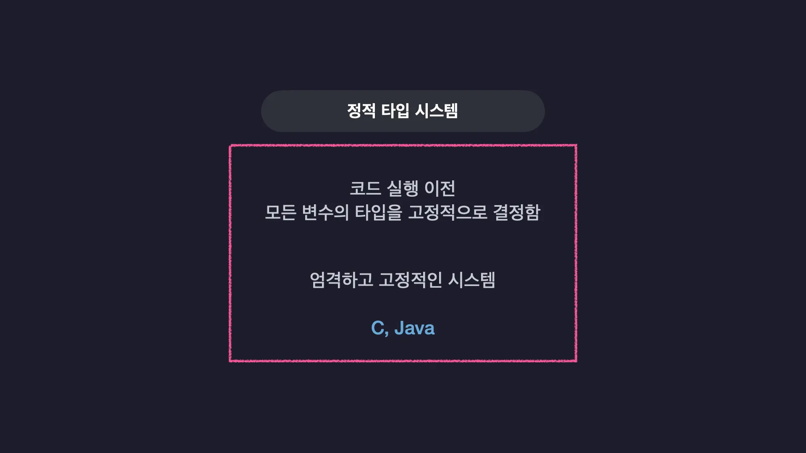
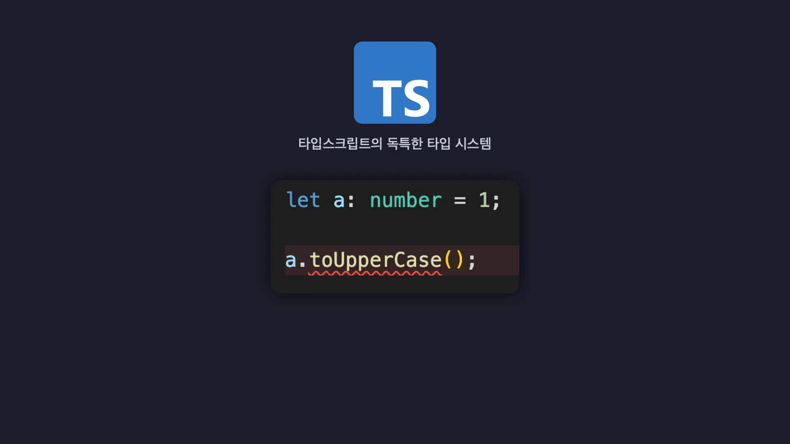
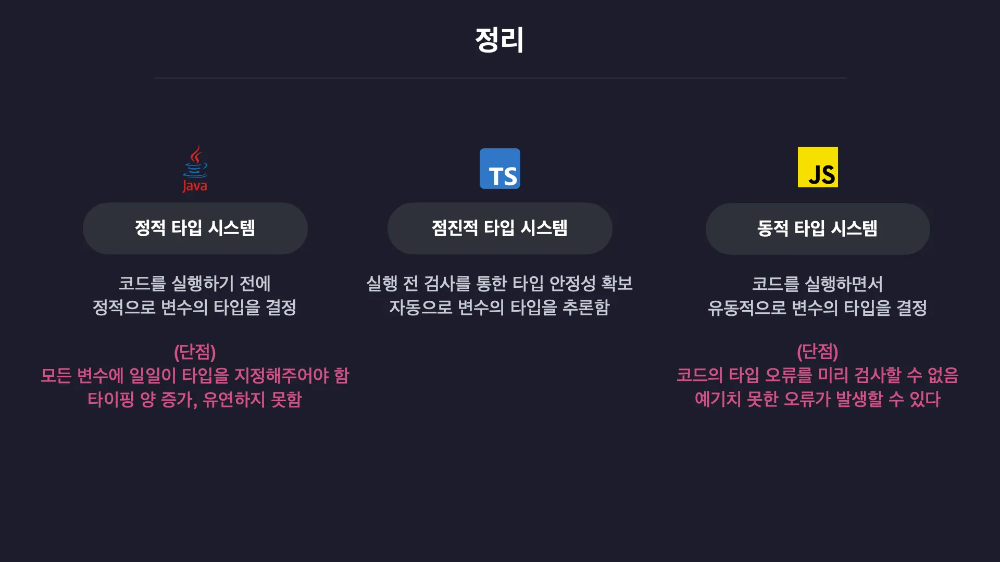

# 🌐 TypeScrpt JS의 단점과 TS의 장점

## 1. 모든 프로그래밍 언어에 타입 시스템이 있다.

- 자바스크립트에 한계점은?
- 타입스크립트는 한계점을 극복하는지?
- 타입스크립트가 다른 언어 대비 갖는 차별점은?

### 1-1. 타입 시스템이란?

- 타입 시스템은 언어의 타입 관련된 문법 체계이다.
- 하나는 코드 실행 전에 모든 변수의 타입을 고정적으로 결정 하는 **정적 타입 시스템**
- 코드를 실행하기 전에 타입을 결정하지 않고 코드를 실행하고 나서 그때 그때마다 유동적으로 변수의 타입을 결정하는 **동적 타입 시스템**
- 정적 타입 시스템은 엄격하고 고정적 시스템, 동적 타입 시스템은 자유롭고 유연한 시스템이라고 볼 수 있다.
  

- C나 Java같은 엄격한 문법을 가진 언어는 정적 타입 시스템
- 파이썬이나 자바스크립트 같은 유연한 문법을 가진 언어는 동적 타입 시스템을 사용한다.

### 1-2. 동적 타입 시스템

**동적 타입 시스템**

- 자바스크립트가 사용하는 동적 타입 시스템은 기본적으로 변수의 타입들을 코드가 실행 되는 도중 결정된다. 미리 변수에 타입을 설정하지 않아도 되는 유연함이 있다.
  

```js
let a = "hello"; // 문자열
a = 19970170; // 숫자

a.toUpperCase();
```

- 실행은 되나 오류가 발생한다. toUpperCase는 문자열에만 사용할 수 있는 메서드이기 때문이다.(a 숫자)
- 다만, 코드가 실행이 되기는 한다. 실행 전에 검사를 안하기 때문이다.
- 런타임에 오류가 발생하게 되면 큰 문제가 발생할수도 있다.

---

### 1-3. 정적 타입 시스템

**정적 타입 시스템**

- C나 Java같은 언어들은 정적 타입 시스템을 가지고 있다.
- 정적 타입 시스템은 코드를 실행하기 전에 모든 변수의 타입을 결정한다.
  

- 변수를 선언 함과 동시에 타입도 함께 명시해야 한다.
  
- String 타입 변수 a에 문자열, 두번째 라인 b 숫자를 선언, 문자열과 숫자를 곱하는 연산은 불가능하다.
- 정적 타입 시스템에서느 에디터 상에서 애초에 오류를 바로 알려주고 실행 전 검사까지 모두 마쳐 실행이 불가능하다.

---

### 1-4. 정적 타입 시스템의 단점

**정적 타입 시스템의 단점**

- 코드의 양이 상당히 늘어난다.
- 일일히 타입을 다 정의해야 한다.

---

### 1-5. 타입스크립트와 점진적 타이핑

- 동적 타입 시스템과 정적 타입 시스템을 혼합한 타입시스템을 실행한다.
- 타입 시스템처럼 타입 오류가 없는 지 코드를 검사한다.
  

- a를 number 타입으로 정의하여 문자열 메서드를 사용하면 미리 오류를 띄운다.
- 변수의 타입을 직접 정의하지 않아도 변수에 담기는 초기값을 기준으로 자동으로 타입을 알아서 추론한다.
- 점진적으로 타입을 결정 -> **점진적 타입 시스템**

---

### 1-6. 정리



## 1. 타입 시스템의 분류 기준

모든 프로그래밍 언어는 **'변수의 타입을 언제 결정하는가?'**에 따라 크게 두 가지로 나뉩니다.

- **동적 타입 시스템 (Dynamic Type System)**: 프로그램 **실행(Runtime) 중**에 타입을 결정함
- **정적 타입 시스템 (Static Type System)**: 프로그램 **실행 전(Compile time)**에 타입을 결정함

---

## 2. 기존 시스템의 장단점 비교

| 구분               | 동적 타입 시스템                                                              | 정적 타입 시스템                                                        |
| :----------------- | :---------------------------------------------------------------------------- | :---------------------------------------------------------------------- |
| **대표 언어**      | **JavaScript**, Python, Ruby                                                  | **Java**, C, C++                                                        |
| **타입 결정 시기** | 런타임 (실행 도중)                                                            | 컴파일 타임 (실행 전)                                                   |
| **장점**           | 유연함, 코드 작성이 빠르고 간결함                                             | 실행 전 오류 발견 가능, 높은 안정성                                     |
| **단점**           | **실행 도중 예상치 못한 에러 발생 가능**<br>(타입 관련 오류를 미리 검사 불가) | **모든 변수에 일일이 타입을 지정해야 함**<br>(코드가 길어지고 번거로움) |

---

## 3. TypeScript의 차별점: 점진적 타입 시스템 (Gradual Type System)

TypeScript는 동적 타입과 정적 타입의 장점을 결합한 **점진적 타입 시스템**을 채택했습니다.

### ✅ 특징

1.  **정적 타입의 안정성 확보**
    - 마치 Java처럼 프로그램 **실행 전**에 타입을 검사하여 오류를 미리 잡아냅니다.
2.  **동적 타입의 유연함 유지 (타입 추론)**
    - 모든 변수에 일일이 타입을 지정하지 않아도 됩니다.
    - 변수의 초기값을 보고 타입을 자동으로 알아내는 **타입 추론(Type Inference)** 기능을 제공합니다.

> **결론:** <br>
> TypeScript는 **"실행 전 타입 검사로 안전하면서도, 일일이 타이핑할 필요 없는 유연함"**을 모두 갖춘 독특하고 강력한 언어입니다.

---

## 참고자료

https://www.inflearn.com/course/%ED%95%9C%EC%9E%85-%ED%81%AC%EA%B8%B0-%ED%83%80%EC%9E%85%EC%8A%A4%ED%81%AC%EB%A6%BD%ED%8A%B8/dashboard
