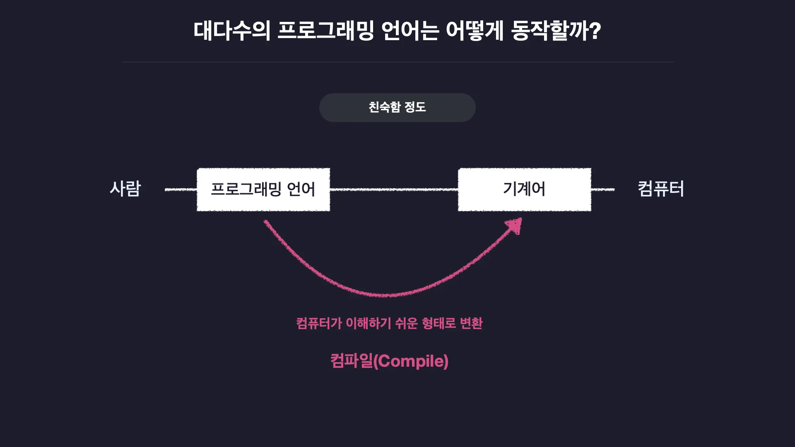
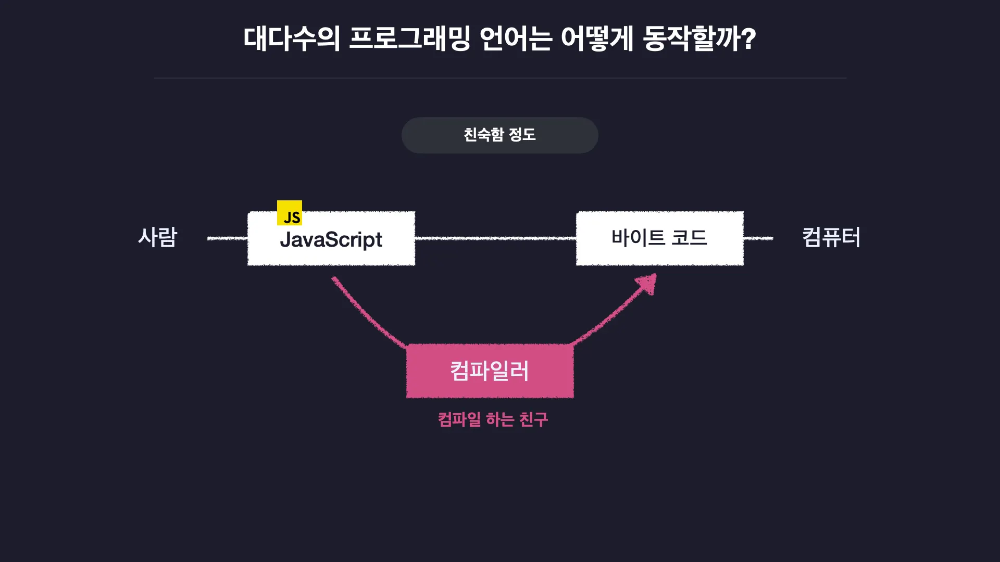
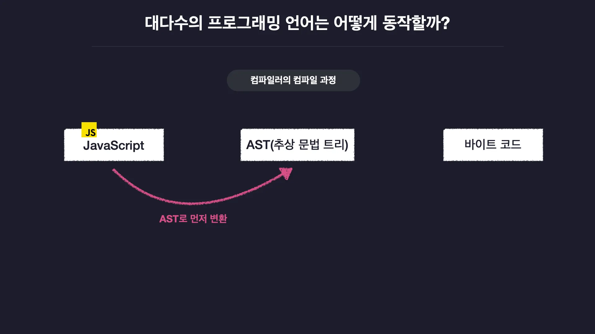
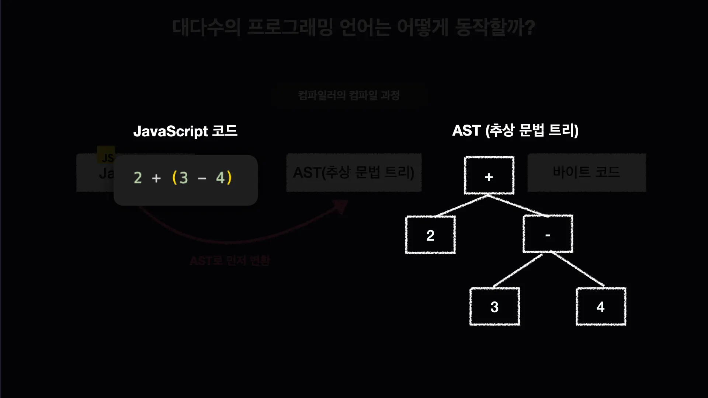
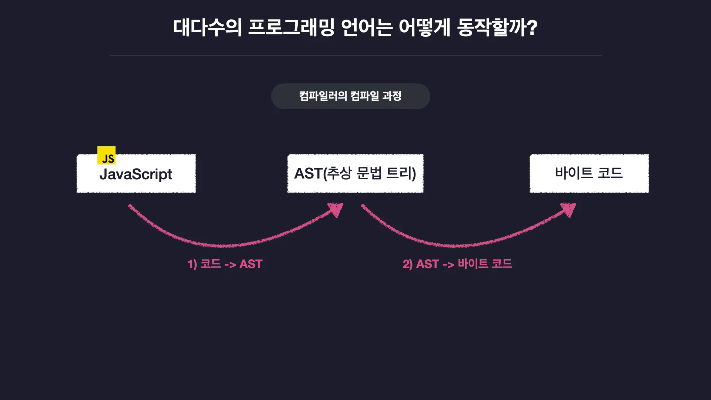
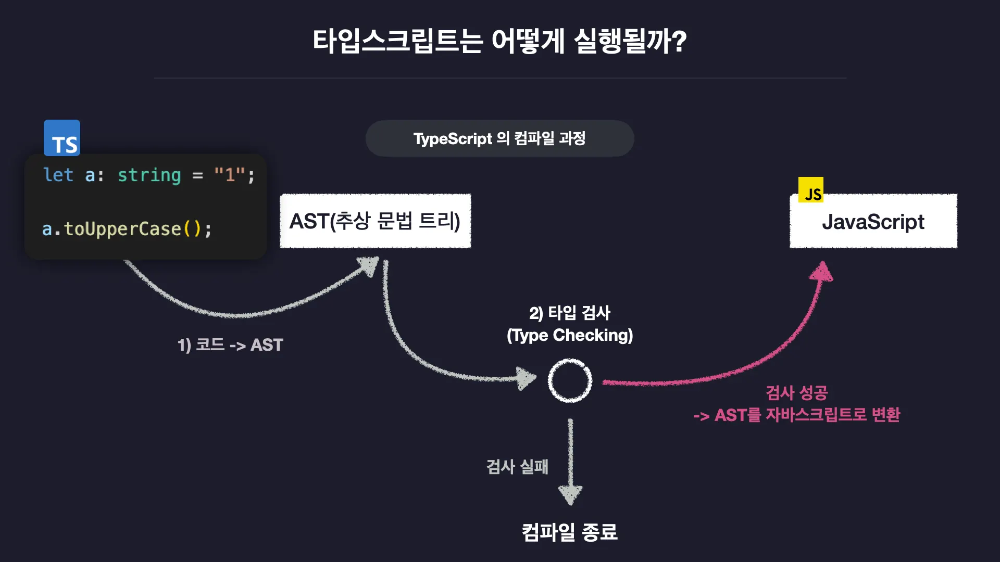
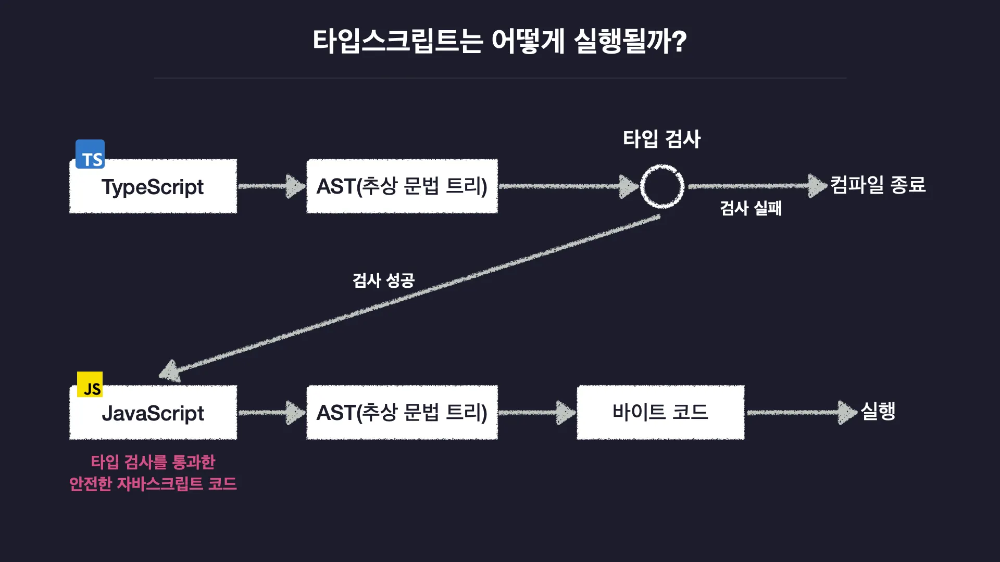

# 🌐 TypeScrpt 동작원리

## 1.대다수의 프로그래밍 언어는 어떻게 동작할까?

- 대부분의 프로그래밍 언어는 인간에게 더 친화적이다.
- 컴퓨터는 인간과 달리 아주 단순한 형태의 언어를 기반으로 동작하고 영어의 문법과 비슷한 프로그래밍 언어를 컴퓨터가 바로 이해하고 실행할 수 없다.
- 코드를 자기가 해석하기 쉬운 형태로 변환하는 과정을 컴파일이라고 한다.
- 프로그래밍 언어 코드를 -> 컴파일 -> 기계어로 형태 변환
  

- 코드를 컴파일 하는 걸 컴파일러 라고 한다.
- 자바스크립트 같은 언어를 컴파일 하면 바이트 코드로 형식이 변환된다.
- 컴퓨터가 이해할 수 있는 형태 코드를 바이트 코드라 부른다.
  

- AST(추상 문법 트리)라는 과정으로 먼저 변환 된다.
- 추상 문법 트리라는 뜻이다.
  

- 트리 형태의 자료구조에 코드를 쪼개서 저장해놓은 형태이다.
- 자바스크립트를 AST 추상 문법 트리로 변환하면 오른쪽처럼 바뀐다.
- 코드를 AST로 변환하면 컴파일러가 AST를 바이트 코드로 변환, 컴파일이 종료된다.
  

  

- 코드를 컴파일러가 AST로 변환
- AST를 다시 바이트 코드로 변환 -> 바이트 코드를 컴퓨터가 실행한다.

### 1-2. 타입스크립트의 동작 과정

- 타입스크립트도 다른 언어와 마찬가지로 컴파일을 한다.
- 타입스크립트 코드를 AST로 변환하고 이는 똑같다.

- AST를 보고 코드 상에 타입 오류가 없는지 검사하는 타입 검사가 수행된다.
- 이때 타입 오류가 있으면 타입 검사가 실패 -> 컴파일이 중단된다.
- 정상적인 코드면 통과하고 AST를 바이트 코드가 아닌 `JavaScript` 코드로 변환하고 컴파일이 종료된다.
  

- 타입스크립트를 컴파일하면 자바스크립트 코드가 만들어진다.
- Node.js나 웹브라우저로 실행하면 동일한 과정을 거쳐 컴파일 되어 실행된다.
- 타입 스크립트 코드를 컴파일 해서 생성한 자바스크립트 코드는 타입 검사를 통과한 자바스크립트 코드다.
- 안전한 자바스크립트라는 것이다.
  

- 타입 오류가 발생한 타입스크립트 코드는 컴파일 시 타입 검사를 통과할 수 없다.
- 컴파일이 종료된다.

- 타입 오류가 없는 타입스크립트 코드는 컴파일 시 타입 검사를 통과
- 타입 관련 문법들은 삭제된 안전한 자바스크립트 코드로 변경된다.
- 타입스크립트로 작성한 타입 관련 코드는 자바스크립트로 변환될 때 사라지게 되어 프로그램 실행에 영향을 미치지 않는다는 것이다.

> [!NOTE] > **TypeScript의 핵심 역할**
>
> - 타입스크립트는 컴파일 결과 타입 검사를 거쳐 **자바스크립트 코드로 변환**됩니다.
> - 만약 코드에 오류가 있으면 **컴파일 도중 실패**하게 되므로, 자바스크립트를 보다 **안전하게** 사용할 수 있습니다.
>   

---

## 참고자료

https://www.inflearn.com/course/%ED%95%9C%EC%9E%85-%ED%81%AC%EA%B8%B0-%ED%83%80%EC%9E%85%EC%8A%A4%ED%81%AC%EB%A6%BD%ED%8A%B8/dashboard
