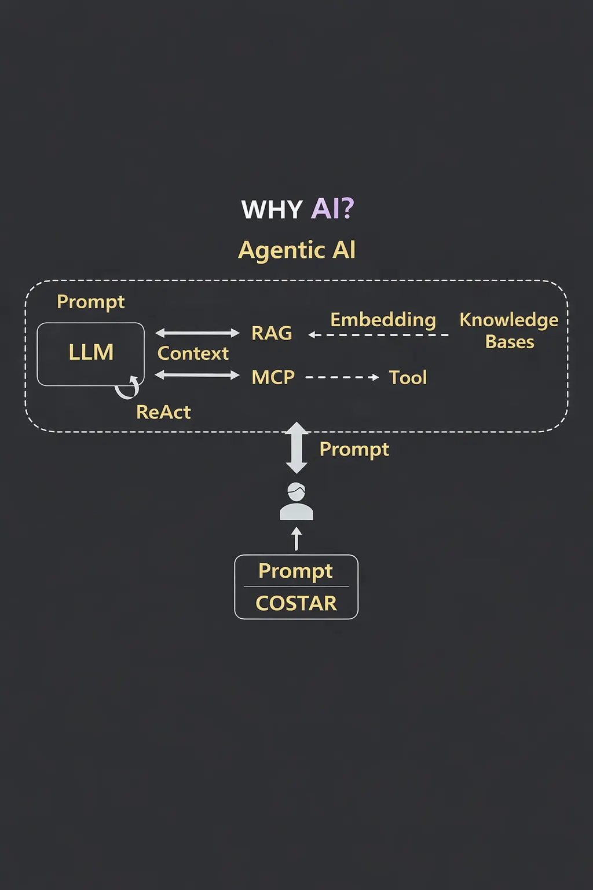

## 한 장 요약 (Mind Map)



```flowchart TD
Root([Agentic AI]) --> A[Prompt 설계]
Root --> B[Context 관리]
Root --> C[지식/도구 확장]

    %% Prompt 설계
    A --> A1[COSTAR 원칙 1]
    A --> A2[Prompt Chaining 원칙 2]

    A1 --> A1a[Context/Objective/Style/Task/Audience/Format]
    A2 --> A2a[단계 분해 / 결과 확인 / 정확도 증가]

    %% Context 관리
    B --> B1[히스토리 + 시스템프롬프트 전달]
    B --> B2[토큰 및 비용 증가]
    B --> B3[컨텍스트 윈도우 한계 - 망각]
    B --> B4[주제 전환 시 채팅 분리 권장]

    %% 지식/도구 확장
    C --> C1[RAG: Embedding/Knowledge Base/Retriever]
    C --> C2[Tool/Agent Loop: 반복 호출 및 최종 응답]
    C --> C3[MCP: 툴 연결 표준 프로토콜]
    C --> C4[ReAct: Reasoning + Acting]
```

## 1단계: LLM, 프롬프트 - 질문보다 "요구사항"

LLM(Large Language Model)은 방대한 텍스트를 학습, 사람처럼 자연스러운 문장을 만들어 낼 수 있다.
LLM은 기본적으로 다음 단어를 무엇을 채울지에 따른 확률적으로 맞추는 단어 생성기에 가깝다. 공백을 채우는 게임과 비슷하고 정확한 답을 원하면 프롬프트(입력)에 필요한 맥락과 목표를 명확히 적어야 한다.

### 1-1 COSTAR

- 프롬프트를 설계할 때 COSTART를 기억하여 입력을 '요구사항 문서'처럼 구성하는 것이 좋다.
  1. Context(맥락): 현재 상황과 배경을 설명한다(백엔드 기술자를 대상으로 기술 블로그를 작성한다)
  2. Objective(목표): 이 작업으로 무엇을 달성하고 싶은 지 명시한다(세미나 핵심 내용을 초보자도 이해할 수 있도록 정리한다)
  3. Style(스타일): 친절한 말투인지, 엄격한 말투인지, 업무 말투인지 세팅한다.
  4. Task(할일): 모델에게 시킬 구체적 작업을 나열한다(한 장 요약, 핵심 개념 설명, 실무 체크리스트 작성)
  5. Audience(대상): 결과물을 볼 사람을 지정해 난이도를 지정한다(초보 개발자, 기획자, 기타 지인)
  6. Reponse Format(응답형식): 마크다운, HTML, 표 등 원하는 출력 형식을 지정한다.

## 2단계: RAG - 지식이 부족한 모델에 컨닝 페이퍼 주기

LLM은 내부 지식만으로 답변을 만들어낸다. 문제는 모델 지식이 최신이 아니거나 회사 내부 데이터에 접근할 수 없다는 점이다. 이를 보완하기 위해 RAG(Retrieval-Augmented Generation)이다. RAG는 특정하고 관련성 있는 데이터 소스로 정보를 가져와 생성 모델의 정확성과 신뢰성을 높이는 기술이다.

1. 질문에 맞는 **문석(지식 기반)**을 찾아 임베딩 인덱스를 통해 검색한다. 임베딩은 문서를 벡터 형태로 변환해 의미가 비슷한 내용을 가까이 배치한다.
2. 검색된 문서의 내용을 프롬프트에 **보강(Augment)**에 모델에게 제공한다.
3. 모델은 보강된 컨텍스트를 바탕으로 답변을 생성한다.
   모델은 외부 자료를 근거로 삼아 환각(hallucination)을 줄이고, 사용자에게 출처를 제시해 신뢰를 높일 수 있다.

4. 회사가 미리 틀을 만들어둔다.
   - 웹 검색 툴
   - 세일즈 데이터 조회 툴
   - 컴퓨터 파일 읽기 툴
5. 사용자가 질문한다.
   - 이번 주 영업 실적 확인
6. LLM이 판단한다.
   - 이 질문에 세일즈 데이터 조회툴이 맞아. 그거 실행해줘
7. 에이전트가 실행하고 결과를 다시 가져온다
   - 조회했고, 결과는 이래.
8. 필요하면 또 판단 -> 반복 실행
   - 엑셀 파일도 있는데 그것도 읽어서 보완해
     이처럼 **컨텍스트가 충분해질 때까지 반복**하고 마지막에 이제 답변해도 괜찮다고 최종 답변을 만든다.
     이 반복을 **에이전틱 루프(Agentic Loop)**라 한다.

RAG는 개발자가 기존 모델을 재학습시키지 않아도 구현할 수 있어 빠르고 비용이 효율적이라는 장점이 있다.

## 3단계: MCP와 Tool - 실제 데이터를 읽고 행동하려면 프로포토콜이 필요하다.

문서를 검색해 컨텍스트를 채워도, LLM은 기본적으로 **읽기(read)와 쓰기(write)**만 할 수 있다. 실무에는 데이터베이스를 조회, 메일을 전송하는 등 **행동(action)**이 필요하다. 이를 위해 모델은 **툴(tool)**을 호출, 여러 툴을 연결하는 과정에서 의존성(커플링)이 커지기 쉽다.

### 3-1 MCP(Model Context Protocool)

문제를 해결하기 위해 나온것이 MCP다. AI시스템과 데이터 소스 사이를 연결하는 **보편적이고 개방된 표준**, 흩어진 통합을 하나의 프로토콜로 대체한다. 개발자는 MCP 서벌르 통해 데이터 노출, MCP 클라이언트로 서버에 접속해 데이터를 읽고 쓸 수 있다.
현재 MCP는 Notion, Stripe, GitHub, Postgress 등 다양한 서비스용 서버 가 등록되어 있고, 하나의 프로토콜을 통해 Ai와 연결할 수 있어 개발자 경험을 획기적으로 간소화 할 수 있다. MCP 서버를 이용한 도구 통합은 빠르게 확산되고 있다.

### 3-2 MCP가 제공하는 기능

세 가지 핵심 기능으로 자율성을 높인다.

1. 동적 툴 탐색 - 에이전트가 MCP 서버에 질의하면 등록된 도구와 버전 정보를 자동으로 받고, 코드를 수정하지 않아도 새 툴을 사용할 수 있다.
2. 컨텍스트 기반 툴 검사 - 툴의 입출력 타입, 사용제약, 인증 범위 등을 기계가 읽을 수 있는 형태를 제공해 도구 오용을 방지, 에이전트의 성공률을 높인다.
3. 안전한 호출 - OAuth 2.1과 PKCE 등 표준 인증을 사용해 툴 호출을 안전하게 수행, 호출 내역은 추적이 가능하다.

## 4단계: ReAct 루프 - 생각과 행동을 번갈아 실행한다.

마인드맵에 LLM과 툴 사이를 반복하는 ReAct라는 화살표가 있다.
ReAct는 **Reasoning + Acting**의 합성어, 모델이 "생각->행동->관찰"을 반복하여 문제를 해결하는 패턴이다. ReAct 프레임워크는 **LLM이 추론 과정(체인오브생각)과 툴 호출**을 번갈아 수행하여 외부 환경에서 필요한 정보를 수집, 이를 다시 생각에 반영하도록 한다.
ReAct는 단순히 답을 출력하는 것보다 더 안정적이고, 의사결정 과정을 명시적으로 보여줘 사용자의 신뢰를 높인다. 모델이 정보를 찾을 때 "어떤 정보가 부족한가?"를 판단(Reasoning)하고, 검색 툴을 호출해 데이터를 가져오고(Acting), 결과를 읽고 다시 판단을 수정하는 과정을 여러번 반복한다. 이 루프는 충분한 컨텍스트가 쌓이면 종료되고 최종답이 생성된다.

## 5단계: 프롬프트 체이닝과 컨텍스트 관리

### 5-1 프롬프트 체이닝 (Prompt Chaining)

복잡한 작업을 한 번에 요구, 모델 내부 로직이 블랙박스가 되어 결과를 이해하기 어려울 수 있다. 프롬프트 체이닝을 제안한다. 예를들어

1.  제품별 리뷰 요약
2.  장점/단점 키워드 추출
3.  키워드 기반 비교표 생성
4.  비교표를 기반으로 기사 작성
    이렇게 단계별로 진행하면 중간 결과를 확인하고 수정할 수 있어 정확도도 높고, 각 단계의 의도를 파악한다.

### 5-2 컨텍스트 관리

LLM은 매 요청마다 시스템 프롬프트와 이전 대화를 모두 입력으로 받아 처리한다. 대화가 길어질수록 **토큰 사용량과 비용이 증가**, 모델의 컨텍스트 윈도우를 넘어서면 이전 내용을
잊어 버릴 수 있다.

- 대화 스레드 분리: 주제가 달라지면 새 스레드를 만들어 컨텍스트를 짧게 유지한다.
- 불필요한 메세지 절제: 핵심 요청만 전달받아 토큰 낭비를 줄인다.
- 외부 문서화: 복잡한 배경정보나 스펙은 별도 문서로 관리한 뒤 필요한 부분만 요약해서 전달한다.
- 1단계 결과를 2단계 입력으로
- 2단계 결과를 3단계 입력으로, 단계를 쪼개서 쭉 시킨다.
  이 방식의 장점은:
- 중간 결과를 확인하며 수정이 가능하다.
- 단계별로 의도가 명확해져 정확도가 상승한다.

## 6단계: Agentic AI 체크리스트

1. 데이터준비: 지식 기반에 넣을 문서를 정제, 임베딩 인덱스를 주기적으로 업데이트 하며 권한 관리도 병행한다.
2. 프롬프트 설계: COSTAR 툴로 요구사항을 명료하게 자성, 복잡한 작업은 프롬프트 체이닝으로 나눈다.
3. 툴 통합과 프로토콜: 내부 API나 외부 서비스가 많으면 MCP를 통해 커플링을 줄이고, 인증을 설정한다.
4. ReAct 구현: 에이전트가 필요할 때 도구를 반복 호출하도록 설계, 불필요한 루프를 줄여 비용과 지연을 관리한다.
5. 모니터링과 평가: 로그, 비용, 지연시간, 정확도를 추적하고 테스트 세트로 환각이나 오류를 확인한다. RAG와 MCP 사용이 환각을 줄이고 통합 속도를 높인다.

---

## 마무리: 다음 세대를 준비하는 개발자

에이전틱 AI는 단순히 LLM을 호출하는 수준에서 벗어나서, 지식 기반, 도구 연결, 표준 프로토콜, 프롬프트 설계, ReAct 루프를 모두 아우르는 시스템적 접근을 요구한다.
Anthropic는 MCP를 AI 시스템을 데이터 소스에 연결하는 보편적 표준이라 정의하고, 업계에서는 이를 통해 도구 통합과 자동화를 가속하고 있다. RAG는 LLM에 컨닝 페이퍼를 주어 정확도를 높이고 환각을 줄이고, ReAct는 생각과 행동을 번갈아 실행해 복잡한 문제 해결을 가능하게 한다.
지금은 작은 개인 프로젝트라도 이 구조를 조금씩 도입해볼 좋은 시기라고 생각한다. 예컨대 개발자라면 백엔드 로그를 조회하는 툴과 문서 검색 RAG를 붙여 자동 분석 리포트를 만드는 것을 시작해볼 수 있다. 이러한 경험이 쌓이면, AI가 단순한 대화 상대를 넘어서 함께 일하는 동료로 거듭나는 미래에 대비할 수 있을 것이다.

---

## 참고자료

[https://blogs.nvidia.com/blog/what-is-retrieval-augmented-generation/#:~:text=What Is Retrieval,RAG](https://blogs.nvidia.com/blog/what-is-retrieval-augmented-generation/#:~:text=What%20Is%20Retrieval,RAG)

[https://www.anthropic.com/news/model-context-protocol#:~:text=The Model Context Protocol is,that connect to these servers](https://www.anthropic.com/news/model-context-protocol#:~:text=The%20Model%20Context%20Protocol%20is,that%20connect%20to%20these%20servers)

[https://techstrong.ai/features/unlocking-agentic-ai-mcp-enables-ai-agents-to-discover-inspect-and-invoke-tools-autonomously/#:~:text=all these don’t scale with,manual integrations](https://techstrong.ai/features/unlocking-agentic-ai-mcp-enables-ai-agents-to-discover-inspect-and-invoke-tools-autonomously/#:~:text=all%20these%20don%E2%80%99t%20scale%20with,manual%20integrations)

[https://blog.modelcontextprotocol.io/posts/2025-11-25-first-mcp-anniversary/#:~:text=But adoption can only grow,an MCP server for it](https://blog.modelcontextprotocol.io/posts/2025-11-25-first-mcp-anniversary/#:~:text=But%20adoption%20can%20only%20grow,an%20MCP%20server%20for%20it)
