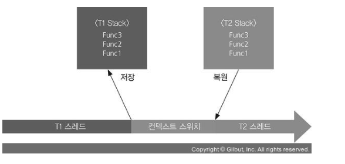
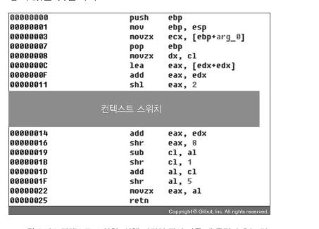

## 1장 멀티스레딩

---

### 1.4 스레드 정체?

- CPU는 하나인데 여러 프로그램이 동시에 실행될 수 있는 이유?
- 공장 예시 -> 나사를 조이고 한쪽에선 페인트칠, 두 가지 일을 동시에 하라.
- 한쪽 일을 다 마친 후 나머지 일을 한다.

- 그러나 컴퓨터는 기계이기에 이쪽저쪽을 왔다가며 하며 일을 한다.
- 여러 프로세스와 각 프로세스 안에 있는 스레드들을 일정 시간마다 번갈아 가며 실행한다.
- 각 스레드를 실행하다말고 다른 스레드를 마저 실행하는 과정을 컨텍스트 스위치(context switch)라고 한다.

- 컨텍스트 스위치를 하는 과정에서 적지 않은 연산이 발생한다.
- 실행 중이던 스레드의 상태(호출 스택)을 어딘가에 저장, 실행하다 만 스레드 중 하나를 골라, 스레드 상태를 복원, 실행 지점으로 강제 이동
- 컨텍스트 스위치를 하는데 연산량이 많아서 자주 하다보면 배보다 배꼽이 더 커진다.
- 아래는 그림처럼.

  

- 컨텍스트 스위치를 덜하면 좋지 않냐는 생각도 할 수 있으나 이것도 문제가 될 수 있다.
- 컨텍스트 스위치가 어떤 스레드를 일시 정지하고 다시 컨텍스트 스위치로 실행을 마저 진행하는데 걸리는 시간이 1초, 로딩 중에 애니메이션은 1초에 한 번 밖에 실행되지 못한다.

- 컨텍스트 스위치 실행은 가급적 긴 시간 단위로 이루어진다.
- 이 시간 단위를 타입 슬라이스(time slice)라고 한다.
- 스레드 하나가 일시 정지했다 다시 시작하는데 걸리는 시간은 5밀리초이다.
- 컴퓨터 입장에서는 충분히 긴 시간이다.

- CPU가 2개고 스레드가 2개면 이론적으로는 컨텍스트 스위치가 필요 없다.
- CPU 개수와 스레드 개수의 관계다.

- CPU 개수와 스레드 개수가 같거나 스레드 개수가 더 적으면 컨텍스트 스위치가 발생할 이유가 없다.
- 스레드 개수가 더 많으면 컨텍스트 스위치가 어느 CPU 안에서 발생한다.

- Runnable 상태(실행중) 스레드가 CPU 개수보다 많을 경우 성능 문제가 된다.
- Waitable 상태(잠자는)의 스레드는 성능 문제가 없다.
- 내가 만드는 프로그램의 스레드가 많아도, 정작 Runnable 스레드 개수가 CPU 개수보다 적으면 별 문제가 없다.

- 한 기계어 명령어를 실행하고 나면 컨텍스트 스위치를 한다.
- 즉, 컨텍스트 스위치는 기계어 명령어 단위로 이루어진다.

- C++이나 다른 언어 프로그래밍을 할 경우, 한 구문은 실제로 기계어 명령어 여러개로 컴파일 된다.
- 컨텍스트 스위치는 기계어 명령어 단위로 일어난다.
- 소스의 한 줄 구문 안에 있는 걸 실행하다가 컨텍스트 스위치를 할 가능성이 있다.

  

- 예를 들어 다음과 같은 C언어 구문

```c++
b = a * 2;
```

-> 기계어

```c++
1. ...
2. r1 = a
3. r2 = r1 * 2
4. b = r2
5. ...
```

> TIP
> r1, r2는 레지스터고 a, b는 메모리 공간을 가리킨다.

- 4를 실행한 후 5를 실행하기 전에 무조건 컨텍스트 스위치가 실행된다면, 이 C 언어 구문은 항상 정확한 결과가 나온다.
- 그러나 불행히도 우리는 컴퓨터가 1~5 중 어디까지 실행한 후 컨텍스트 스위치를 일으킬지 예상할 수가 없습니다.
