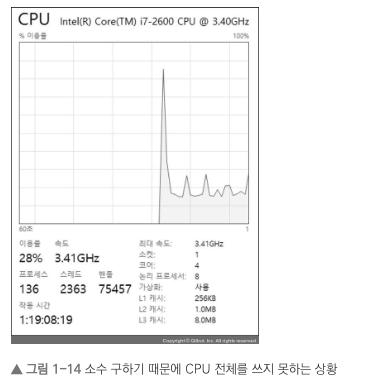

## 1장 멀티스레딩

---

### 1.3 멀티스레드 프로그래밍은 언제 해야 하나?

- 똑같은 연산을 해도 멀티스레드로 할 경우 연산 속도가 훨씬 더 느려지기도 한다.
- 멀티스레드 프로그래밍은 조금만 실수해도 오류를 일으키고, 오류를 찾기 힘들때도 많다.

- 왜 해야 하지라는 답을 분명하게 해야한다.
  - 1. 오래 걸리는 일 하나와 빨리 끝나는 일 여럿을 같이 해야 할 때
  - 2. 어떤 긴 처리를 진행하는 동안 다른 짧은 일을 처리해야 할 때
  - 3. 기기에 있는 CPU를 모두 활용할 때

#### 1.3.1 오래 걸리는 일 하나와 빨리 끝나는 일 여럿을 같이 해야 할 때

- 게임 프로그램의 로딩의 예.

- 게임을 켜고 스테이지 들어가기 전, 그래픽 리소스를 로딩하기 위해 많은 양의 데이터를 읽어야 한다.
- 지루함을 덜고자 로딩을 통해 그래프로 보여준다.
- 혹은 애니메이션 등을 화면에 뿌려주거나 요즘엔 간단한 미니게임을 넣는 경우도 있다.(남코의 저작권이 있었으나 15년에 풀렸다.)

- 멀티스레딩을 하지 않는다면 하나 로딩하고 렌더링하기를 반복해야 한다.

```c++
LoadScene()
{
  Render();
  LoadScene();
  Render();
  LoadModel();
  Render();
  LoadTexture();
  Render();
  LoadAnimation();
  Render();
  LoadSound();
}
```

- 큰 파일을 로딩하는 동안 프레임률이 끊길 것이다.
- 큰파일은 부분(chunk)단위로 로딩하며 렌더링을 할 예정이다.

- 아래처럼 멀티 스레드를 이용하면 문제를 해결할 수 있다.

```c++
bool isStillLoading; // 전역 변수

Thread1
{
  isStillLoading = true;
  while (isStillLoading)
  {
      FrameMove();
      Render();
  }
}

Thread2
{
  LoadScene();
  LoadModel();
  LoadTexture();
  LoadAnimation();
  LoadSound();

  isStillLoading = false;
}
```

- Thread1에서 게임루프를 돈다. 렌더링을 지속적으로 수행한다.
- Thread2에서 게임에 필요한 데이터를 디스크에서 로딩한다.
- 로딩이 끝나면 특정 변수를 변경하고 Thread1에서 변수가 변경될 때까지 로딩 화면을 반복해서 렌더링 한다.

---

#### 1.3.2 어떤 긴 처리를 진행하는 동안 다른 짧은 일을 처리해야 할 때

- 플레이어 정보를 읽거나 쓰기위해 디스크를 액세스하는 경우다.
- 디스크를 액세스 하는 스레드는 처리 결과가 끝날 때까지 기다려야 하는데 이때 CPU가 놀기 때문에, 서버의 실행 성능을 개선할 수 있다.
- 현대(2026년)의 SSD는 초당 수백만 번의 작업을 처리할 만큼 강력해졌습니다. 하지만 실시간 게임 서버에서 요구하는 데이터 처리량과 복잡도는 그보다 훨씬 가파르게 증가했습니다.
- 여전히 디스크는 시스템에서 가장 느린 구간이며, 이를 효율적으로 다루기 위한 비동기/논블로킹 설계는 하드웨어 성능과 관계없이 필수적인 기술입니다.

- 1만분의 1초라는 매우 긴 시간을 효율적으로 활용하기 위해 멀티스레딩을 하든지 비동기 프로그래밍을 해야 한다.

---

#### 1.3.3 기기에 있는 CPU를 모두 홝용

- CPU의 실행 속도, 클록 수가 계속 증가했다. 그 이후부터 CPY의 클록 수 대신 CPU 코어 개수만 증가했다.
- CPU가 처리할 수 있는 기능들만 추가되고 있을 뿐이다. 제일 중요한 CPU 자체 속도는 증가하지 못했다.

- 스레드는 코어를 하나만 사용한다.
- 다음 코드는 소수 (2, 3, 5, 7처럼 1과 자기 자신을 제외한 나머지 숫자로 나뉘지 않는 정수)를 찾아내서 출력하는 프로그램이다.

```c#
#inClude <vector>
#inClude <iostream>
#inClude <chrono>

using namespace std;
const int MaxCount = 150000;

bool IsPrimeNumber(int number)
{
  if (number == 1) {
    return false;
  }
  if (number == 2 || number == 3) {
    return true;
  }
  for (int i = 2; i < number - 1; i++) {
    if ((number % i) == 0) {
      return false;
    }
  }
  return true;
}

void PrintNumbers(const vector<int>& primes)
{
  for (int v : primes) {
    count << v << endl;
  }
}

void main()
{
  vector<int> primes;

  auto t0 = chrono::system_clock::now();

  for (int i = 1; i <= MaxCount; i++)
  {
    if (IsPrimeNumber(i))
    {
      primes.push_back(i);
    }
  }
  auto t1 = chroo::system_clock::now();
  auto duration = chrono::duration_cast<chrono::milliseconds>(t1 - t0).count();
  count << "Took " << duration << "milliseconds. " << endl;

  PrintNumbers(primes);
}
```

- 이 프로그램을 실행하면 소수를 계산하는데 걸린 시간을 표시한다.

```bash
Took 3920 milliseconds.
```

- MaxCount를 훨씬 큰 수로 바꾼 후 실행해 본다. 프로그램이 실행을 완료하는 데 오랜 시간이 걸린다.
- 전체 CPU 성능의 1/8 밖에 사용하지 못할 것이다.


