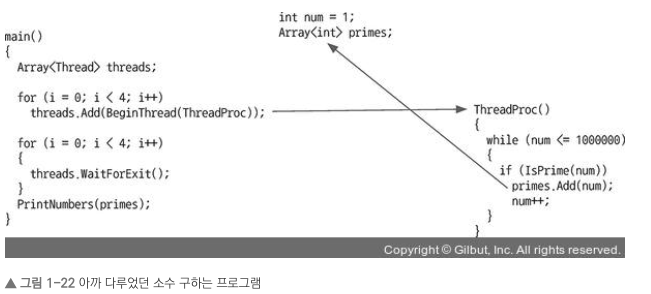

## 1장 멀티스레딩

---

### 1.5 스레드를 다룰 때 주의사항

- 스레드 2개가 값 하나에 동시에 접근하는 경우다.
- 두 스레드가 한 값에 접근하는 것에 대해 조치를 하지 않으면 이상한 결과를 낳을 수 있다.
- 두 스레드가 데이터에 접근해서 예측할 수 없는 걸 **데이터 레이스(data race)**라고 한다.
- 예시

```c++
x += y;
```

- 컨텍스트 스위치는 기계어 단위로 자른다.

```c++
t1 = x
t1 = t1 + 3
x = t1
```

- 이 기계어 세줄을 스레드 2개가 실행한다. 다음과 같이 발생한다고 친다.

```c++
x = 2
# 스레드 1
t1 = x       // t1 = 2
t1 = t1 + 3  // t1 = 5
x = t1       // x = 5
# 스레드 2
t2 = x       // t2 = 5
t2 = t2 + 4  // t2 = 9

x = t2       // x = 9
```

-> 이렇게 실행이 된다면?

```c++
x = 2
# 스레드 1
t1 = x       // t1 = 2
t1 = t1 + 3  // t1 = 5
# 스레드 2
t2 = x       // t2 = 2
t2 = t2 + 4  // t2 = 6
x = t2       // x = 6
# 스레드 1
x = t1       // x = 5
```

- x에는 9가 아닌 5가 들어간다.
- 컨텍스트 스위치가 무작위로 발생하니 결과를 예측할 수 없다.



- 여러 스레드가 동시에 num을 읽는다. 그리고 num을 증가시킨다.
- num을 증가시키는 연산은 기계어로 컴파일하면 다음과 같다.

```c++
r1 = num
r1 = r1 + 1
num = r1
```

- 컨텍스트 스위치를 할 떄 어디서 실행하다 멈추어야 할지 모른다. 
- 충돌이 난상황 이었다. Array<int> primes에서다. 왜 충돌이 발생했는가?

> 실제로는 MOV, INC 같은 기계어(명령어)로 만들어진다. 여기서는 이해를 돕고자 C언어로 표현했다.

- 멀티스레드 프로그래밍에서 단순히 `int`형 변수 하나를 공유하는 것과 달리, `std::vector`나 `Array`와 같은 컨테이너를 공유할 때는 훨씬 복잡한 메모리 참조 문제가 발생합니다.

- 단순한 정수형(`int num`)은 4바이트 공간 하나 있으면 되나, 동작 배열(`Array<int>`)은 내부적으로 더 복잡한구조를 가진다. 

* **포인터 변수**: 실제 데이터가 저장된 힙(Heap) 메모리 주소를 가리킨다.
* **크기(Size) 변수**: 현재 배열에 담긴 데이터의 개수
* **힙(Heap) 메모리**: 실제 데이터가 저장되는 공간

> **구조:** [ Stack: 포인터 + 사이즈] -> [ Heap: 실제 데이터 [1, 2, 3 ...]]

- 동시 접근 시 발생하는 문제로 여러 스레드가 동시에 `Add()` 함수를 호출, 데이터를 추가할 때 다음과 같은 치명적인 문제가 발생할 수 있다.

- 시나리오: 메모리 재할당(Reallocation) 충돌
- **Tread A**가 데이터를 추가하려나 공간이 부족함을 감지한다.
- **Thread B**는 더 큰 메모리 공간을 새로 할당, 기존 데이터를 복사한 뒤, 기존 메모리를 해제(Free)한다. 
- 이때, Thread B가 동시에 접근한다.
- Thread B는 아직 업데이트되지 않은(이미 해제된) 기존 메모리 주소를 참조하여 데이터를 쓰거나 읽으려 한다.
- **결과**: 댕글링 포인터(Dangling Pointer) 접근으로 인한 **프로그램 크러시(Crash)** 또는 데이터 오염이 발생한다.

- 핵심 개면으로: 원자성과 일관성이다.
- 이 문제를 해결하기 위해 해당 객체에 접근할 때 **동기화(Synchronization)** 메커니즘이 필요하다.

### 원자성(Atomicity)
* 멤버 변수들(포인터, 사이즈 등) 변경하는 작업은 **모두 변경되거나, 아무것도 변경되지 않거나** 둘 중 하나여야 한다.
* 변수들이 변경되는 도중(중간 상태)에는 다른 스레드가 절대 접근하지 못하도록 막아야 한다.

### 일관성(Consistency)
* 원자성이 보장됨, `Array<int>`의 내부 변수들은 항상 논리적으로 올바른 상태를 유지해야 한다.
* 예: "포인터는 유효한 힙 메모리를 가리키고, 사이즈 변수는 실제 데이터 개수와 일치한다."

## 해결 방법: 동기화(Synchronization)
- 데이터 레이스를 방지하고 원자성을 보장하기 위해 다음과 같은 기법을 사용한다.

* **임계 영역(Critical Section):** 한 번에 하나의 스레드만 실행할 수 있는 코드 영역
* **뮤텍스 (Muex) / 락 (Lock):** 임계 영역에 들어가기 위한 열쇠, 데이터를 수정하기 전 락을 걸고(Lock), 수정이 끝나면 락을 푼다(Unlock).

```cpp
// 뮤텍스를 활용한 동기화
std::mutex mtx;

void AddToArray(int value) {
  mtx.lock(); // 문 잠그기

  // 임계 영역
  // 안전하게 데이터 추가 및 메모리 재할당 처리
  primes.push_back(value); 

  mtx.unlock(); // 문 열기
}
```