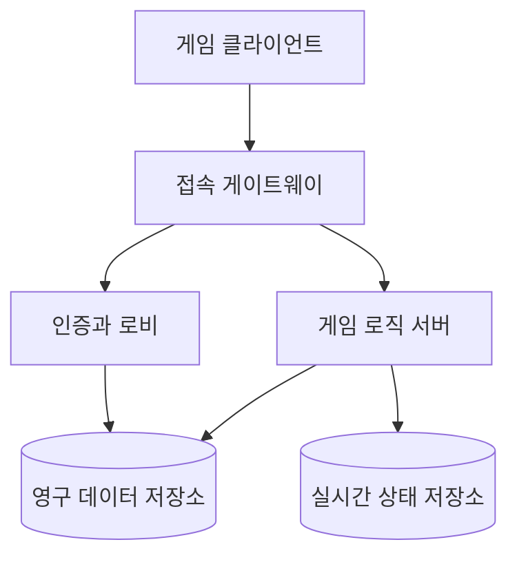
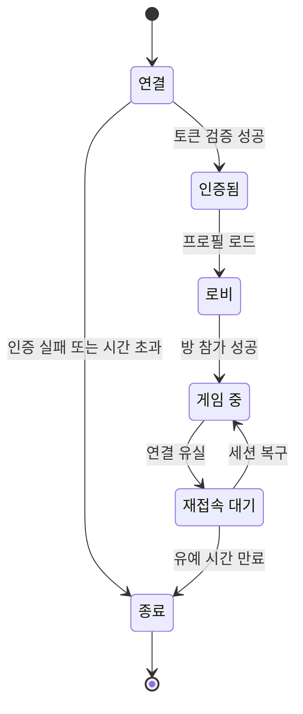
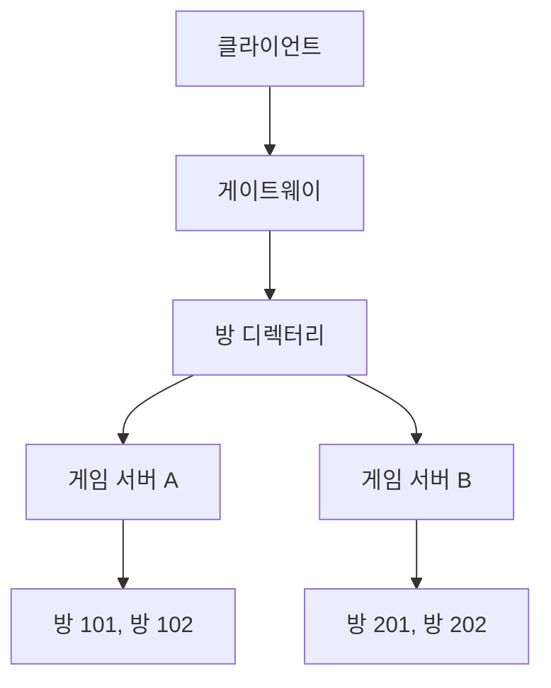
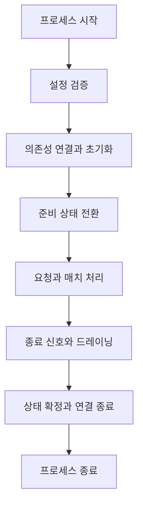

# 4장. 게임 서버와 클라이언트: 역할, 품질, 운영 환경

---

## 4장에서 배울 내용

4장에서는 네트워크 통신 위에 **어떤 게임 규칙과 서버 구조를 구현해야 하는지** 알아본다.

| 구분 | 확인할 내용                                              |
| ---- | -------------------------------------------------------- |
| 연결 | 연결된 사용자를 어떻게 인증하는가?                       |
| 수신 | 클라이언트가 보낸 요청을 어디까지 신뢰할 것인가?         |
| 송신 | 누구에게 어떤 결과를 전달할 것인가?                      |
| 장애 | 연결이 끊긴 플레이어의 게임 상태를 어떻게 처리할 것인가? |
| 확장 | 여러 서버가 방과 플레이어를 어떻게 나누어 처리할 것인가? |

> 게임 서버는 게임의 규칙, 상태, 권한 및 데이터 정합성을 처리한다.

---

## 패키지 게임에서의 게임 서버

전통적인 패키지 게임은 게임 실행 파일과 대부분의 데이터를 사용자의 컴퓨터나 콘솔에 설치한다.

사용자 입력 처리, 게임 로직 실행, 화면 렌더링 및 데이터 저장도 한 기기에서 이루어지는 경우가 많다.

```text
사용자 입력
    ↓
로컬 게임 로직
    ↓
화면과 소리 출력
    ↓
로컬 저장 파일
```

이러한 구조에서는 별도의 원격 서버가 없어도 게임을 진행할 수 있다.

네트워크 지연이나 서버 점검, 서버 장애가 게임 플레이 자체에 직접적인 영향을 주지 않는다는 장점이 있다.

### 패키지 게임의 서버 형태

패키지 게임이라고 해서 항상 서버가 없는 것은 아니다.

| 형태               | 설명                                                  | 특징                                       |
| ------------------ | ----------------------------------------------------- | ------------------------------------------ |
| 로컬 전용          | 한 기기에서 모든 게임 로직 실행                       | 네트워크 불필요                            |
| 호스트 방식        | 플레이어 한 명의 게임이 서버 역할도 담당              | 구축은 단순하지만 호스트에게 권한이 집중됨 |
| 전용 서버          | 별도의 서버 프로세스가 멀티플레이 판정을 담당         | 공정성과 안정성이 높지만 운영 비용 발생    |
| 보조 온라인 서비스 | 계정, 클라우드 저장, 순위표 등의 기능만 서버에서 처리 | 핵심 플레이는 오프라인에서도 가능          |

### 호스트 방식의 문제점

플레이어 한 명이 서버 역할까지 담당하는 구조를 **리슨 서버(Listen Server)** 또는 호스트 서버라고 부른다.

리슨 서버는 소규모 협동 게임에서 유용하게 사용할 수 있지만 다음과 같은 문제가 발생할 수 있다.

- 호스트가 게임을 종료하면 모든 참가자가 영향을 받는다.
- 호스트의 컴퓨터 성능과 네트워크 품질에 따라 전체 게임 품질이 달라진다.
- 호스트 프로그램이 게임 상태를 조작할 가능성이 있다.
- 호스트와 가까운 플레이어가 네트워크 지연 면에서 유리할 수 있다.
- 호스트가 연결을 종료하면 다른 사용자에게 호스트 권한을 이전해야 할 수 있다.

반면 전용 서버는 플레이어와 독립된 환경에서 실행되기 때문에 서버의 권한과 수명을 플레이어로부터 분리할 수 있다.

### 현대적인 패키지 게임

현재는 패키지 형태로 판매되는 게임도 다음과 같은 기능을 제공하기 위해 온라인 서버를 함께 사용한다.

- 계정 및 게임 소유권 확인
- 클라우드 저장
- 친구 및 파티 관리
- 매치메이킹
- 순위표와 시즌 관리
- 게임 설정 및 밸런스 데이터 배포
- 부정행위 탐지

따라서 **판매 방식이 패키지인지**와 **게임 서버가 필요한지**는 별개의 문제로 봐야 한다.

---

## 온라인 게임에서의 게임 서버

온라인 게임 서버는 여러 플레이어가 같은 규칙과 상태를 공유하도록 중재하는 장기 실행 서비스다.

게임 서버는 단순히 메시지를 전달하는 중계기가 아니다. 클라이언트가 보낸 요청이 유효한지 검사하고 게임 규칙에 따라 실제 결과를 결정해야 한다.

### 온라인 게임의 기본 구조



각 구성 요소의 주요 역할은 다음과 같다.

| 구성 요소            | 주요 역할                              | NestJS 구성 예시                |
| -------------------- | -------------------------------------- | ------------------------------- |
| 접속 게이트웨이      | 연결 관리, 인증 전 검사, 메시지 라우팅 | `WebSocketGateway`, Guard, Pipe |
| 인증 서버            | 로그인, 토큰 검증, 중복 접속 정책      | `AuthModule`, JWT, 세션         |
| 로비 서버            | 친구, 파티, 채널, 매치 요청            | REST API, WebSocket 모듈        |
| 게임 로직 서버       | 이동, 전투, 승패, 방 상태 관리         | 도메인 서비스, 룸 실행기        |
| 데이터 저장소        | 계정, 재화, 아이템, 진행도 저장        | 관계형 DB, 문서형 DB            |
| 캐시와 메시지 브로커 | 임시 상태 저장, 서버 간 이벤트 전달    | Redis, Kafka 등                 |

규모가 작은 게임이라면 이러한 역할을 하나의 NestJS 애플리케이션에 모아 구현할 수 있다.

사용자가 증가하거나 기능별 장애 범위를 분리해야 한다면 프로세스 또는 서비스 단위로 나눌 수 있다.

### 장르에 따라 달라지는 서버 요구사항

| 장르        | 서버가 주로 처리하는 것             | 일반적인 통신 성격       |
| ----------- | ----------------------------------- | ------------------------ |
| 턴제 게임   | 행동 순서, 유효한 수, 제한 시간     | 요청·응답 중심           |
| 카드 게임   | 비공개 정보, 덱 순서, 턴, 재접속    | 이벤트 중심, 강한 정합성 |
| RPG         | 위치, 전투 판정, 드롭, 성장         | 지속 연결과 상태 동기화  |
| FPS         | 낮은 지연, 이동, 발사, 히트 판정    | 높은 빈도의 상태 갱신    |
| MMORPG      | 넓은 월드, 다수의 객체, 영속 데이터 | 영역 분할과 서버 간 이동 |
| 방치형 게임 | 보상 계산, 서버 시간, 재화 정합성   | API와 트랜잭션 중심      |

모든 게임에 동일한 네트워크 구조를 적용해서는 안 된다.

게임 장르, 동시 접속자 수, 필요한 응답 속도, 데이터의 중요도에 따라 적절한 구조를 선택해야 한다.

### 전용 서버와 권위 서버

- **전용 서버(Dedicated Server)**는 플레이어의 기기와 분리된 환경에서 실행되는 서버 프로세스다.
- **권위 서버(Authoritative Server)**는 최종 게임 결과와 상태를 서버가 판정하는 구조다.

전용 서버를 사용하더라도 클라이언트가 보낸 체력, 보상 및 명중 결과를 그대로 저장한다면 권위 서버라고 보기 어렵다.

---

## 서버와 클라이언트의 역할

일반적인 게임은 사용자 입력을 받고 게임 상태를 갱신한 뒤 결과를 화면과 소리로 출력하는 과정을 반복한다.

온라인 게임에서는 이러한 작업을 클라이언트와 서버가 나누어 처리한다.

| 처리                    | 클라이언트    | 서버                      |
| ----------------------- | ------------- | ------------------------- |
| 키보드와 터치 입력      | 담당          | 직접 수집하지 않음        |
| 그래픽과 사운드 출력    | 담당          | 담당하지 않음             |
| 즉각적인 화면 반응      | 예측 가능     | 최종 판정과 별개          |
| 게임 규칙 판정          | 일부 예측     | 최종 권위 보유            |
| 다른 플레이어 상태 전달 | 수신하여 표현 | 계산하고 전파             |
| 재화와 아이템 변경      | 결과 표시     | 검증 후 저장              |
| 시간과 시즌 판정        | 표시 용도     | 서버 시간을 기준으로 판정 |

### 클라이언트는 의도를 보내고 서버는 결과를 계산한다

좋은 요청 메시지는 클라이언트가 계산한 결과가 아니라 사용자의 **행동 의도**를 담는다.

| 좋지 않은 요청           | 문제점                           | 더 나은 요청               |
| ------------------------ | -------------------------------- | -------------------------- |
| 골드를 늘려 달라         | 결과를 클라이언트가 결정함       | 퀘스트 42의 보상 수령 요청 |
| 적에게 500의 피해를 줬다 | 피해량을 조작할 수 있음          | 스킬 7을 대상에게 사용     |
| 현재 위치가 맵 끝이다    | 이동 규칙을 우회할 수 있음       | 해당 방향으로 이동 요청    |
| 오늘이 출석 7일째다      | 클라이언트 시간을 조작할 수 있음 | 출석 보상 수령 요청        |

서버는 요청을 받은 뒤 플레이어 상태, 거리, 재사용 대기시간, 서버 시간 및 게임 데이터 테이블을 이용해 결과를 계산한다.

### 입력 DTO의 역할

NestJS의 DTO 검증은 잘못된 형태의 입력이 도메인 로직으로 전달되는 것을 차단하는 경계다.

```ts
import { IsInt, IsString, IsUUID, Length, Max, Min } from "class-validator";

export class UseSkillRequestDto {
  @IsUUID()
  requestId!: string;

  @IsString()
  @Length(1, 64)
  targetId!: string;

  @IsInt()
  @Min(1)
  @Max(10_000)
  skillId!: number;

  @IsInt()
  @Min(0)
  sequence!: number;
}
```

DTO의 형식 검증만으로 게임 규칙까지 검증할 수 있는 것은 아니다.

- `skillId`가 정수인지는 DTO가 검증한다.
- 플레이어가 해당 스킬을 배웠는지는 도메인 로직이 검증한다.
- 대상이 사거리 안에 있는지는 게임 상태를 가진 로직 서버가 검증한다.
- 재사용 대기시간이 끝났는지는 서버 시간을 기준으로 검증한다.

### 권위 서버의 판정

```ts
import { Injectable } from "@nestjs/common";

@Injectable()
export class CombatService {
  constructor(private readonly rooms: RoomRepository) {}

  useSkill(playerId: string, request: UseSkillRequestDto): CombatEvent {
    const room = this.rooms.getByPlayerId(playerId);
    const actor = room.getPlayer(playerId);
    const target = room.getActor(request.targetId);
    const skill = actor.getLearnedSkill(request.skillId);

    actor.assertCanAcceptSequence(request.sequence);
    actor.assertAlive();
    skill.assertCooldownReady(room.now());

    room.assertInRange(actor, target, skill.range);

    const damage = room.calculateDamage(actor, target, skill);

    target.applyDamage(damage);
    skill.startCooldown(room.now());

    return {
      type: "skill-used",
      roomId: room.id,
      actorId: actor.id,
      targetId: target.id,
      skillId: skill.id,
      damage,
      targetHp: target.hp,
    };
  }
}
```

클라이언트가 보낸 값은 공격 대상, 사용할 스킬 및 입력 순번이다.

실제 피해량과 대상의 남은 체력은 서버가 계산한다.

### 서버의 게임 진행 방식

게임 장르에 따라 서버 로직을 진행하는 방식이 다르다.

| 방식         | 설명                                    | 적합한 예              |
| ------------ | --------------------------------------- | ---------------------- |
| 요청 기반    | 요청이 들어올 때 상태 변경              | 카드, 보드, 방치형     |
| 고정 틱 기반 | 일정한 주기로 입력을 모아 상태 갱신     | 액션, FPS, 실시간 전투 |
| 혼합형       | 전투는 고정 틱, 경제와 로비는 요청 기반 | RPG, MMORPG            |

Node.js가 이벤트 기반이라고 해서 게임 시뮬레이션까지 반드시 이벤트가 도착하는 순간마다 처리해야 하는 것은 아니다.

실시간 전투에서는 네트워크 입력을 큐에 넣고 고정된 틱마다 순서대로 처리하는 편이 재현성과 일관성에 유리하다.

```ts
import { performance } from "node:perf_hooks";

const tickRate = 20;
const tickMs = 1000 / tickRate;
const maxCatchUpTicks = 3;

let previous = performance.now();
let accumulator = 0;

function runLoop(): void {
  const now = performance.now();

  accumulator += now - previous;
  previous = now;

  let executed = 0;

  while (accumulator >= tickMs && executed < maxCatchUpTicks) {
    consumeQueuedInputs();
    updateWorld(tickMs / 1000);
    publishSnapshot();

    accumulator -= tickMs;
    executed += 1;
  }

  const delayUntilNextTick = Math.max(0, tickMs - accumulator);

  setTimeout(runLoop, delayUntilNextTick);
}

runLoop();
```

최대 따라잡기 횟수를 두는 이유는 서버가 한 번 밀렸을 때 과거 로직만 계속 처리하다가 현재 시각을 따라잡지 못하는 상황을 방지하기 위해서다.

서버에서는 이벤트 루프 지연과 각 틱의 처리 시간을 함께 측정해야 한다.

---

## 게임 클라이언트와 서버의 상호작용

클라이언트와 서버의 상호작용은 크게 다음과 같은 흐름으로 구분할 수 있다.

1. 네트워크 연결
2. 인증과 세션 생성
3. 클라이언트 요청과 서버 응답
4. 서버가 먼저 보내는 알림
5. 연결 종료 또는 재접속

### 연결은 인증이 아니다

TCP 또는 WebSocket 연결이 성공했다는 사실은 상대방의 신원을 확인했다는 뜻이 아니다.

연결 직후의 소켓은 아직 익명 상태이며 토큰이나 세션 정보를 검증한 후에만 게임 기능을 허용해야 한다.



상태를 명확하게 정의하면 인증되지 않은 소켓이 게임 메시지를 보내거나 이미 종료된 방에 다시 입장하는 오류를 줄일 수 있다.

### 요청, 응답 및 서버 알림

| 유형         | 시작 주체  | 예시                          |
| ------------ | ---------- | ----------------------------- |
| 요청과 응답  | 클라이언트 | 덱 변경 요청과 처리 결과      |
| 명령과 ACK   | 클라이언트 | 이동 입력과 수신 확인         |
| 서버 알림    | 서버       | 다른 플레이어 입장, 체력 변경 |
| 브로드캐스트 | 서버       | 방 전체 상태 스냅샷           |

요청과 응답에 `requestId`를 포함하는 것이 좋다.

네트워크 재시도나 클라이언트의 중복 클릭 때문에 같은 요청이 여러 번 들어와도 서버가 중복 처리를 식별할 수 있기 때문이다.

### NestJS 게이트웨이 예시

```ts
import { UsePipes, ValidationPipe } from "@nestjs/common";
import {
  ConnectedSocket,
  MessageBody,
  OnGatewayConnection,
  OnGatewayDisconnect,
  SubscribeMessage,
  WebSocketGateway,
  WebSocketServer,
} from "@nestjs/websockets";
import { Server, Socket } from "socket.io";

@WebSocketGateway({
  namespace: "/game",
  transports: ["websocket"],
})
@UsePipes(
  new ValidationPipe({
    whitelist: true,
    forbidNonWhitelisted: true,
    transform: true,
  }),
)
export class GameGateway implements OnGatewayConnection, OnGatewayDisconnect {
  @WebSocketServer()
  private readonly server!: Server;

  constructor(
    private readonly sessions: SessionService,
    private readonly combat: CombatService,
  ) {}

  handleConnection(client: Socket): void {
    client.data.authenticated = false;
  }

  async handleDisconnect(client: Socket): Promise<void> {
    await this.sessions.markDisconnected(client.id);
  }

  @SubscribeMessage("authenticate")
  async authenticate(
    @ConnectedSocket() client: Socket,
    @MessageBody() body: AuthenticateDto,
  ): Promise<{
    event: string;
    data: AuthenticatedView;
  }> {
    const session = await this.sessions.authenticate(body.accessToken);

    client.data.authenticated = true;
    client.data.playerId = session.playerId;

    await client.join(`player:${session.playerId}`);

    return {
      event: "authenticated",
      data: session.toView(),
    };
  }

  @SubscribeMessage("use-skill")
  useSkill(
    @ConnectedSocket() client: Socket,
    @MessageBody() body: UseSkillRequestDto,
  ): {
    event: string;
    data: CombatEvent;
  } {
    this.sessions.assertAuthenticated(client);

    const result = this.combat.useSkill(client.data.playerId, body);

    this.server.to(`room:${result.roomId}`).emit("combat-event", result);

    return {
      event: "use-skill-result",
      data: result,
    };
  }
}
```

전체 흐름을 보여주기 위한 예제 코드다.

실제 구현에서는 인증 처리를 각 메서드에 반복해서 작성하지 않고 Guard 또는 미들웨어로 분리하는 것이 좋다.

### 연결 종료와 재접속

모바일 환경이나 무선 네트워크에서는 연결 종료가 흔하게 발생한다.

서버는 연결 종료를 곧바로 로그아웃이나 패배로 확정하지 않고 게임 규칙에 맞는 **재접속 유예 시간**을 둘 수 있다.

```text
연결 유실
    ↓
세션을 재접속 대기 상태로 변경
    ↓
캐릭터 처리 정책 적용
    ├─ 잠시 정지
    └─ 기존 행동 유지
    ↓
유예 시간 안에 재접속 토큰 검증
    ↓
인증 성공 시 최신 스냅샷부터 복구
```

재접속 설계에서는 다음 사항을 결정해야 한다.

- 재접속이 가능한 시간
- 같은 계정의 중복 접속 처리
- 이전 소켓과 새 소켓 중 어느 쪽을 유효하게 볼 것인지
- 연결이 끊긴 동안 캐릭터를 어떻게 처리할 것인지
- 누락된 이벤트를 재생할지 최신 스냅샷만 전달할지
- 재접속 토큰 탈취를 어떻게 방어할지

### 메시지 순번과 오래된 패킷

재접속 후에는 이전 연결에서 늦게 도착한 메시지나 클라이언트가 재전송한 메시지가 섞일 수 있다.

세션 세대와 입력 순번을 함께 사용하면 이러한 메시지를 구분하기 쉽다.

```ts
interface ClientCommand<T> {
  requestId: string;
  sessionGeneration: number;
  sequence: number;
  payload: T;
}

function validateCommand(
  session: PlayerSession,
  command: ClientCommand<unknown>,
): void {
  if (command.sessionGeneration !== session.generation) {
    throw new Error("stale-session");
  }

  if (command.sequence <= session.lastAcceptedSequence) {
    throw new Error("duplicate-or-stale-command");
  }
}
```

TCP가 바이트의 전달 순서를 보장하더라도 애플리케이션 차원의 중복 요청, 재접속 세대 및 비즈니스 처리 순서까지 자동으로 해결해 주는 것은 아니다.

---

## 게임 서버가 하는 업무

게임 서버의 역할은 다음 세 가지로 요약할 수 있다.

1. 여러 플레이어 사이의 상호작용을 중재한다.
2. 클라이언트가 임의로 결정해서는 안 되는 규칙을 판정한다.
3. 플레이어의 중요한 상태를 보존한다.

### 여러 플레이어의 상호작용 중재

두 플레이어가 같은 아이템을 동시에 획득하거나 서로를 공격할 때 각 클라이언트가 독립적으로 결과를 결정하면 서로 다른 게임 상태가 만들어질 수 있다.

서버는 하나의 처리 순서와 결과를 정하고 모든 플레이어에게 같은 결과를 전달해야 한다.

```text
플레이어 1: 상자를 연다.
플레이어 2: 상자를 연다.

서버:
먼저 처리된 유효한 요청 하나만 성공시킨다.

플레이어 1과 플레이어 2에게
같은 최종 결과를 전달한다.
```

### 신뢰할 수 없는 클라이언트 요청 검증

클라이언트 프로그램은 사용자의 기기에서 실행되므로 언제든지 변조될 수 있다고 가정해야 한다.

서버가 직접 판정해야 하는 항목은 다음과 같다.

- 이동 가능한 속도와 거리
- 공격 사거리와 재사용 대기시간
- 피해량과 치명타
- 아이템 구매 가격
- 보상 수령 조건
- 매치 승패와 순위 점수
- 서버 이벤트의 시작과 종료 시각
- 확률형 결과와 난수

검증의 목적은 단순히 잘못된 숫자를 막는 것이 아니다.

현재 상태에서 해당 명령을 실행할 권한과 조건을 갖추었는지를 확인해야 한다.

### 플레이어 상태 보존

서버는 접속이 종료되어도 유지되어야 하는 정보를 저장한다.

- 계정과 캐릭터
- 인벤토리와 장비
- 재화와 결제 지급 내역
- 퀘스트와 업적
- 덱, 스킬 및 성장 상태
- 시즌 기록과 랭킹
- 운영 제재와 신고 정보

### 서버가 추가로 맡는 기능

서비스 규모가 커지면 다음 기능도 별도 서버나 모듈로 분리될 수 있다.

| 기능       | 역할                                | 중요한 성질                    |
| ---------- | ----------------------------------- | ------------------------------ |
| 매치메이킹 | 실력, 지역, 파티 조건으로 상대 검색 | 대기 시간과 매치 품질의 균형   |
| 채팅       | 채널, 귓속말, 신고, 금칙어 관리     | 대량 팬아웃과 운영             |
| 랭킹       | 점수 집계와 순위 조회               | 갱신 비용과 일관성             |
| 상점       | 상품, 가격, 구매, 지급              | 트랜잭션과 감사 기록           |
| 스케줄러   | 시즌과 이벤트 시간 관리             | 중복 실행 방지와 서버 시간     |
| 텔레메트리 | 로그와 플레이 지표 수집             | 게임 처리와 분리된 비동기 처리 |

### 서버 시간을 기준으로 판정

클라이언트의 시계는 사용자가 변경할 수 있고 기기마다 오차가 발생할 수 있다.

출석, 상점 갱신, 쿨다운 및 시즌 종료처럼 게임 내 가치에 영향을 주는 시간은 서버가 판정해야 한다.

화면에 남은 시간을 표시하기 위한 카운트다운은 클라이언트가 처리할 수 있다.

그러나 보상을 받을 수 있는지에 대한 최종 판단은 서버가 해야 한다.

---

## 게임 서버의 품질

| 품질 속성   | 확인할 질문                                    | 대표 지표                            |
| ----------- | ---------------------------------------------- | ------------------------------------ |
| 안정성      | 잘못된 결과 없이 계속 서비스할 수 있는가?      | 오류율, 크래시, 데이터 불일치        |
| 확장성      | 사용자가 증가할 때 처리 용량을 늘릴 수 있는가? | 인스턴스 증가 대비 처리량            |
| 성능        | 하나의 요청과 틱을 충분히 빠르게 처리하는가?   | 지연 시간, 틱 시간, 처리량           |
| 관리 편의성 | 배포, 관찰 및 복구가 쉬운가?                   | 배포 시간, 복구 시간, 오류 탐지 시간 |

---

### 안정성

안정적인 게임 서버는 단순히 프로세스가 실행 중인 서버를 의미하지 않는다.

- 크래시하지 않는다.
- 무한 대기나 교착 상태에 빠지지 않는다.
- 잘못된 결과를 생성하지 않는다.
- 재화와 아이템을 중복 지급하거나 잃어버리지 않는다.
- 장애가 발생해도 영향 범위를 제한한다.
- 재시작 후 일관된 상태로 복구한다.

게임 서버에서는 눈에 띄는 크래시보다 **조용한 데이터 손상**이 더 위험할 수 있다.

잘못된 재화 지급이 며칠 뒤에 발견되면 원인을 추적하고 지급된 재화를 회수하기 어렵다.

### 안정성을 깨뜨리는 원인

| 원인               | 예시                               | 대응                           |
| ------------------ | ---------------------------------- | ------------------------------ |
| 입력 검증 부족     | 음수 구매 수량                     | DTO와 도메인 규칙 모두 검증    |
| 중복 요청          | 보상 버튼 재시도                   | 멱등 키와 유일 제약 사용       |
| 부분 성공          | 결제 기록은 성공했지만 지급은 실패 | 트랜잭션 또는 보상 처리        |
| 무제한 큐          | 느린 소비자로 인한 메모리 증가     | 큐 상한과 역압력               |
| 무제한 처리 시간   | 외부 API 응답을 계속 기다림        | 타임아웃과 취소                |
| 예외 처리 누락     | 비동기 작업의 거부를 방치          | 최상위 오류 관측과 안전한 종료 |
| 상태 소유자 불명확 | 두 서버가 같은 방을 동시에 갱신    | 단일 소유권과 세대 번호        |

#### 멱등성이 필요한 이유

클라이언트는 응답을 받지 못하면 같은 요청을 다시 보낼 수 있다.

첫 번째 요청 처리는 성공했지만 응답만 유실된 상황에서 두 번째 요청을 다시 처리하면 보상이 중복 지급될 수 있다.

```ts
interface ClaimRewardCommand {
  requestId: string;
  playerId: string;
  questId: string;
}

async function claimReward(command: ClaimRewardCommand): Promise<RewardResult> {
  return database.transaction(async (tx) => {
    const previous = await tx.processedRequest.find(command.requestId);

    if (previous) {
      return previous.result as RewardResult;
    }

    const quest = await tx.quest.lockForUpdate(
      command.playerId,
      command.questId,
    );

    quest.assertCompleted();
    quest.assertNotClaimed();

    const result = await tx.reward.grant(command.playerId, quest.reward);

    await tx.quest.markClaimed(quest.id);

    await tx.processedRequest.insert(command.requestId, result);

    return result;
  });
}
```

이 코드는 특정 ORM 문법이 아니라 처리 원칙을 보여주는 예제다.

중복 검사, 상태 잠금, 보상 지급, 완료 표시 및 결과 저장이 하나의 원자적 작업으로 묶여야 한다.

#### 실패를 숨기지 않는다

복구할 수 없는 불변식 위반이 발생했는데도 해당 방이나 프로세스를 계속 실행하면 데이터 손상이 확대될 수 있다.

- 예상 가능한 실패: 잘못된 요청, 잔액 부족, 재사용 대기시간
- 예상하지 못한 실패: 존재해야 할 객체가 없음, 음수가 될 수 없는 재화가 음수임

예상 가능한 실패는 정상적인 오류 응답으로 처리한다.

불변식 위반은 높은 우선순위로 기록하고 영향받은 방을 격리하거나 프로세스를 안전하게 교체해야 한다.

---

### 확장성

확장성은 사용량이 증가할 때 시스템의 처리 용량을 늘릴 수 있는 성질이다.

| 구분        | 수직 확장                         | 수평 확장                             |
| ----------- | --------------------------------- | ------------------------------------- |
| 방법        | 더 빠른 CPU와 더 많은 메모리 사용 | 서버 인스턴스 수 증가                 |
| 장점        | 애플리케이션 구조가 비교적 단순함 | 전체 처리 용량을 크게 늘릴 수 있음    |
| 단점        | 장비 한계와 비용 증가             | 분산 상태와 라우팅이 복잡함           |
| 적합한 상황 | 작은 서비스, 단일 월드            | 방 단위 게임, 독립 요청이 많은 서비스 |

#### 무상태 API와 상태가 있는 게임 방

로그 조회처럼 요청마다 필요한 데이터를 DB에서 읽을 수 있는 API는 여러 인스턴스로 나누기 쉽다.

반면 실시간 게임 방은 서버 메모리에 지속적인 상태를 보유하므로 다음 패킷을 아무 서버에나 보내서는 안 된다.



방 디렉터리는 특정 `roomId`가 어느 서버에 존재하는지를 알려준다.

중요한 불변식은 다음과 같다.

> 한 시점에 하나의 게임 방 상태는 하나의 권위 있는 소유자만 갱신해야 한다.

두 서버가 동시에 같은 방을 처리하면 공격 순서, 승패 및 보상 결과가 서로 달라질 수 있다.

#### 수평 확장의 기본 단위

게임 서버는 다음과 같은 키를 기준으로 작업을 분할하는 경우가 많다.

- `roomId`: 대전, 협동, 카드 게임
- `zoneId`: 필드와 던전
- `guildId`: 길드 채팅과 길드전
- `playerId` 해시: 프로필과 우편함
- `region`: 지연 시간을 줄이기 위한 지역 분리

분할 키를 선택할 때는 서로 자주 상호작용하는 데이터를 같은 소유자에게 모으는 것이 좋다.

서버 간 호출이 지나치게 많아지면 수평 확장을 통해 얻은 이점이 줄어든다.

#### 여러 NestJS WebSocket 인스턴스

WebSocket 게이트웨이를 여러 프로세스로 늘리면 다음 문제를 별도로 해결해야 한다.

- 같은 방의 소켓이 어느 인스턴스에 연결되어 있는지
- 다른 인스턴스의 사용자에게 이벤트를 전달하는 방법
- 연결이 재배치되었을 때 세션을 복구하는 방법
- Socket.IO의 폴링 전송을 사용할 때 연결 고정이 필요한지
- 인스턴스가 종료되었을 때 방 소유권을 누가 인수할지

Redis 어댑터나 메시지 브로커는 인스턴스 간 이벤트 전달을 도울 수 있다.

그러나 게임 상태의 동시 수정 문제까지 자동으로 해결하지는 않는다.

따라서 **메시지 전달 계층**과 **상태 소유권**은 별도로 설계해야 한다.

---

### 성능

성능은 요청이나 게임 틱을 얼마나 빠르고 안정적으로 처리하는지에 관한 품질이다.

#### 성능을 확인하는 네 가지 관점

| 관점        | 의미                                     | 게임 서버 예시                     |
| ----------- | ---------------------------------------- | ---------------------------------- |
| 지연 시간   | 하나의 처리가 끝나는 데 걸리는 시간      | 이동 입력부터 상태 반영까지의 시간 |
| 처리량      | 단위 시간에 처리하는 작업 수             | 초당 명령 수, 초당 매치 생성 수    |
| 동시성      | 동시에 유지할 수 있는 작업 수            | 동시 소켓 수, 활성 방 수           |
| 주기 안정성 | 반복 처리가 정해진 마감 시간을 지키는가? | 틱 지연과 틱 초과 비율             |

평균값만 확인하면 순간적인 지연을 놓칠 수 있다.

따라서 `p50`, `p95`, `p99`와 같은 백분위 지연을 함께 확인해야 한다.

- `p50`: 요청의 50%가 해당 시간 안에 완료됨
- `p95`: 요청의 95%가 해당 시간 안에 완료됨
- `p99`: 가장 느린 사용자에 가까운 경험을 보여줌

#### 틱 예산

| 틱 속도 | 한 틱의 이론적인 시간 예산 |
| ------: | -------------------------: |
|    10Hz |                      100ms |
|    20Hz |                       50ms |
|    30Hz |                  약 33.3ms |
|    60Hz |                  약 16.7ms |

네트워크 처리, 직렬화, 가비지 컬렉션 및 로그 기록에도 시간이 필요하므로 이론적인 시간 예산을 전부 게임 로직에 사용해서는 안 된다.

#### Node.js에서 확인할 항목

- 이벤트 루프 지연
- 한 틱의 최대 실행 시간
- 힙 사용량과 가비지 컬렉션 정지 시간
- 소켓 송신 대기량과 느린 클라이언트
- JSON 직렬화와 역직렬화 비용
- 동기식 파일 또는 암호화 작업
- DB 연결 대기 시간

```ts
import { monitorEventLoopDelay, performance } from "node:perf_hooks";

const delay = monitorEventLoopDelay({
  resolution: 20,
});

delay.enable();

function runMeasuredTick(room: GameRoom): void {
  const startedAt = performance.now();

  room.tick();

  const elapsedMs = performance.now() - startedAt;

  metrics.observe("game_tick_duration_ms", elapsedMs, {
    roomType: room.type,
  });
}

setInterval(() => {
  metrics.gauge("event_loop_delay_p99_ms", delay.percentile(99) / 1_000_000);

  delay.reset();
}, 10_000);
```

#### 일반적인 성능 개선 순서

1. 목표 지연 시간과 처리량을 정한다.
2. 실제 부하와 비슷한 조건에서 측정한다.
3. 가장 큰 병목을 찾는다.
4. 한 번에 하나씩 변경한다.
5. 다시 측정하고 안정성이 저하되지 않았는지 확인한다.

게임 서버에서는 다음과 같은 방법을 자주 사용한다.

- 전체 상태 대신 변경된 데이터만 전송한다.
- 같은 틱에서 발생한 이벤트를 묶어 직렬화한다.
- 읽기 전용 게임 데이터를 메모리에 캐시한다.
- 느린 외부 저장 작업을 게임 틱과 분리한다.
- CPU 집약적인 작업을 워커나 별도 서비스로 분리한다.
- 무제한 로그와 불필요한 디버그 문자열 생성을 피한다.

최적화 때문에 코드가 지나치게 복잡해지거나 데이터 정합성이 약해진다면 전체 시스템의 품질은 오히려 떨어질 수 있다.

---

### 관리 편의성

게임 서버는 사용자 입력 없이도 장시간 실행되는 서비스다.

운영자는 서버에 직접 접속하지 않고도 상태를 관찰하고 배포하거나 복구할 수 있어야 한다.

#### 관리 가능한 서버가 제공해야 하는 기능

- 자동 시작과 자동 재시작
- 구조화된 로그
- 지표와 경보
- 상태 확인 엔드포인트
- 설정과 비밀 정보의 외부 주입
- 안전한 배포와 롤백
- 운영 명령의 인증과 감사 로그
- 점검 모드와 신규 매치 차단
- 연결 드레이닝과 정상 종료

#### 구조화 로그

사람만 읽을 수 있는 문자열 대신 필드를 가진 로그를 남기면 검색과 집계가 쉬워진다.

```ts
logger.log({
  event: "match-finished",
  matchId: match.id,
  roomId: room.id,
  winnerId: result.winnerId,
  durationMs: result.durationMs,
  serverId: process.env.INSTANCE_ID,
});
```

로그에 액세스 토큰, 비밀번호, 결제 정보 및 전체 개인정보를 기록해서는 안 된다.

`playerId`도 조직의 개인정보 정책에 따라 마스킹하거나 별도의 식별자로 변환할 수 있다.

#### 운영 명령은 게임 명령보다 더 조심해야 한다

아이템 지급, 계정 제재 및 시즌 종료와 같은 운영 기능은 강력한 권한을 가진다.

- 일반 사용자 API와 경로 및 권한을 분리한다.
- 누가, 언제, 왜 실행했는지 감사 로그를 남긴다.
- 대량 작업에는 사전 검증과 승인 단계를 둔다.
- 동일한 명령의 중복 실행을 막는다.
- 가능하면 되돌리기 또는 보상 절차를 마련한다.

---

## 플레이어 정보 저장

플레이어 정보는 게임 서비스의 핵심 자산이다.

### 데이터 종류를 먼저 구분한다

| 종류               | 예시                    | 저장 위치                            |
| ------------------ | ----------------------- | ------------------------------------ |
| 연결 상태          | `socketId`, 하트비트    | 프로세스 메모리, Redis               |
| 매치 상태          | 위치, 체력, 턴, 카드 패 | 게임 서버 메모리, 필요한 경우 스냅샷 |
| 영구 플레이어 상태 | 캐릭터, 재화, 인벤토리  | 관계형 DB 또는 문서형 DB             |
| 파생 데이터        | 랭킹 캐시, 추천 목록    | 캐시 또는 검색 저장소                |
| 이벤트 기록        | 구매, 보상, 전투 결과   | 로그, 스트림, 분석 저장소            |

모든 데이터를 하나의 저장소에 넣는 것이 아니라 데이터의 수명, 정합성 및 조회 형태에 맞춰 구분한다.

### 진실의 원천을 정한다

같은 골드 값을 게임 서버 메모리, Redis 및 DB가 모두 가지고 있다면 어느 값이 최종 값인지 정해야 한다.

- DB를 진실의 원천으로 두고 Redis는 캐시로 사용한다.
- 매치 중에는 게임 서버가 상태를 소유하고 종료 결과를 DB에 확정한다.
- 이벤트 원장을 진실의 원천으로 두고 현재 값은 이벤트의 투영 결과로 사용한다.

명확한 규칙이 없다면 장애 복구 과정에서 서로 다른 값을 비교하며 최종 값을 추측해야 하는 상황이 발생한다.

### 저장 시점

| 전략                       | 장점                         | 위험과 비용                            |
| -------------------------- | ---------------------------- | -------------------------------------- |
| 변경 즉시 저장             | 데이터 유실 범위가 작음      | DB 부하와 지연 시간 증가               |
| 주기적 저장                | 여러 쓰기를 묶을 수 있음     | 저장 주기 사이의 상태가 유실될 수 있음 |
| 로그아웃 시 저장           | 구현이 단순함                | 비정상 종료 시 저장되지 않음           |
| 이벤트 기록 후 비동기 반영 | 처리 분리와 이벤트 재생 가능 | 중복 처리와 순서 설계 필요             |

로그아웃 시점에만 저장하는 방식은 안전하지 않다.

프로세스 크래시, 네트워크 단절 및 강제 종료 상황에서는 정상적인 로그아웃 이벤트가 전달되지 않을 수 있다.

### 트랜잭션이 필요한 예

상점에서 아이템을 구매하면 다음 상태가 함께 변경된다.

1. 상품 가격과 판매 조건을 확인한다.
2. 플레이어의 재화를 차감한다.
3. 아이템을 지급한다.
4. 구매 횟수를 증가시킨다.
5. 구매 기록을 저장한다.

중간 단계만 성공하면 플레이어가 재화를 잃거나 아이템을 중복으로 획득할 수 있다.

하나의 DB가 담당할 수 있는 범위라면 트랜잭션과 유일 제약을 사용한다.

```ts
async function purchaseItem(command: PurchaseCommand): Promise<PurchaseResult> {
  return database.transaction(async (tx) => {
    const product = await tx.catalog.findActiveProduct(command.productId);

    const wallet = await tx.wallet.lockForUpdate(command.playerId);

    product.assertPurchasableAt(serverClock.now());

    wallet.assertEnough(product.price);

    await tx.wallet.decrease(command.playerId, product.price);

    const item = await tx.inventory.add(command.playerId, product.itemId);

    await tx.purchaseHistory.insert({
      requestId: command.requestId,
      playerId: command.playerId,
      productId: product.id,
      price: product.price,
    });

    return {
      itemId: item.id,
      remainingGold: wallet.gold - product.price,
    };
  });
}
```

실제 구현에서는 `requestId`에 유일 제약을 설정하고 재시도 시 이미 완료된 결과를 반환하도록 설계해야 한다.

### 데이터 저장에서 지켜야 할 원칙

- 금액과 수량은 정수 단위를 사용한다.
- 저장소의 유일 제약과 외래 키를 적극적으로 사용한다.
- 데이터 수정 전후를 추적할 수 있는 감사 기록을 남긴다.
- DB와 캐시의 역할을 명확히 구분한다.
- 백업의 존재 여부만 확인하지 않고 실제 복원 절차를 검증한다.
- 스키마를 변경할 때 구버전 서버와의 호환성을 고려한다.
- 서버 시간은 UTC로 저장하고 표시할 때 지역 시간으로 변환한다.
- 결제 지급처럼 중요한 외부 이벤트는 중복 수신을 전제로 처리한다.

---

## 서버 구동 환경

게임 서버는 운영체제 위에서 실행되는 프로세스다.

Node.js는 `libuv`를 통해 운영체제의 비동기 I/O 기능을 추상화한다.

### 일반적인 환경 구분

| 환경     | 목적                        | 주의 사항                                       |
| -------- | --------------------------- | ----------------------------------------------- |
| 로컬     | 빠른 개발과 디버깅          | 외부 의존성을 대체할 수 있어야 함               |
| 개발     | 팀 단위 기능 통합           | 데이터 초기화와 잦은 배포를 허용                |
| 스테이징 | 운영과 유사한 환경에서 검증 | 설정, 네트워크 및 스키마를 운영과 유사하게 구성 |
| 운영     | 실제 사용자 서비스          | 접근 통제, 관측, 백업 및 롤백 필수              |

각 환경은 목적과 설정이 다르다.

### 컨테이너 환경의 서버 생명주기



#### 시작 단계

서버가 포트를 열기 전에 다음 항목을 확인한다.

- 필수 환경 변수가 존재하는지
- DB와 메시지 브로커 연결 설정이 유효한지
- 게임 데이터 버전이 코드와 일치하는지
- 필요한 키와 인증서가 정상적으로 로드되었는지
- 마이그레이션 호환성이 보장되는지

잘못된 설정으로 불완전하게 서비스를 시작하는 것보다 명확한 오류를 남기고 시작에 실패하는 편이 안전하다.

#### 상태 확인 종류

| 검사      | 확인할 질문                          | 실패 시 동작            |
| --------- | ------------------------------------ | ----------------------- |
| 시작 검사 | 초기화가 아직 진행 중인가?           | 충분한 시작 시간을 허용 |
| 준비 상태 | 지금 새로운 트래픽을 받을 수 있는가? | 로드밸런서에서 제외     |
| 생존 상태 | 프로세스가 회복 불가능하게 멈췄는가? | 프로세스 재시작         |

생존 검사가 일시적인 외부 DB 장애까지 모두 실패로 판단하면 정상 프로세스가 한꺼번에 재시작되어 장애를 키울 수 있다.

따라서 준비 상태와 생존 상태의 목적을 구분해야 한다.

### NestJS 정상 종료

서버는 새로운 작업을 중단하고 진행 중인 작업을 정리한 뒤 제한 시간 안에 종료해야 한다.

```ts
import { NestFactory } from "@nestjs/core";

async function bootstrap(): Promise<void> {
  const app = await NestFactory.create(AppModule);

  app.enableShutdownHooks();

  await app.listen(Number(process.env.PORT ?? 3000), "0.0.0.0");
}

void bootstrap();
```

```ts
import {
  BeforeApplicationShutdown,
  Injectable,
  OnApplicationShutdown,
} from "@nestjs/common";

@Injectable()
export class GameDrainService
  implements BeforeApplicationShutdown, OnApplicationShutdown
{
  constructor(
    private readonly matchmaker: MatchmakerService,
    private readonly rooms: RoomManager,
  ) {}

  async beforeApplicationShutdown(signal?: string): Promise<void> {
    readiness.markUnavailable();

    this.matchmaker.stopAcceptingNewMatches();

    await this.rooms.drain({
      deadlineMs: 20_000,
      reason: signal ?? "application-shutdown",
    });
  }

  onApplicationShutdown(): void {
    logger.log({
      event: "server-stopped",
    });
  }
}
```

정상 종료 시에는 다음 항목을 고려해야 한다.

1. 준비 상태를 실패로 전환하여 새로운 연결을 막는다.
2. 신규 매치와 신규 방 생성을 중단한다.
3. 진행 중인 짧은 작업을 완료한다.
4. 장기 매치는 다른 서버로 이전하거나 게임 규칙에 따라 종료한다.
5. 저장해야 할 상태와 감사 이벤트를 확정한다.
6. 남아 있는 소켓에 재접속 정보를 전달한다.
7. 제한 시간을 초과하면 강제 종료될 수 있다는 것을 전제로 설계한다.

프로세스 종료 시점에 처음으로 중요한 데이터를 저장하려 하면 종료 시간 제한 때문에 데이터가 유실될 수 있다.

### Node.js 프로세스와 CPU

하나의 Node.js 프로세스에서 JavaScript 게임 로직은 기본적으로 하나의 이벤트 루프에서 실행된다.

여러 CPU 코어를 활용하려면 다음 방법을 검토할 수 있다.

- 여러 프로세스 또는 컨테이너로 방을 분산한다.
- `worker_threads`에 독립적인 CPU 작업을 위임한다.
- 이미지 처리나 경로 탐색 같은 무거운 작업을 별도 서비스로 분리한다.
- 로드밸런서가 무상태 API 요청을 여러 인스턴스에 분배한다.

실시간 게임 상태를 여러 워커가 공유 메모리로 동시에 수정하는 것보다 방 단위로 소유권을 나누는 구조가 이해하고 관리하기 쉽다.

### 설정과 비밀 정보

```ts
import { Module } from "@nestjs/common";
import { ConfigModule } from "@nestjs/config";

@Module({
  imports: [
    ConfigModule.forRoot({
      isGlobal: true,
      cache: true,
      validate(config: Record<string, unknown>) {
        if (!config.DATABASE_URL) {
          throw new Error("DATABASE_URL is required");
        }

        const port = Number(config.PORT ?? 3000);

        if (!Number.isInteger(port) || port < 1 || port > 65_535) {
          throw new Error("PORT is invalid");
        }

        return {
          ...config,
          PORT: port,
        };
      },
    }),
  ],
})
export class AppModule {}
```

비밀 키와 DB 비밀번호를 소스 코드나 Git 저장소에 포함해서는 안 된다.

---

## 서버 개발 지침

게임 서버는 장시간 실행되며 많은 사용자의 상태를 책임진다.

새로운 기술을 사용하는 것보다 팀이 시스템의 구조를 이해하고 실제로 운영할 수 있는지가 더 중요하다.

### 권위의 위치를 명확히 한다

각 상태의 최종 값을 어떤 구성 요소가 결정하는지 문서화한다.

- 클라이언트: 입력과 화면 표현
- 게임 방 서버: 현재 매치 상태
- 계정 DB: 영구 플레이어 데이터
- 상점 서비스: 상품 정보와 구매 결과
- 스케줄 서비스: 시즌과 이벤트 시각

### 클라이언트를 신뢰하지 않는다

클라이언트가 보낸 값은 요청일 뿐 사실이 아니다.

서버는 요청의 타입, 범위, 권한, 현재 상태 및 처리 순번을 모두 검증해야 한다.

### 상태 전이를 명시한다

플레이어, 매치, 결제 및 길드 가입과 같은 흐름을 상태 머신으로 표현하면 허용되지 않은 전이를 막기 쉽다.

```text
매치 상태 예시

CREATED
    ↓
WAITING
    ↓
PLAYING
    ↓
FINISHING
    ↓
FINISHED

WAITING ──→ CANCELLED
```

예를 들어 `FINISHED` 상태에서 다시 `PLAYING` 상태로 돌아가는 전이는 허용하지 않는다.

### 재시도와 중복을 기본 상황으로 본다

네트워크 타임아웃은 작업이 실패했다는 뜻이 아니라 성공 여부를 확인하지 못했다는 뜻일 수 있다.

중요한 쓰기 요청에는 다음 장치를 사용한다.

- `requestId`
- 데이터베이스 유일 제약
- 멱등 처리
- 이미 처리된 결과 저장

### 큐와 대기 시간에 상한을 둔다

무제한 큐는 부하를 제거하는 것이 아니라 메모리 안에 숨기는 것이다.

- 방 입력 큐의 최대 길이
- 플레이어별 초당 요청 제한
- DB 커넥션 풀 대기 시간
- 외부 API 호출 타임아웃
- 재접속 유예 시간
- 정상 종료 제한 시간

상한을 초과했을 때 요청 거부, 품질 저하 또는 연결 종료 중 어떤 정책을 적용할지 미리 결정해야 한다.

### 게임 틱에서 느린 I/O를 기다리지 않는다

DB 저장, HTTP 호출 및 대량 로그 전송을 틱 처리 안에서 직접 기다리면 한 사용자의 느린 작업 때문에 같은 방 전체가 멈출 수 있다.

- 틱에서는 메모리 상태를 결정적으로 갱신한다.
- 영속화 결과는 별도 큐나 후처리 단계로 전달한다.
- 즉시 확정해야 하는 경제 행위는 실시간 전투와 실행 경계를 분리한다.

### 관측 가능성도 기능의 일부다

장애가 발생한 뒤에는 과거 시점의 로그나 지표를 새로 추가할 수 없다.

따라서 설계 단계부터 다음 항목을 준비해야 한다.

- 구조화 로그
- 처리 시간과 오류율 지표
- 분산 추적용 식별자
- 경보 기준
- 운영 대시보드

### 결정적 로직과 외부 효과를 분리한다

전투 계산은 입력 상태와 명령을 이용해 결과를 만든다.

DB 저장이나 소켓 전송은 계산된 결과를 외부에 반영한다.

두 부분을 분리하면 테스트와 문제 재현이 쉬워진다.

```ts
interface CombatDecision {
  nextState: CombatState;
  events: CombatEvent[];
}

function decideCombat(
  state: CombatState,
  command: CombatCommand,
  rules: CombatRules,
): CombatDecision {
  // 네트워크, DB 및 현재 시각을
  // 함수 안에서 직접 조회하지 않는다.
  return rules.apply(state, command);
}

async function commitDecision(decision: CombatDecision): Promise<void> {
  await eventStore.append(decision.events);

  gateway.publish(decision.events);
}
```

---

## Node.js와 NestJS의 권장 모듈 경계

| 모듈                  | 책임                     | 직접 처리하지 않아야 할 것      |
| --------------------- | ------------------------ | ------------------------------- |
| `AuthModule`          | 토큰, 세션, 중복 로그인  | 전투 규칙                       |
| `GatewayModule`       | 연결과 메시지 변환       | DB 테이블 직접 수정             |
| `LobbyModule`         | 파티, 친구, 매치 요청    | 게임 방 내부 상태 소유          |
| `MatchmakingModule`   | 대기열과 매치 구성       | 전투 결과 판정                  |
| `GameModule`          | 방, 틱, 전투 규칙        | HTTP와 Socket.IO 객체 직접 의존 |
| `EconomyModule`       | 재화, 상점, 보상         | 클라이언트 표시 로직            |
| `PersistenceModule`   | 저장소 인터페이스와 구현 | 게임 규칙 결정                  |
| `ObservabilityModule` | 로그, 지표, 추적         | 도메인 상태 변경                |

---

## 면접 및 복습 포인트

- 전용 서버와 권위 서버의 차이는 무엇인가?
- 클라이언트가 보낸 값을 서버가 그대로 신뢰하면 안 되는 이유는 무엇인가?
- 실시간 게임 서버에서 고정 틱을 사용하는 이유는 무엇인가?
- WebSocket 연결 성공과 사용자 인증 성공은 왜 다른가?
- 재접속을 구현할 때 어떤 상태와 식별자가 필요한가?
- 멱등성이 필요한 게임 서버 요청에는 무엇이 있는가?
- 상태가 있는 게임 방을 수평 확장할 때 무엇을 기준으로 분할할 수 있는가?
- 서버의 준비 상태 검사와 생존 상태 검사는 어떻게 다른가?
- 게임 서버의 정상 종료 과정에서 어떤 작업을 수행해야 하는가?
- DB, Redis 및 게임 서버 메모리 중 진실의 원천을 어떻게 정할 것인가?
