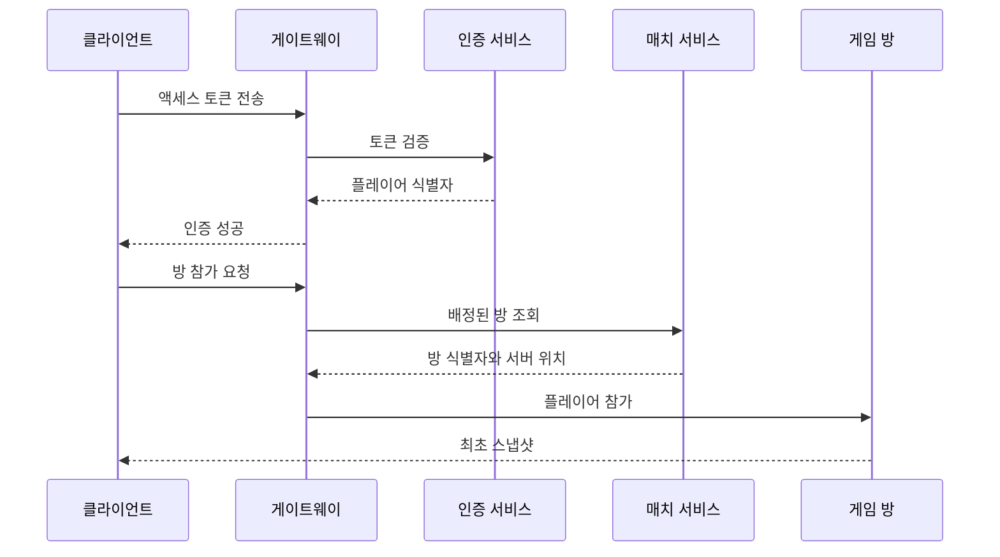
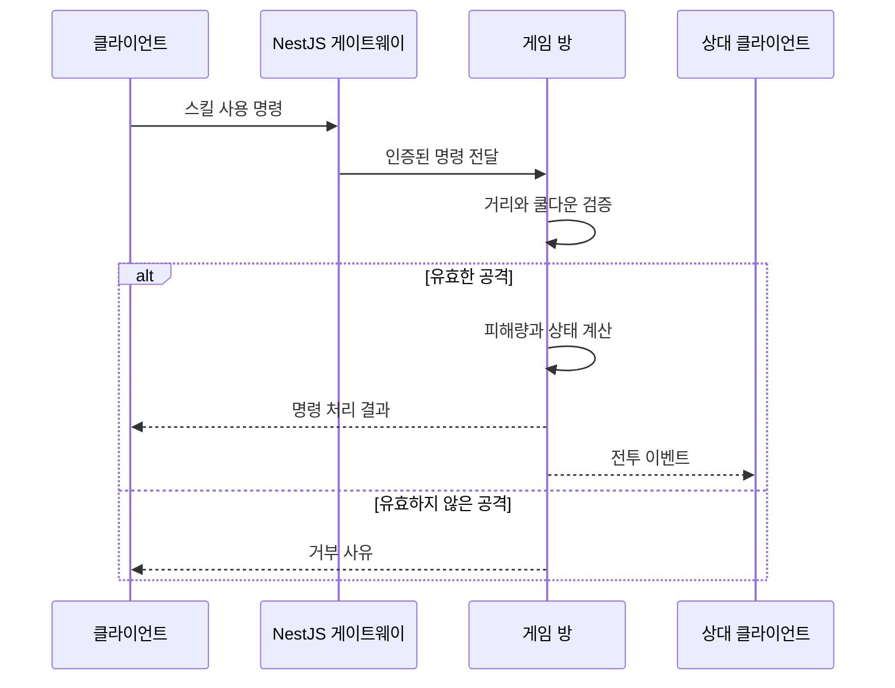
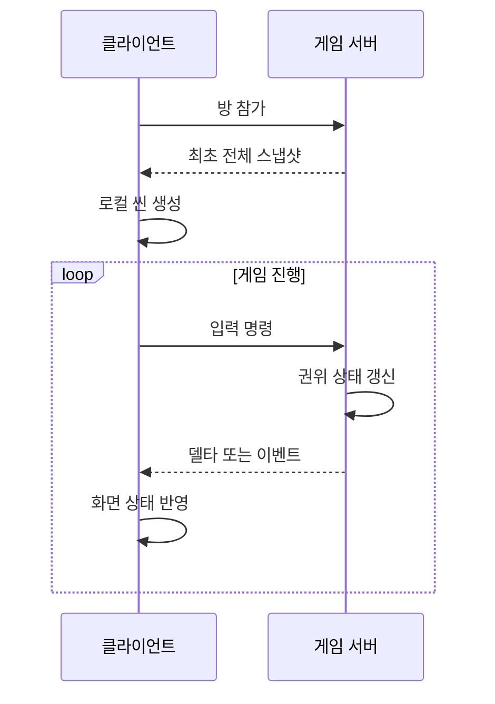

# 게임 네트워킹 - 동기화, 레이턴시, 보안

> 5장의 목차, 게임 네트워킹 개념

---

> 서버는 권위 있는 상태를 유지, 클라이언트는 네트워크 지연 속에서 상태를 자연스럽게 표현

---

## UML

UML은 프로그램 구조와 상호 작용을 표현, 게임 서버를 설계할 때 모든 UML 종류를 사용할 필요가 없다

| 다이어그램        | 표현                            | 예시                          |
| ----------------- | ------------------------------- | ----------------------------- |
| 시퀀스 다이어그램 | 시간에 따른 메시지 순서         | 로그인, 방 입장, 공격, 재접속 |
| 상태 다이어그램   | 객체가 가질 수 있는 상태와 전이 | 세션, 매치, 결제, 보상        |

UML 자체가 목적이 아님. 흐름을 이해하게 만드는 것

---

### UML 시퀀스 다이어그램

시퀀스 다이어그램은 위에서 아래로 시간이 흐르고, 각 참여자 사이에 오가는 메시지를 보여준다

#### 기본 요소

| 요소        | 의미                                            |
| ----------- | ----------------------------------------------- |
| 참여자      | 클라이언트, 게이트웨이, 게임 서버, DB 같은 주체 |
| 실선 화살표 | 요청이나 명령                                   |
| 점선 화살표 | 응답이나 결과                                   |
| alt         | 조건에 따른 분기                                |
| loop        | 반복되는 메시지                                 |
| opt         | 특정 조건에서만 실행되는 흐름                   |

#### 인증 후 게임 방 입장 흐름



해당 흐름은 다음과 같다

- 소켓 연결과 사용자 인증이 분리되어 있다
- 방 참가 전에 인증이 끝난다
- 최초 스냅샷을 받고 클라이언트가 현재 월드를 구성할 수 있음
- 방 배정 결과와 게임 상태의 권위자가 구분되어 있다

#### 공격 요청 흐름



시퀀스 다이어그램에 함수 이름만 쓰기보다 네트워크에서 실제로 의미 있는 명령과 결과를 쓰는 편이 좋다

---

## 게임 플레이 네트워킹

게임 플레이 네트워킹에 서로 충돌하는 목표가 있다

1. 서버가 공정하고 일관된 결과를 결정해야 한다
2. 클라이언트는 입력에 빠르게 반응해야 한다

모든 판단을 서버에서 하고 응답을 기다리면 안전하나 답답하다. 게임 장르에 맞는 절충이 필요

### 네트워크에 보내는 정보 세 종류

| 종류   | 의미                      | 예시                            |
| ------ | ------------------------- | ------------------------------- |
| 명령   | 플레이어가 하고 싶은 행동 | 이동 시작, 카드 사용, 스킬 사용 |
| 상태   | 특정 시점 값              | 위치, 속도, 체력, 현재 턴       |
| 이벤트 | 이미 발생한 사실          | 피격, 폭발, 사망, 아이템 획득   |

명령과 결과를 구분해야 한다

```ts
interface UseSkillCommand {
  requestId: string;
  inputSequence: number;
  skillId: number;
  targetId: string;
}

interface SkillUsedEvent {
  serverTick: number;
  actorId: string;
  targetId: string;
  skillId: number;
  damage: number;
  targetHp: number;
}
```

클라이언트는 `UseSkillCommand`를 보내고 서버가 검증하고 계산한 뒤 `SkillUsedEvent`를 만든다

---

### 모든 역할을 서버

클라이언트를 입력과 출력만 담당하는 단말로 보고, 게임 로직과 화면 생성까지 서버가 처리하는 방식

```text
클라이언트
  - 키보드와 마우스 입력 전송
  - 서버가 만든 화면 출력

서버
  - 게임 상태 보유
  - 게임 로직 실행
  - 화면 렌더링
  - 영상과 소리 전송
```

서버가 렌더링한 영상 결과를 클라이언트에 전송

#### 장점

- 게임 실행 환경과 상태를 서버가 통제
- 클라이언트에 전체 게임 로직을 배포하지 않아도 된다
- 기기 성능이 낮아도 고품질 렌더링이 가능할 수 있음

#### 단점

- 입력이 서버에 도착하고 영상이 돌아올 때까지 지연
- 서버의 CPU, GPU 사용량이 매우 크다
- 영상 스트리밍 대역폭이 필요
- 네트워크 품질이 화면 품질과 조작감에 직접 영향을 준다

일반적인 온라인 모바일 게임이나 PC 게임 서버는 화면을 렌더링하지 않음. 게임 상태와 판정만 서버가 담당, 그래픽 렌더링은 클라이언트에 맡긴다.

---

### 렌더링은 클라이언트가

최근 온라인 게임에서 일반적인 구조는 다음과 같다

- 서버는 권위 있는 월드 상태와 게임 규칙을 처리
- 클라이언트는 서버 상태의 사본을 가지고 화면을 렌더링
- 클라이언트는 행동 명령을 서버로 보낸다
- 서버는 변경된 상태와 발생한 이벤트를 관련 클라이언트에 보낸다

#### 최초 접속과 지속 갱신



#### 전체 스냅샷

특정 시점의 필요한 상태 전체를 담음

```ts
interface WorldSnapshot {
  serverTick: number;
  generatedAtMs: number;
  players: PlayerSnapshot[];
  monsters: MonsterSnapshot[];
  projectiles: ProjectileSnapshot[];
}

interface PlayerSnapshot {
  id: string;
  x: number;
  y: number;
  vx: number;
  vy: number;
  hp: number;
  state: "idle" | "moving" | "attacking" | "dead";
}
```

전체 스냅샷은 다음 상황에 유용

- 게임 방에 처음 들어갈 때
- 재접속 후 상태를 복구
- 클라이언트 상태 불일치를 강제로 잡을 때
- 관전자에게 현재 상황을 처음 전달할 때

매 틱마다 전체 상태를 보내면 구현은 단순하나 통신량과 직렬화가 커진다

#### 델타 스냅샷

이전 상태와 비교해 바뀐 값만 전송

```ts
interface WorldDelta {
  baseTick: number;
  serverTick: number;
  created: EntitySnapshot[];
  updated: EntityPatch[];
  removedIds: string[];
}

interface EntityPatch {
  id: string;
  x?: number;
  y?: number;
  vx?: number;
  vy?: number;
  hp?: number;
  state?: string;
}
```

| 비교      | 전체                       | 델타                         |
| --------- | -------------------------- | ---------------------------- |
| 통신량    | 큼                         | 작음                         |
| 난이도    | 낮음                       | 높음                         |
| 패킷 영향 | 다음 전체 상태로 복구 쉬움 | 기준 상태가 없으면 적용 불가 |
| 재접속    | 적합                       | 단독 사용 어려움             |
| 디버깅    | 비교적 쉬움                | 버전과 기준 틱 추적 필요     |

델타에는 어떤 상태를 기준으로 만든 것인지 `baseTick`을 포함해야 함. 클라이언트가 기준 상태를 가지고 있지 않으면 전체 스냅샷을 다시 요청

#### 지속성 상태, 단발성 이벤트

| 성격             | 예시                       | 필요한지                        |
| ---------------- | -------------------------- | ------------------------------- |
| 지속성           | 캐릭터 위치, 체력, 문 열림 | 필요함                          |
| 생성             | 캐릭터 등장, 투사체 생성   | 현재 존재하면 상태로 필요       |
| 제거             | 캐릭터 퇴장, 투사체 소멸   | 기존 사본을 지우는 데 필요      |
| 단발성 효과      | 폭발음, 피격 이벤트        | 지나간 뒤에 보통 불필요         |
| 중요한 게임 결과 | 사망, 득점, 승패           | 상태와 기록 모두 필요할 수 있음 |

폭발 이벤트를 놓쳤다고 전체 월드가 틀어지는 건 아니고 문이 열렸다는 지속성 상태를 놓치면 이후 충돌 판정이 달라질 수 있다

#### NestJS 방 단위 전파

```ts
import { WebSocketGateway, WebSocketServer } from "@nestjs/websockets";
import { Server } from "socket.io";

@WebSocketGateway({
  namespace: "/game",
  transports: ["websocket"],
})
export class GameGateway {
  @WebSocketServer()
  private server!: Server;

  publishDelta(roomId: string, delta: WorldDelta): void {
    this.server.to("room:" + roomId).emit("world-delta", delta);
  }

  publishToPlayer(playerId: string, event: unknown): void {
    this.server.to("player:" + playerId).emit("private-event", event);
  }
}
```

공개 위치 상태는 방 참가자에게 보낼 수 있으나, 카드 패나 개인 보상처럼 비공개인 정보는 해당 플레이어에게만 보내야 한다

---

### 추측항법

서버가 보낸 위치는 클라이언트에 도착하는 순간 과거의 값이다. 캐릭터가 계속 움직이면 위치와 속도를 이용해 현재 위치를 추정하고 추측항법 또는 데드 레커닝이라고 한다

#### 기본 계산

서버가 시각 `t`에서 다음 정보를 보냈다고 가정

- 위치 `P`
- 속도 `V`
- 서버 시각 또는 서버 틱

전송 후 경과 시간이 `Δt`라면 단순한 예상 위치는 다음과 같다

$$
P_{\text{예상}} = P_{\text{수신}} + V \times \Delta t
$$

가속도를 사용하는 게임이면 다음 항까지 고려할 수 있음

$$
P_{\text{예상}}
=
P_{\text{수신}}
+
V \times \Delta t
+
\frac{1}{2} A \Delta t^2
$$

네트워크가 오래 끊겼을 때 무한히 외삽하면 캐릭터가 벽을 통과하거나 전혀 다른 곳으로 달아날 수 있음. 예상 시간에는 상한이 필요

```ts
interface Vector2 {
  x: number;
  y: number;
}

interface MovementSnapshot {
  position: Vector2;
  velocity: Vector2;
  serverTimeMs: number;
}

function predictPosition(
  snapshot: MovementSnapshot,
  estimatedServerNowMs: number,
  maxPredictionMs = 20,
): Vector2 {
  const elapsedMs = Math.max(
    0,
    Math.min(maxPredictionMs, estimatedServerNowMs - snapshot.serverTimeMs),
  );

  const elapsedSeconds = elapsedMs / 1000;

  return {
    x: snapshot.position.x + snapshot.velocity.x * elapsedSeconds,
    y: snapshot.position.y + snapshot.velocity.y * elapsedSeconds,
  };
}
```

#### RTT, 단방향 지연

`ping`을 보내고 `pong`을 받을 때까지 걸린 시간이 RTT.

단순히 RTT를 2로 나누면 단방향 지연을 대략 추정할 수 있으나, 실제 상행과 하행 경로가 비대칭일 수 있어 정확한 값은 아님

또한 `Date.now()` 값은 기기마다 다르고 서버 타임스탬프를 사용할 때 클라이언트와 서버의 시계 차이도 추정해야 한다

```ts
interface ClockSample {
  sentAtClientMs: number;
  receivedAtClientMs: number;
  serverTimeMs: number;
}

function estimateClock(sample: ClockSample): {
  rttMs: number;
  offsetMs: number;
} {
  const rttMs = sample.receivedAtClientMs - sample.sentAtClientMs;

  const estimatedServerTimeAtReceive = sample.serverTimeMs + rttMs / 2;

  return {
    rttMs,
    offsetMs: estimatedServerTimeAtReceive - sample.receivedAtClientMs,
  };
}
```

한 번의 측정값보다 최근 여러 샘플 중앙값이나 이동 평균을 사용하는 편이 순간적인 영향을 줄인다

#### 보간과 외삽

| 기법      | 기준                               | 장점                      | 단점                          |
| --------- | ---------------------------------- | ------------------------- | ----------------------------- |
| 보간      | 이미 받은 두 과거 상태 사이를 그림 | 부드럽고 예측 오차가 작음 | 의도적으로 조금 늦게 보여준다 |
| 외삽      | 마지막 상태 이후의 미래를 예측     | 지연을 덜 느끼게 한다     | 방향 전환 시 오차 발생        |
| 즉시 스냅 | 최신 위치로 바로 이동              | 상태가 즉시 맞음          | 화면이 튀어 보인다            |

#### 스냅샷 버퍼

클라이언트는 받은 스냅샷을 즉시 그리지 않고 짧은 시간 동안 버퍼에 보관할 수 있음.

렌더 시각을 서버의 현재 추정 시각보다 과거로 잡으면 두 스냅샷 사이를 보간할 가능성이 높다

```ts
class SnapshotBuffer<T extends { serverTimeMs: number }> {
  private readonly snapshots: T[] = [];

  push(snapshot: T): void {
    this.snapshots.push(snapshot);

    this.snapshots.sort((a, b) => a.serverTimeMs - b.serverTimeMs);

    while (this.snapshots.length > 32) {
      this.snapshots.shift();
    }
  }

  findPair(renderTimeMs: number): [T, T] | null {
    for (let index = 0; index < this.snapshots.length - 1; index += 1) {
      const from = this.snapshots[index];
      const to = this.snapshots[index + 1];

      if (
        from.serverTimeMs <= renderTimeMs &&
        renderTimeMs <= to.serverTimeMs
      ) {
        return [from, to];
      }
    }

    return null;
  }
}
```

버퍼 시간을 늘리면 지터에는 강해지나 상대를 더 과거 모습으로 보게 된다. 장르와 네트워크 상태에 맞춰 조절

---

## 레이턴시 마스킹

레이턴시 마스킹은 실제 네트워크 지연을 없애는 기술이 아니고 지연이 있더라도 플레이어가 덜 불편하게 느끼도록 화면과 규칙을 설계하는 기술

### 지연이 그대로 드러나는 구조

```text
입력
  -> 서버로 전송
  -> 서버 판정
  -> 결과 수신
  -> 내 캐릭터 화면 반영
```

왕복 시간이 120ms면 버튼을 누른 뒤 캐릭터가 반응하기까지 비슷한 지연을 느낄 수 있음

### 클라이언트 측 예측

자신이 조종하는 캐릭터는 입력 즉시 로컬에서 움직이고, 같은 입력을 서버에도 보냄

```text
로컬 입력
  - 즉시 화면에 예측 적용
  - 입력 순번과 함께 서버 전송

서버
  - 명령 검증 후 권위 상태 전송

클라이언트
  - 예측 상태와 서버 상태를 조정
```

클라이언트 예측은 권위를 클라이언트에 넘긴다는 뜻이 아니고 서버가 나중에 다른 결과를 보내면 클라이언트가 수정해야 한다

### 입력 순번과 서버 조정

```ts
interface MoveInput {
  sequence: number;
  direction: Vector2;
  durationMs: number;
}

interface AuthoritativePlayerState {
  acknowledgedSequence: number;
  position: Vector2;
  velocity: Vector2;
  serverTick: number;
}

class ClientPrediction {
  private pendingInputs: MoveInput[] = [];
}
```
