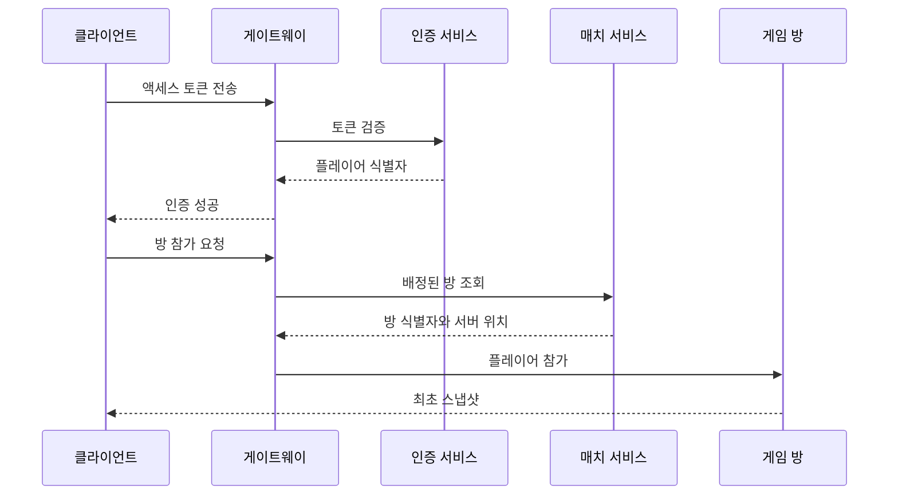
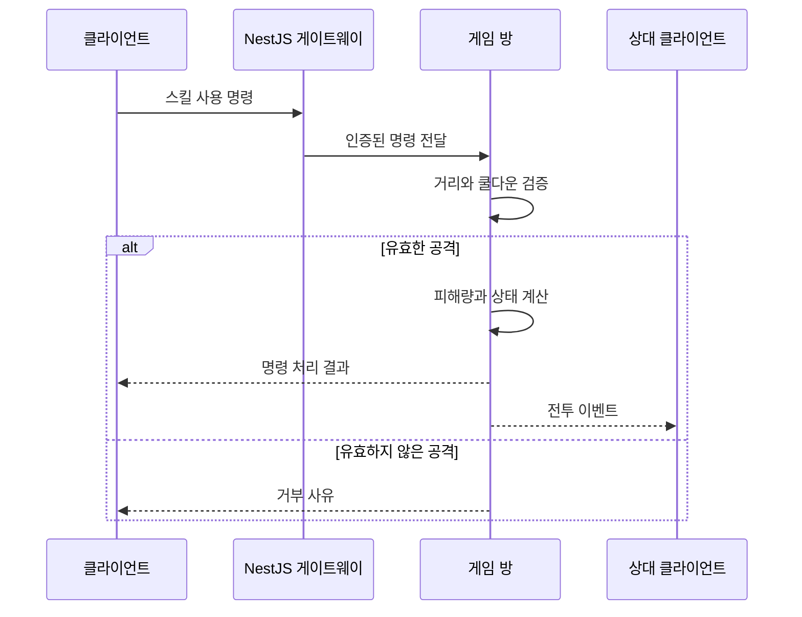
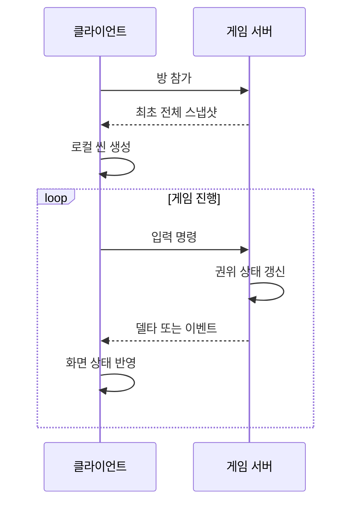
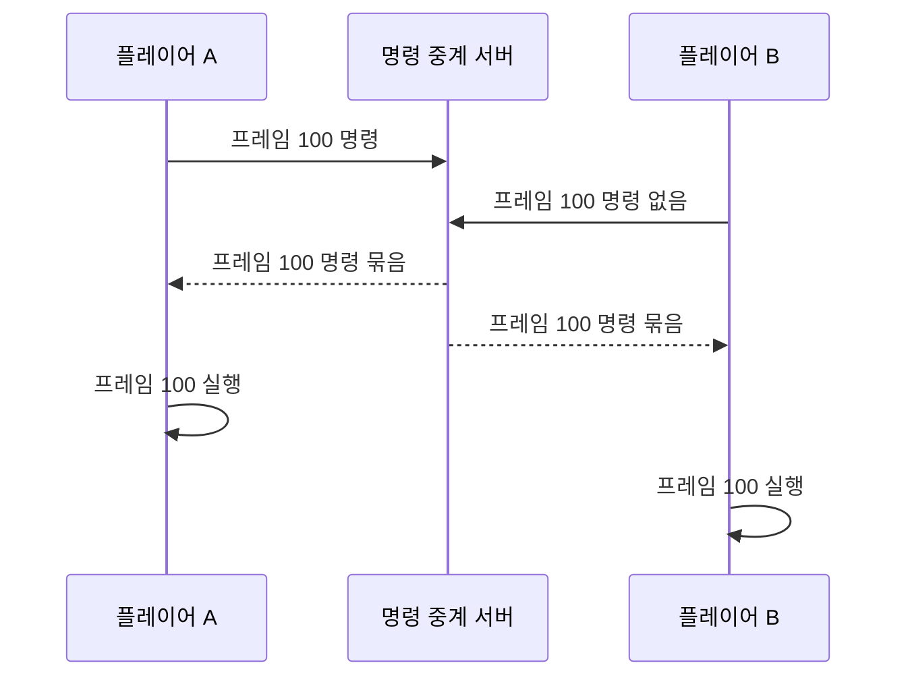
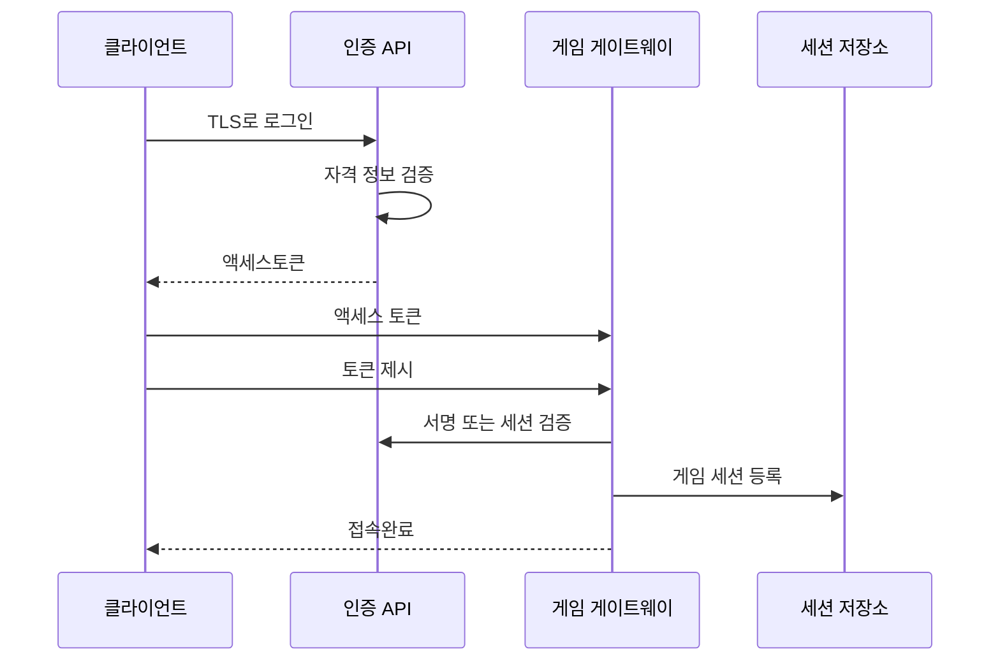
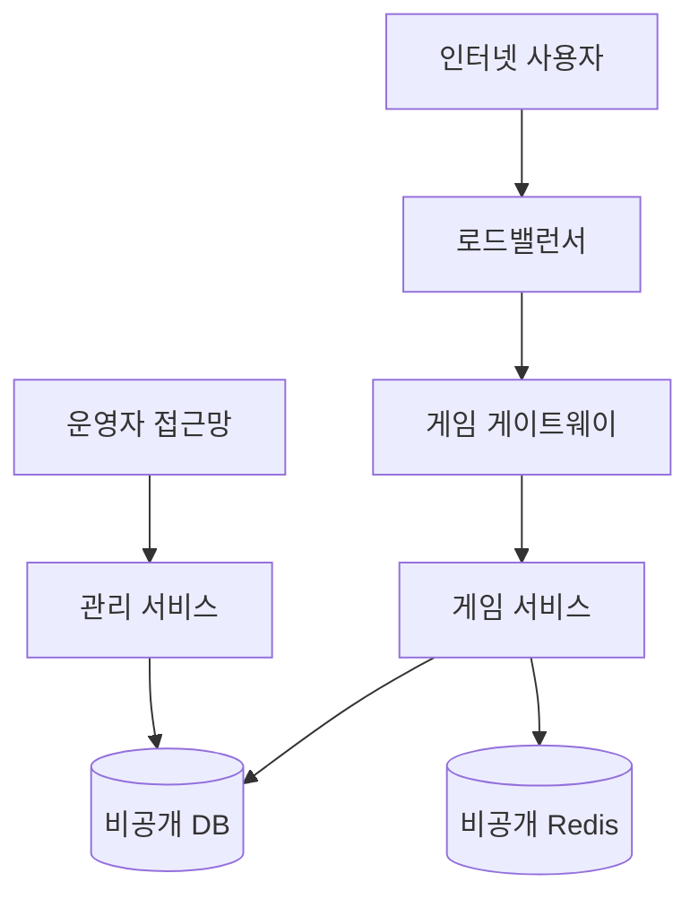

# 게임 네트워킹 - 동기화, 레이턴시, 보안

> 5장의 목차, 게임 네트워킹 개념

---

> 서버는 권위 있는 상태를 유지, 클라이언트는 네트워크 지연 속에서 상태를 자연스럽게 표현

---

## UML

UML은 프로그램 구조와 상호 작용을 표현, 게임 서버를 설계할 때 모든 UML 종류를 사용할 필요가 없다

| 다이어그램        | 표현                            | 예시                          |
| ----------------- | ------------------------------- | ----------------------------- |
| 시퀀스 다이어그램 | 시간에 따른 메시지 순서         | 로그인, 방 입장, 공격, 재접속 |
| 상태 다이어그램   | 객체가 가질 수 있는 상태와 전이 | 세션, 매치, 결제, 보상        |

UML 자체가 목적이 아님. 흐름을 이해하게 만드는 것

---

### UML 시퀀스 다이어그램

시퀀스 다이어그램은 위에서 아래로 시간이 흐르고, 각 참여자 사이에 오가는 메시지를 보여준다

#### 기본 요소

| 요소        | 의미                                            |
| ----------- | ----------------------------------------------- |
| 참여자      | 클라이언트, 게이트웨이, 게임 서버, DB 같은 주체 |
| 실선 화살표 | 요청이나 명령                                   |
| 점선 화살표 | 응답이나 결과                                   |
| alt         | 조건에 따른 분기                                |
| loop        | 반복되는 메시지                                 |
| opt         | 특정 조건에서만 실행되는 흐름                   |

#### 인증 후 게임 방 입장 흐름


```mermaid
sequenceDiagram
    participant C as 클라이언트
    participant G as 게이트웨이
    participant A as 인증 서비스
    participant M as 매치 서비스
    participant R as 게임 방

    C->>G: 액세스 토큰 전송
    G->>A: 토큰 검증
    A-->>G: 플레이어 식별자
    G-->>C: 인증 성공

    C->>G: 방 참가 요청
    G->>M: 배정된 방 조회
    M-->>G: 방 식별자와 서버 위치
    G->>R: 플레이어 참가
    R-->>C: 최초 스냅샷
```

해당 흐름은 다음과 같다

- 소켓 연결과 사용자 인증이 분리되어 있다
- 방 참가 전에 인증이 끝난다
- 최초 스냅샷을 받고 클라이언트가 현재 월드를 구성할 수 있음
- 방 배정 결과와 게임 상태의 권위자가 구분되어 있다

#### 공격 요청 흐름


```mermaid
sequenceDiagram
    participant C as 클라이언트
    participant G as NestJS 게이트웨이
    participant R as 게임 방
    participant O as 상대 클라이언트

    C->>G: 스킬 사용 명령
    G->>R: 인증된 명령 전달
    R->>R: 거리와 쿨다운 검증

    alt 유효한 공격
        R->>R: 피해량과 상태 계산
        R-->>C: 명령 처리 결과
        R-->>O: 전투 이벤트
    else 유효하지 않은 공격
        R-->>C: 거부 사유
    end
```

시퀀스 다이어그램에 함수 이름만 쓰기보다 네트워크에서 실제로 의미 있는 명령과 결과를 쓰는 편이 좋다

---

## 게임 플레이 네트워킹

게임 플레이 네트워킹에 서로 충돌하는 목표가 있다

1. 서버가 공정하고 일관된 결과를 결정해야 한다
2. 클라이언트는 입력에 빠르게 반응해야 한다

모든 판단을 서버에서 하고 응답을 기다리면 안전하나 답답하다. 게임 장르에 맞는 절충이 필요

### 네트워크에 보내는 정보 세 종류

| 종류   | 의미                      | 예시                            |
| ------ | ------------------------- | ------------------------------- |
| 명령   | 플레이어가 하고 싶은 행동 | 이동 시작, 카드 사용, 스킬 사용 |
| 상태   | 특정 시점 값              | 위치, 속도, 체력, 현재 턴       |
| 이벤트 | 이미 발생한 사실          | 피격, 폭발, 사망, 아이템 획득   |

명령과 결과를 구분해야 한다

```ts
interface UseSkillCommand {
  requestId: string;
  inputSequence: number;
  skillId: number;
  targetId: string;
}

interface SkillUsedEvent {
  serverTick: number;
  actorId: string;
  targetId: string;
  skillId: number;
  damage: number;
  targetHp: number;
}
```

클라이언트는 `UseSkillCommand`를 보내고 서버가 검증하고 계산한 뒤 `SkillUsedEvent`를 만든다

---

### 모든 역할을 서버

클라이언트를 입력과 출력만 담당하는 단말로 보고, 게임 로직과 화면 생성까지 서버가 처리하는 방식

```text
클라이언트
  - 키보드와 마우스 입력 전송
  - 서버가 만든 화면 출력

서버
  - 게임 상태 보유
  - 게임 로직 실행
  - 화면 렌더링
  - 영상과 소리 전송
```

서버가 렌더링한 영상 결과를 클라이언트에 전송

#### 장점

- 게임 실행 환경과 상태를 서버가 통제
- 클라이언트에 전체 게임 로직을 배포하지 않아도 된다
- 기기 성능이 낮아도 고품질 렌더링이 가능할 수 있음

#### 단점

- 입력이 서버에 도착하고 영상이 돌아올 때까지 지연
- 서버의 CPU, GPU 사용량이 매우 크다
- 영상 스트리밍 대역폭이 필요
- 네트워크 품질이 화면 품질과 조작감에 직접 영향을 준다

일반적인 온라인 모바일 게임이나 PC 게임 서버는 화면을 렌더링하지 않음. 게임 상태와 판정만 서버가 담당, 그래픽 렌더링은 클라이언트에 맡긴다.

---

### 렌더링은 클라이언트가

최근 온라인 게임에서 일반적인 구조는 다음과 같다

- 서버는 권위 있는 월드 상태와 게임 규칙을 처리
- 클라이언트는 서버 상태의 사본을 가지고 화면을 렌더링
- 클라이언트는 행동 명령을 서버로 보낸다
- 서버는 변경된 상태와 발생한 이벤트를 관련 클라이언트에 보낸다

#### 최초 접속과 지속 갱신


```mermaid
sequenceDiagram
    participant C as 클라이언트
    participant S as 게임 서버

    C->>S: 방 참가
    S-->>C: 최초 전체 스냅샷
    C->>C: 로컬 씬 생성

    loop 게임 진행
        C->>S: 입력 명령
        S->>S: 권위 상태 갱신
        S-->>C: 델타 또는 이벤트
        C->>C: 화면 상태 반영
    end
```

#### 전체 스냅샷

특정 시점의 필요한 상태 전체를 담음

```ts
interface WorldSnapshot {
  serverTick: number;
  generatedAtMs: number;
  players: PlayerSnapshot[];
  monsters: MonsterSnapshot[];
  projectiles: ProjectileSnapshot[];
}

interface PlayerSnapshot {
  id: string;
  x: number;
  y: number;
  vx: number;
  vy: number;
  hp: number;
  state: "idle" | "moving" | "attacking" | "dead";
}
```

전체 스냅샷은 다음 상황에 유용

- 게임 방에 처음 들어갈 때
- 재접속 후 상태를 복구
- 클라이언트 상태 불일치를 강제로 잡을 때
- 관전자에게 현재 상황을 처음 전달할 때

매 틱마다 전체 상태를 보내면 구현은 단순하나 통신량과 직렬화가 커진다

#### 델타 스냅샷

이전 상태와 비교해 바뀐 값만 전송

```ts
interface WorldDelta {
  baseTick: number;
  serverTick: number;
  created: EntitySnapshot[];
  updated: EntityPatch[];
  removedIds: string[];
}

interface EntityPatch {
  id: string;
  x?: number;
  y?: number;
  vx?: number;
  vy?: number;
  hp?: number;
  state?: string;
}
```

| 비교      | 전체                       | 델타                         |
| --------- | -------------------------- | ---------------------------- |
| 통신량    | 큼                         | 작음                         |
| 난이도    | 낮음                       | 높음                         |
| 패킷 영향 | 다음 전체 상태로 복구 쉬움 | 기준 상태가 없으면 적용 불가 |
| 재접속    | 적합                       | 단독 사용 어려움             |
| 디버깅    | 비교적 쉬움                | 버전과 기준 틱 추적 필요     |

델타에는 어떤 상태를 기준으로 만든 것인지 `baseTick`을 포함해야 함. 클라이언트가 기준 상태를 가지고 있지 않으면 전체 스냅샷을 다시 요청

#### 지속성 상태, 단발성 이벤트

| 성격             | 예시                       | 필요한지                        |
| ---------------- | -------------------------- | ------------------------------- |
| 지속성           | 캐릭터 위치, 체력, 문 열림 | 필요함                          |
| 생성             | 캐릭터 등장, 투사체 생성   | 현재 존재하면 상태로 필요       |
| 제거             | 캐릭터 퇴장, 투사체 소멸   | 기존 사본을 지우는 데 필요      |
| 단발성 효과      | 폭발음, 피격 이벤트        | 지나간 뒤에 보통 불필요         |
| 중요한 게임 결과 | 사망, 득점, 승패           | 상태와 기록 모두 필요할 수 있음 |

폭발 이벤트를 놓쳤다고 전체 월드가 틀어지는 건 아니고 문이 열렸다는 지속성 상태를 놓치면 이후 충돌 판정이 달라질 수 있다

#### NestJS 방 단위 전파

```ts
import { WebSocketGateway, WebSocketServer } from "@nestjs/websockets";
import { Server } from "socket.io";

@WebSocketGateway({
  namespace: "/game",
  transports: ["websocket"],
})
export class GameGateway {
  @WebSocketServer()
  private server!: Server;

  publishDelta(roomId: string, delta: WorldDelta): void {
    this.server.to("room:" + roomId).emit("world-delta", delta);
  }

  publishToPlayer(playerId: string, event: unknown): void {
    this.server.to("player:" + playerId).emit("private-event", event);
  }
}
```

공개 위치 상태는 방 참가자에게 보낼 수 있으나, 카드 패나 개인 보상처럼 비공개인 정보는 해당 플레이어에게만 보내야 한다

---

### 추측항법

서버가 보낸 위치는 클라이언트에 도착하는 순간 과거의 값이다. 캐릭터가 계속 움직이면 위치와 속도를 이용해 현재 위치를 추정하고 추측항법 또는 데드 레커닝이라고 한다

#### 기본 계산

서버가 시각 `t`에서 다음 정보를 보냈다고 가정

- 위치 `P`
- 속도 `V`
- 서버 시각 또는 서버 틱

전송 후 경과 시간이 `Δt`라면 단순한 예상 위치는 다음과 같다

$$
P_{\text{예상}} = P_{\text{수신}} + V \times \Delta t
$$

가속도를 사용하는 게임이면 다음 항까지 고려할 수 있음

$$
P_{\text{예상}}
=
P_{\text{수신}}
+
V \times \Delta t
+
\frac{1}{2} A \Delta t^2
$$

네트워크가 오래 끊겼을 때 무한히 외삽하면 캐릭터가 벽을 통과하거나 전혀 다른 곳으로 달아날 수 있음. 예상 시간에는 상한이 필요

```ts
interface Vector2 {
  x: number;
  y: number;
}

interface MovementSnapshot {
  position: Vector2;
  velocity: Vector2;
  serverTimeMs: number;
}

function predictPosition(
  snapshot: MovementSnapshot,
  estimatedServerNowMs: number,
  maxPredictionMs = 20,
): Vector2 {
  const elapsedMs = Math.max(
    0,
    Math.min(maxPredictionMs, estimatedServerNowMs - snapshot.serverTimeMs),
  );

  const elapsedSeconds = elapsedMs / 1000;

  return {
    x: snapshot.position.x + snapshot.velocity.x * elapsedSeconds,
    y: snapshot.position.y + snapshot.velocity.y * elapsedSeconds,
  };
}
```

#### RTT, 단방향 지연

`ping`을 보내고 `pong`을 받을 때까지 걸린 시간이 RTT.

단순히 RTT를 2로 나누면 단방향 지연을 대략 추정할 수 있으나, 실제 상행과 하행 경로가 비대칭일 수 있어 정확한 값은 아님

또한 `Date.now()` 값은 기기마다 다르고 서버 타임스탬프를 사용할 때 클라이언트와 서버의 시계 차이도 추정해야 한다

```ts
interface ClockSample {
  sentAtClientMs: number;
  receivedAtClientMs: number;
  serverTimeMs: number;
}

function estimateClock(sample: ClockSample): {
  rttMs: number;
  offsetMs: number;
} {
  const rttMs = sample.receivedAtClientMs - sample.sentAtClientMs;

  const estimatedServerTimeAtReceive = sample.serverTimeMs + rttMs / 2;

  return {
    rttMs,
    offsetMs: estimatedServerTimeAtReceive - sample.receivedAtClientMs,
  };
}
```

한 번의 측정값보다 최근 여러 샘플 중앙값이나 이동 평균을 사용하는 편이 순간적인 영향을 줄인다

#### 보간과 외삽

| 기법      | 기준                               | 장점                      | 단점                          |
| --------- | ---------------------------------- | ------------------------- | ----------------------------- |
| 보간      | 이미 받은 두 과거 상태 사이를 그림 | 부드럽고 예측 오차가 작음 | 의도적으로 조금 늦게 보여준다 |
| 외삽      | 마지막 상태 이후의 미래를 예측     | 지연을 덜 느끼게 한다     | 방향 전환 시 오차 발생        |
| 즉시 스냅 | 최신 위치로 바로 이동              | 상태가 즉시 맞음          | 화면이 튀어 보인다            |

#### 스냅샷 버퍼

클라이언트는 받은 스냅샷을 즉시 그리지 않고 짧은 시간 동안 버퍼에 보관할 수 있음.

렌더 시각을 서버의 현재 추정 시각보다 과거로 잡으면 두 스냅샷 사이를 보간할 가능성이 높다

```ts
class SnapshotBuffer<T extends { serverTimeMs: number }> {
  private readonly snapshots: T[] = [];

  push(snapshot: T): void {
    this.snapshots.push(snapshot);

    this.snapshots.sort((a, b) => a.serverTimeMs - b.serverTimeMs);

    while (this.snapshots.length > 32) {
      this.snapshots.shift();
    }
  }

  findPair(renderTimeMs: number): [T, T] | null {
    for (let index = 0; index < this.snapshots.length - 1; index += 1) {
      const from = this.snapshots[index];
      const to = this.snapshots[index + 1];

      if (
        from.serverTimeMs <= renderTimeMs &&
        renderTimeMs <= to.serverTimeMs
      ) {
        return [from, to];
      }
    }

    return null;
  }
}
```

버퍼 시간을 늘리면 지터에는 강해지나 상대를 더 과거 모습으로 보게 된다. 장르와 네트워크 상태에 맞춰 조절

---

## 레이턴시 마스킹

레이턴시 마스킹은 실제 네트워크 지연을 없애는 기술이 아니고 지연이 있더라도 플레이어가 덜 불편하게 느끼도록 화면과 규칙을 설계하는 기술

### 지연이 그대로 드러나는 구조

```text
입력
  -> 서버로 전송
  -> 서버 판정
  -> 결과 수신
  -> 내 캐릭터 화면 반영
```

왕복 시간이 120ms면 버튼을 누른 뒤 캐릭터가 반응하기까지 비슷한 지연을 느낄 수 있음

### 클라이언트 측 예측

자신이 조종하는 캐릭터는 입력 즉시 로컬에서 움직이고, 같은 입력을 서버에도 보냄

```text
로컬 입력
  - 즉시 화면에 예측 적용
  - 입력 순번과 함께 서버 전송

서버
  - 명령 검증 후 권위 상태 전송

클라이언트
  - 예측 상태와 서버 상태를 조정
```

클라이언트 예측은 권위를 클라이언트에 넘긴다는 뜻이 아니고 서버가 나중에 다른 결과를 보내면 클라이언트가 수정해야 한다

### 입력 순번과 서버 조정

### 입력 순번과 서버 조정

```ts
interface MoveInput {
  sequence: number;
  direction: Vector2;
  durationMs: number;
}

interface AuthoritativePlayerState {
  acknowledgedSequence: number;
  position: Vector2;
  velocity: Vector2;
  serverTick: number;
}

class ClientPrediction {
  private pendingInputs: MoveInput[] = [];
  private predictedPosition: Vector2 = { x: 0, y: 0 };

  applyLocalInput(input: MoveInput): void {
    this.predictedPosition = state.postion;

    this.pendingInputs = this.pendingInputs.filter(
      (input) => input.sequence > state.acknowledgedSequence,
    );

    for (const input of this.pendingInputs) {
      this.predictedPosition = simulateMove(this.predictedPosition, input);
    }
  }
}
```

서버가 sequence 120까지 처리했다고 알려주면 클라는 120 이하의 입력을 제거하고, 그 뒤 서버 위치에서 아직 처리되지 않은 121 이후 입력을 다시 적용

이 과정을 **서버 조정(Reconciliation)**이라 한다

### 오차를 화면에 반영

| 오차크기       | 방법                                   |
| -------------- | -------------------------------------- |
| 매우 작음      | 몇 프렝미에 걸쳐 부드럽게 보정         |
| 중간           | 짧은 시간 동안 빠르게 목표 위치를 추적 |
| 매우 큼        | 순간 이동 또는 안전 지점으로 강제 보정 |
| 규칙 위반 의심 | 명령 거부, 기록, 추가 검증             |

충돌이나 낙사처럼 잘못된 예측을 계속 보여줘 더 큰 오류가 생기는 상황에서 부드러움보다 즉시 보정이 중요

### 원격 플레이어와 로컬 플레이어 차이

| 대상        | 방식                                          | 이유                               |
| ----------- | --------------------------------------------- | ---------------------------------- |
| 캐릭터      | 클라이언트 예측과 서버 조정                   | 입력 반응성                        |
| 다른 캐릭터 | 스냅샷 보간과 제한적 외삽                     | 다른 사람의 미래 입력을 알 수 없음 |
| 투사체      | 서버 생성 후 로컬 시뮬레이션 또는 상태 동기화 | 게임 규칙에 따라 다름              |
| NPC         | 서버 권위 상태를 보간                         | 서버가 행동을 결정함               |

### 지연 보상

FPS처럼 발사 시점의 조준이 중요한 게임에서 서버가 과거 상태를 짧게 보관, 클라이언트 발사 시각에 가까운 상태로 되돌려 명중 여부를 판정할 수 있음. 이를 서버 측 지연 보상이라 함

다음 제한이 필요

- 되돌릴 수 있는 최대 시간
- 클라이언트 타임스탬프를 신뢰하지 않고 서버가 추정한 시간 사용
- 이미 사망한 플레이어와 뒤늦은 명중의 처리 규칙
- 높은 지연 사용자가 지나치게 유리해지지 않도록 상한 설정

지연 보상은 서로 다른 지연 조건 사이에 납득 가능한 판정을 만드는 절충

### 애니메이션으로 숨길 수 있는 지연

네트워크 기술만으로 모든 지연을 해결할 필요는 없다

- 공격 준비 동작 중 서버 판정 완료
- 상자 열기 애니메이션 중 보상 조회
- 매치 확정 화면 중 방 생성
- 카드 뒤집기 연출 중 상대 행동 수신
- 로딩 화면 중 최초 스냅샷과 게임 데이터 준비

성공 여부가 확정되지 않았는데 보상을 먼저 보여주면 안된다

---

## 넓은 월드, 많은 캐릭터 처리

월드 전체에 수천 개의 객체가 있어도 한 플레이어가 실제로 보고 상호 작용하는 객체는 일부.

**관심 영역**, **가시 영역 필터링**, **AOI**

### 관심 영역의 기준

단순한 거리뿐 아니라 게임 규칙도 포함

- 플레이어 주변 일정 거리
- 같은 방, 채널, 파티
- 같은 던전 인스턴스
- 카메라에 보이는 구역
- 소리가 들리는 범위
- 전투 또는 타깃 관계
- 운영자와 관전자 권한

### 객체 생명주기

관심 영역이 바뀌면 클라이언트에 객체를 만들고 없애야 한다

```text
관심 영역 진입 -> spawn 이벤트 또는 현재 상태 전송
관심 영역 내부 -> 위치와 상태 델타 전송
관심 영역 이탈 -> despawn 이벤트 전송
```

despawn은 실제 게임 세계에서 객체가 삭제되었다는 뜻일 수도 있고, 클라이언트의 관심 영역에서만 사라졌다는 뜻일 수도 있음. 메시지 의미를 구분하는 것이 필요

### 공간 분할

모든 객체와 거리를 매번 비교하면 객체 수가 늘수록 비용이 커짐. 월드를 격자, 쿼드트리, 공간 해시 등으로 나누어 가까운 후보만 조회

| 방식            | 장점                    | 적합 상황                      |
| --------------- | ----------------------- | ------------------------------ |
| 고정 격자       | 단순하고 빠름           | 밀도가 비교적 일정한 월드      |
| 공간 해시       | 좌표로 셀을 바로 계산   | 큰 좌표 공간, 동적 객체        |
| 쿼드트리        | 밀도에 따라 영역 세분화 | 2D 월드의 밀도 차이가 크다     |
| 옥트리          | 3차원 공간 분할         | 비행과 높이 차이가 중요한 월드 |
| 네비게이션 구역 | 게임 맵 구조를 활용     | 방과 통로가 명확한 맵          |

### 단순 격자 인덱스

```ts
type EntityId = string;

class SpatialGrid {
  private readonly cells = new Map<string, Set<EntityId>>();

  constructor(private readonly cellSize: number) {}

  private cellCoordinate(value: number): number {
    return Math.floor(value / this.cellSize);
  }

  private key(cellX: number, cellY: number): string {
    return cellX + " : " + cellY;
  }

  add(entityId: EntityId, x: number, y: number): void {
    const key = this.key(this.cellCoordinate(x), this.cellCoordinate(y));

    const cell = this.cells.get(key) ?? new Set<EntityId>();

    cell.add(entityId);
    this.cells.set(key, cell);
  }

  queryNearby(x: number, y: number, radiusInCells = 1): Set<EntityId> {
    const centerX = this.cellCoordinate(x);
    const centerY = this.cellCoordinate(y);
    const result = new Set<EntityId>();

    for (let dx = -radiusInCells; dx <= radiusInCells; dx += 1) {
      for (let dy = -radiusInCells; dy <= radiusInCells; dy += 1) {
        const cell = this.cells.get(this.key(centerX + dx, centerY + dy));

        for (const entityId of cell ?? []) {
          result.add(entityId);
        }
      }
    }

    return result;
  }
}
```

실제 구현에서 객체가 셀을 이동할 때 이전 셀에서 제거하고 새 셀에 추가해야 한다. 격자로 후보를 찾은 뒤 실제 거리와 시야 조건을 한 번 더 검사

### 관심 집합 변경 계산

```ts
function diffInterestSet(
  previouis: Set<string>,
  current: Set<string>,
): {
  entered: string[];
  stayed: string[];
  left: string[];
} {
  return {
    entered: [...current].filter((id) => !previous.has(id)),
    stayed: [...current].filter((id) => previous.has(id)),
    left: [...previous].filter((id) => !current.has(id)),
  };
}
```

- entered에 전체 현재 상태를 보낸다
- stayed에 변경을 보낸다
- left에 관심 영역 제거 메시지를 보낸다

### 거리별 전송 빈도

관심 영역 안의 모든 객체를 같은 빈도로 보낼 필요가 없다

| 거리, 중요도          | 전송 정책               |
| --------------------- | ----------------------- |
| 매우 가까운 전투 대상 | 높은 빈도의 위치, 행동  |
| 주변 플레이어         | 중간 빈도               |
| 멀리 보이는 객체      | 낮은 빈도 위치          |
| 화면 밖 파티원        | 위치 요약과 상태 아이콘 |
| 무관한 다른 지역      | 전송하지 않음           |

이를 중요도 기반 갱신 또는 네트워크 LOD라고 볼 수 있음

### 경계 떨림 방지

관심 반경이 50m일 때 객체가 49.9와 50.1m을 반복하면 spawn, despawn이 계속 발생할 수 있음. 진입 반경과 이탈 반경을 다르게 둔다

이러한 완충 구간을 히스테리시스라고 함

---

## 실시간 전략 시뮬레이션 게임, 네트워크 동기화

RTS는 플레이어 수보다 유닛 수가 훨씬 많을 수 있음. 수백 개 유닛의 위치와 상태를 계속 보내면 통신량이 커짐

락스텝 방식에 모든 유닛 상태 대신 플레이어의 명령만 공유, 각 참여자가 같은 시뮬레이션을 실행

### 락스텝 기본 원리

> 같은 초기 상태에 같은 명령을 같은 순서로 적용하면 같은 결과가 나온다


```mermaid
sequenceDiagram
    participant A as 플레이어 A
    participant S as 명령 중계 서버
    participant B as 플레이어 B

    A->>S: 프레임 100 명령
    B->>S: 프레임 100 명령 없음

    S-->>A: 프레임 100 명령 묶음
    S-->>B: 프레임 100 명령 묶음

    A->>A: 프레임 100 실행
    B->>B: 프레임 100 실행
```

각 클라는 프레임 100에 필요한 모든 명령을 받은 뒤 같은 순서로 실행

### 명령 메시지

```ts
interface LockstepCommand {
  frame: number;
  playerId: string;
  sequence: number;
  type: "move" | "attack" | "produce" | "no-op";
  payload: Record<string, number | string>;
}

interface CommandFrame {
  frame: number;
  commands: LockstepCommand[];
  previousStateHash: string;
}
```

명령이 없는 플레이어도 no-op을 제출, 서버가 제한 시간 후 no-op로 확정, 다른 참여자가 입력을 영원히 기다리지 않음

### 입력 지연

네트워크로 명령이 도착할 시간을 확보, 현재보다 미래 프레임에 명령을 예약

```text
현재 시뮬레이션 프레임: 100
입력 지연: 3프레임
새 명령 실행 프레임: 103
```

입력 지연을 늘리면 불안정한 네트워크에 강해지나 조작 반응이 느려짐

### 결정성을 깨뜨리는 요소

락스텝은 모든 참여자의 시뮬레이션 결과가 같아야 한다

| 위험요소         | 문제                       | 대응                               |
| ---------------- | -------------------------- | ---------------------------------- |
| 부동소수점 차이  | 플랫폼별 반올림 결과 차이  | 고정소수점 또는 검증된 결정적 수학 |
| 무작위 값        | 각 기기에서 다른 결과      | 같은 시드와 호출 순서              |
| 현재 시각        | 기기별 시간이 다름         | 시뮬레이션 틱 사용                 |
| 컬렉션 순회 순서 | 실행 순서가 달라질 수 있음 | 안정적인 정렬 기준                 |
| 비동기 완료 순서 | 실행마다 결과 순서 변경    | 시뮬레이션 입력으로 확정 후 적용   |
| 게임 데이터 버전 | 능력치와 규칙이 다르다     | 매치 시작 전 버전 확인             |

Node.js 서버가 명령을 중계 Unity, Unreal 다른 네이티브 클라이언트가 같은 결과를 만들어야 하며 언어와 플랫폼 간 결정성을 별도로 검증해야 한다

### 상태 해시와 불일치 감지

일정 프레임마다 핵심 상태를 정규화한 뒤 해시를 계산

```ts
import { createHash } from "node:crypto";

function createStateHash(state: DeterministicWorldState): string {
  const canonical = JSON.stringify({
    frame: state.frame,
    units: [...state.units]
      .sort((a, b) => a.id.localeCompare(b.id))
      .map((unit) => ({
        id: unit.id,
        x: unit.x,
        y: unit.y,
        hp: unit.hp,
      })),
  });

  return createHash("sha256").update(canonical).digest("hex");
}
```

해당 예시는 개념 설명용. 상태 해시가 다른 것은 불일치를 감지, 어느 쪽이 올바른지를 자동으로 알게 되었다는 것은 아님.

### 락스텝, 스냅샷, 풀백 비교

| 방식          | 전송 대상             | 장점                                | 예           |
| ------------- | --------------------- | ----------------------------------- | ------------ |
| 상태 스냅샷   | 객체 상태             | 구현과 복구가 비교적 직관적         | 액션, MMORPG |
| 결정적 락스텝 | 입력 명령             | 많은 유닛을 적은 통신량으로 동기화  | RTS          |
| 롤백          | 입력 명령과 과거 상태 | 입력 반응성을 높이고 늦은 입력 반영 | 대전 격투    |

롤백은 늦게 도착한 입력이 있으면 과거 프레임으로 돌아가사 다시 이 시뮬래이션. 모든 게임 객체가 빠르게 저장 및 복원되고 결정적으로 재실행되어야 하여 설계 난이도가 높다

---

## 실제 레이턴시 줄이기

레이턴시 마스킹은 지연을 덜 느끼게 한다. 실제 레시턴시를 줄이는 작업은 패킷이 오가는 거리와 처리 단계를 줄이는 일

### 전체 지연 예산

플레이어가 느끼는 응답 시간에 네트워크 외의 시간도 포함

```text
입력 수집
+ 클라이언트 프레임 대기
+ 상행 네트워크
+ 서버 큐 대기
+ 게임 틱 대기와 로직 처리
+ 하행 네트워크
+ 클라이언트 보간과 렌더링
```

네트워크 RTT만 측정해 실제 체감 지연의 원인을 알 수 없고 각 구간을 따로 측정해야 한다

### 서버 지역 선택

물리적 거리는 줄일 수 없는 지연의 큰 부분

- 사용자와 가까운 리전에 게임 서버를 배치
- 매치메이킹 때 각 후보 리전의 RTT를 측정
- 파티 전체의 지연을 고려해 리전을 선택
- 평균만 낮추기보다 특정 플레이어의 과도한 지연도 제한

### 불필요한 서버 경유 줄이기

```text
좋지않은 예

클라이언트
-> API 게이트웨이
-> 인증 서비스
-> 로비
-> 게임서버

매 입력마다 전체 경로 반복

개선

초기 인증과 방 배정 완료

클라이언트
-> 게임 게이트웨이 또는 게임서버
```

서비스 분리는 관리에 도움이 될 수 있으나, 실시간 입력 경로에 동기 호출을 여러 개 넣으면 지연과 부분 실패가 늘어난다

### TCP, UDP 선택

| 데이터           | 필요한 성질                    | 후보                  |
| ---------------- | ------------------------------ | --------------------- |
| 구매, 보상, 채팅 | 신뢰성과 순서                  | TCP, HTTPS, WebSocket |
| 반복 위치 스냅샷 | 최신 값이 중요, 일부 유실 허용 | UDP 계열 전송         |
| 공격 판정 이벤트 | 유실되면 안 됨                 | 신뢰성 있는 채널      |
| 음성 및 영상     | 오래된 데이터의 가치가 낮음    | UDP 기반 미디어 전송  |

Node.js 네이티브 서버는 dgram으로 UDP를 사용할 수 있음. 브라우저 클라이언트는 일반 UDP 소켓을 직접 열 수 없어 WebRTC DataChannel 같은 상위 기술을 검토

UDP를 사용한다고 자동으로 더 빠른 게임이 되는 것은 아님. 연겱 관리, 혼잡 제어, 암호화, 순서, 인증, 중요한 메시지 재전송을 앱이나 선택한 프로토콜이 처리해야 함

### TCP의 작은 메시지 지연

Node.js TCP 소켓은 작은 쓰기를 즉시 보내고 싶을 때 Nagle 알고리즘을 비활성화할 수 있다

```ts
import net from "node:net";

const server = net.createServer((socket) => {
  socket.setNoDelay(true);

  socket.on("data", (chunk) => {
    handleIncomingChunk(socket, chunk);
  });
});
```

프레임워크와 전송 계층이 실제 소켓에 어떤 값을 적용하는지 문서와 측정으로 확인

### 메시지 크기 줄이기

- 필요하지 않은 필드를 보내지 않음
- 전체 상태보다 델타를 사용
- 문자열 ID를 세션 내부의 작은 정수 ID로 매핑
- JSON 대신 MessagePack, Protocol Buffers를 검토
- 좌표 정밀도를 게임에 필요한 범위로 제한
- 압축은 CPU 비용과 작은 메시지에서 역효과를 함께 측정

### 최신 상태 우선

건너뛰면 안되는 정보

- 아이템 획득
- 체력 변경의 원인이 되는 전투 이벤트
- 턴 변경
- 매치 종료
- 경제 및 결제 결과

메시지마다 신뢰성과 최신성 요구를 분류해야 한다

---

## 게임 플레이 이외의 네트워킹

온라인 게임의 네트워크 기능은 실시간 이동과 전투만으로 끝나지 않음

| 기능              | 일반적 통신              | 고려 사항                     |
| ----------------- | ------------------------ | ----------------------------- |
| 로그인            | HTTPS 요청과 토큰        | 인증 정보 보호, 재시도 제한   |
| 프로필과 인벤토리 | HTTPS 또는 요청과 응답   | 데이터 정합성, 페이지네이션   |
| 로비와 파티       | WebSocket과 API 혼합     | 상태 알림, 초대 만료          |
| 메치메이킹        | 요청 후 비동기 결과 알림 | 취소, 중복 요청, 타임 아웃    |
| 채팅              | WebSocket                | 팬아웃, 차단, 신고, 보관 정책 |
| 랭킹              | API 조회와 비동기 집계   | 캐시, 동점 순위, 마감 시점    |
| 우편함            | API                      | 중복 수령 방지                |
| 공지와 점검       | API 또는 푸시            | 버전과 지역별 노출            |
| 패치와 에셋       | CDN                      | 무결성, 버전, 캐시            |

### 로그은 흐름

현재 서비스에 게임 서버가 평문 비밀번호를 직접 비교하는 구조보다 인증 서비스를 분리, 인증 성공 후 짧은 수명의 토큰이나 게임 속 티켓을 발급하는 방식이 일반적


```mermaid
sequenceDiagram
    participant C as 클라이언트
    participant A as 인증 API
    participant G as 게임 게이트웨이
    participant S as 세션 저장소

    C->>A: TLS로 로그인
    A->>A: 자격 정보 검증
    A-->>C: 액세스토큰
    C->>G: 액세스 토큰
    C->>G: 토큰 제시
    G->>A: 서명 또는 세션 검증
    G->>S: 게임 세션 등록
    G-->>C: 접속완료
```

비밀번호는 복호화 가능한 형태로 저장하지 않고 검증에 적합한 비밀번호 해시를 사용. 액세스 토큰도 유출 가능성을 전제로 짧은 수명, 폐기 정책, 재발급 정책을 정함

### 매치메이킹은 비동기작업

매치 검색은 결과가 즉시 나오지 않을 수 있다

```ts
interface MatchmakingTicket {
  ticketId: string;
  playerIds: string[];
  mode: string;
  regionCandiates: string[];
  createdAtMs: number;
  status: "searching" | "matched" | "cancelled" | "expired";
}
```

클라이언트는 검색 시작 요청을 보내고 ticketId를 받는다. 결과는 WebSocket 알림이나 상태조회로 받는다

서버는 다음 경쟁 상황을 처리해야 한다

- 매치가 성립되는 순간 취소 요청이 도착한다
- 같은 사용자가 여러 번 검색 시작
- 파티원이 검색 중 이탈
- 게임 서버 할당은 성공했으나 클라이언트 알림 실패
- 한 사용자가 매치 두 개에 동시에 포함된다

티켓 상태 전이와 멱등 처리가 필요한 이유

### 채팅은 게임 상태와 분리

채팅은 게임 틱과 다른 특성을 가진다

- 메시지 빈도 제한
- 금칙어와 신고
- 차단 관계
- 채널별 팬아웃
- 보관 기간
- 개인정보와 운영 검사

### 채팅은 게임 상태와 분리

채팅은 게임 틱과 다른 특성을 가짐

- 메시지 빈도 제한
- 금칙어와 신고
- 차단 관계
- 채널별 팬아웃
- 보관 기간
- 개인정보와 운영 감사

채팅 부하나 외부 필터 장애 때문에 전투 틱이 지연되지 않도록 실행 경계를 분리하는 것이 좋다

### 긴 작업은 비동기로 처리

랭킹 집계, 로그 분석, 대량 우편 발송, 통계 처리는 메시지 큐나 배치 작업으로 넘길 수 있음. 클라이언트 요청 경로에서 작업 접수 여부만 빠르게 확정하고 진행 상태를 별도로 관리

---

## 해킹과 보안

온라인 게임 보안 목표는 크게 두 종류

1. 계정, 개인정보, 서버와 데이터를 보호
2. 치트로 다른 플레이어와 게임 경제가 피해받지 않게 한다

보안은 암호화 하나로 끝나지 않는다. 네트워크, 클라이언트, 서버, 게임 규칙을 각각 위협 모델에 포함해야 한다

| 공격       | 위험                           | 방어                  |
| ---------- | ------------------------------ | --------------------- |
| 네트워크   | 도청, 변조, 재전송, 연결 남음  | TLS, 인증, 순번, 제한 |
| 클라이언트 | 메모리 조작, 자동화, 코드 변조 | 서버 권위와 행동 검증 |
| 서버       | 취약점, 인젝션, 비밀 유출      | 패치, 최소 권한       |
| 게임 규칙  | 속도 조작, 중복 보상           | 불변식, 탐지          |

### 네트워크 해킹

인터넷 구간의 메세지는 도청이거나 조작될 가능성을 전제로 한다

#### TLS를 사용

- HTTPS로 로그인과 API 요청을 보호한다
- WebSocket은 운영 환경에서 WSS를 사용
- 인증서 검증을 비활성화하지 않는다
- 자체 암호화 알고리즘을 새로 만들지 않음

TLS은 전송 중 데이터의 기밀성과 무결성을 보호, 정상 클라이언트가 악의적인 명령을 보내는것까지 막지 않음

#### 토큰을 안전하게 전달

- 장기간 유효한 토큰을 URL 쿼리에 넣지 않는다
- 로그에 토큰이 기록되지 않게 한다
- 짧은 수명의 게임 접속 티켓을 사용할 수 있음
- 연결 후 인증 제한 시간을 둔다
- 로그아웃, 제제, 중복 접속을 위한 세션 폐기 정책을 둔다

#### 재전송 공격

공격자가 과거의 유효한 구매나 공격 메시지를 다시 보내는 상황을 생각해야 한다

```ts
interface SecuredCommand<T> {
  requestId: string;
  sessionGeneration: number;
  sequence: number;
  issuedAtMs: number;
  payload: T;
}

function assertFreshCommand(
  session: GameSession,
  command: SecuredCommand<unknown>,
  nowMs: number,
): void {
  if (command.sessionGeneration !== session.generation) {
    throw new Error('statle-session');
  }

  if (command.sequence <= session.lastAcceptedSequence) {
    throw new Error('duplicate-or-replayed-command');
  }

  if (Math.abs(nowMs - command.issuedAtMs > 10_000) {
    throw new Error('expired-command');
  })
}
```

issuedAtMs는 보조 검증값이고 클라이언트 시간을 그대로 신뢰해서 안된다.

#### 서비스 거부와 자원 고갈

공격자는 유효하지 않은 대형 메시지나 지나치게 많은 요청으로 서바 자원을 소모시킬 수 있음

- 연결당 최대 메시지 크기
- 인증 전 허용 메시지 종류
- 초당 메시지 수
- 플레이어벼 명령 큐 길이
- 연결 및 인증 타임아웃
- 압축 해제 후 최대 크기
- 방 참가 수와 채널 구독 수

#### 간단한 토큰 버킷

```ts
class TokenBucket {
  private tokens: number;
  private lastRefillMs: number;

  constructro(private readonly capcity: number, private readonly refillPerSecond: number, nowMs: number) {
    this.tokens = capacity;
    this.lastRefillMs = nowMs;
  }

  consume(nowMs: number, cost = 1): boolean {
    const elapsedSeconds = (nowMs - this.lastRefillMs) / 1000;
    this.tokens = Math.min(this.capacity, this.tokens + elpsedSeconds * this.refillPersecond);
    this.lastRefillMs = nowMs;

    if (this.token < cost) {
      return false;
    }

    this.token -= cost;
    return true;
  }
}
```

- 실제 운영에서는 다를 수 있다

### 클라이언트 컴퓨터 해킹

클라이언트는 사용자가 소유한 기기에서 실행. 공겨자는 메모리, 실행 파일, 네트워크 호출, 입력 장치를 분석하거나 바꿀 수 있음

다음을 전제를 둔다

- 클라 코드에 완전한 비밀을 숨길 수 없음
- 클라 메모리의 값은 조작될 수 있음
- 클라가 보낸 타임스태프와 난수 결과는 사실이 아닐 수 있음
- 앱 검사를 통과했다고 모든 명령이 정상인 것은 아님
- 난독화와 안티탬퍼는 분석 비용을 높일 뿐 서버 검증을 대체하지 않음

클라에 넣지 말아야할 대표 정보는

- DB 비번
- 서버 관리 API 키
- 모든 사용자에게 공통인 장기 비밀 키
- 서버에서 알아야하는 비공개 확률 결과
- 다른 플레이어의 숨겨진 카드와 시야 밖 정보

서버가 클라에 보내지 않은 정보는 메모리 해킹으로 바로 읽을 수 없음. 카드 게임의 상대 패, 전장의 안개 뒤 유닛처럼 비공개여야 하는 데이터는 애초에 전송하지 않는 것이 가장 강한 방이다

### 서버 컴퓨터 해킹

게임 서버가 침해되면 사용자의 데이터와 서비스 전체가 위험

#### 기본 방어 원칙

- 운영체제와 런타임, 의존성 보안 패치를 관리
- 외부에 필요한 포트만 노출
- DB, Redis는 인터넷에서 직접 접근하지 못하게 한다
- 서비스 계정에 최소 권한만 부여
- 비밀 정보는 별도 비밀 저장소에서 주입
- 운영자 접근에 강한 인증과 감사 로그를 사용
- 개발, 스테이징, 운영 계정과 데이터를 분리
- 백업과 복원 절차를 정기적으로 검증

#### 네트워크 분리


```mermaid
flowchart TD
    U[인터넷 사용자] --> L[로드밸런서]
    L --> G[게임 게이트웨이]
    G --> S[게임 서비스]
    S --> D[(비공개 DB)]
    S --> R[(비공개 Redis)]
    O[운영자 접근망] --> A[관리 서비스]
    A --> D
```

사용자는 로드밸런서와 공개 게이트웨이만 접근. DB, Redis, 내부 관리 포트는 사설 네트워크와 접근 정책으로 보호

#### 인젝션 방지

사용자 입력을 SQL 문자열에 직접 이어 붙이지 않는다

```ts
// 잘못된 방식
const sql = "SELECT * FROM players WHERE nickname = '" + nickname + "'";

// 파라미터 바인딩을 사용하는 방식
const [rows] = await connection.execute(
  "SELECT id, nickname FROM players WHERE nickname = ?",
  [nickname],
);
```

ORM을 사용해도 raw query, 동적 정렬 열, 필터 조합 과정에서 다시 인젝션 위험이 생길 수 있음

#### 공급망과 의존성

Node.js에서 여러 패키지에 의존할 수 있음

- 잠금 파일을 버전 관리
- 의존성 업데이트를 검토, 자동 테스트한다
- 사용하지 않는 패키지를 제거
- 설치 스크립트와 새 유지관리자의 변경을 확인
- 알려진 취약점 경보를 운영 절차에 포함
- 운영 이미지에 개발 도구와 불필요한 파일을 넣지 않음

---

### 게임 치트

치트는 정상적인 게임 규칙을 우회해 부당한 결과를 얻는 행동

### 대표 유형과 서버 검증

| 치트 유형 | 조작                     | 서버 검증                         |
| --------- | ------------------------ | --------------------------------- | ----------------------- |
| 이동 속도 | 짧은 시간에 먼 거리 이동 | 시간당 최대 이동 거리와 충돌 검사 |
| 공격 속도 |                          | 공격 메시지 반복                  | 서버 쿨다운과 상태 머신 |
| 피해량    | 큰 피해값 전송           | 서버 공식과 스킬 데이터로 계산    |
| 재화      | 보상 및 구매 결과 조작   | 서버 트랜잭션과 멱동 처리         |
| 시야      | 숨겨진 적 정보 확인      | 불필요한 정보를 전송하지 않음     |
| 봇        | 일정한 자동 행동         | 행동 패텬과 입력 특성 분석        |
| 패킷 재생 | 과거 명령 반복           | 세션 세대, 순번, requestId        |
| 시간 조작 | 쿨다운과 출석 우회       | 서버 시간 사용                    |

### 이동 검증

```ts
interface MoveReport {
  inputSequence: number;
  requestdPosition: Vector2;
}

function validateMove(
  player: ServerPlayer,
  report: MoveReport,
  nowMs: number,
): Vector2 {
  const elapsedSeconds = Math.min(
    0.25,
    Math.max(0, nowMs - player.lastMoveAtMs) / 1000,
  );

  const maxDistance =
    player.currentMoveSpeed * elapsedSeconds + player.allowedPositionError;

  const distance = vectorDistance(player.position, report.requestdPosition);

  if (distance > maxDistance) {
    securityEvents.record({
      type: "invalid-movement",
      playerId: player.id,
      distance,
      maxDistance,
    });

    return player.position;
  }

  return world.clampToWalkableArea(report.requestdPosition);
}
```

### 즉시 차단과 탐지의 균형

모든 이상 행동을 즉시 계정 정지로 연결하면 피해가 생김

1. 서버가 불가능한 결과는 즉시 거부
2. 이상 행동과 주변 상태를 기록
3. 반복성, 빈도, 여러 신호를 종합
4. 확신 수준에 따라 경고, 매치 무효, 격리, 제재를 적용
5. 제재 기준과 이의 제기 절차를 운영

안티치트는 서버, 입력 검증, 운영 정책이 결합된 시스템

---

## 게임 네트워킹 방식 선택

| 상황              | 우선 방식                                    | 이유                               |
| ----------------- | -------------------------------------------- | ---------------------------------- |
| 카드 및 턴제 게임 | 명령과 이벤트, 서버                          | 정확한 순서와 비공개 정보가 중요   |
| 소규모 액션 게임  | 서버 스냅샷, 예측                            | 반응성과 판정의 균형               |
| FPS               | 높은 빈도의 상태, 예측, 서버 조정, 지연 보상 | 낮은 체감 지연과 명중 판정         |
| MMORPG            | AOI, 델타, 거리별 전송 빈도                  | 넓은 월드와 많은객체               |
| 전통 RTS          | 결정적 스텝                                  | 유닛 상태 대신 작은 입력 공유      |
| 대전 격투         | 입력 동기화와 롤백                           | 빠른 입력 반응과 짧은 경기         |
| 방지형 및 수집    | HTTPS 요청과 서버 시간                       | 실시간 위치보다 경제 정합성이 중요 |

한 게임에서 로비, 전투, 채팅, 상점에 서로 다른 방식 사용

---

## 메시지 설계 체크

| 항목 | 확인                                                    |
| ---- | ------------------------------------------------------- |
| 의미 | 이것은 명령, 상태, 이벤트 중 무엇인지 ?                 |
| 권위 | 최종 값을 누가 결정                                     |
| 순서 | 앞선 메시지보다 먼저 처리되면 문제가 되는 지?           |
| 중복 | 두 번 처리되어도 안전?                                  |
| 유실 | 없어져도 다음 상태로 회복되는 지?                       |
| 대상 | 방 전체, 관심 영역, 특정 플레이어 중 누구에게 보내는 지 |
| 버전 | 구버전 클라이언트가 작동될 수 있는지                    |
| 크기 | 필드와 배열 길이에 상한이 있는지                        |
| 시간 | 서버 틱, 서버 시각, 클라이언트 시각 중 무엇을 사용      |
| 추적 | requestId, sequence, serverTick이                       |
| 보안 | 사용자가 필드를 바꾸면 어떤 피해가 생기는 지            |

---

## 요약

### 개념

1. 게임 기획을 메시지 흐름으로 바꾸기 전에 권위와 상태 소유자를 정해야 한다
2. 서버는 권위 있는 월드 상태를 유지, 클라이언트는 사본을 렌더링
3. 최초 참가와 재접속에 전체 스냅샷이 지속 갱신에 델타와 이벤트 유용
4. 추측방법은 마지막 위치와 속도로 현재 위치를 예상하는 방법
5. 과거의 두 상태 사이를 부드럽게 표현하고 외삽은 미래 상태를 예상
6. 내 캐릭터는 클라이언트 예측과 서버 조정을 사용해 입력 지연을 숨길 수 있음
7. 넓은 월드에서 관심 영역과 공간 분할로 필요한 객체만 전송
8. RTS 상태가 아니라 입력을 공유하고 결정적인 시뮬레이션이 필요
9. 실제 지연을 줄이려면 가까운 리전, 짧은 처리 경로, 적절한 전송 방식과 메시지 크기가 중요
10. 로그인, 로비, 채팅, 매치메이킹도 상태 전이와 실패 처리가 필요한 네트워크 기능
11. TLS는 전송 구간을 보호하나 클라이언트 조작과 게임 치트는 서버 검증으로 막아야 한다
12. 서버는 메시지와 범위, 순서, 빈도, 권한, 현재 게임 상태를 모두 검증

---

## 면접 포인트

### 서버 상태와 클라이언트 화면 상태가 항상 완전히 같아야 하는 지

아니다. 서버는 권위 상태를 유지하고 클라이언트는 지연을 감안한 표현 상태를 가질 수 있다. 보간과 예측 결과는 화면용이고 최종 판정은 서버 상태를 따른다

### 전체 스냅샷과 델타 스냅샷의 차이는

전체 스냅샷은 특정 시점의 필요한 상태 전체를 담는다 델타는 기준 상태 이후 바뀐 부분만 담고 델타는 작지만 기준 상태가 없거나 유실되면 적용하기 어렵다

### AOI가 필요한 이유는

월드의 모든 객체 변화를 모든 플레이어에게 보내면 통신량과 서버 비용이 지나치게 커지기 떄문임. 플레이어가 볼 수 있거나 상호 작용할 수 있는 개체만 전송

### TCP보다 UDP가 무조건 빠른지

아니다. UDP는 유실 패킷의 자동 재전송과 순서 보장을 제공하지 않아 오래된 위치 데이터에는 유리할 수 있다. 신뢰성, 인증, 암호화, 혼잡과 중요한 데이터 재전송을 별도로 해결

### TLS 사용하면 게임 치트를 막을 수 있는지

아니다. TLS는 도청과 전송 중 변조를 방어한다. 정상 인증을 받은 클라이언트가 속도나 공격 명령을 조작하는 문제는 서버 권위 판정과 행동 검증으로 막아야 한다

### 클라리언트가 요청한 위치를 서버가 그대로 적용하면 안 되는 이유는

클라이언트 메모리와 메시지는 조작될 수 있다. 서버는 경과 시간, 이동 속도, 충돌, 캐릭터 상태, 허용 오차를 기준으로 이동 가능성을 검증

### 메시지에 serverTick과 sequence를 넣는 이유는

serverTick은 상태가 어느 시점의 것인지 확인, sequence는 입력 순서와 중복 또는 오래된 명령을 구분하는데 사용

---

- TheBook 게임 서버 프로그래밍 교과서 5장: https://thebook.io/006884/0280/
- NestJS 공식 문서 - Gateways: https://docs.nestjs.com/websockets/gateways
- NestJS 공식 문서 - Guards: https://docs.nestjs.com/guards
- Node.js 공식 문서 - TCP net 모듈: https://nodejs.org/api/net.html
- Node.js 공식 문서 - UDP dgram 모듈: https://nodejs.org/api/dgram.html
- MDN - WebSocket: https://developer.mozilla.org/docs/Web/API/WebSocket
- MDN - WebRTC DataChannel: https://developer.mozilla.org/docs/Web/API/RTCDataChannel
- OWASP - WebSocket Security Cheat Sheet: https://cheatsheetseries.owasp.org/cheatsheets/WebSocket_Security_Cheat_Sheet.html
- OWASP - Authentication Cheat Sheet: https://cheatsheetseries.owasp.org/cheatsheets/Authentication_Cheat_Sheet.html
