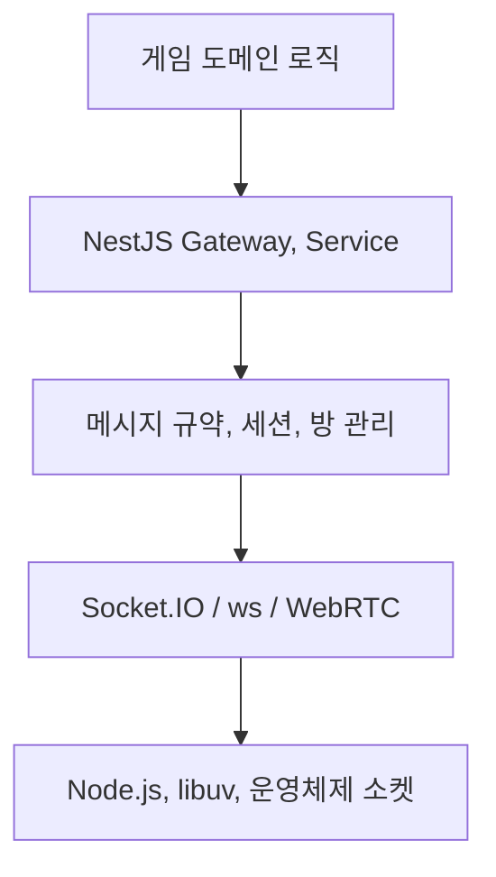
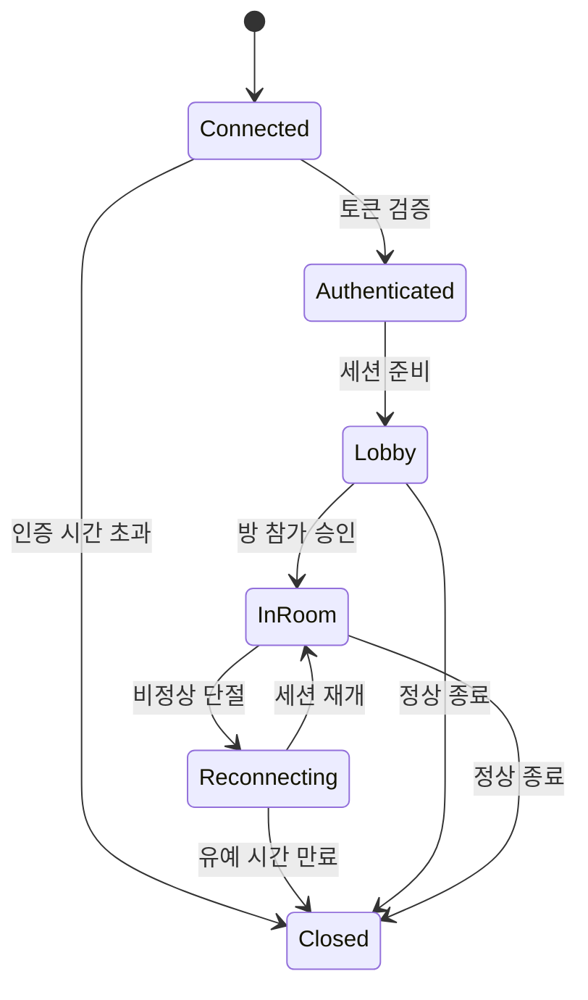
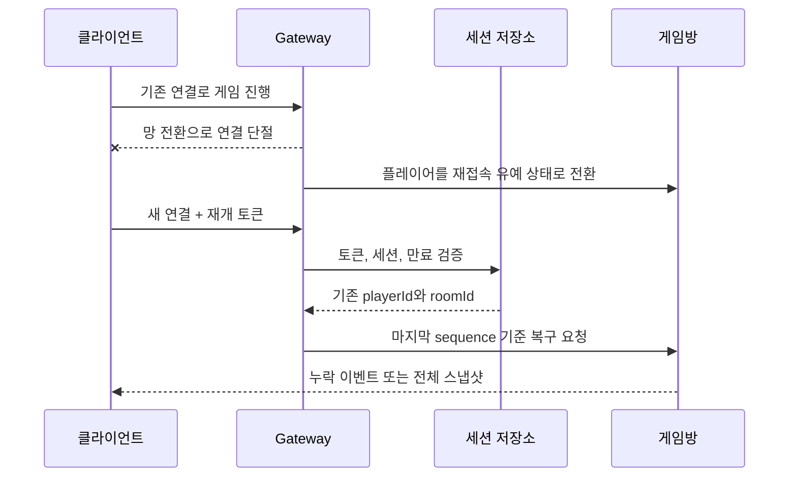
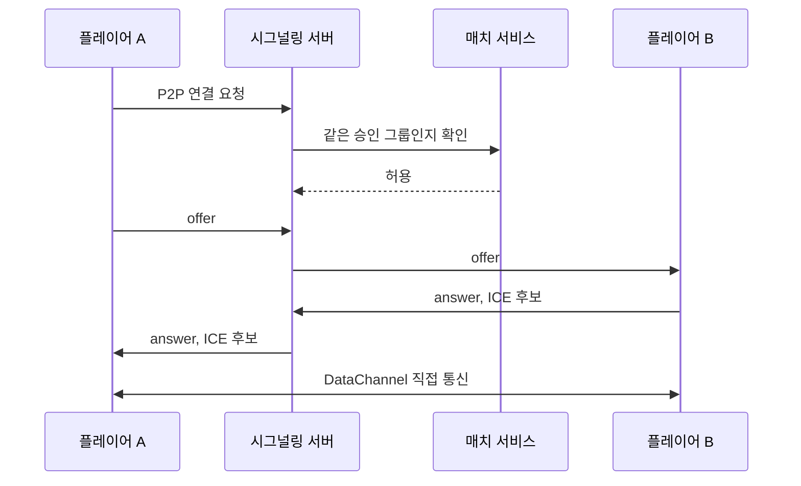
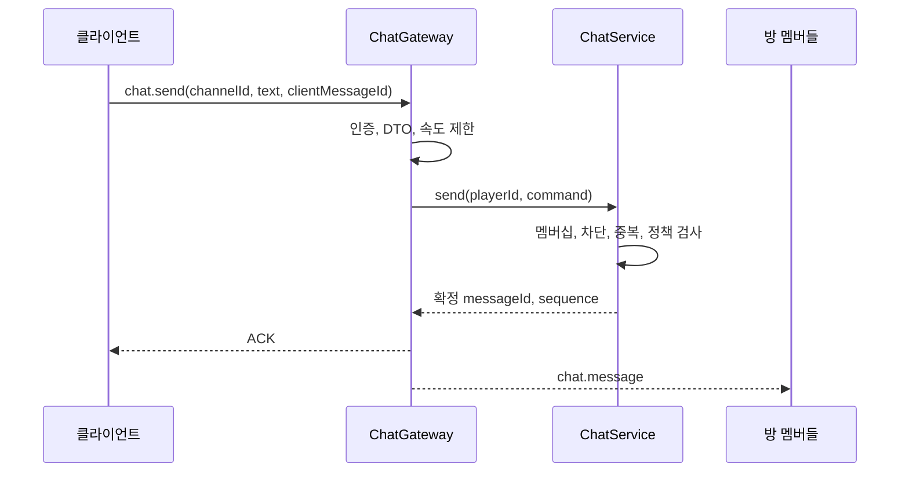
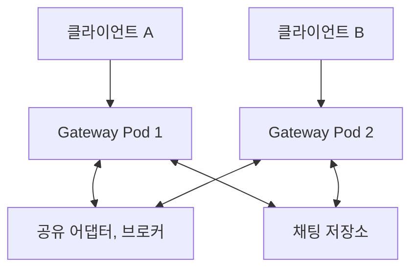
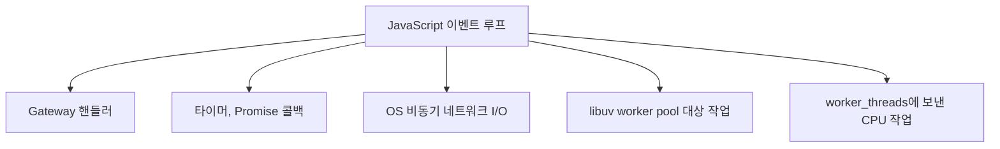
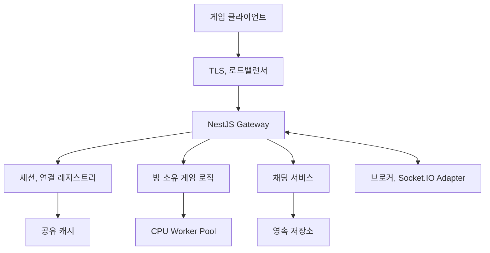

# 6장. 게임 네트워크 엔진 (Node.js/NestJS)

---

## 프라우드넷 개념, Node.js/NestJS 대응

해당 책의 프라우드넷은 여러 네트워크 기능을 하나의 제품 안에서 제공. Node.js에서 필요한 기능을 조합해 하나의 앱 네트워크 계층을 만든다

| 책 내용              | Node.js/NestJS                                 | 주의                                          |
| -------------------- | ---------------------------------------------- | --------------------------------------------- |
| 서버, 클라 연결      | `@nestjs/websockets`, Socket.IO, `ws`          | 연결과 인증은 별개                            |
| 메시지 전송          | `@SubscribeMessage()`, `emit()`, DTO           | 메시지 버전과 최대 크기를 정해야 함           |
| 원격 메서드 호출     | Socket.IO ACK, NestJS Microservices, gRPC      | 로컬 함수와 달리 timeout과 중복이 존재        |
| P2P 그룹             | WebRTC DataChannel + 시그널링 Gateway          | 그룹 생성과 상대 선택은 서버가 승인           |
| 망 전환 처리         | 재연결 + 세션 재개 토큰 + 상태 재동기화        | 새 소켓을 기존 플레이어 세션에 안전하게 연결  |
| 암호화               | HTTPS/WSS, WebRTC 보안 전송                    | TLS가 치트 방지까지 해주지 않음               |
| 압축, 직렬화         | Socket.IO 옵션, Protobuf, MessagePack          | 작은 실시간 메시지는 압축비용이 더 클 수 있음 |
| 스레드 처리          | 이벤트 루프, libuv, `worker_threads`, 여러 Pod | `async/await`가 새 스레드를 만드는 것은 아님  |
| 방 단위 브로드캐스트 | Socket.IO Room                                 | 여러 서버에 어댑터 또는 메시지 브로커가 필요  |
| 운영 관측            | 구조화 로그, 메트릭, 분산 추적                 | 연결 수뿐 아니라 큐와 이벤트 루프 지연도 본다 |

```text
프라우드넷 같은 통합 엔진 = 여러 네트워크 문제의 검증된 묶음
Node.js 구성 = 필요한 문제를 라이브러리와 앱 코드로 나눈
```

---

## 게임 서버, 네트워크 엔진

### 소켓만 사용할 때 직접 만들어야 하는 것

`node:net`이나 `node:dgram`은 바이트를 보내고 받는 저수준 기능을 제공. 실제 게임서비스에서 그 위에 더 많은 기능이 필요

- 연결 수명 주기와 종료 사유 관리
- 인증 전후의 메시지 허용 정책
- 메시지 경계와 직렬화
- 메시지 라우팅과 핸들러 호출
- 요청과 응답의 대응 관계
- timeout, 재시도, 중복 제거
- 방, 파티, 길드, 관심 영역 단위의 브로드캐스트
- 재접속과 상태 복구
- 암호화와 권한 검사
- 속도 제한과 비정상 트래픽 방어
- 네트워크 품질과 송신 큐 관측
- 여러 서버 인스턴스 사이의 메시지 전달

게임 네트워크 엔진은 이런 반복 작업을 공통 계층으로 제공. 게임 로직은 소켓 상태 대신 `move`, `attack`, `chat.send` 같은 도메인 메시지에 집중할 수 있다

### Node.js 계층 구조



각 계층은 섞지 않는 편이 좋다

| 계층     | 책임                                    | 넣지 말아야 할 것     |
| -------- | --------------------------------------- | --------------------- |
| 도메인   | 이동 가능 여부, 공격 판정, 보상 계산    | Socket 객체 직접 참조 |
| Gateway  | 연결, 인증 문맥, DTO 검증, 응답 변환    | 복잡한 게임 규칙      |
| 세션, 방 | 플레이어-소켓 연결, 멤버십, 재접속 유예 | DB 세부 쿼리          |
| 전송     | 프레임, ping/pong, 실제 송수신          | 게임 결과의 진실 판단 |
| 인프라   | 로드밸런싱, TLS 종료, 프로세스 배포     | 플레이어 행동 판정    |

도메인 서비스가 `Socket` 에 의존하면 단위 테스트가 어렵고, 전송 방식을 WebSocket에서 다른 프로토콜로 바꾸기도 어렵다. Gateway에서 네트워크 메시지를 도메인 명령으로 변환한 뒤 서비스에 넘기는 구조가 좋다

```ts
export interface MoveCommand {
  playerId: string;
  inputSequence: number;
  direction: { x: number; y: number };
  clientTick: number;
}
export interface MoveResult {
  accepted: boolean;
  serverTick: number;
  position: { x: number; y: number };
}
export abstract class GameRoomPort {
  abstract move(command: MoveCommand): MoveResult;
}
```

도메인 계층은 누가 메시지를 운반했는지 알 수 없다. Socket.IO Gateway, 테스트 코드, 내부 서버 호출 모두 같은 `GameRoomPort`를 사용할 수 있음

### 통합 엔진과 조합형 생태계 차이

| 항목            | 통합 게임 네트워크 엔진      | Node.js 구성                        |
| --------------- | ---------------------------- | ----------------------------------- |
| 속도            | 제공 기능 범위 안에서 빠르다 | 구성요소 선택과 통합이 필요         |
| 기능 일관성     | 하나의 API와 수명 주기       | 패키지마다 API와 보장 수준이 다르다 |
| 플랫폼 SDK      | 엔진이 제공하는 경우가 많음  | 클라이언트 플랫폼별 SDK를 따로 선택 |
| P2P, NAT 통과   | 내장된 경우가 있다           | WebRTC, STUN, TURN을 별도 구성      |
| 서버 프레임워크 | 제품 구조에 맞춰진다         | NestJS 모듈과 DI를 자유롭게 사용    |
| 운영            | 제품 기능에 일부 포함        | 재접속, 관측, 확장을 직접 설계      |
| 종속성          | 제품과 라이선스에 종속       | 여러 오픈 소스와 자체 코드에 종속   |

### 선택할 때 확인할 기준

1. 지원 클라이언트: 브라우저, Unity, Unreal, 모바일 네이티브 중 무엇인지

2. 필요한 전송 특성: 신뢰성, 순서 보장, 손실 허용 채널이 각각 필요한지

3. 동시 접속과 메시지 빈도: 연결 수뿐 아니라 초당 메시지와 바이트는 얼마인지

4. 서버 권위 수준: 위치, 전투, 경제 중 어디까지 서버가 판정하는 지

5. 재접속: 몇 초 동안 어떤 상태를 유지해야 하는지

6. P2P: 직접 연결 실패 시 TURN 비용을 감당할 수 있는지

7. 다중 인스턴스: 방의 소유권과 브로드캐스트를 어떻게 나눌 것인지

8. 관측성: 지연, 유실, 큐 적체, 연결 종료 원인을 볼 수 있는지

9. 보안 업데이트와 유지보수 주체가 명확한지

10. 클라이언트와 서버의 프로토콜 버전을 함께 운영할 수 있는지

---

## 개발 환경과 기본 모듈

### 권장 역할 분리

```text
src/
├─ main.ts
├─ game-network/
│  ├─ game-network.module.ts
│  ├─ game.gateway.ts
│  ├─ connection-registry.service.ts
│  ├─ session-resume.service.ts
│  ├─ room-membership.service.ts
│  ├─ protocol/
│  │  ├─ events.ts
│  │  ├─ envelope.ts
│  │  └─ dto/
│  └─ guards/
│     └─ ws-auth.guard.ts
├─ game-domain/
│  ├─ game-room.service.ts
│  └─ world.service.ts
└─ chat/
   ├─ chat.module.ts
   ├─ chat.gateway.ts
   └─ chat.service.ts
```

| 모듈            | 담당                           |
| --------------- | ------------------------------ |
| `game-network`  | 연결, 메시지 입출력, 세션 문맥 |
| `game-domain`   | 서버 권위 게임 규칙과 상태     |
| `chat`          | 채팅 정책, 금칙어, 저장 여부   |
| `matchmaking`   | 대기열과 게임방 배정           |
| `persistence`   | 플레이어 영속 데이터           |
| `observability` | 로그, 메트릭, 추적 문맥        |

### 기본 패키지의 역할

```bash
npm install @nestjs/websockets @nestjs/platform-socket.io socket.io
npm install class-validator class-transformer
```

- `@nestjs/websockets`: Gateway, 메시지 데코레이터, WebSocket 예외 기능
- `@nestjs/platform-socket.io`: NestJS 기본 Socket.IO 어댑터
- `socket.io` : 방, ACK, 재연결 지원이 있는 상위 실시간 프로토콜
- `class-validator`: 외부 메시지의 구조와 범위 검증
- `class-transformer`: 평범한 객체를 DTO 인스턴스로 변환

`ws`를 사용하려면 `@nestjs/platform-ws`를 선택할 수 있음. 다만 Socket.IO와 순수 WebSocket은 서로 같은 프로토콜이 아님. Socket.IO 클라이언트로 순수 `ws`서버에 접속할 수 없고, 반대도 마찬가지다

### Socket.IO / ws 기준

| 기준              | Socket.IO                 | ws                           |
| ----------------- | ------------------------- | ---------------------------- |
| 추상화            | 높음                      | 낮음                         |
| 방과 브로드캐스트 | 내장                      | 직접 구현                    |
| ACK               | 내장                      | 직접 규약 정의               |
| 자동 재연결       | 클라이언트 기능 제공      | 직접 구현                    |
| 전송 프로토콜     | Socket.IO 프로토콜        | 표준 WebSocket               |
| 메시지 오버헤드   | 상대적으로 크다           | 상대적으로 작다              |
| 프레임            | 제한적                    | 더 직접적                    |
| 상황              | 로비, 채팅, 캐주얼 실시간 | 단순, 고성능 커스텀 프로토콜 |

Socket.IO는 UDP가 아님. WebSocket 전송을 사용할 때 일반적으로 TCP에서 동작한다. `volatile` 메시지를 사용해 앱 수준에서 오래된 메시지를 버릴 수는 있으나, 이것이 UDP 전송으로 바뀌는 것은 아님

### Gateway 등록

Gateway는 NestJS Provider다. 모듈의 `providers`에 등록되어야 생성된다

```ts
// game-network.module.ts
import { Module } from "@nestjs/common";
import { GameGateway } from "./game.gateway";
import { ConnectionRegistry } from "./connection-registry.service";
import { SessionResumeService } from "./session-resume.service";
import { GameRoomService } from "../game-domain/game-room.service";
@Module({
  providers: [
    GameGateway,
    ConnectionRegistry,
    SessionResumeService,
    GameRoomService,
  ],
  exports: [ConnectionRegistry],
})
export class GameNetworkModule {}
```

```ts
// app.module.ts
import { Module } from "@nestjs/common";
import { GameNetworkModule } from "./game-network/game-network.module";
@Module({
  imports: [GameNetworkModule],
})
export class AppModule {}
```

```ts
// main.ts
import { ValidationPipe } from "@nestjs/common";
import { NestFactory } from "@nestjs/core";
import { AppModule } from "./app.module";
async function bootstrap() {
  const app = await NestFactory.create(AppModule);
  app.useGlobalPipes(
    new ValidationPipe({
      transform: true,
      whitelist: true,
      forbidNonWhitelisted: true,
    }),
  );
  await app.listen(Number(process.env.PORT ?? 3000), "0.0.0.0");
}
void bootstrap();
```

HTTP 전역 파이프 설정이 모든 WebSocket 어댑터와 상황에서 기대한 방식으로 적용되는지 확인.

### 이벤트 이름을 상수로 관리

문자열 이벤트 이름이 여러 파일에 흩어지면 오타와 버전 관리가 어렵다

```ts
export const ClientEvent = {
  Authenticate: "session.authenticate",
  Resume: "session.resume",
  JoinRoom: "room.join",
  Move: "game.move",
  ChatSend: "chat.send",
  SignalOffer: "p2p.offer",
  SignalAnswer: "p2p.answer",
  SignalIce: "p2p.ice",
} as const;
export const ServerEvent = {
  Ready: "session.ready",
  Snapshot: "game.snapshot",
  PlayerMoved: "game.player-moved",
  ChatMessage: "chat.message",
  Error: "protocol.error",
} as const;
```

상수와 DTO, 스키마를 별도 패키지로 분리해 서버와 TS 클라이언트가 같은 계약을 사용하게 할 수 있다. 공유 패키지는 프로토콜 계약을 공유하는 장소로 한다

---

## 게임 클라이언트-서버 간 통신

### 연결은 곧 로그인을 뜻하는게 아님

TCP 또는 WebSocket 연결이 수립됐다는 것은 통신 경로가 생겼다는 뜻이다. 해당 소켓이 어떤 플레이어인지 신뢰할 수 없음

일반적인 상태



상태별 허용 메시지를 제한

| 연결 상태       | 예                            |
| --------------- | ----------------------------- |
| `CONNECTED`     | 인증, 버전                    |
| `AUTHENTICATED` | 로비 조회, 매치 참가          |
| `IN_ROOM`       | 입력, 채팅, 준비 상태         |
| `PLAYING`       | 게임 입력, 필요한 게임 이벤트 |
| `RECONNECTING`  | 새 소켓에서 재개 요청         |
| `CLOSED`        | 없음                          |

인증 전 소켓이 `game.attack`을 보내면 핸들러가 있어도 거부해야 한다

### 연결 레지스트리

`socket.id`는 연결의 식별자이지 플레이어 영구 식별자가 아니다. 재접속하면 달라질 수 있다. 서버는 다음 식별자를 구분한다

| 식별자         | 수명                       | 용도                     |
| -------------- | -------------------------- | ------------------------ |
| `socketId`     | 현재 연결 동안             | 전송 대상 지정           |
| `connectionId` | 한 연결 시도 동안          | 로그와 추적              |
| `sessionId`    | 로그인 또는 게임 세션 동안 | 재접속 복구              |
| `playerId`     | 계정 수명 동안             | 게임 데이터 소유         |
| `roomId`       | 게임방 수명 동안           | 상태와 브로드캐스트 범위 |

```ts
import { Injectable } from "@nestjs/common";
import type { Socket } from "socket.io";
export type ConnectionState =
  | "CONNECTED"
  | "AUTHENTICATED"
  | "IN_ROOM"
  | "PLAYING"
  | "CLOSED";
export interface GameSocketData {
  connectionId: string;
  state: ConnectionState;
  playerId?: string;
  sessionId?: string;
  roomId?: string;
}
export type GameSocket = Socket<
  Record<string, (...args: any[]) => void>,
  Record<string, (...args: any[]) => void>,
  Record<string, never>,
  GameSocketData
>;
@Injectable()
export class ConnectionRegistry {
  private readonly byPlayer = new Map<string, GameSocket>();
  attach(playerId: string, socket: GameSocket): GameSocket | undefined {
    const previous = this.byPlayer.get(playerId);
    this.byPlayer.set(playerId, socket);
    return previous;
  }
  detachIfCurrent(playerId: string, socketId: string): void {
    const current = this.byPlayer.get(playerId);
    if (current?.id === socketId) {
      this.byPlayer.delete(playerId);
    }
  }
  get(playerId: string): GameSocket | undefined {
    return this.byPlayer.get(playerId);
  }
}
```

`detachIfCurrent`가 재접속 경쟁이다. 새 소켓이 먼저 등록된 뒤 예전 소켓의 `disconnect` 이벤트가 늦게 도착할 수 있다. 단순히 `delete(playerId)` 를 호출하면 새 연결까지 레지스트리에서 지워버린다

### 연결과 인증 처리

```ts
import { randomUUID } from "node:crypto";
import {
  ConnectedSocket,
  MessageBody,
  OnGatewayConnection,
  OnGatewayDisconnect,
  SubscribeMessage,
  WebSocketGateway,
  WsException,
} from "@nestjs/websockets";
interface AuthenticateDto {
  accessToken: string;
  protocolVersion: number;
}
@WebSocketGateway({
  namespace: "/game",
  transports: ["websocket"],
  maxHttpBufferSize: 64 * 1024,
})
export class GameGateway implements OnGatewayConnection, OnGatewayDisconnect {
  constructor(
    private readonly authService: AuthService,
    private readonly connections: ConnectionRegistry,
  ) {}
  handleConnection(client: GameSocket): void {
    client.data.connectionId = randomUUID();
    client.data.state = "CONNECTED";
    const authenticationTimer = setTimeout(() => {
      if (client.data.state === "CONNECTED") {
        client.disconnect(true);
      }
    }, 5_000);
    client.once("disconnect", () => clearTimeout(authenticationTimer));
  }
  @SubscribeMessage("session.authenticate")
  async authenticate(
    @ConnectedSocket() client: GameSocket,
    @MessageBody() dto: AuthenticateDto,
  ) {
    if (client.data.state !== "CONNECTED") {
      throw new WsException("INVALID_CONNECTION_STATE");
    }
    if (dto.protocolVersion !== 1) {
      throw new WsException("UNSUPPORTED_PROTOCOL_VERSION");
    }
    const identity = await this.authService.verifyAccessToken(dto.accessToken);
    const previous = this.connections.attach(identity.playerId, client);
    client.data.playerId = identity.playerId;
    client.data.sessionId = identity.sessionId;
    client.data.state = "AUTHENTICATED";
    // 한 계정에 한 연결만 허용
    if (previous && previous.id !== client.id) {
      previous.emit("session.replaced");
      previous.disconnect(true);
    }
    await client.join(`player:${identity.playerId}`);
    return {
      ok: true,
      playerId: identity.playerId,
      serverTime: Date.now(),
    };
  }
  handleDisconnect(client: GameSocket): void {
    const { playerId } = client.data;
    client.data.state = "CLOSED";
    if (playerId) {
      this.connections.detachIfCurrent(playerId, client.id);
    }
  }
}
```

구조를 보여주기 위한 것, Gateway handler에 토큰 문자열을 그대로 넘기는 것보다 연결 미들웨어 또는 WebSocket Guard를 사용할 수 있다

- 토큰의 서명, 만료, 발급 대상, 폐기 여부를 검증
- 클라이언트가 보낸 `playerId`로 신원을 결정하지 않음
- 프로토콜 버전을 초기에 협상
- 인증이 오래 걸리는 연결에는 timeout
- 토큰과 전체 handshake 헤더를 로그에 남기지 않음

### 게임방 참가

Socket.IO Room은 메시지 전달 그룹. 게임방의 도메인 서비스가 관리해야 한다. `client.join(roomId)`가 성공해서 게임 규칙상 참가가 승인된 것은 아님

```ts
interface JoinRoomDto {
  roomId: string;
}
@SubscribeMessage('room.join')
async joinRoom(
  @ConnectedSocket() client: GameSocket,
  @MessageBody() dto: JoinRoomDto,
) {
  if (client.data.state !== 'AUTHENTICATED') {
    throw new WsException('AUTHENTICATION_REQUIRED');
  }
  const playerId = client.data.playerId!;
  const result = await this.roomService.join(dto.roomId, playerId);
  if (!result.accepted) {
    throw new WsException(result.reason);
  }
  await client.join(`game:${dto.roomId}`);
  client.data.roomId = dto.roomId;
  client.data.state = 'IN_ROOM';
  return {
    ok: true,
    roomId: dto.roomId,
    snapshot: result.snapshot,
  }
}
```

`도메인 참가 승인 -> 전송 그룹 -> 상태 응답` 중간 실패가 가능한 작업이면 보상처리도 필요하다. 방 참가 후 응답 전에 연결이 끊기면 어떻게 할지 방향을 정한다

### 연결 종료를 정상 흐름으로 보기

연결 종료는 오류가 아님

| 종료              | 서버 대응                        |
| ----------------- | -------------------------------- |
| 사용자가 로그아웃 | 즉시 세션과 방 정리              |
| 백그라운드로      | 짧은 재접속 유예 가능            |
| 네트워크 단절     | 플레이어 상태를 유예 상태 전환   |
| 중복 로그인       | 기존 연결 종료 또는 새 연결 거부 |
| 인증 실패         | 이유를 제한적으로 종료           |
| 프로토콜 위반     | 기록, 속도 제한, 연결 종료       |
| 배포              | 새 연결 차단 후 재연결 유도      |

`disconnect` 직후 캐릭터를 월드에서 삭제하면 모바일 사용자는 짧은 망 전환만으로 게임에서 탈락. 재접속 유예 시간과 만료 처리를 정해야 한다

### heartbeat, 게임 상태 확인

Socket.IO 자체 ping/pong은 전송 연결의 생존 여부를 확인. 게임 로직은 필요하면 별도 메시지로 다음을 확인

- 클라이언트가 마지막으로 적용한 `serverSequence`
- 클라이언트가 관측한 RTT
- 마지막 입력 번호
- 현재 화면 또는 로딩 상태

heartbeat 메시지를 보내는 사실만으로 게임 로직이 정상이라고 판단하면 안 된다. 네트워크 연결 생존, 세션 인증, 게임 상태 진행은 다른 상태다

---

## 메시지 주고받기

### 메시지를 목적별로 구분

| 종류     | 방향               | 의미                  | 예                              |
| -------- | ------------------ | --------------------- | ------------------------------- |
| Command  | 클라이언트 -> 서버 | 무엇을 해달라는 의도  | `game.move`, `item.buy`         |
| Event    | 서버 -> 클라이언트 | 이미 일어난 사실      | `player.died`, `item.purchased` |
| Query    | 클라이언트 -> 서버 | 정보 조회             | `profile.get`                   |
| Response | 서버 -> 요청자     | 요청 결과             | 성공, 실패 코드, 현재 상태      |
| Snapshot | 서버 -> 클라이언트 | 특정 tick의 권위 상태 | 플레이어 위치 묶음              |
| Signal   | 양방향 또는 중계   | 연결 제어 정보        | P2P offer, ICE candidate        |

클라이언트가 `player.died` 이벤트를 서버로 보내 게임 결과를 결정하게 해서는 안된다

클라이언트는 공격 의도나 입력을 보낸 뒤, 서버가 판정한 뒤 `player.died` 이벤트를 배포

### 메시지 봉투

모든 메시지에 거대한 공통 헤더가 필요하진 않으나, 운영과 호환성을 위해 다음 필드를 선택적으로 사용할 수 있다

```ts
export interface MessageEnvelope<T> {
  protocolVersion: number;
  type: string;
  requestId?: string;
  sequence?: number;
  clientTick?: number;
  serverTick?: number;
  sentAt?: number;
  payload: T;
}
```

| 필드              | 목적                          |
| ----------------- | ----------------------------- |
| `protocolVersion` | 호환되지 않은 클라이언트 구분 |
| `type`            | 메시지 라우팅                 |
| `requestId`       | 요청과 응답 대응, 중복 제거   |
| `sequence`        | 순서, 중복, 오래된 입력 확인  |
| `clientTick`      | 입력이 생성된 클라이언트 참고 |
| `serverTick`      | 서버 권위 상태 기준           |
| `sentAt`          | 관측과 디버깅용 시각          |
| `payload`         | 실제 도메인 데이터            |

Socket.IO는 이벤트 이름을 별도로 전달 `type`을 payload 안에 중복해서 넣지 않을 수 있음

### DTO 검증

TS 타입은 컴파일할 때 존재. 네트워크로 들어온 값은 검증해야 한다

```ts
import { Type } from "class-transformer";
import { IsInt, IsNumber, Max, Min, ValidateNested } from "class-validator";
class DirectionDto {
  @IsNumber()
  @Min(-1)
  @Max(1)
  x!: number;
  @IsNumber()
  @Min(-1)
  @Max(1)
  y!: number;
}
export class MoveDto {
  @IsInt()
  @Min(0)
  inputSequence!: number;
  @IsInt()
  @Min(0)
  clientTick!: number;
  @ValidateNested()
  @Type(() => DirectionDto)
  direction!: DirectionDto;
}
```

```ts
import { UsePipes, ValidationPipe } from '@nestjs/common';
@UsePipes(
  new ValidationPipe({
    transform: true,
    whitelist: true,
    forbidNonWhitelisted: true,
  }),
)
@SubscribeMessage('game.move')
handleMove(
  @ConnectedSocket() client: GameSocket,
  @MessageBody() dto: MoveDto,
) {
  if (client.data.state !== 'PLAYING') {
    throw new WsException('NOT_PLAYING');
  }
  return this.roomService.move({
    playerId: client.data.playerId!,
    inputSequence: dto.inputSequence,
    clientTick: dto.clientTick,
    direction: dto.direction,
  });
}
```

DTO 검증은 형식 검증. 실제 이동 가능성은 도메인 검증이 맡음

### ACK, 도메인 이벤트

ACK는 요청자에게 처리 결과를 돌려주는데 적합. 별도 이벤트로 배포

```ts
@SubscribeMessage('player.ready')
setReady(
  @ConnectedSocket() client: GameSocket,
  @MessageBody() body: { ready: boolean },
) {
  const result = this.roomService.setReady(
    client.data.roomId!,
    client.data.playerId!,
    body.ready,
  );
  // 요청자에게 ACK 결과를 반환
  if (!result.accepted) {
    return { ok: false, code: result.reason };
  }
  // 방에는 확정된 사실 전달
  this.server
    .to(`game:${client.data.roomId}`)
    .emit('player.ready-changed', result.event);
  return { ok: true, revision: result.event.revision };
}
```

ACK가 오지 않는 상황을 고려해 timeout을 둔다. 응답이 의미하는 완료 수준을 API 계약에 적는다

### 순서와 중복

TCP는 연결 안에 바이트 순서를 보장, 앱 전체 처리 순서를 자동으로 보장하지 않음

```ts
@SubscribeMessage('inventory.use-item')
async useItem(
  @ConnectedSocket() client: GameSocket,
  @MessageBody() dto: UseItemDto,
) {
  // 요청이 연속 도착해 아래 await에서 다른 핸들러가 실행될 수 있다
  const item = await this.inventoryRepository.find(dto.itemId);
  return this.inventoryService.use(client.data.playerId!, item, dto.requestId);
}
```

Node.js 한 이벤트 루프에서 첫 요청이 `await`에서 양보하면 두 번째 요청이 끼어들 수 있다

인벤토리, 거래, 보상처럼 순서와 원자성이 중요한 처리는 DB 트랜잭션, 엔티티, 멱등성 키 등을 사용

```ts
interface ProcessedRequest<T> {
  requestId: string;
  result: T;
  expiresAt: number;
}
// 같은 requestId가 이미 처리한 결과를 반환하는 개념
async function executeIdempotently<T>(
  playerId: string,
  requestId: string,
  action: () => Promise<T>,
): Promise<T> {
  const cached = await requestStore.find(playerId, requestId);
  if (cached) {
    return cached.result as T;
  }
  const result = await action();
  await requestStore.save(playerId, requestId, result);
  return result;
}
```

위 코드는 `find`, `save` 사이 경쟁을 완전히 막지 못한다. 구현은 requestId에 고유 제약을 두거나 비즈니스 변경, 멱등성 기록을 같은 트랜잭션에 처리한다

### 신뢰성 등급을 메시지별로 정하기

| 메시지            | 유실             | 오래된 값 가치 | 일반적인 처리                |
| ----------------- | ---------------- | -------------- | ---------------------------- |
| 결제, 아이템 구매 | 불가             | 높음           | ACK, 멱등성, 트랜잭션        |
| 매치 시작         | 거의 불가        | 높음           | 상태 재조회                  |
| 공격 입력         | 장르에 따라 다름 | 중간           | sequence, 서버 판정          |
| 최신 위치 스냅샷  | 일부 가능        | 낮음           | 다음 스냅샷이 이전 값을 대체 |
| 조준 방향         | 일부 가능        | 매우 낮음      | 최신 우선                    |
| 채팅              | 보통 불가        | 높음           | 메시지 ID, 전송결과          |

Socket.IO에서 최신 상태형 메시지 `volatile` 전송을 고려.

```ts
this.server.to(`game:${roomId}`).volatile.emit("game.snapshot", snapshot);
```

코드는 혼잡하거나 연결이 준비되지 않은 상황에 메시지가 버려질 수 있음을 허용

### 프로토콜 버전 전략

서버와 모든 클라이언트를 교체할 수 없어 호환 구간이 필요

- 필드를 추가할 때 기존 클라이언트가 무시할 수 있게 한다
- 필드 의미를 바꾸기보다 새 필드 또는 새 이벤트를 만든다
- 삭제는 지원 중인 가장 오래된 클라이언트가 사라진 뒤 진행
- 로그인 시 최소, 최대 지원 프로토콜 버전을 검사
- 서버 로그와 메트릭에 프로토콜 버전을 태그
- 강제 업데이트와 선택 업데이트 정책을 구분

```ts
const MIN_PROTOCOL_VERSION = 3;
const MAX_PROTOCOL_VERSION = 5;
function assertSupportedProtocol(version: number): void {
  if (version < MIN_PROTOCOL_VERSION || version > MAX_PROTOCOL_VERSION) {
    throw new WsException({
      code: "UNSUPPORTED_PROTOCOL_VERSION",
      min: MIN_PROTOCOL_VERSION,
      max: MAX_PROTOCOL_VERSION,
    });
  }
}
```

### 크기 제한과 역압력

파싱 전 전송 계층 최대 메시지 크기를 제한, 파싱 뒤에 필드의 크기를 다시 검사

```ts
@WebSocketGateway({
  maxHttpBufferSize: 64 * 1024,
})
export class GameGateway {}
```

관측해야 할 항목은 다음과 같음

- 연결별 초당 메시지 수와 바이트 수
- 이벤트 종류별 payload 크기 분포
- 직렬화, 역직렬화
- 송신 큐 크기, 오래된 스냅샷 폐기 수
- ACK timeout 비율
- 프로토콜 검증 실패 코드

---

## 와이파이, 셀룰러 연결 핸드오버 기능

### 핸드오버를 앱 관점에서 보기

Wi-Fi에 셀룰러로 바뀌면 IP 주소와 네트워크 경로가 달라질 수 있음. 기존 TCP/WebSocket 연결이 그대로 유지된다고 가정할 수 없음.



소켓 연결을 복구하는 것과 게임 세션을 복구하는 것을 구분하는 것이다. 실제로는 새 소켓이 만들어질 수 있다. 서버는 검증된 재개 토큰을 이용해 새 연결을 기존 플레이어 세션에 연결한다

### 재접속 상태에 보관할 정보

```ts
export interface ResumeSession {
  sessionId: string;
  playerId: string;
  roomId?: string;
  lastServerSequence: number;
  lastInputSequence: number;
  protocolVersion: number;
  status: "ACTIVE" | "RECONNECTION" | "CLOSED";
  reconnectDeadline: number;
}
```

| 정보                 | 이유                      |
| -------------------- | ------------------------- |
| `sessionId`          | 재개할 세션 식별          |
| `playerId`           | 계정과 연결               |
| `roomId`             | 게임방으로 복귀           |
| `lastServerSequence` | 누락된 서버 이벤트 판단   |
| `lastInputSequence`  | 재전송된 입력의 중복 판단 |
| `protocolVersion`    | 복구 메시지 호환성 확인   |
| `reconnectDeadline`  | 유령 세션 정리            |

일회성 또는 짧은 수명의 토큰 사용, 필요 서버에는 해시나 토큰 식별자만 저장

### 복구 수준 세 가지

| 방식             | 장점               | 단점                          | 상황                   |
| ---------------- | ------------------ | ----------------------------- | ---------------------- |
| 연결 재수립      | 단순               | 방과 게임 상태를 다시 구성    | 로비, 비실시간 화면    |
| 누락 이벤트 재생 | 전송량이 작음      | 이벤트 보관, 순서 관리가 필요 | 짧은 단절, 이벤트 소싱 |
| 스냅샷 재동기화  | 구현과 검증이 명확 | 스냅샷이 클 수 있음           | 액션 게임, 복구 실패   |

실무에서 혼합

1. 단절 시간이 짧고 이벤트 로그가 남아 있으면 누락분을 보냄

2. 로그 범위를 벗어나거나 상태 검증에 실패하면 전체 스냅샷을 보낸다

3. 세션 유예 시간이 끝났으면 재접속이 아니라 새 입장 절차를 밟는다

### 앱 세션 재개

```ts
import { Injectable } from "@nestjs/common";
interface ResumeRequest {
  resumeToken: string;
  lastReceivedServerSequence: number;
}
interface ResumeResult {
  playerId: string;
  sessionId: string;
  roomId?: string;
  mode: "DELTA" | "SNAPSHOT";
  events?: unknown[];
  snapshot?: unknown;
}
@Injectable()
export class SessionResumeService {
  constructor(
    private readonly tokens: ResumeTokenService,
    private readonly sessions: SessionStore,
    private readonly rooms: GameRoomService,
  ) {}
  async resume(request: ResumeRequest): Promise<ResumeResult> {
    const claims = await this.tokens.verifyAndConsume(request.resumeToken);
    const session = await this.sessions.get(claims.sessionId);
    if (!session || session.playerId !== claims.playerId) {
      throw new Error("INVALID_RESUME_SESSION");
    }
    if (session.reconnectDeadline < Date.now()) {
      throw new Error("RESUME_WINDOW_EXPIRED");
    }
    if (!session.roomId) {
      return {
        playerId: session.playerId,
        sessionId: session.sessionId,
        mode: "SNAPSHOT",
        snapshot: await this.sessions.getLobbyState(session.playerId),
      };
    }
    const recovery = this.rooms.buildRecovery(
      session.roomId,
      request.lastReceivedServerSequence,
    );
    return {
      playerId: session.playerId,
      sessionId: session.sessionId,
      roomId: session.roomId,
      ...recovery,
    };
  }
}
```

```ts
@SubscribeMessage('session.resume')
async resume(
  @ConnectedSocket() client: GameSocket,
  @MessageBody() dto: ResumeDto,
) {
  if (client.data.state !== 'CONNECTED') {
    throw new WsException('INVALID_CONNECTION_STATE');
  }
  const result = await this.sessionResume.resume(dto);
  const previous = this.connections.attach(result.playerId, client);
  client.data.playerId = result.playerId;
  client.data.sessionId = result.sessionId;
  client.data.roomId = result.roomId;
  client.data.state = result.roomId ? 'IN_ROOM' : 'AUTHENTICATED';
  if (result.roomId) {
    await client.join(`game:${result.roomId}`);
  }
  if (previous && previous.id !== client.id) {
    previous.disconnect(true);
  }
  return {
    ok: true,
    mode: result.mode,
    events: result.events,
    snapshot: result.snapshot,
  };
}
```

`verifyAndConsume` 은 토큰 재사용을 막는 개념을 나타냄. 서버가 실행되면 메모리 `Map`만으로 충분하지 않다

### Socket.IO 연결 상태 복구

Socket.IO에 일시적 연결 끊김 뒤 `socket.id`, room, `socket.data`, 누락 패킷 복구를 시도하는 connection state recovery 기능

```ts
@WebSocketGateway({
  connectionStateRecovery: {
    maxDisconnectionDuration: 20_000,
    skipMiddlewares: false,
  },
})
export class GameGateway implements OnGatewayConnection {
  handleConnection(client: GameSocket): void {
    if (client.recovered) {
      // 전송 계층 복구 성공. 게임 세션 유효성을 다시 확인
      return;
    }
    // 최초 연결, 자동 복구가 불가능
    client.data.state = "CONNECTED";
  }
}
```

자동 복구는 편리하나 게임 세션 복구의 유일한 수단으로 생각하면 안된다

- 모든 단절이 복구 가능한 것은 아님
- 어댑터 종류에 따라 누락 패킷 보존 지원이 다름
- 복구 중 계정 정지, 방 종료, 매치 결과 확정이 일어날 수 있음
- middleware 생략은 최신 권한 검사를 건너뛸 위험이 있음
- 긴 단절은 전체 스냅샷 복구가 더 안전

`client.recovered === false` 일 때 사용할 앱 재동기화 경로를 반드시 둔다

### 핸드오버 보안 체크

- `socket.id` 만으로 기존 세션을 복구하지 않음
- 재개 토큰에 짧은 만료 시간과 목적을 둔다
- 토큰의 `playerId`, `sessionId`, `matchId` 를 서버 상태와 대조
- 가능하면 성공한 재개 토큰을 폐기하고 새 토큰을 발급
- 같은 세션에 두 연결이 경쟁할 때 승자 정책을 정한다
- 재접속했다고 이미 종료된 매치를 되살리지 않는다
- 복구 응답 전 최신 차단, 정지, 로그아웃 상태를 확인
- 과도한 재접속 시도에 계정과 IP 제한을 둔다

---

## 원격 메서드 호출

### RPC는 로컬 함수 호출이 아님

원격 메서드 호출은 다른 프로세스나 장치의 기능을 함수처럼 호출하는 추상화다. 문법이 함수처럼 보여도 실패 모델은 완전히 다르다

| 로컬 함수                   | 원격 호출                                  |
| --------------------------- | ------------------------------------------ |
| 프로세스 안에서 실행        | 네트워크 건너편에서 실행                   |
| 보통 매우 빠름              | 직렬화와 네트워크 지연 포함                |
| 예외, 반환                  | 응답 유실과 timeout 가능                   |
| 한 번 호출, 보통 한 번 실행 | 재시도로 중복 실행 가능                    |
| 타입을 같은 런타임 확인     | 계약과 버전이 달라질 수 있음               |
| 호출자 종료와 실행이 밀접   | 호출자가 끊겨도 원격 작업은 계속될 수 있음 |

> timeout이 발생했을 때 원격 메서드가 실행되지 않은 것인지, 실행 중인 것인지, 응답만 유실된 것인지

호출자만으로 알 수 없음. 중요한 RPC에 requestId, 멱등성 설계가 필요

### 클라이언트-서버 RPC: 이벤트, ACK

Socket.IO의 ACK를 사용하면 클라이언트가 서버 메시지 처리 결과를 받을 수 있음

```ts
socket
  .timeout(1_000)
  .emit(
    "match.ready",
    { requestId, ready: true },
    (error: Error | null, response: ReadyResponse) => {
      if (error) {
        // 결과를 모름. 상태 조회 또는 같은 requestId로 제한적 재시도
        return;
      }
      updateReadyUi(response);
    },
  );
```

```ts
// 서버
@SubscribeMessage('match.ready')
async ready(
  @ConnectedSocket() client: GameSocket,
  @MessageBody() dto: ReadyDto,
) {
  const result = await this.readyService.setReady({
    playerId: client.data.playerId!,
    matchId: dto.matchId,
    ready: dto.ready,
    requestId: dto.requestId,
  });
  return { ok: true, revision: result.revision };
}
```

### 서버 간 RPC: NestJS Microservices

NestJS Microservices는 여러 transporter에 요청-응답과 이벤트 기반 메시지를 추상화한다

Gateway가 매치 할당 서비스에 요청한다고 생각해보자

```ts
// allocation.controller.ts - 원격 서비스
import { Controller } from "@nestjs/common";
import { MessagePattern, Payload } from "@nestjs/microservices";
interface AllocateMatchRequest {
  requestId: string;
  region: string;
  playerIds: string[];
}
@Controller()
export class AllocationController {
  constructor(private readonly allocator: MatchAllocator) {}
  @MessagePattern("match.allocate.v1")
  allocate(@Payload() request: AllocateMatchRequest) {
    return this.allocator.allocateIdempotently(request);
  }
}
```

```ts
// 호출 서비스
import { Inject, Injectable } from "@nestjs/common";
import { ClientProxy } from "@nestjs/microservices";
import { firstValueFrom, timeout } from "rxjs";
@Injectable()
export class MatchAllocationClient {
  constructor(
    @Inject("MATCH_ALLOCATOR") private readonly client: ClientProxy,
  ) {}
  allocate(request: AllocateMatchRequest): Promise<AllocateMatchResponse> {
    return firstValueFrom(
      this.client
        .send<AllocateMatchResponse>("match.allocate.v1", request)
        .pipe(timeout(800)),
    );
  }
}
```

timeout은 서비스 목표, 평상시 지연 분포, deadline을 기준으로 정하고 기계적으로 재시도하면 부하가 몰린 서비스에 추가 부하를 만들어 장애를 증폭할 수 있음

### 요청-응답과 이벤트 비교

| 기준                      | 요청-응답 RPC             | 이벤트                     |
| ------------------------- | ------------------------- | -------------------------- |
| 호출자가 결과를 즉시 필요 | 적합                      | 부적합할 수 있음           |
| 생산자와 소비자 결합      | 높음                      | 낮음                       |
| timeout                   | 필수                      | 보통 소비자와 별개         |
| 여러 소비자               | 추가 조정 필요            | 자연스러움                 |
| 예                        | 방 배정 요청, 소유권 조회 | 매치 종료, 통계 수집, 알림 |

필요한 데이터는 방 소유 프로세스에 함께 두고, 비핵심 작업은 이벤트로 분리

### RPC 계약에 포함

```ts
export interface RpcRequest<T> {
  requestId: string;
  traceId: string;
  deadlineAt: number;
  caller: string;
  payload: T;
}
export type RpcResponse<T> =
  | { ok: true; value: T }
  | { ok: false; code: string; retryable: boolean; message?: string };
```

- `requestId`: 중복 제거와 결과 조회
- `traceId`: 여러 서비스를 거친 요청 추적
- `deadlineAt`: 이미 의미가 없어진 작업 중단 판단
- 명시적 오류 코드: 호출자의 재시도와 사용자 메시지 결정
- 버전이 포함된 pattern 또는 스키마: 호환성 관리

### 재시도 규칙

| 작업                  | 재시도                     | 이유                  |
| --------------------- | -------------------------- | --------------------- |
| 조회                  | 제한적으로 가능            | 보통 멱등적           |
| 같은 값으로 상태 설정 | requestId와 함께 가능      | 멱등하게 설계 가능    |
| 재화 차감             | 조건 없이 금지             | 중복 실행 위험        |
| 보상 지급             | 멱등성 키                  | 중복 보상 위험        |
| 채팅 전송             | 메시지 ID가 있을 때 제한적 | 중복 메시지 표시 방지 |

재시도에 최대 횟수, 지수 backoff를 둔다.

---

## 클라이언트끼리 P2P 통신

### P2P, 서버 중계

P2P는 클라이언트끼리 직접 데이터를 주고받는 구조, 서버 비교

| 항목               | 서버                           | P2P 직접 연결                     |
| ------------------ | ------------------------------ | --------------------------------- |
| 서버 부하          | 큼                             | 줄일 수 있음                      |
| 중앙 판정          | 쉬움                           | 별도 서버가 여전히 필요할 수 있음 |
| NAT, 방화벽 대응   | 클라이언트는 서버만 접속       | STUN/TURN과 연결 협상 필요        |
| 클라이언트 IP 노출 | 다른 플레이어에게 숨길 수 있음 | 피어에게 노출될 가능성            |
| 치트 통제          | 상대적으로 쉬움                | 피어 데이터를 신뢰하면 위험       |
| 장애               | 서버                           | 각 피어와 연결 통로               |
| 지연               | 서버 경유 경로                 | 직접 경로가 더 짧을 수 있음       |

P2P를 사용해도 로그인, 매치 구성, 권한, 결과 검증, 경제 데이터는 서버가 맡는 경우가 많음

### 브라우저와 WebRTC DataChannel

브라우저는 일반 웹 페이지에서 임의의 UDP 소켓을 열 수 없음. 데이터 P2P에 주로 WebRTC `RTCDataChannel`을 사용

WebRTC 연결에 필요한 구성요소

- 시그널링 서버: offer, answer, ICE candidate를 상대에게 전달
- STUN 서버: 외부에서 보이는 주소와 연결 후보 탐색 보조
- TURN 서버: 직접 연결이 실패할 때 데이터를 중계
- `RTCPeerConnection`: 연결 협상과 보안 전송
- `RTCDataChannel`: 앱 데이터 전송

NestJS Gateway는 시그널링에 적합하나 실제 P2P 게임 데이터를 계속 중계하는 것은 아님. 결과적으로 트래픽이 릴레이 서버를 통과, 비용과 용량을 산정해야 한다

### 서버 승인형 P2P 그룹

시그널링 메시지를 보낼 수 있게 하면 스팸, 정보 노출, 서비스 거부 공격의 통로가 됨



시그널링 서버는 최소한 다음을 확인

- 송신자가 인증되었는지
- 송신자와 대상이 같은 활성 매치에 있는지
- P2P 기능이 허용된 게임 단계인지
- 대상 `socketId`를 클라이언트가 임의 조작하지 않았는지
- SDP, ICE payload 크기와 형식이 정상인지
- 초당 시그널링 횟수가 제한 안에 있는지

### NestJS 시그널링 Gateway

```ts
interface PeerSignalDto {
  targetPlayerId: string;
  matchId: string;
  signal: unknown;
}
@WebSocketGateway({ namespace: "/signal" })
export class SignalingGateway {
  constructor(
    private readonly matches: MatchMembershipService,
    private readonly connections: ConnectionRegistry,
  ) {}
  @SubscribeMessage("p2p.offer")
  relayOffer(
    @ConnectedSocket() sender: GameSocket,
    @MessageBody() dto: PeerSignalDto,
  ) {
    return this.relay("p2p.offer", sender, dto);
  }
  @SubscribeMessage("p2p.answer")
  relayAnswer(
    @ConnectedSocket() sender: GameSocket,
    @MessageBody() dto: PeerSignalDto,
  ) {
    return this.relay("p2p.answer", sender, dto);
  }
  @SubscribeMessage("p2p.ice")
  relayIce(
    @ConnectedSocket() sender: GameSocket,
    @MessageBody() dto: PeerSignalDto,
  ) {
    return this.relay("p2p.ice", sender, dto);
  }
  private relay(
    event: "p2p.offer" | "p2p.answer" | "p2p.ice",
    sender: GameSocket,
    dto: PeerSignalDto,
  ) {
    const senderId = sender.data.playerId;
    if (
      !senderId ||
      !this.matches.arePeers(dto.matchId, senderId, dto.targetPlayerId)
    ) {
      throw new WsException("P2P_NOT_ALLOWED");
    }
    const target = this.connections.get(dto.targetPlayerId);
    if (!target) {
      throw new WsException("PEER_OFFLINE");
    }
    target.emit(event, {
      fromPlayerId: senderId,
      matchId: dto.matchId,
      signal: dto.signal,
    });
    return { ok: true };
  }
}
```

`signal: unknown`은 설명을 단순화한 것. 실제 구현에서 offer, answer, ICE candidate별 DTO를 만들고 문자열 길이, 객체 깊이, 허용 필드를 검증.

### 신뢰형 채널, 손실 허용 채널

WebRTC DataChannel은 생성 옵션으로 순서와 재전송 특성을 다르게 구성할 수 있음

```ts
const reliableChannel = peerConnection.createDataChannel("important-events", {
  ordered: true,
});
const realtimeChannel = peerConnection.createDataChannel("realtime-state", {
  ordered: false,
  maxRetransmits: 0,
});
```

| 채널                   | 데이터                                        |
| ---------------------- | --------------------------------------------- |
| 순서 보장, 재전송      | 준비 완료, 게임 이벤트, 작은 채팅             |
| 순서 없음, 재전송 제한 | 위치, 조준, 임시 이펙트, 최신값이 중요한 상태 |

`ordered: false`만 지정했다고 자동으로 완전한 비신뢰 채널이 되는 것은 아님.

`maxRetransmits` 또는 `maxPacketLifeTime` 같은 재전송 제한을 함께 설계한다. 두 제한을 동시에 설정할 수 있는지 API 계약을 확인해야 한다

### DataChannel 역압력

P2P라고 해서 무한히 보낼 수 있는 것은 아니다. `bufferedAmount`가 계속 커져 오래된 상태 메시지가 큐에 쌓여 지연이 증가

```ts
const MAX_BUFFERED_BYTES = 128 * 1024;
function sendRealtimeState(
  channel: RTCDataChannel,
  payload: ArrayBuffer,
): boolean {
  if (channel.readyState !== "open") {
    return false;
  }
  if (channel.bufferedAmount > MAX_BUFFERED_BYTES) {
    // 최신 상태가 곧 다시 와 이번 상태는 버림
    return false;
  }
  channel.send(payload);
  return true;
}
```

중요한 이벤트는 같은 방식으로 버리면 안 되고 제한된 큐와 실패 처리를 두고, 서버 경로 또는 상태 재동기화를 사용

### P2P에 적합한 것, 위험한 것

| 사례 | P2P 적합성 | 권장 |

| -------------------- | ---------- | ----------------------------- |

| 음성, 영상 채팅 | 높음 | WebRTC 미디어 + 서버 시그널링 |

| 협동 게임 상태 | 조건부 | P2P + 서버 검증 |

| 위치, 조준 보조 전파 | 조건부 | 손실 허용 DataChannel + 서버 |

| 랭크 승패 판정 | 낮음 | 서버 판정 |

| 아이템, 재화 거래 | 매우 낮음 | 서버 트랜잭션 |

| 결제와 보상 | 부적합 | 서버, 저장소 |

### 피어 수와 토폴로지

모든 플레이어가 서로 직접 연결하는 mesh는 피어 수가 늘수록 연결 수와 업로드 부담이 빠르게 증가한다

피어가 나머지 모든 피어와 연결하면 전체 연결 관계는 대략 `n(n-1)/2` 개다

| 규모 | 구조 |

| ----------------- | ------------------------------ |

| 2~4명 협동 | mesh P2P 가능 |

| 중간 규모 게임 방 | 서버 또는 P2P |

| 대규모 월드 | 서버 + 관심 영역 필터링 |

| 음성 채널 | SFU 같은 미디어 전용 구조 검토 |

P2P는 일부 데이터 경로를 피어 사이로 옮기는 기술로 이해하는 게 정확하다

### P2P 연결 실패와 호스트 이탈

항상 직접 연결에 성공한다고 가정하지 않음

1. 직접 연결 후보를 시도

2. 실패하면 TURN 또는 서버 중계 경로로 전환

3. 지연과 비용을 관측

4. 호스트가 나가면 새 호스트를 고를 지, 서버 상태로 복원할지 결정

5. 피어가 보고한 마지막 상태를 그대로 권위 상태로 채택하지 않음

호스트 마이그레이션은 어느 시점의 상태가 정답인지, 중복 이벤트를 어떻게 제거하는지 등을 함께 설계

---

## 채팅 처리 예시

채팅은 단순한 문자열 브로드캐스트처럼 보이나, 인증, 방 권한, 순서, 중복, 신고, 차단, 속도 제한, 저장 정책이 모두 들어가는 네트워크 엔진 사례

### 채팅 정책

| 항목 | 예 |

| ----------- | ------------------------------------------------------ |

| 채널 종류 | 로비, 파티, 게임방, 귓속말 |

| 권한 | 해당 채널 멤버만 송수신 |

| 메시지 길이 | 사용자 인식 문자 기준 제한 |

| 속도 제한 | 지속 전송 제한 |

| 저장 여부 | 게임방은 임시, 길드는 일정 기간 저장(정책에 따라 별도) |

| 순서 | 채널 서버가 부여한 sequence 기준 |

| 중복 제거 | `clientMessageId` 기준 |

| 수정, 삭제 | 지원 여부와 감사 로그 정책 |

| 필터링 | 욕설, 개인정보, 링크, 스팸 정책 |

| 차단 | 수신자별 차단 목록 적용 |

| 신고 | 메시지 ID로 원본과 문맥 조회 |

채팅 메시지에 클라이언트가 보낸 닉네임을 그대로 붙이면 사칭할 수 있어 서버가 인증된 `playerId`로 프로필을 조회해 표시 이름을 결정

### 메시지 흐름



브로드캐스트보다 서버 확정이 먼저.

### DTO 설계

```ts
import { IsString, Length, Matches, MaxLength } from "class-validator";

export class SendChatDto {
  @IsString()
  @Matches(/^[A-Za-z0-9:_-]+$/)
  @MaxLength(80)
  channelId: string;

  @IsString()
  @Length(1, 500)
  text!: string;

  @IsString()
  @Matches(/^[A-Za-z0-9_-]{8,64}$/)
  clientMessageId!: string;
}
```

`@Length(1, 500)`은 JavaScript 문자열 길이를 기준으로 한다. 이모지와 결합 문자는 사용자가 보는 한 글자와 코드 단위 수가 다를 수 있음. 사용자 인식 문자 제한이 필요하면 `Intl.Segmenter` 등으로 별도 validator를 둔다

빈 문자열 검사는 공백, 제어 문자, 유니코드 정규화도 고려한다.

```ts
export function normalizeChatText(input: string): string {
  return input

    .normalize("NFC")

    .replace(/[\u0000-\u0008\u000B\u000C\u000E-\u001F\u007F]/g, "")

    .trim();
}
```

정규화는 정책에 맞게 정해야 한다. 모든 공백이나 문자를 공격적으로 바꾸면 정상 언어 표현을 손상할 수 있음

### 속도 제한

개념을 보여주는 단일 프로세스 token bucket이다

```ts
import { Injectable } from "@nestjs/common";

interface Bucket {
  tokens: number;

  updatedAt: number;
}

@Injectable()
export class ChatRateLimiter {
  private readonly buckets = new Map<string, Bucket>();

  private readonly capacity = 6;

  private readonly refillPerSecond = 1;

  consume(playerId: string, now = Date.now()): boolean {
    const bucket = this.buckets.get(playerId) ?? {
      tokens: this.capacity,

      updatedAt: now,
    };

    const elapsedSeconds = (now - bucket.updatedAt) / 1_000;

    bucket.tokens = Math.min(
      this.capacity,

      bucket.tokens + elapsedSeconds * this.refillPerSecond,
    );

    bucket.updatedAt = now;

    if (bucket.tokens < 1) {
      this.buckets.set(playerId, bucket);

      return false;
    }

    bucket.tokens -= 1;

    this.buckets.set(playerId, bucket);

    return true;
  }

  remove(playerId: string): void {
    this.buckets.delete(playerId);
  }
}
```

Pod가 동일 사용자를 처리할 수 있으면 로컬 `Map` 제한은 인스턴스별로 따로 적용된다. Redis 등 공유 저장소에서 원자적으로 제한. 계정, 세션, IP 신호를 조합

### ChatService

```ts
export interface SendChatCommand {
  playerId: string;

  channelId: string;

  text: string;

  clientMessageId: string;
}

export interface ChatMessage {
  messageId: string;

  clientMessageId: string;

  channelId: string;

  sender: {
    playerId: string;

    displayName: string;
  };

  text: string;

  sequence: number;

  createdAt: number;
}

@Injectable()
export class ChatService {
  constructor(
    private readonly memberships: ChannelMembershipRepository,

    private readonly profiles: PlayerProfileRepository,

    private readonly messages: ChatMessageRepository,

    private readonly moderation: ModerationService,
  ) {}

  async send(command: SendChatCommand): Promise<ChatMessage> {
    const member = await this.memberships.find(
      command.channelId,

      command.playerId,
    );

    if (!member?.canSend) {
      throw new ChatPolicyError("CHANNEL_SEND_FORBIDDEN");
    }

    const existing = await this.messages.findByClientMessageId(
      command.playerId,

      command.clientMessageId,
    );

    if (existing) {
      return existing;
    }

    const normalized = normalizeChatText(command.text);

    if (!normalized) {
      throw new ChatPolicyError("EMPTY_MESSAGE");
    }

    const moderation = await this.moderation.evaluate({
      playerId: command.playerId,

      channelId: command.channelId,

      text: normalized,
    });

    if (!moderation.allowed) {
      throw new ChatPolicyError(moderation.code);
    }

    const profile = await this.profiles.get(command.playerId);

    // 저장소는 채널 발급과 clientMessageId 고유성을 같은 원자적 작업으로 처리해야 한다

    return this.messages.append({
      channelId: command.channelId,

      sender: {
        playerId: command.playerId,

        displayName: profile.displayName,
      },

      text: moderation.filteredText ?? normalized,

      clientMessageId: command.clientMessageId,
    });
  }
}
```

`findByClientMessageId` 뒤 `append` 호출하는 구조는 동시 요청 경쟁이 생길 수 있음. 실제 저장소에 `(playerId, clientMessageId)` 고유 제약을 두고, 충돌하면 이미 저장된 메시지를 읽어 반환하도록 구현

### ChatGateway

```ts
import { UsePipes, ValidationPipe } from "@nestjs/common";

import {
  ConnectedSocket,
  MessageBody,
  SubscribeMessage,
  WebSocketGateway,
  WebSocketServer,
  WsException,
} from "@nestjs/websockets";

import type { Server } from "socket.io";

@WebSocketGateway({ namespace: "/game" })
export class ChatGateway {
  @WebSocketServer()
  private readonly server!: Server;

  constructor(
    private readonly chat: ChatService,

    private readonly limiter: ChatRateLimiter,
  ) {}

  @UsePipes(
    new ValidationPipe({
      transform: true,

      whitelist: true,

      forbidNonWhitelisted: true,
    }),
  )
  @SubscribeMessage("chat.send")
  async send(
    @ConnectedSocket() client: GameSocket,

    @MessageBody() dto: SendChatDto,
  ) {
    const playerId = client.data.playerId;

    if (!playerId) {
      throw new WsException("AUTHENTICATION_REQUIRED");
    }

    if (!this.limiter.consume(playerId)) {
      throw new WsException("CHAT_RATE_LIMITED");
    }

    try {
      const message = await this.chat.send({ playerId, ...dto });

      this.server.to(`chat:${message.channelId}`).emit("chat.message", message);

      return {
        ok: true,

        clientMessageId: dto.clientMessageId,

        messageId: message.messageId,

        sequence: message.sequence,
      };
    } catch (error) {
      if (error instanceof ChatPolicyError) {
        throw new WsException(error.code);
      }

      throw error;
    }
  }
}
```

Gateway에 `channelId`를 보고 바로 `server.to(...).emit()`하지 않는다. ChatService가 해당 플레이어의 멤버십과 발언 권한을 확인한 뒤 확정 메시지를 반환

### 채널 참가와 퇴장

```ts

@SubscribeMessage('chat.join')

async joinChannel(

  @ConnectedSocket() client: GameSocket,

  @MessageBody() dto: JoinChatChannelDto

) {

  const playerId = client.data.playerId;

  if (!playerId) {

    throw new WsException('AUTHENTICATION_REQUIRED');

  }

  const membership = await this.memberships.requireReadable(

    dto.channelId,

    playerId,

  );

  await client.join(`chat:${dto.channelId}`);

  return {

    ok: true,

    channelId: dto.channelId,

    history: await this.messages.recent(

      dto.channelId,

      membership.historyLimit,

    ),

  };

}

@SubscribeMessage('chat.leave')

async leaveChannel(

  @ConnectedSocket() client: GameSocket,

  @MessageBody() dto: LeaveChatChannelDto,

) {

  await client.leave(`chat:${dto.channelId}`);

  return { ok: true}

}

```

Socket.IO는 연결이 끊기면 해당 소켓을 room에서 자동으로 제거한다. 도메인과 저장된 채널 참가 정보까지 자동으로 삭제되는 것은 아니다

### 수신자별 차단 처리

송신자가 정상 메시지를 보내도 특정 수신자가 송신자를 차단했을 수 있음. 단순 Room 브로드캐스트는 수신자별 필터가 어렵다

대안은 아래와 같음

1. 소규모 방에서 수신자 목록을 순회하여 차단 관계를 확인해 개별 전송

2. 차단 관계에 따라 하위 전송 그룹을 관리

3. 서버는 공통 메시지를 보내고 클라이언트도 숨기되, 민감 정보에 서버 필터를 반드시 둔다

4. 대규모 채널은 팬아웃 서비스와 캐시를 별도로 설계

개인정보나 안전 정책상 전달 자체를 막아야 하면 서버에서 수신자를 계산

### 여러 서버 인스턴스 채팅

기본 Socket.IO Room 정보는 해당 서버 프로세스 메모리에 있음. 여러 인스턴스에서 한 채널을 공유하면 어댑터 또는 브로커가 필요하다



다중 인스턴스에 다음 문제가 추가된다

- 동일 채널 메시지의 전역 순서

- 중복 배포와 소비자 재처리

- 브로커 장애 중 메시지 처리 정책

- 한 사용자의 여러 기기 또는 여러 연결

- 인스턴스의 교체 중 연결 재수립

- 기록 저장 성공과 실시간 배포 성공의 순서

모든 채팅에 완벽한 전역 순서가 필요하진 않음. 채널별 sequence를 부여, 클라이언트가 빈 구간을 발견 후 최근 기록을 재조회하게 하는 방법

### 채팅 보안과 운영

- HTML 문자열을 서버에서 실행 가능한 형태로 만들지 않음

- 웹 클라이언트는 출력 시 텍스트로 렌더링하고 XSS를 방지

- 메시지 원문, 필터 결과, 신고용 보존 기간을 개인정보 정책에 맞춘다

- 관리자 삭제와 사용자 삭제의 의미를 구분

- 로그에 귓속말 전체 원문을 무조건 복제하지 않음

- 링크, 제어 문자, 긴 반복 문자, 제어 문자를 정책적으로 검토

- 신고는 화면 캡처가 아닌 서버의 `messageId`를 기준으로 조회 가능하게 함

- 자동 제재에 오탐 복구와 이의 처리 경로를 둔다

---

## 스레드 모델

### Node.js 기본 실행 모델

Node.js 프로세스에 JavaScript 콜백은 기본적으로 한 이벤트 루프 스레드에서 실행된다. 네트워크 I/O는 운영체제와 libuv의 비동기 기능을 이용, 일부 파일 I/O, DNS, 암호화 같은 작업은 libuv worker pool을 사용할 수 있음



다음을 구분해서 기억

1. JavaScript 핸들러가 기본적으로 한 번에 하나씩 실행된다

2. 여러 I/O 작업은 동시에 진행될 수 있음

3. `async/await`를 쓴다고 JavaScript 계산이 새 스레드에서 병렬 실행되는 건 아니다

### 이벤트 루프의 장점

- 연결마다 스레드를 하나씩 만들지 않아도 됨

- 짧은 I/O 중심 작업을 많은 연결에 효율적으로 처리할 수 있음

- 같은 프로세스의 동기 코드 구간에서 공유 상태에 OS mutex를 돌 일이 줄어든다

- 방 하나의 상태를 한 이벤트 루프가 소유하면 사고 모델이 단순해짐

싱글 스레드이므로 경쟁 조건이 없다는 말은 틀리고 `await`가 있는 두 작업은 논리적으로 서로 끼어들 수 있고 여러 프로세스와 DB까지 포함하면 분산 경쟁도 생김

### 이벤트 루프를 막는 작업

```ts

@SubscribeMessage('world.generate')

generateWorld(@MessageBody() dto: GenerateWorldDto) {

  // 안좋은 예 큰 CPU 계산을 Gateway 이벤트 루프에 직접 수행

  const world = generateHugeWorldSynchronously(dto.seed);

  return { world };

}

```

함수가 300ms 동안 CPU를 독점, 프로세스의 다른 플레이어 메시지, ping 처리, 타이머도 함께 늦어짐

위험 작업은 다음과 같음

- 매우 큰 JSON 직렬화, 역직렬화

- 경로 탐색, 물리, 대규모 NPC AI 계산

- 압축과 암호화의 동기 API

- 동기 파일 I/O

- 거대한 배열 정렬과 전체 월드 순회

- 복잡한 정규식으로 인한 과도한 실행 시간

- 끝이 긴 재귀와 while 루프

`Promise.resolve(cpuHeavy())`로 감싸도 `cpuHeavy()`는 현재 이벤트 루프에서 실행

### await가 만드는 논리적 경쟁

```ts
async function purchase(playerId: string, price: number) {
  const wallet = await walletRepository.get(playerId);

  if (wallet.gold < price) {
    throw new Error("NOT_ENOUGH_GOLD");
  }

  wallet.gold -= price;

  await walletRepository.save(wallet);
}
```

같은 플레이어 두 구매가 거의 동시에 들어오면 둘 다 같은 잔액을 읽고 통과할 수 있음

한 이벤트 루프여도 첫 번째 호출이 `await` 하는 동안 두 번째 호출이 실행

해결은 데이터 특성에 따라 다름

- DB 트랜잭션과 행 잠금

- `UPDATE ... WHERE gold >= price` 같은 조건부 원자 갱신

- 낙관적 버전 번호

- 플레이어 또는 방별 직렬 실행 큐

- 메시지 브로커 키로 같은 엔티티 순서 유지

- 단일 소유자 프로세스에 명령 라우팅

### 방별 직렬 실행 큐

상태 변경을 순서대로 실행하는 패턴

```ts
import { Injectable } from "@nestjs/common";

@Injectable()
export class RoomSerialExecutor {
  private readonly tails = new Map<string, Promise<void>>();

  run<T>(roomId: string, task: () => Promise<T> | T): Promise<T> {
    const previous = this.tails.get(roomId) ?? Promise.resolve();

    const result = previous.catch(() => undefined).then(() => task());

    const tail = result.then(
      () => undefined,

      () => undefined,
    );

    this.tails.set(roomId, tail);

    void tail.finally(() => {
      if (this.tails.get(roomId) === tail) {
        this.tails.delete(roomId);
      }
    });

    return result;
  }
}
```

```ts

@SubscribeMessage('game.command')

handleCommand(

  @ConnectedSocket() client: GameSocket,

  @MessageBody() dto: GameCommandDto,

) {

  const roomId = client.data.roomId!;

  return this.roomExecutor.run(roomId, () =>

    this.roomService.applyCommand(roomId, client.data.playerId!, dto)

  );

}

```

상한과 timeout이 필요하다. 특정 방의 작업이 영원히 끝나지 않으면 뒤의 모든 작업이 막히고 큐 길이를 관측, 방이 종료될 때 새 작업을 거부, 오류가 다음 작업을 영구적으로 막지 않게 한다

Pod가 같은 방을 동시에 처리하면 프로세스 로컬 큐는 충분하지 않고 한 방을 한 소유 프로세스로 라우팅하거나 분산 동시성 제어가 필요

### worker_threads를 사용하는 경우

`worker_threads`는 JavaScript를 별도 스레드에서 병렬 실행한다. 네트워크나 DB처럼 비동기인 I/O를 위해 쓰기보다 CPU 사용량이 큰 JavaScript 작업에 적합

적합 예:

- 큰 맵의 경로 탐색

- 독립적인 전투 시뮬레이션 묶음

- 절차적 월드 생성

- 대규모 압축 또는 바이너리 변환

- 분석용 리플레이 계산

적합하지 않은 예:

- 일반 DB 쿼리 대기

- HTTP 요청 대기

- 짧은 Gateway handler

- 작업 하나마다 worker를 새로 만드는 방식

Worker의 생성 비용이 있어 보통 재사용 가능한 pool을 둔다

```ts
// pathfinding.worker.ts

import { parentPort } from "node:worker_threads";

if (!parentPort) {
  throw new Error("WORKER_PORT_NOT_AVAILABLE");
}

parentPort.on("message", (job: PathfindingJob) => {
  try {
    const path = calculatePath(job.map, job.start, job.goal);

    parentPort!.postMessage({ jobId: job.jobId, ok: true, path });
  } catch (error) {
    parentPort!.postMessage({
      jobId: job.jobId,

      ok: true,

      error: error instanceof Error ? error.message : "UNKNOWN_ERROR",
    });
  }
});
```

pool은 다음을 관리한다

- 최대 Worker 수와 대기 큐 상한

- jobId별 Promise 대응

- 작업 timeout과 취소 정책

- Worker 비정상 종료와 재생성

- 전달 데이터 복사 비용

- `ArrayBuffer` transfer 또는 공유 메모리의 소유권

- 서버 종료 시 drain

큰 객체를 Worker에 보낼 때 구조화 복사 비용이 계산 이득보다 클 수 있다. 작업 입력을 작게 만들고 부하 측정을 한다

### 여러 프로세스와 여러 Pod

CPU 코어를 활용, Node.js 프로세스를 여러 개 실행하는 것

| 방법 | 메모리 | 격리 | 공유 상태 | 적합 대상 |

| ------------------ | ------------- | ---- | ----------------------- | ------------------ |

| 이벤트 루프 1개 | 한 프로세스 | 낮음 | 직접 접근 | 순차 로직 |

| worker_threads | 같은 프로세스 | 중간 | 메시지, 공유 메모리 가능 | CPU 계산 |

| 여러 Node 프로세스 | 분리 | 높음 | IPC, 외부 저장소 | 여러 방, 연결 분산 |

| 여러 Pod | 완전 분리 | 높음 | 브로커, DB, 캐시 | 수평 확장과 배포 |

WebSocket은 오래 유지되는 연결로 매 메시지마다 임의의 Pod로 이동하지 않음. 연결은 한 Pod에 붙어 있고, 방 상태가 다른 Pod에 있으면 내부 라우팅이 필요

1. Gateway와 방 로직을 같은 프로세스에 두고 방 단위로 분산

2. Gateway는 연결만 소유, 명령을 방 소유 서비스로 전달

3. 로드밸런서 affinity를 사용하되 공유 상태 의존성을 최소화

4. 방 이동 시 소유권 이전 프로토콜을 둔다

### 이벤트 루프 지연 측정

```ts
import { monitorEventLoopDelay } from "node:perf_hooks";

const histogram = monitorEventLoopDelay({ resolution: 20 });

histogram.enable();

setInterval(() => {
  const p99Ms = histogram.percentile(99) / 1_000_000;

  const maxMs = histogram.max / 1_000_000;

  metrics.gauge("node_event_loop_delay_p99_ms", p99Ms);

  metrics.gauge("node_event_loop_delay_max_ms", maxMs);

  histogram.reset();
}, 10_000).unref();
```

이벤트 루프 지연이 높으면 CPU 사용률만 보지 말고 다음을 함께 확인

- 메시지 종류별 handler 실행 시간

- JSON 또는 Protobuf 직렬화 시간

- 한 tick에 처리한 엔티티 수

- GC 일시 정지와 heap 사용량

- 방별 큐 길이

- 동기 API 호출

- 같은 시간에 몰린 타이머 수

### 게임 틱과 네트워크 콜백

고정 tick 게임이면 네트워크 콜백에서 즉시 월드를 변경하기보다 입력 큐에 넣고 tick에 일괄 적용할 수 있음

```ts
interface QueuedInput {
  playerId: string;

  sequence: number;

  command: MoveDto;
}

class FixedTickRoom {
  private readonly inputQueue: QueuedInput[] = [];

  private serverTick = 0;

  enqueue(input: QueuedInput): void {
    this.inputQueue.push(input);
  }

  tick(): RoomSnapshot {
    this.serverTick += 1;

    const inputs = this.inputQueue.splice(0);

    inputs.sort((a, b) => a.sequence - b.sequence);

    for (const input of inputs) {
      this.applyIfValid(input);
    }

    this.simulate();

    return this.makeSnapshot();
  }
}
```

전역 배열에 모든 방 입력을 모으면 병목이 된다. 방별 큐, 최대 입력 수, 오래된 sequence 폐기, 한 tick의 작업 예산을 둔다. 방별 큐, 최대 입력 수, 오래된 sequence 폐기, 등이 있다

### Node.js 스레드 모델에서 주의해야 될 것들

\***\*싱글 스레드여서 동시성 이슈가 없음\*\***

-> `await`, 여러 프로세스, DB 등으로 논리적 동시성 문제가 생김

\***\*비동기 함수는 CPU 작업도 병렬처리\*\***

-> JavaScript CPU 작업은 이벤트 루프를 막는다

\***\*worker_threads가 연결 수를 늘려줌\*\***

-> 네트워크 I/O는 이미 비동기고 Worker는 주로 CPU 작업용이다

\***\*한 연결의 메시지는 비즈니스 처리까지 항상 순서대로 끝난다\*\***

-> handler 내부의 `await`로 완료 순서가 달라질 수 있음

---

### 출처

- TheBook 게임 서버 프로그래밍 교과서 6장: https://thebook.io/006884/0335/

- NestJS 공식 문서 - WebSocket Gateways: https://docs.nestjs.com/websockets/gateways

- NestJS 공식 문서 - WebSocket Adapter: https://docs.nestjs.com/websockets/adapter

- NestJS 공식 문서 - Microservices: https://docs.nestjs.com/microservices/basics

- Socket.IO 공식 문서 - Rooms: https://socket.io/docs/v4/rooms/

- Socket.IO 공식 문서 - Connection state recovery: https://socket.io/docs/v4/connection-state-recovery/

- Socket.IO 공식 문서 - Delivery guarantees: https://socket.io/docs/v4/delivery-guarantees

- MDN - WebRTC protocols: https://developer.mozilla.org/docs/Web/API/WebRTC_API/Protocols

- MDN - RTCDataChannel: https://developer.mozilla.org/docs/Web/API/RTCDataChannel

- Node.js 공식 문서 - worker_threads: https://nodejs.org/api/worker_threads.html

- Node.js 공식 문서 - 이벤트 루프: https://nodejs.org/learn/asynchronous-work/event-loop-timers-and-nexttick

- Node.js 공식 문서 - 이벤트 루프 블로킹 방지: https://nodejs.org/en/learn/asynchronous-work/dont-block-the-event-loop

### 확인 질문

- 이 기능은 전송 계층 복구, 게임 세션 복구인지?

- 메시지의 전달 보장과 비즈니스 처리 보장이 구분인지

- 자동 재시도 시 중복 실행을 막을 수 있는지

- 프로세스의 메모리 상태가 여러 인스턴스에도 유효한지

- P2P 직접 연결 실패 시 어떤 경로로 대체되는지

---

## 통합 아키텍처 예시



단일 NestJS 앱 안에서 모듈 경계를 만들고, 프로세스를 나누는 편이 좋다

### 책임 배치

| 책임 | 위치 |

| --------------------- | ---------------------------- |

| handshake 연결 | Gateway 또는 middleware |

| access token 검증 | 인증서비스, Guard |

| socketId <-> playerId | 연결 레지스트리 |

| 재접속 유예 | 세션 서비스와 방 소유자 |

| 메시지 DTO | Gateway 경계 |

| 이동, 전투 판정 | 방 도메인 서비스 |

| 채팅 | ChatService |

| 서버 요청 | 명시적 RPC client |

| 비핵심 통계 | 비동기 이벤트 소비자 |

| 경로 CPU 계산 | Worker pool 또는 별도 서비스 |

| 영속 데이터 | DB repository와 트랜잭션 |

---

## 전송 방식을 고르는 기준

| 요구사항 | 검토 기술 | 이유 |

| ----------------------- | ------------------------------- | ---------------------------- |

| 로비, 채팅 | Socket.IO | 방, ACK, 재연결 기능 |

| 표준 WebSocket 호환 | `ws` | 표준 프로토콜 |

| 네이티브 클라이언트 TCP | `node:net` 또는 전용 게이트웨이 | 커스텀 바이너리 프레이밍 |

| 네이티브 UDP | `node:dgram` 또는 전용 엔진 | 손실 허용 저지연 데이터 |

| 브라우저 P2P 데이터 | WebRTC DataChannel | 브라우저가 제공하는 P2P 경로 |

| 서버 간 계약 RPC | gRPC 또는 Nest transporter | 스키마와 요청-응답 |

| 비동기 소비 | 메시지 브로커 | 생산자, 소비자 분리 |

| 대규모 | 방 소유 서버 | 전역 브로드캐스트 방지 |

메시지 가치, 빈도, 크기 등을 먼저

---

## 헷갈리는 부분

### Socket.IO가 UDP라고 생각함

Socket.IO의 `volatile`은 일부 메시지를 버릴 수 있게하는 앱 기능이다. 일반적인 WebSocket 전송은 TCP 기반이고 UDP 전송 특성과 같지 않음

### socket.id를 세션 ID로 저장

재접속하면 연결 식별자는 바뀔 수 있고 별도 sessionId와 검증된 재개 토큰을 사용

### P2P면 서버가 필요 없다고 느낀다

시그널링, 매치 구성, 권한, 결과 검증, TURN fallback에서 서버가 필요할 수 있음

### NestJS Gateway에 모든 게임 로직을 넣는다

게임 규칙은 Socket에 의존하지 않는 도메인 서비스로 분리한다

### 이벤트 루프라서 순서가 항상 안전하다고 생각

`await` 사이에 다른 요청이 실행될 수 있고 DB 트랜잭션이나 엔티티별 직렬화가 필요

### Room 참가를 비즈니스 권한으로 생각

Socket.IO Room은 전송 그룹이고 채팅 권한은 도메인 서비스가 검증한다

---

## 요약

1. 게임 네트워크 엔진은 소켓 위에서 연결, 메시지, RPC, 복구, P2P, 보안 같은 공통 문제를 해결한다

2. Node.js/NestJS에 프라우드넷과 정확히 일대일 대응하는 단일 표준 구성요소가 없어 Gateway, Socket.IO/ws, Microservices, WebRTC를 조합

3. 연결 식별자, 세션 식별자, 플레이어 식별자, 방 식별자는 수명과 책임이 다르다

4. 연결 성공은 인증 성공이 아님. 상태별 허용 메시지와 인증 timeout이 필요

5. 메시지는 명령, 이벤트, 응답, 스냅샷으로 목적을 구분하고 런타임 DTO 검증을 한다

6. TCP 순서 보장만으로 비즈니스 처리 순서와 중복 실행 문제가 해결되지는 않는다

7. 모바일 핸드오버는 새 연결을 기존 게임 세션에 안전하게 연결하는 복구 문제

8. 자동 연결 복구가 실패할 때 사용할 전체 스냅샷 재동기화 경로를 둔다

9. RPC는 timeout, 중복, 부분 실패가 있는 네트워크 작업이고 중요한 변경은 멱등해야 한다

10. P2P 그룹과 시그널링 대상은 서버가 승인, 피어가 보낸 결과를 권위 상태로 신뢰하지 않음

11. WebRTC DataChannel은 신뢰형과 재전송 제한형 채널을 구성할 수 있으나 역압력을 직접 관리해야 한다

12. Node.js 이벤트 루프는 I/O 동시성에 강하나 CPU 작업이 길어지며 모든 연결이 지연된다

13. `async/await`는 병렬 스레드가 아니고, `await` 사이의 논리적 경쟁을 고려

14. CPU 작업은 재사용 가능한 Worker pool이나 별도 프로세스로 옮기고 전달 비용을 측정

15. 여러 인스턴스에 로컬 Room, Map, 큐가 자동으로 공유되지 않고 소유권과 메시지 전달 구조가 필요

## 복습 질문

### 소켓 API, 게임 네트워크 엔진의 차이는

소켓 API는 주로 바이트 송수신과 연결 기능을 제공. 게임 네트워크 엔진은 그 위에 메시지, 세션, RPC, 재접속, P2P, 보안 같은 반복 기능을 제공

### 프라우드넷 기능 전체에 대응하는 NestJS 패키지가 있는지

NestJS Gateway, Socket.IO 또는 ws, Microservices, WebRTC 세션 저장소와 운영 구성요소를 요구 사항에 맞게 조합

### socket.id를 플레이어 세션 ID로 쓰면 안되는 이유는

socket.id는 현재 연결의 식별자여서 재접속이나 연결 교체 때 바뀔 수 있다. 플레이어 세션은 더 긴 수명의 별도 식별자와 검증된 토큰을 사용해야 한다

### TCP를 쓰는데 sequence가 필요한 이유는

TCP는 한 연결의 바이트 순서를 보장. 재접속을 건너간 입력 순서, 중복 요청, await가 있는 비즈니스 처리 완료 순서까지 보장하지 않음

### STUN, TURN 차이

STUN은 외부 주소와 연결 후보 탐색을 돕는다. TURN은 직접 연결이 되지 않을 때 실제 트래픽을 중계

### async 함수가 이벤트 루프를 막을 수 있는지

맞다. 함수 안에서 긴 동기 CPU 계산을 하면 `async` 선언 여부와 관계 없이 이벤트 루프를 막는다

### worker_threads는 어떤 작업에 적합한지

경로 탐색, 대규모 시뮬레이션, 데이터 변환처럼 CPU 사용량이 큰 JavaScript 작업에 적합.

### Socket.IO Room이 게임방 권한을 보장하는지

Room은 전송 그룹. 해당 검증은 도메인 서비스가 따로 검증

### 채팅에서 clientMessageId가 필요한 이유는

클라이언트가 timeout 뒤 같은 메시지를 재전송할 때 서버가 중복 저장과 중복 표시를 막을 수 있기 때문이다.
