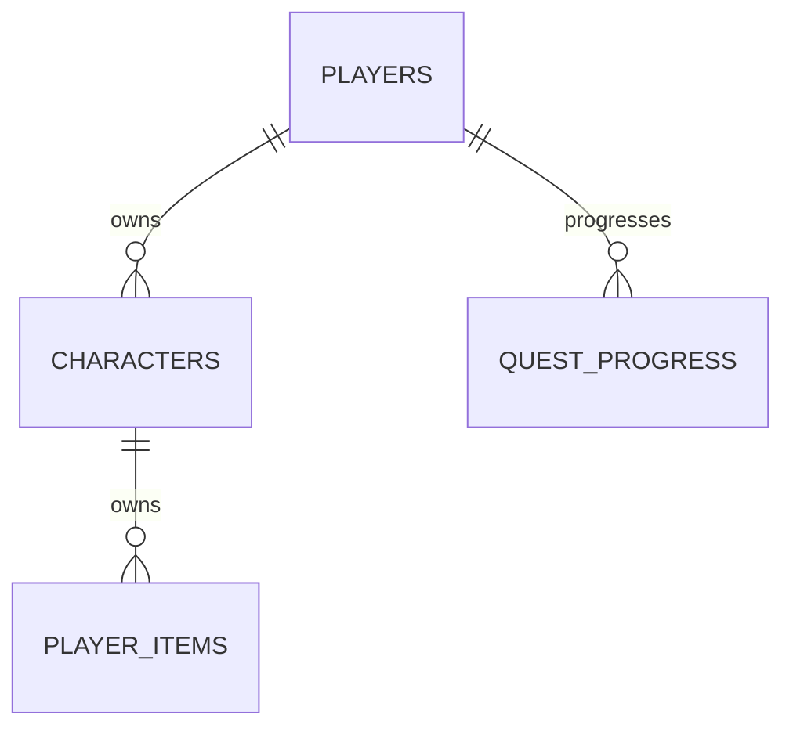

# 데이터베이스

---

## 챕터

이 장에서는 다음 내용을 학습한다.

- 온라인 게임에서 플레이어 정보를 서버 데이터베이스에 저장하는 이유
- 테이블, 행, 열, 기본 키, 외래 키의 역할
- 게임 서버에서 자주 사용하는 SQL
- 인덱스가 조회를 빠르게 하지만 쓰기 비용을 만드는 이유
- 플레이어 데이터를 JSON 문서 하나 또는 정규화된 여러 테이블로 저장하는 방법
- 여러 변경을 하나의 작업으로 묶는 트랜잭션
- Node.js 이벤트 루프를 막지 않고 DB 질의를 실행하는 방법
- SQL Injection, 권한 분리, 비밀값 관리

---

# 0. Node.js · NestJS 연관

| 개념            | Node.js / NestJS                        |
| --------------- | --------------------------------------- |
| DB 연결 객체    | TypeORM `DataSource`, `mysql2` Pool     |
| SQL 실행        | Repository, EntityManager, QueryBuilder |
| 플레이어 구조체 | TypeScript Interface, Entity, DTO       |
| 비동기 DB 작업  | Promise, `async/await`                  |
| 트랜잭션        | `DataSource.transaction`, QueryRunner   |
| 파라미터 바인딩 | Repository 조건, QueryBuilder Parameter |
| DB 작업         | 드라이버 비동기 I/O, Connection Pool    |

TypeScript 타입은 데이터베이스의 제약조건을 대신하지 않는다.

예를 들어 애플리케이션 코드에서 다음과 같이 선언했다고 하자.

```ts
playerId: number;
```

이것만으로 데이터베이스에 다음 제약조건이 자동으로 생성되는 것은 아니다.

- `NOT NULL`
- `UNIQUE`
- `FOREIGN KEY`

따라서 애플리케이션 코드의 검증과 데이터베이스의 제약조건을 함께 사용해야 한다.

---

# 1. 플레이어 정보 저장

## 1.1 클라이언트 저장만으로 부족한 이유

온라인 게임의 핵심 플레이어 데이터는 서버가 관리해야 한다.

이유는 다음과 같다.

- 기기를 바꿔도 같은 계정으로 이어서 플레이해야 한다.
- 클라이언트 파일과 메모리는 사용자가 수정할 수 있다.
- 재화, 아이템, 랭킹, 결제 결과는 여러 사용자에게 영향을 준다.
- 운영 도구와 고객 지원에서 플레이어 상태를 조회하고 복구해야 한다.
- 여러 서버 인스턴스가 같은 데이터를 일관되게 사용해야 한다.

클라이언트에는 화면 표시와 예측에 필요한 데이터의 복사본이 존재할 수 있다.

하지만 중요한 원본 데이터는 서버가 관리한다.

| 데이터             | 위치             | 예                         |
| ------------------ | ---------------- | -------------------------- |
| 계정, 재화, 아이템 | 서버 DB          | 골드, 유료 재화, 인벤토리  |
| 진행 정보          | 서버 DB          | 스테이지, 퀘스트, 업적     |
| 일시적 전투 상태   | 게임 서버 메모리 | 현재 HP, 버프, 위치        |
| 캐시               | Redis 등         | 세션, 임시 랭킹, 조회 결과 |
| 화면 표시 상태     | 클라이언트       | 애니메이션, UI 선택        |

---

## 1.2 메모리와 영속 저장소

게임 진행 중 모든 입력을 데이터베이스에 즉시 기록하면 지연과 부하가 커질 수 있다.

반대로 게임이나 세션이 종료할 때만 저장한다면 프로세스 장애가 발생했을 때 많은 데이터가 사라질 수 있다.

일반적으로 다음과 같이 구분할 수 있다.

### 즉시 저장

- 결제
- 재화 차감
- 아이템 획득
- 보상 수령

### 주기 저장

- 위치
- 일반 진행도
- 플레이 시간

### 세션 종료 저장

- 중요도가 낮고 복구 가능한 임시 상태

### 이벤트 기록

- 감사가 필요한 거래
- 보상 지급 이력

저장 시점은 다음 두 가지를 함께 고려해서 결정한다.

```text
데이터 손실 허용량
+
데이터베이스 부하
```

---

# 2. 데이터베이스 사용

## 2.1 관계형 데이터베이스를 사용하는 이유

관계형 데이터베이스는 다음 기능을 제공한다.

- 스키마와 타입
- 기본 키
- 고유 제약조건
- 외래 키를 통한 관계
- SQL을 이용한 다양한 조회
- 트랜잭션
- 인덱스
- 백업
- 복제
- 장애 복구 도구

게임 서버에서는 MySQL, PostgreSQL과 같은 관계형 데이터베이스를 다음 데이터에 사용하기 좋다.

- 계정
- 결제
- 인벤토리
- 우편
- 보상 이력

특히 일관성이 중요한 데이터에 적합하다.

---

## 2.2 NestJS에서 TypeORM 연결

### 설치

```bash
npm install @nestjs/typeorm typeorm mysql2
```

### AppModule

```ts
// app.module.ts

import { Module } from "@nestjs/common";
import { TypeOrmModule } from "@nestjs/typeorm";

import { Player } from "./player/player.entity";
import { PlayerItem } from "./inventory/player-item.entity";

@Module({
  imports: [
    TypeOrmModule.forRoot({
      type: "mysql",
      host: process.env.DB_HOST,
      port: Number(process.env.DB_PORT ?? 3306),
      username: process.env.DB_USER,
      password: process.env.DB_PASSWORD,
      database: process.env.DB_NAME,

      entities: [Player, PlayerItem],

      synchronize: false,
      logging: false,

      extra: {
        connectionLimit: 20,
      },
    }),
  ],
})
export class AppModule {}
```

운영 환경에서는 `synchronize`를 켜서 스키마를 자동으로 변경하지 않는다.

```ts
synchronize: false;
```

마이그레이션 파일을 사용하고 변경 내용을 검토하면서 배포 순서를 통제한다.

---

## 2.3 연결 풀

요청마다 다음 작업을 새로 수행하면 비용이 크다.

```text
TCP 연결
→ DB 인증
→ 질의
→ 연결 종료
```

Connection Pool은 미리 생성한 DB 연결을 재사용한다.

하지만 연결 수가 많다고 무조건 좋은 것은 아니다.

예를 들어 다음과 같다고 하자.

```text
애플리케이션 Pod 10개
×
Pod당 DB 연결 30개
=
최대 300개 연결
```

Pod 수를 늘릴 때는 데이터베이스의 최대 연결 수도 함께 계산해야 한다.

관측할 항목은 다음과 같다.

- Pool 대기 시간
- 사용 중인 연결 수
- Query 실행 시간
- Timeout
- DB 최대 Connection

---

# 3. 데이터베이스 데이터 구성

## 3.1 기본 용어

| 용어         | 의미                   | 예                       |
| ------------ | ---------------------- | ------------------------ |
| 데이터베이스 | 관련 데이터의 모음     | `game_db`                |
| 테이블       | 같은 종류 행의 모음    | `players`                |
| 행, 레코드   | 하나의 데이터          | 플레이어 한 명           |
| 열, 필드     | 데이터의 속성          | `level`, `gold`          |
| 스키마       | 데이터 구조와 제약조건 | 타입, 키, 인덱스         |
| 기본 키      | 행을 유일하게 식별     | `players.id`             |
| 외래 키      | 다른 테이블 행을 참조  | `player_items.player_id` |

---

## 3.2 예제 스키마

### players

```sql
CREATE TABLE players (
  id BIGINT UNSIGNED NOT NULL AUTO_INCREMENT,
  account_id BIGINT UNSIGNED NOT NULL,
  nickname VARCHAR(32) NOT NULL,
  level INT UNSIGNED NOT NULL DEFAULT 1,
  gold BIGINT UNSIGNED NOT NULL DEFAULT 0,
  version INT UNSIGNED NOT NULL DEFAULT 0,

  created_at TIMESTAMP NOT NULL DEFAULT CURRENT_TIMESTAMP,

  updated_at TIMESTAMP NOT NULL DEFAULT CURRENT_TIMESTAMP
    ON UPDATE CURRENT_TIMESTAMP,

  PRIMARY KEY (id),

  UNIQUE KEY uq_players_account_id (account_id),
  UNIQUE KEY uq_players_nickname (nickname)
) ENGINE=InnoDB;
```

### player_items

```sql
CREATE TABLE player_items (
  id BIGINT UNSIGNED NOT NULL AUTO_INCREMENT,
  player_id BIGINT UNSIGNED NOT NULL,
  item_type_id INT UNSIGNED NOT NULL,
  quantity INT UNSIGNED NOT NULL DEFAULT 1,
  acquired_at TIMESTAMP NOT NULL DEFAULT CURRENT_TIMESTAMP,

  PRIMARY KEY (id),

  KEY idx_player_items_player_id (player_id),

  UNIQUE KEY uq_player_item_type (
    player_id,
    item_type_id
  ),

  CONSTRAINT fk_player_items_player
    FOREIGN KEY (player_id)
    REFERENCES players(id)
) ENGINE=InnoDB;
```

수량형 아이템은 다음 조합을 고유하게 두는 방식이 편할 수 있다.

```text
player_id + item_type_id
```

반면 다음과 같은 속성을 가진 장비는 아이템 각각을 별도의 행으로 관리할 필요가 있다.

- 개별 강화
- 옵션
- 내구도

---

## 3.3 Entity

```ts
import {
  Column,
  CreateDateColumn,
  Entity,
  Index,
  OneToMany,
  PrimaryGeneratedColumn,
  UpdateDateColumn,
  VersionColumn,
} from "typeorm";

import { PlayerItem } from "../inventory/player-item.entity";

@Entity({ name: "players" })
@Index("uq_players_account_id", ["accountId"], {
  unique: true,
})
@Index("uq_players_nickname", ["nickname"], {
  unique: true,
})
export class Player {
  @PrimaryGeneratedColumn({
    type: "bigint",
    unsigned: true,
  })
  id!: string;

  @Column({
    name: "account_id",
    type: "bigint",
    unsigned: true,
  })
  accountId!: string;

  @Column({
    type: "varchar",
    length: 32,
  })
  nickname!: string;

  @Column({
    type: "int",
    unsigned: true,
    default: 1,
  })
  level!: number;

  // JavaScript number는 큰 BIGINT를
  // 정확히 표현하지 못할 수 있어 문자열로 받는다.
  @Column({
    type: "bigint",
    unsigned: true,
    default: 0,
  })
  gold!: string;

  @VersionColumn()
  version!: number;

  @OneToMany(() => PlayerItem, (item) => item.player)
  items!: PlayerItem[];

  @CreateDateColumn({
    name: "created_at",
  })
  createdAt!: Date;

  @UpdateDateColumn({
    name: "updated_at",
  })
  updatedAt!: Date;
}
```

JavaScript의 `number`는 모든 64비트 정수를 정확하게 표현할 수 없다.

따라서 다음과 같은 값은 주의해야 한다.

- `BIGINT` 기본 키
- 큰 재화 값
- 큰 누적값

DB Driver의 설정과 직렬화 정책을 확인하고 다음 타입을 검토한다.

```ts
string;
```

또는

```ts
bigint;
```

---

# 4. 데이터베이스 시작

## 4.1 환경 분리

개발, 테스트, 스테이징, 운영 데이터베이스를 분리한다.

```text
개발
테스트
스테이징
운영
```

다음 원칙을 지킨다.

- 운영 데이터와 로컬 개발 DB를 분리한다.
- 테스트에서는 독립 데이터베이스 또는 격리된 스키마를 사용한다.
- 계정별 최소 권한을 적용한다.
- 접속 정보는 환경 변수나 Secret 관리 시스템으로 주입한다.
- 애플리케이션 시작 시 DB 연결 실패 정책을 명확하게 정의한다.

---

## 4.2 마이그레이션

스키마 변경은 애플리케이션 코드 배포와 호환되어야 한다.

예를 들어 다음 순서로 변경할 수 있다.

```text
1. Nullable 새 열 추가
        ↓
2. 기존 코드와 새 코드가 모두 동작하도록 처리
        ↓
3. 기존 데이터 Backfill
        ↓
4. 새 코드가 새 열을 사용하도록 배포
        ↓
5. 검증
        ↓
6. NOT NULL 적용 또는 이전 열 제거
```

열 이름을 즉시 변경하거나 열을 바로 삭제하면 이전 버전 Pod가 실행 중일 때 장애가 발생할 수 있다.

---

# 5. SQL 질의 구문

## 5.1 조회

```sql
SELECT
  id,
  nickname,
  level,
  gold
FROM players
WHERE id = ?;
```

필요한 열만 조회하면 다음 비용을 줄일 수 있다.

- 네트워크 전송량
- 객체 생성 비용
- 불필요한 데이터 조회

예:

```sql
SELECT
  id,
  nickname,
  level
FROM players
WHERE level >= ?
ORDER BY
  level DESC,
  id ASC
LIMIT ?;
```

---

## 5.2 삽입

```sql
INSERT INTO player_items (
  player_id,
  item_type_id,
  quantity
)
VALUES (?, ?, ?);
```

---

## 5.3 갱신

```sql
UPDATE players
SET gold = gold + ?
WHERE id = ?;
```

애플리케이션에서 먼저 `gold`를 읽은 후 계산하여 다시 저장하기보다 DB 내부에서 원자적으로 증가시키는 방법을 사용할 수 있다.

재화 차감은 조건부 갱신을 사용할 수 있다.

```sql
UPDATE players
SET gold = gold - ?
WHERE id = ?
  AND gold >= ?;
```

예를 들어 다음 값을 차감한다고 하자.

```text
차감 금액 = 100
```

SQL Parameter는 다음과 같은 개념이다.

```text
SET gold = gold - 100

WHERE id = 플레이어 ID
AND gold >= 100
```

실행 이후 `affected rows`를 확인한다.

```text
affected rows = 1
→ 성공

affected rows = 0
→ 플레이어가 없거나 잔액 부족
```

---

## 5.4 삭제

```sql
DELETE FROM player_items
WHERE id = ?
  AND player_id = ?;
```

소유자 조건을 같이 넣어 다른 플레이어의 아이템을 삭제하지 못하도록 한다.

---

## 5.5 집계와 랭킹

```sql
SELECT
  player_id,
  point,
  RANK() OVER (
    ORDER BY point DESC
  ) AS ranking
FROM season_rankings
WHERE season_id = ?
ORDER BY
  ranking,
  player_id
LIMIT 100;
```

대규모 랭킹을 요청마다 전체 계산하면 비용이 클 수 있다.

실시간 요구 수준에 따라 다음 방식을 검토한다.

- 별도의 랭킹 테이블
- Redis Sorted Set
- 주기적인 Snapshot

---

# 6. 인덱스와 키

## 6.1 기본 키

기본 키는 하나의 행을 유일하게 식별한다.

내부 식별자는 일반적으로 변경되지 않는 다음 값을 사용한다.

- 숫자 ID
- UUID

닉네임처럼 변경 가능한 값을 기본 키로 사용하지 않는다.

---

## 6.2 고유 키

예를 들어 보상 수령 테이블에서 다음과 같은 고유 키를 만들 수 있다.

```sql
UNIQUE KEY uq_reward_claim (
  player_id,
  reward_type,
  reward_period_id
)
```

이 제약조건은 같은 플레이어가 같은 기간의 동일 보상을 중복 수령하는 것을 막는 데 사용할 수 있다.

---

## 6.3 복합 인덱스

```sql
KEY idx_results_player_created (
  player_id,
  created_at
)
```

다음 조회에 활용할 수 있다.

```sql
SELECT
  id,
  score,
  created_at
FROM game_results
WHERE player_id = ?
  AND created_at >= ?
ORDER BY created_at DESC
LIMIT 20;
```

복합 인덱스에서는 열 순서가 중요하다.

다음 인덱스가 있다고 하자.

```text
(player_id, created_at)
```

이 인덱스는 다음 조건에 적합할 수 있다.

```text
player_id 조건
+
created_at 조건 또는 정렬
```

반면 `player_id` 조건 없이 `created_at`만 사용하는 조회에는 효율적이지 않을 수 있다.

---

## 6.4 인덱스의 비용

인덱스에는 비용도 존재한다.

- `INSERT` 시 인덱스도 갱신해야 한다.
- `UPDATE` 시 인덱스도 갱신해야 한다.
- 저장 공간을 사용한다.
- 인덱스가 많으면 유지 비용이 증가한다.
- 낮은 선택도의 열 하나만 인덱싱하면 효과가 작을 수 있다.

인덱스는 추측만으로 추가하지 않는다.

실제 조회 패턴과 실행 계획을 확인한다.

```sql
EXPLAIN

SELECT
  id,
  score
FROM game_results
WHERE player_id = ?
ORDER BY created_at DESC
LIMIT 20;
```

---

# 7. 플레이어 정보를 저장하는 방법 1 — 문서 단위 저장

첫 번째 방식은 플레이어 전체 데이터를 JSON과 같은 문서로 직렬화하여 하나의 행에 저장하는 방법이다.

---

## 7.1 TypeScript 구조

```ts
export interface PlayerDocument {
  schemaVersion: number;

  playerId: string;

  profile: {
    nickname: string;
    level: number;
  };

  wallet: {
    gold: string;
    premiumCurrency: number;
  };

  characters: Array<{
    characterId: string;

    level: number;

    items: Array<{
      itemTypeId: number;
      quantity: number;
    }>;
  }>;
}
```

---

## 7.2 테이블

```sql
CREATE TABLE player_documents (
  player_id BIGINT UNSIGNED NOT NULL,
  schema_version INT UNSIGNED NOT NULL,

  document JSON NOT NULL,

  revision BIGINT UNSIGNED NOT NULL DEFAULT 0,

  updated_at TIMESTAMP NOT NULL
    DEFAULT CURRENT_TIMESTAMP
    ON UPDATE CURRENT_TIMESTAMP,

  PRIMARY KEY (player_id)
) ENGINE=InnoDB;
```

---

## 7.3 장점

- 한 플레이어의 데이터를 한 번에 읽기 쉽다.
- 객체 구조와 저장 구조가 비슷하다.
- 초기 개발 속도가 빠를 수 있다.
- 플레이어 단위로 함께 사용하는 데이터의 응집도가 높다.

---

## 7.4 단점

- 일부 필드만 검색하거나 집계하기 어렵다.
- 작은 변경에도 큰 문서를 다시 기록할 수 있다.
- 문서가 커지면 직렬화 비용이 증가한다.
- 네트워크 비용이 증가할 수 있다.
- 여러 서버가 같은 문서를 수정하면 충돌 범위가 넓어진다.
- Schema Version Migration이 애플리케이션의 책임이 된다.

---

## 7.5 낙관적 동시성

```sql
UPDATE player_documents
SET
  document = ?,
  schema_version = ?,
  revision = revision + 1
WHERE player_id = ?
  AND revision = ?;
```

`affected rows`가 `0`이라면 다른 작업이 먼저 저장했을 가능성이 있다.

이 경우 다음과 같은 처리가 필요하다.

```text
최신 문서 조회
    ↓
변경 내용 확인
    ↓
병합 또는 명령 재처리
```

문서 전체를 조회한 뒤 마지막 저장이 무조건 이전 데이터를 덮어쓰게 만들면 다음과 같은 문제가 발생할 수 있다.

```text
작업 A
아이템 획득

작업 B
퀘스트 진행

동시 수정
    ↓
마지막 저장이 전체 문서를 덮어씀
    ↓
한쪽 변경이 사라질 수 있음
```

---

# 8. 플레이어 정보를 저장하는 방법 2 — 트리 노드별 테이블

두 번째 방식은 다음 데이터 노드를 각각의 테이블로 저장하는 것이다.

- 플레이어
- 캐릭터
- 아이템
- 퀘스트 진행도



---

## 8.1 장점

- 필요한 행과 열만 읽고 수정할 수 있다.
- 검색과 집계가 쉽다.
- 운영 도구에서 조회하기 쉽다.
- DB 제약조건으로 관계를 보호할 수 있다.
- DB 제약조건으로 중복을 방지할 수 있다.
- 서로 다른 데이터의 갱신 충돌 범위가 작다.

---

## 8.2 단점

- 플레이어 전체 로딩에 여러 테이블 조회가 필요할 수 있다.
- JOIN이 증가한다.
- 매핑 코드가 증가한다.
- 테이블 수가 늘어난다.
- Migration 수가 많아질 수 있다.
- 잘못 설계하면 N+1 Query가 발생한다.

---

## 8.3 NestJS 로딩 예제

```ts
@Injectable()
export class PlayerLoadService {
  constructor(
    @InjectRepository(Player)
    private readonly players: Repository<Player>,
  ) {}

  async load(playerId: string): Promise<Player> {
    return this.players.findOneOrFail({
      where: {
        id: playerId,
      },

      relations: {
        items: true,
      },
    });
  }
}
```

모든 관계를 항상 Loading하면 데이터가 커질수록 느려질 수 있다.

따라서 필요한 시점에 필요한 데이터를 분리해서 조회한다.

예:

```text
로그인
→ 로그인에 필요한 최소 정보

인벤토리 화면
→ 아이템 데이터

전투 시작
→ 전투에 필요한 캐릭터와 장비 정보
```

---

## 8.4 저장 방식 혼합

한 가지 방식만 사용해야 하는 것은 아니다.

| 데이터           | 저장 방식 예    |
| ---------------- | --------------- |
| 계정             | 정규화된 테이블 |
| 재화             | 정규화된 테이블 |
| 결제             | 정규화된 테이블 |
| 보상             | 정규화된 테이블 |
| 개별 아이템      | 별도 행         |
| 자주 바뀌는 설정 | JSON 열         |
| 분석용 이벤트    | 이벤트 문서     |
| 함께 읽는 상태   | JSON 문서       |

문서 방식과 테이블 방식은 다음 요구사항을 기준으로 결정한다.

- 조회
- 변경
- 일관성
- 운영
- 복구

---

# 9. 질의 구문 실행

## 9.1 Repository 사용

```ts
@Injectable()
export class PlayerRepository {
  constructor(
    @InjectRepository(Player)
    private readonly repository: Repository<Player>,
  ) {}

  findById(playerId: string): Promise<Player | null> {
    return this.repository.findOne({
      where: {
        id: playerId,
      },

      select: {
        id: true,
        nickname: true,
        level: true,
        gold: true,
      },
    });
  }
}
```

---

## 9.2 QueryBuilder와 Parameter

```ts
const rankings = await rankingRepository
  .createQueryBuilder("ranking")
  .where("ranking.season_id = :seasonId", {
    seasonId,
  })
  .andWhere("ranking.point >= :minimumPoint", {
    minimumPoint,
  })
  .orderBy("ranking.point", "DESC")
  .addOrderBy("ranking.player_id", "ASC")
  .limit(100)
  .getMany();
```

다음처럼 값을 문자열로 직접 이어 붙이지 않는다.

```ts
// 사용하지 않는 방식
`WHERE season_id = ${seasonId}`;
```

Parameter Binding을 사용한다.

```ts
.where(
  "ranking.season_id = :seasonId",
  { seasonId },
)
```

---

## 9.3 Timeout과 취소

DB Query가 무한정 기다리게 만들면 안 된다.

고려할 항목은 다음과 같다.

- Connection 획득 Timeout
- Query Timeout
- 상위 요청 Deadline
- 재시도 횟수

특히 쓰기 Query에서 Timeout이 발생했다고 해서 실제 DB 작업이 실패했다고 단정할 수는 없다.

예를 들어 다음과 같은 상황이 가능하다.

```text
클라이언트
    ↓
구매 요청
    ↓
DB Commit 성공
    ↓
응답 전 네트워크 Timeout
    ↓
클라이언트는 실패로 인식
```

이 상태에서 같은 구매 요청을 다시 보내면 중복 처리 위험이 있다.

따라서 다음과 같은 작업은 `requestId` 등을 사용한 멱등성 처리를 검토한다.

- 재화 차감
- 상품 구매
- 보상 지급

---

# 10. 트랜잭션

트랜잭션은 여러 변경을 하나의 작업으로 묶어 모두 성공시키거나 모두 취소하기 위한 단위다.

예를 들어 아이템 구매 과정이 다음과 같다고 하자.

```text
1. 플레이어 재화 확인
2. 재화 차감
3. 아이템 추가
4. 구매 이력 기록
```

중간에 하나라도 실패하면 전체를 Rollback해야 할 수 있다.

```text
재화 차감 성공
아이템 지급 실패

→ 재화만 차감되면 안 됨
```

---

## 10.1 NestJS · TypeORM 트랜잭션 예제

```ts
@Injectable()
export class ShopService {
  constructor(private readonly dataSource: DataSource) {}

  async purchase(
    playerId: string,
    product: Product,
    requestId: string,
  ): Promise<void> {
    await this.dataSource.transaction(async (manager) => {
      const existing = await manager.findOne(PurchaseHistory, {
        where: {
          playerId,
          requestId,
        },
      });

      if (existing) {
        return;
      }

      const walletResult = await manager
        .createQueryBuilder()
        .update(Player)
        .set({
          gold: () => "gold - :price",
        })
        .where("id = :playerId", {
          playerId,
        })
        .andWhere("gold >= :price", {
          price: product.price,
        })
        .execute();

      if (walletResult.affected !== 1) {
        throw new Error("NOT_ENOUGH_GOLD");
      }

      await manager.upsert(
        PlayerItem,
        {
          playerId,
          itemTypeId: product.itemTypeId,
          quantity: product.quantity,
        },
        {
          conflictPaths: ["playerId", "itemTypeId"],
        },
      );

      await manager.insert(PurchaseHistory, {
        playerId,
        requestId,
        productId: product.id,
        price: product.price,
      });
    });
  }
}
```

트랜잭션 Callback 내부에서는 전달받은 `manager`를 사용한다.

```ts
await this.dataSource.transaction(async (manager) => {
  // manager를 사용한다.
});
```

---

## 10.2 트랜잭션은 짧게 유지

트랜잭션 안에서 다음 작업을 오래 수행하지 않는다.

- 외부 HTTP API 호출
- 다른 Microservice 응답 대기
- 사용자 입력 대기
- 긴 CPU 계산
- 대용량 파일 처리

트랜잭션 안에서 오랜 시간이 걸리면 다음 문제가 발생할 수 있다.

```text
잠금 시간 증가
+
DB Connection 점유 시간 증가
+
경합 증가
+
Deadlock 가능성 증가
```

---

## 10.3 교착 상태

둘 이상의 트랜잭션이 서로가 가진 Lock을 기다리면 교착 상태가 발생할 수 있다.

```text
Transaction A
Row 1 Lock 획득
→ Row 2 대기

Transaction B
Row 2 Lock 획득
→ Row 1 대기
```

결과적으로 서로 기다리는 상태가 된다.

---

# 11. 게임 서버에서 SQL 실행

## 11.1 이벤트 루프를 막지 않는 비동기 처리

NestJS WebSocket Gateway에서 DB를 조회하는 예:

```ts
@SubscribeMessage("inventory.load")
async loadInventory(
  @ConnectedSocket()
  client: GameSocket,
): Promise<InventoryResponse> {
  const items =
    await this.inventoryService.findAll(
      client.data.playerId,
    );

  return {
    items,
  };
}
```

`await` 중에는 해당 함수의 실행이 양보되므로 다른 네트워크 이벤트를 처리할 수 있다.

하지만 `async/await`를 사용한다고 해서 모든 문제가 자동으로 해결되는 것은 아니다.

다음 문제를 고려해야 한다.

- 동시에 너무 많은 Query를 보내면 Connection Pool이 고갈될 수 있다.
- 하나의 요청에서 N+1 Query가 발생하면 응답 시간이 증가한다.
- 큰 결과를 JSON으로 변환하는 작업은 Event Loop를 오래 점유할 수 있다.
- 실패한 Promise를 처리하지 않으면 요청과 로그의 원인을 파악하기 어려워진다.

---

## 11.2 게임 Tick과 DB 분리

실시간 게임 Tick에서 매번 DB 응답을 직접 기다리는 구조는 피할 수 있다.

```text
네트워크 입력
    ↓
메모리의 방 상태 처리
    ↓
클라이언트 응답

        ↓

저장 명령 / 이벤트 생성
        ↓
DB 저장 계층 처리
```

다만 다음 데이터처럼 저장 성공 자체가 결과의 조건인 경우는 별도로 생각해야 한다.

- 재화
- 결제
- 중요한 보상

이런 작업은 별도의 명령 흐름으로 처리하고 성공 응답의 의미를 명확히 해야 한다.

---

## 11.3 저장 Queue의 위험

메모리 Queue에 저장 작업을 쌓으면 순간적인 부하를 흡수할 수 있다.

하지만 프로세스가 종료되면 메모리 Queue의 데이터가 유실될 수 있다.

중요 데이터는 다음과 같은 구조를 검토한다.

- 내구성 있는 Message Broker
- Outbox
- DB Transaction

---

# 12. 보안을 위한 주의사항

## 12.1 SQL Injection

Parameter Binding을 사용한다.

```ts
const player = await dataSource.query(
  `
  SELECT
    id,
    nickname,
    level
  FROM players
  WHERE nickname = ?
  `,
  [nickname],
);
```

ORM을 사용하더라도 Raw SQL이나 동적 SQL을 직접 구성하면 취약점이 발생할 수 있다.

특히 정렬 열을 사용자 입력으로 직접 넣으면 안 된다.

예:

```ts
const allowedSortColumns = {
  level: "player.level",
  createdAt: "player.created_at",
} as const;

const sortColumn =
  allowedSortColumns[inputSort as keyof typeof allowedSortColumns];

if (!sortColumn) {
  throw new Error("INVALID_SORT_COLUMN");
}
```

동적인 Column이나 정렬 필드는 허용 목록을 만들어 검증한다.

---

## 12.2 최소 권한

DB 사용자에게 필요한 권한만 제공한다.

예:

- 애플리케이션 계정에 `DROP` 권한을 주지 않는다.
- 애플리케이션 계정에 `CREATE USER` 권한을 주지 않는다.
- 읽기 전용 도구는 Read Only 계정을 사용한다.
- Batch와 운영 도구도 필요한 테이블 권한만 가진다.
- DB를 외부 인터넷에 직접 노출하지 않는다.
- 필요한 환경에서는 TLS와 인증서 검증을 적용한다.

---

## 12.3 비밀값

다음 정보를 Git에 저장하지 않는다.

- DB Password
- Connection String의 비밀번호
- 운영 Secret

운영 비밀값은 다음과 같은 방법으로 주입한다.

- Secret Manager
- Kubernetes Secret
- 환경 변수

또한 다음 사항을 고려한다.

- 비밀값 정기 교체
- 접근 감시
- 로그 출력 방지

---

## 12.4 개인정보

개인정보는 필요한 정보만 저장한다.

비밀번호는 복호화 가능한 평문 형태로 저장하지 않고 검증된 Password Hash 방식을 사용한다.

또한 다음에도 개인정보 정책을 적용해야 한다.

- 애플리케이션 로그
- 데이터베이스
- Backup
- 운영 도구

삭제와 보존 기간 요구사항도 데이터 모델에 반영한다.

---

# 13. 데이터베이스 운영 관측 항목

| 지표                   | 의미                            |
| ---------------------- | ------------------------------- |
| Query 실행 시간        | 느린 Tail Latency 확인          |
| Connection Pool 사용량 | 연결 부족 또는 누수 확인        |
| Pool 대기 시간         | 애플리케이션 동시성 과다 확인   |
| 초당 Query 수          | 부하 변화 확인                  |
| Slow Query 수          | 인덱스와 Query 문제 확인        |
| Lock Wait              | 트랜잭션 경합 확인              |
| Deadlock               | 잠금 순서와 트랜잭션 문제 확인  |
| Replica Lag            | 복제본 최신 상태 확인           |
| Transaction Rollback   | 비즈니스 또는 DB 오류 확인      |
| Affected Rows 불일치   | 조건부 갱신 실패 또는 중복 확인 |

로그에는 다음 정보를 남길 수 있다.

```text
requestId
playerId
query 이름
실행 시간
결과 행 수
```

반면 SQL 전체와 민감한 Parameter를 무조건 로그에 기록하지 않는다.

---

# 14. 자주 발생할 수 있는 실수

## 14.1 TypeScript 타입만 있으면 DB 데이터가 안전하다고 생각

TypeScript 타입은 런타임 DB 제약조건이 아니다.

```ts
playerId: number;
```

이 코드가 있다고 해서 자동으로 다음 제약이 생성되지 않는다.

```text
NOT NULL
UNIQUE
FOREIGN KEY
```

---

## 14.2 인덱스를 많이 만들수록 빠르다고 생각

인덱스는 읽기 성능을 높일 수 있지만 쓰기와 저장 공간 비용이 발생한다.

---

## 14.3 SELECT 후 애플리케이션에서 계산하고 UPDATE하면 원자적이라고 생각

다음 구조는 동시 요청에서 문제가 될 수 있다.

```text
SELECT gold
    ↓
애플리케이션 계산
    ↓
UPDATE gold
```

필요한 경우 조건부 UPDATE 등을 사용한다.

---

## 14.4 트랜잭션 안에서 외부 API 호출

외부 API 응답을 기다리는 동안 DB Lock과 Connection을 오래 점유할 수 있다.

---

## 14.5 Timeout이면 쓰기가 실행되지 않았다고 단정

응답만 Timeout되었고 DB에서는 이미 Commit되었을 수 있다.

---

## 14.6 플레이어 문서를 마지막 저장이 항상 덮어쓰게 처리

동시에 수정된 한쪽 변경이 유실될 수 있다.

---

## 14.7 ORM을 사용하면 SQL Injection이 절대 없다고 생각

Raw Query와 동적 Column 조립에서는 여전히 문제가 발생할 수 있다.

---

## 14.8 Pod 수를 늘리면서 DB 연결 총합을 계산하지 않음

```text
Pod 수
×
Pod당 Connection Pool 크기
=
DB 최대 연결 가능성
```

을 계산해야 한다.

---

## 14.9 BIGINT를 무조건 JavaScript number로 변환

큰 정수는 정밀도를 잃을 수 있다.

---

## 14.10 Replica에서 항상 즉시 최신 데이터를 읽을 수 있다고 가정

Replication Lag이 존재할 수 있다.

---

# 15. 복습 질문

## Q1. 플레이어 데이터를 클라이언트에만 저장하면 안 되는 이유는?

기기 변경 시 이어하기가 어렵고 사용자가 데이터를 조작할 수 있기 때문이다.

또한 중요한 게임 데이터는 여러 서버와 운영 도구가 일관되게 조회할 수 있어야 한다.

---

## Q2. 기본 키와 고유 키의 차이는?

기본 키는 행의 대표 식별자이다.

고유 키는 지정한 열 또는 열 조합에서 중복을 추가로 방지한다.

예:

```text
PRIMARY KEY
→ players.id

UNIQUE
→ players.nickname
```

---

## Q3. 복합 인덱스의 열 순서가 중요한 이유는?

복합 인덱스는 왼쪽 열부터 구성된 정렬 구조를 사용하기 때문에 조회 조건과 정렬 방식에 따라 활용 가능한 범위가 달라질 수 있다.

예:

```text
(player_id, created_at)
```

은 다음 조회에 적합할 수 있다.

```sql
WHERE player_id = ?
ORDER BY created_at DESC;
```

---

## Q4. 문서 단위 저장의 큰 위험 중 하나는?

동시에 수정한 두 작업이 문서 전체를 덮어쓰면서 한쪽 변경을 잃어버릴 수 있다는 점이다.

---

## Q5. 정규화된 여러 테이블을 사용하는 장점은?

필요한 일부 데이터만 조회하거나 수정하기 쉽다.

또한 다음 기능을 활용하기 좋다.

- 데이터베이스 제약조건
- 검색
- 집계
- JOIN
- 운영 도구 조회

---

## Q6. 트랜잭션 안에서 외부 API를 오래 호출하면 안 되는 이유는?

외부 서비스의 응답을 기다리는 동안 DB Lock과 Connection을 오래 점유할 수 있기 때문이다.

그 결과 다음 문제가 커질 수 있다.

- 경합
- Connection 부족
- Deadlock 가능성
- 장애 전파

---

## Q7. 조건부 재화 차감의 성공을 어떻게 확인하는가?

잔액 조건을 `WHERE`에 포함한 `UPDATE`를 실행한다.

```sql
UPDATE players
SET gold = gold - ?
WHERE id = ?
  AND gold >= ?;
```

그다음 `affected rows`를 확인한다.

```text
1
→ 성공

0
→ 플레이어가 없거나 잔액 부족
```

---

## Q8. DB Timeout 이후 같은 구매 요청을 다시 보내도 안전하게 하려면?

`requestId`와 같은 요청 식별자를 사용하고 고유 제약조건과 멱등 처리를 적용하여 다음 문제를 막아야 한다.

- 중복 재화 차감
- 중복 아이템 지급
- 중복 보상 지급

---

## Q9. Connection Pool이 필요한 이유는?

DB 연결 생성 비용을 줄이고 동시에 사용할 수 있는 DB 연결 수를 제한하기 위해 사용한다.

```text
요청마다 연결 생성

TCP 연결
→ 인증
→ Query
→ 종료

보다

Connection Pool
→ 기존 연결 재사용

방식으로 처리
```

---

# 16. 전체 흐름 복습

```text
게임 클라이언트
        ↓
Node.js / NestJS 서버
        ↓
Controller / Gateway
        ↓
Service
        ↓
Repository / QueryBuilder
        ↓
Connection Pool
        ↓
MySQL
```

플레이어의 중요한 데이터를 변경할 때는 다음 내용을 함께 생각한다.

```text
요청 검증
    ↓
중복 요청 여부
    ↓
트랜잭션 필요 여부
    ↓
조건부 UPDATE
    ↓
DB 제약조건
    ↓
Commit
    ↓
응답
```

그리고 운영 환경에서는 다음을 관측한다.

```text
Query 실행 시간
Connection Pool
Pool 대기 시간
Slow Query
Lock Wait
Deadlock
Rollback
Replica Lag
Affected Rows
```

---

# 17. 핵심 정리

## 데이터 저장

- 중요한 플레이어 데이터는 서버에서 관리한다.
- 데이터 중요도에 따라 저장 시점을 구분한다.
- 메모리 상태와 영속 상태의 역할을 나눈다.

## 데이터베이스

- 관계형 DB는 일관성이 필요한 게임 데이터에 사용할 수 있다.
- TypeScript 타입과 DB Constraint는 다른 역할을 가진다.
- 운영 환경에서는 자동 Schema Sync보다 Migration을 사용한다.

## SQL

- 필요한 Column만 조회한다.
- Parameter Binding을 사용한다.
- 재화 차감과 같은 작업에서는 조건부 UPDATE를 사용할 수 있다.
- `affected rows`를 통해 실행 결과를 확인할 수 있다.

## 인덱스

- Index는 조회를 빠르게 만들 수 있다.
- 대신 저장 공간과 쓰기 비용이 증가한다.
- 복합 Index의 Column 순서는 중요하다.
- 실제 Query와 `EXPLAIN`을 기준으로 설계한다.

## 저장 구조

```text
문서 단위 저장
vs
정규화된 여러 테이블
```

각 방식은 장점과 단점이 있으며 다음 요구사항을 기준으로 선택한다.

- 조회
- 변경
- 일관성
- 동시성
- 운영
- 복구

## 트랜잭션

- 여러 변경을 하나의 작업 단위로 묶는다.
- 트랜잭션은 가능한 짧게 유지한다.
- 외부 API 호출을 트랜잭션 안에서 오래 기다리지 않는다.
- 중복 요청 문제는 트랜잭션만으로 모두 해결되지 않는다.

## Node.js · NestJS

- DB 작업은 비동기 방식으로 처리한다.
- `await` 자체가 Event Loop를 Block하는 것은 아니다.
- 하지만 과도한 동시 Query는 Connection Pool을 고갈시킬 수 있다.
- 대량 데이터의 동기 처리나 큰 JSON 변환은 Event Loop에 영향을 줄 수 있다.

## 보안

- SQL Parameter Binding을 사용한다.
- DB 계정에는 최소 권한만 부여한다.
- 비밀번호와 Secret을 Git에 저장하지 않는다.
- 개인정보는 필요한 범위만 저장한다.

---

# 18. 학습할 때 확인할 질문

이 장을 공부한 뒤 다음 질문에 답할 수 있는지 확인한다.

- 플레이어 데이터를 왜 서버에 저장해야 하는가?
- 메모리 상태와 DB 상태는 어떻게 구분하는가?
- TypeScript 타입과 DB Constraint는 무엇이 다른가?
- Connection Pool은 왜 필요한가?
- Pod가 증가하면 DB Connection은 어떻게 변하는가?
- 기본 키와 Unique Key는 무엇이 다른가?
- 복합 Index에서 Column 순서가 왜 중요한가?
- 조건부 UPDATE가 재화 차감에 유용한 이유는 무엇인가?
- `affected rows`는 무엇을 의미하는가?
- JSON 문서 단위 저장의 장단점은 무엇인가?
- 정규화된 여러 테이블 저장의 장단점은 무엇인가?
- 낙관적 동시성 제어는 어떤 문제를 막기 위한 것인가?
- Query Timeout이 발생했다고 쓰기가 실패했다고 단정할 수 없는 이유는 무엇인가?
- 트랜잭션 안에서 외부 API를 호출하면 왜 문제가 될 수 있는가?
- Node.js에서 DB Query를 `await`할 때 Event Loop는 어떻게 동작하는가?
- Connection Pool 고갈은 어떤 상황에서 발생할 수 있는가?
- ORM을 사용하더라도 SQL Injection을 조심해야 하는 이유는 무엇인가?
- `BIGINT`를 JavaScript `number`로 무조건 변환하면 왜 문제가 될 수 있는가?
- Replica Lag이 무엇인지 설명할 수 있는가?
- 중요한 구매·보상 API에서 멱등성이 필요한 이유는 무엇인가?
