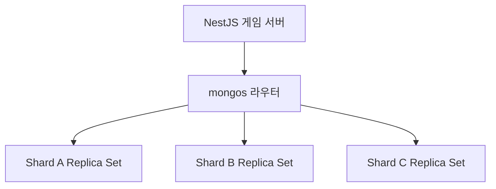
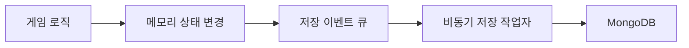

# 8장 NoSQL 기초 — Node.js/NestJS 버전

> 이 장은 관계형 데이터베이스와 NoSQL의 차이를 이해하고, MongoDB를 게임 서버에 적용하는 방법을 다룹니다. 원서의 흐름을 유지하되 예제는 Node.js, NestJS, TypeScript와 MongoDB Node.js Driver를 사용합니다. MongoDB가 관계형 데이터베이스를 무조건 대체하는 것은 아닙니다. **게임 데이터의 조회·변경 패턴에 맞는 저장소를 선택하는 것**이 핵심입니다.

---

## 이 장의 학습 목표

- 관계형 데이터베이스와 문서 데이터베이스의 차이를 설명한다.
- MongoDB의 문서, 컬렉션, BSON 구조를 이해한다.
- Node.js에서 MongoDB CRUD 명령을 안전하게 실행한다.
- 인덱스와 실행 계획으로 느린 쿼리의 원인을 찾는다.
- 복제와 샤딩이 각각 고가용성과 수평 확장에 어떤 역할을 하는지 구분한다.
- 게임 루프와 데이터베이스 I/O를 분리하고 중복 요청에 안전한 저장 로직을 설계한다.

---

## 0. 개념 대응표

| 개념         | MongoDB                     | Node.js/NestJS에서의 표현                     |
| ------------ | --------------------------- | --------------------------------------------- |
| 데이터베이스 | Database                    | MongoClient.db                                |
| 테이블       | Collection                  | Db.collection                                 |
| 행           | Document                    | TypeScript 객체                               |
| 기본 키      | \_id                        | ObjectId 또는 애플리케이션이 정한 ID          |
| 스키마       | 유연한 문서 구조            | TypeScript 타입 + JSON Schema/Mongoose Schema |
| SQL INSERT   | insertOne, insertMany       | Collection.insertOne                          |
| SQL SELECT   | findOne, find               | Collection.find                               |
| SQL UPDATE   | updateOne, findOneAndUpdate | $set, $inc, $push 등                          |
| SQL DELETE   | deleteOne, deleteMany       | Collection.deleteOne                          |
| 실행 계획    | explain                     | cursor.explain                                |
| 고가용성     | Replica Set                 | Primary/Secondary와 자동 장애 조치            |
| 수평 분산    | Sharding                    | shard key 기준 데이터 분배                    |

---

## 8.1 관계형 데이터베이스와 NoSQL

관계형 데이터베이스는 데이터를 표와 관계로 표현합니다. 정규화, 조인, 제약 조건, 트랜잭션이 강점입니다. 반면 NoSQL은 하나의 제품군이 아니라 관계형 모델 이외의 여러 저장 모델을 묶어 부르는 말입니다.

| 종류          | 대표적인 데이터 구조     | 게임 서버 예시                         |
| ------------- | ------------------------ | -------------------------------------- |
| 문서형        | JSON과 비슷한 문서       | 플레이어 프로필, 우편함, 퀘스트 진행도 |
| 키-값형       | key → value              | 세션, 캐시, 일시적 매치 상태           |
| 와이드 컬럼형 | 파티션 키 중심의 넓은 행 | 대규모 시계열 이벤트, 활동 로그        |
| 그래프형      | 정점과 간선              | 친구 관계, 추천, 길드 관계 분석        |

MongoDB는 문서형 데이터베이스입니다. 서로 함께 읽고 변경되는 값을 하나의 문서에 넣기 쉽고, 필드 구성이 조금씩 다른 데이터도 저장하기 편합니다.

### 관계형 데이터베이스가 더 알맞은 경우

- 거래, 결제, 아이템 소유권처럼 강한 무결성이 필요하다.
- 여러 엔터티를 조인해 조회하는 일이 많다.
- 외래 키와 제약 조건으로 잘못된 데이터를 데이터베이스가 막아야 한다.
- 여러 행을 묶는 트랜잭션이 핵심이다.

### MongoDB가 잘 맞는 경우

- 한 플레이어의 데이터를 문서 하나 또는 소수 문서로 함께 읽는다.
- 데이터 구조가 자주 확장되고 이전 버전 문서와 공존해야 한다.
- 플레이어 ID처럼 자연스러운 분산 키가 있다.
- 중첩 객체나 배열이 실제 조회 단위와 잘 맞는다.

> 중요한 판단 기준은 유행이 아니라 **접근 패턴**입니다. 어떤 데이터를 어떤 키로 읽고, 얼마나 자주 바꾸며, 어느 범위까지 원자적으로 저장해야 하는지를 먼저 적어야 합니다.

---

## 8.2 관계형 데이터베이스에서 확장성

관계형 데이터베이스도 충분히 확장할 수 있습니다. 흔히 다음 순서로 확장을 검토합니다.

1. 쿼리와 인덱스를 최적화한다.
2. 더 큰 CPU·메모리·스토리지로 수직 확장한다.
3. 읽기 복제본으로 읽기 부하를 분산한다.
4. 캐시를 도입한다.
5. 파티셔닝이나 샤딩으로 쓰기와 데이터 용량을 분산한다.

수평 확장은 서버 수를 늘리는 방식입니다. 그러나 데이터베이스 노드를 늘린다고 애플리케이션이 자동으로 확장되지는 않습니다. 어떤 요청을 어느 노드로 보낼지, 노드 간 데이터 일관성을 어떻게 유지할지, 장애가 났을 때 어떻게 복구할지를 함께 설계해야 합니다.

게임 서버에서는 플레이어 ID, 길드 ID, 월드 ID처럼 데이터의 소유 위치를 결정할 키가 중요합니다. 키가 없으면 요청 하나가 모든 노드를 뒤지는 산개 조회가 되기 쉽습니다.

---

## 8.3 관계형 데이터베이스에서 고가용성

**확장성**은 부하가 증가해도 처리량을 늘릴 수 있는 성질이고, **고가용성**은 일부 장비가 고장 나도 서비스를 계속 제공하는 성질입니다. 둘은 관련 있지만 같은 개념은 아닙니다.

MongoDB의 Replica Set은 보통 다음 역할로 구성됩니다.

- Primary: 기본 쓰기를 처리한다.
- Secondary: Primary의 변경 로그를 복제한다.
- 장애 조치: Primary가 사라지면 남은 멤버가 새 Primary를 선출한다.

자동 장애 조치가 있어도 잠깐의 쓰기 실패나 지연은 발생할 수 있습니다. 애플리케이션은 일시적 오류를 정상적인 분산 시스템 상황으로 다뤄야 합니다.

### 복제에서 확인할 것

| 항목            | 의미                                  | 게임 서버에서의 판단                    |
| --------------- | ------------------------------------- | --------------------------------------- |
| write concern   | 몇 개 노드가 쓰기를 확인해야 성공인가 | 재화·구매는 강하게, 통계는 완화 가능    |
| read concern    | 어느 수준까지 확정된 데이터를 읽는가  | 즉시 일관성이 필요한지 판단             |
| read preference | 어느 멤버에서 읽는가                  | Secondary 읽기는 지연된 값을 볼 수 있음 |
| replication lag | 복제본이 Primary보다 늦은 정도        | 방금 쓴 값을 복제본에서 못 볼 수 있음   |

> 복제는 백업이 아닙니다. 실수로 삭제한 데이터도 복제됩니다. 별도의 백업, 복구 절차, 복구 훈련이 필요합니다.

---

## 8.4 MongoDB를 위한 JSON 이해

MongoDB 문서는 JSON과 비슷하게 보이지만 실제 저장 형식은 BSON입니다. BSON은 ObjectId, Date, Binary, Decimal128, 64비트 정수처럼 JSON보다 다양한 타입을 지원합니다.

```ts
type PlayerDocument = {
  _id: string;

  nickname: string;
  level: number;

  currencies: {
    gold: number;
    gem: number;
  };

  inventory: Array<{
    instanceId: string;
    itemId: number;
    count: number;
  }>;

  quest: {
    dailyResetAt: Date;
    completedIds: number[];
  };

  schemaVersion: number;
  updatedAt: Date;
};
```

### BSON 타입에서 주의할 점

- JavaScript의 number는 IEEE 754 배정밀도 부동소수점입니다. 2의 53승보다 큰 정수는 정확하지 않을 수 있습니다.
- 큰 식별자나 재화 값은 string, bigint 변환 규칙, BSON Long 또는 Decimal128 중 하나로 명확히 정합니다.
- 날짜는 문자열과 Date를 섞지 말고 UTC Date로 저장한 뒤 표시할 때만 지역 시간을 적용합니다.
- 필드가 없다는 것과 null이라는 것을 같은 의미로 사용할지 규칙을 정합니다.

### 포함과 참조

MongoDB 모델링의 핵심은 정규화 여부보다 **포함할지 참조할지**입니다.

| 포함하기 좋은 경우                   | 참조하기 좋은 경우                 |
| ------------------------------------ | ---------------------------------- |
| 항상 함께 읽는 데이터                | 독립적으로 자주 조회하는 데이터    |
| 문서 크기가 제한적으로 유지됨        | 배열이 끝없이 커질 수 있음         |
| 같은 원자적 변경에 포함되어야 함     | 여러 문서가 같은 데이터를 공유함   |
| 자식 데이터의 생명주기가 부모와 같음 | 데이터의 소유권과 갱신 주체가 다름 |

인벤토리 이력, 채팅 기록, 전투 로그처럼 계속 늘어나는 배열을 플레이어 문서 하나에 무한히 넣으면 안 됩니다. 현재 상태는 플레이어 문서에 두고, 이력은 별도 컬렉션으로 분리하는 편이 안전합니다.

### 스키마 버전

유연한 스키마는 스키마가 없다는 뜻이 아닙니다. 배포가 반복되면 여러 버전의 문서가 공존합니다.

```ts
function normalizePlayer(doc: PlayerDocument): PlayerDocument {
  if ((doc.schemaVersion ?? 1) < 2) {
    doc.currencies ??= {
      gold: 0,
      gem: 0,
    };

    doc.schemaVersion = 2;
  }

  return doc;
}
```

온라인 마이그레이션은 읽을 때 보정하고, 백그라운드에서 천천히 갱신하며, 새 코드가 구버전 문서도 읽을 수 있게 하는 방식이 안전합니다.

---

## 8.5 MongoDB 시작

다음은 MongoDB Node.js Driver를 NestJS의 공급자로 등록하는 예입니다. 연결 문자열은 코드에 직접 쓰지 않고 환경 변수나 비밀 관리 시스템에서 주입합니다.

```ts
// mongo.constants.ts

export const MONGO_CLIENT = Symbol("MONGO_CLIENT");
export const MONGO_DB = Symbol("MONGO_DB");
```

```ts
// mongo.module.ts

import { Module } from "@nestjs/common";
import { MongoClient } from "mongodb";

import { MONGO_CLIENT, MONGO_DB } from "./mongo.constants";

@Module({
  providers: [
    {
      provide: MONGO_CLIENT,

      useFactory: async () => {
        const uri = process.env.MONGODB_URI;

        if (!uri) {
          throw new Error("MONGODB_URI is required");
        }

        const client = new MongoClient(uri, {
          maxPoolSize: 50,
          minPoolSize: 5,
          serverSelectionTimeoutMS: 3_000,
        });

        await client.connect();

        return client;
      },
    },
    {
      provide: MONGO_DB,
      inject: [MONGO_CLIENT],

      useFactory: (client: MongoClient) =>
        client.db(process.env.MONGODB_DATABASE ?? "game"),
    },
  ],
  exports: [MONGO_CLIENT, MONGO_DB],
})
export class MongoModule {}
```

실제 서비스에서는 애플리케이션 종료 시 MongoClient를 닫는 생명주기 처리, 연결 실패 재시도 정책, 준비 상태 검사도 추가해야 합니다.

요청마다 새 연결을 만들지 말고 드라이버의 연결 풀을 재사용합니다.

NestJS에서는 Mongoose를 사용할 수도 있습니다.

Mongoose는 스키마와 모델 중심의 편의 기능을 제공하고, 공식 Driver는 MongoDB 기능을 더 직접적으로 다룹니다.

팀이 원하는 추상화 수준에 맞춰 하나를 선택하면 됩니다.

---

## 8.6 MongoDB에 데이터 액세스

예제 저장소는 컬렉션 타입을 지정해 컴파일 단계에서 필드 오타를 줄입니다.

```ts
import { Inject, Injectable } from "@nestjs/common";

import { Collection, Db } from "mongodb";

import { MONGO_DB } from "./mongo.constants";

@Injectable()
export class PlayerRepository {
  private readonly players: Collection<PlayerDocument>;

  constructor(
    @Inject(MONGO_DB)
    db: Db,
  ) {
    this.players = db.collection<PlayerDocument>("players");
  }
}
```

### 8.6.1 생성(create)

```ts
async createPlayer(
  playerId: string,
  nickname: string,
): Promise<void> {
  await this.players.insertOne({
    _id: playerId,
    nickname,
    level: 1,

    currencies: {
      gold: 0,
      gem: 0,
    },

    inventory: [],

    quest: {
      dailyResetAt: new Date(),
      completedIds: [],
    },

    schemaVersion: 2,
    updatedAt: new Date(),
  });
}
```

`_id`에는 자동으로 고유 인덱스가 생깁니다.

애플리케이션이 `playerId`를 `_id`로 사용하면 같은 플레이어를 두 번 생성하는 일을 데이터베이스가 막아줍니다.

중복 키 오류는 서버 장애로만 취급하지 말고, 이미 생성된 요청의 재시도인지 확인해야 합니다.

이벤트를 한 번만 처리해야 한다면 `eventId`에 고유 인덱스를 만들고 처리 기록과 함께 저장하는 방식이 유용합니다.

```ts
await db.collection("processed_events").createIndex(
  {
    eventId: 1,
  },
  {
    unique: true,
  },
);
```

### 8.6.2 읽기(read)

```ts
async findSummary(
  playerId: string,
) {
  return this.players.findOne(
    {
      _id: playerId,
    },
    {
      projection: {
        nickname: 1,
        level: 1,
        currencies: 1,
      },
    },
  );
}
```

필요한 필드만 projection으로 가져오면 네트워크 전송량과 역직렬화 비용을 줄일 수 있습니다.

목록 조회에는 항상 정렬 기준과 제한을 둡니다.

```ts
async findTopPlayers(
  limit = 100,
) {
  const safeLimit =
    Math.min(
      Math.max(limit, 1),
      100,
    );

  return this.players
    .find(
      {},
      {
        projection: {
          nickname: 1,
          level: 1,
        },
      },
    )
    .sort({
      level: -1,
      _id: 1,
    })
    .limit(safeLimit)
    .toArray();
}
```

대량 페이지 이동에서 `skip` 값이 커지면 앞 문서를 계속 건너뛰어야 합니다.

마지막으로 본 정렬 키를 다음 커서로 넘기는 커서 기반 페이지네이션이 더 안정적입니다.

### 8.6.3 업데이트(update)

수정할 문서 전체를 읽고 다시 쓰는 것보다 `$inc`, `$set` 같은 원자 연산을 사용하면 경쟁 상태를 줄일 수 있습니다.

```ts
async spendGold(
  playerId: string,
  amount: number,
): Promise<boolean> {
  if (
    !Number.isSafeInteger(amount) ||
    amount <= 0
  ) {
    throw new Error(
      'amount must be a positive safe integer',
    );
  }

  const result =
    await this.players.updateOne(
      {
        _id: playerId,
        'currencies.gold': {
          $gte: amount,
        },
      },
      {
        $inc: {
          'currencies.gold': -amount,
        },

        $set: {
          updatedAt: new Date(),
        },
      },
    );

  return result.modifiedCount === 1;
}
```

잔액 조건과 차감을 한 명령에 넣었으므로 동시 요청 두 개가 같은 잔액을 각각 소비하는 문제를 줄일 수 있습니다.

단일 문서의 쓰기는 원자적입니다.

낙관적 잠금이 필요하면 `version` 필드를 조건에 포함합니다.

```ts
const result = await this.players.updateOne(
  {
    _id: playerId,
    version: expectedVersion,
  },
  {
    $set: {
      nickname: nextNickname,
      updatedAt: new Date(),
    },
    $inc: {
      version: 1,
    },
  },
);

if (result.modifiedCount !== 1) {
  throw new Error("concurrent update detected");
}
```

`upsert`는 없으면 생성하고 있으면 수정합니다.

편리하지만 필터가 유일하지 않거나 재시도 의미가 불명확하면 예상치 못한 중복을 만들 수 있으므로 고유 인덱스와 함께 사용합니다.

### 8.6.4 지우기(delete)

```ts
async softDeletePlayer(
  playerId: string,
): Promise<boolean> {
  const result =
    await this.players.updateOne(
      {
        _id: playerId,
        deletedAt: {
          $exists: false,
        },
      },
      {
        $set: {
          deletedAt: new Date(),
          updatedAt: new Date(),
        },
      },
    );

  return result.modifiedCount === 1;
}
```

계정과 결제 데이터는 바로 물리 삭제하기보다 삭제 상태와 보존 기간을 두는 경우가 많습니다.

개인정보 삭제 정책과 감사 요구 사항을 함께 고려합니다.

TTL 인덱스는 세션이나 만료 토큰처럼 시간이 지나면 자동 제거해도 되는 데이터에 유용하지만, 삭제 시점이 정확한 초 단위로 보장되는 것은 아닙니다.

---

## 8.7 성능 분석 기능

MongoDB의 성능 문제는 먼저 쿼리 모양과 인덱스를 확인해야 합니다.

```ts
await db.collection<PlayerDocument>("players").createIndex(
  {
    level: -1,
    _id: 1,
  },
  {
    name: "level_ranking",
  },
);
```

복합 인덱스는 필드 순서가 중요합니다.

일반적으로 동등 조건, 정렬, 범위 조건의 실제 쿼리 패턴을 기준으로 설계합니다.

인덱스가 많으면 읽기는 빨라질 수 있지만 쓰기 비용과 저장 공간이 늘어납니다.

```ts
const plan = await db
  .collection<PlayerDocument>("players")
  .find({
    level: {
      $gte: 50,
    },
  })
  .sort({
    level: -1,
    _id: 1,
  })
  .limit(100)
  .explain("executionStats");

console.dir(plan, {
  depth: 8,
});
```

실행 계획에서 주로 볼 항목은 다음과 같습니다.

- `COLLSCAN`이 발생하는가, `IXSCAN`을 사용하는가?
- 검사한 문서 수가 반환한 문서 수보다 지나치게 많은가?
- 정렬이 인덱스로 처리되는가, 메모리 정렬이 발생하는가?
- 쿼리 한 번의 응답 시간뿐 아니라 초당 호출 횟수는 얼마인가?

프로덕션 프로파일러는 부하와 개인정보 노출 가능성이 있으므로 제한적으로 사용합니다.

평소에는 다음 항목을 관찰하는 것이 좋습니다.

- 지연 시간 p50
- 지연 시간 p95
- 지연 시간 p99
- 연결 풀 대기
- Timeout
- 재시도 횟수
- 읽은 문서 수
- 쓴 문서 수

### 흔한 성능 문제

| 문제          | 증상                          | 개선 방향                         |
| ------------- | ----------------------------- | --------------------------------- |
| 인덱스 없음   | 전체 컬렉션 스캔              | 실제 쿼리에 맞는 인덱스 추가      |
| 과도한 인덱스 | 쓰기 지연 증가                | 사용되지 않는 인덱스 제거         |
| 거대한 문서   | 네트워크·역직렬화 증가        | 문서 경계 재설계, projection 사용 |
| 무한 배열     | 문서 크기와 갱신 비용 증가    | 이력 컬렉션 분리                  |
| 큰 skip       | 뒤 페이지가 급격히 느려짐     | 커서 기반 페이지네이션            |
| N+1 조회      | 요청 하나가 DB를 수십 번 호출 | 포함 모델, 일괄 조회, 캐시 검토   |

---

## 8.8 MongoDB 수평 확장

MongoDB 샤딩은 컬렉션의 문서를 여러 샤드에 나눠 저장합니다.

`mongos` 라우터는 쿼리와 shard key를 보고 적절한 샤드로 요청을 보냅니다.



### shard key가 중요한 이유

좋은 shard key는 다음 특성을 가능한 한 많이 만족합니다.

- 값의 종류가 충분히 많아 데이터를 고르게 나눌 수 있다.
- 자주 사용하는 쿼리에 포함되어 대상 샤드를 바로 찾을 수 있다.
- 쓰기가 특정 범위에만 몰리지 않는다.
- 향후 데이터 증가와 접근 패턴에도 견딜 수 있다.

예를 들어 `playerId`의 해시를 shard key로 사용하면 플레이어 문서를 고르게 분산하기 쉽습니다.

반대로 계속 증가하는 생성 시각만 범위 shard key로 쓰면 최신 쓰기가 한 샤드에 몰릴 수 있습니다.

shard key가 없는 조회는 여러 샤드로 퍼지는 scatter-gather가 될 수 있습니다.

관리자 검색이나 전체 랭킹처럼 원래 전역 조회가 필요한 기능은 별도 읽기 모델이나 분석 저장소를 두는 것이 낫습니다.

### 범위 샤딩과 해시 샤딩

| 방식      | 장점                        | 주의점                               |
| --------- | --------------------------- | ------------------------------------ |
| 범위 기반 | 인접 범위 조회에 유리       | 순차 키는 쓰기 핫스폿 가능           |
| 해시 기반 | 데이터와 쓰기를 고르게 분산 | 범위 조회가 여러 샤드로 퍼질 수 있음 |

최신 MongoDB는 shard key 보완이나 리샤딩 기능을 제공하지만 운영 비용과 위험이 작지 않습니다.

처음부터 접근 패턴과 데이터 분포를 측정해 키를 선택해야 합니다.

### 샤딩 전에 확인할 것

1. 단일 노드 쿼리와 인덱스가 이미 최적화되었는가?
2. 실제 병목이 CPU, 메모리, 디스크, 연결 수 중 무엇인가?
3. 대부분의 요청이 shard key를 알고 있는가?
4. 샤드 간 트랜잭션과 전역 집계가 얼마나 자주 필요한가?
5. 백업, 복구, 리밸런싱을 운영할 인력이 있는가?

---

## 8.9 게임 서버에서 MongoDB 명령 실행

Node.js의 데이터베이스 호출은 비동기 I/O이므로 기다리는 동안 이벤트 루프가 다른 작업을 처리할 수 있습니다.

그러나 쿼리가 느려도 괜찮다는 뜻은 아닙니다.

완료 콜백이 몰리거나 연결 풀이 고갈되면 전체 서버의 지연이 커집니다.

### 게임 틱에서 DB를 직접 기다리지 않기

전투 틱마다 저장을 기다리면 데이터베이스 지연이 게임 진행 지연으로 전파됩니다.



단, 비동기 저장은 서버가 죽었을 때 아직 기록되지 않은 상태가 사라질 수 있습니다.

재화 구매처럼 유실을 허용할 수 없는 명령은 먼저 내구성 있게 기록하거나, 데이터베이스 트랜잭션과 Outbox Pattern을 사용해야 합니다.

### 여러 문서 트랜잭션

MongoDB는 Replica Set과 샤딩 환경에서 여러 문서 트랜잭션을 지원합니다.

그래도 트랜잭션 범위를 작게 유지하고, 가능하면 함께 바뀌는 데이터를 한 문서 경계에 배치하는 것이 좋습니다.

```ts
async transferGuildGold(
  client: MongoClient,
  db: Db,
  fromGuildId: string,
  toGuildId: string,
  amount: number,
): Promise<void> {
  const session =
    client.startSession();

  try {
    await session.withTransaction(
      async () => {
        const guilds =
          db.collection('guilds');

        const debit =
          await guilds.updateOne(
            {
              _id: fromGuildId,
              gold: {
                $gte: amount,
              },
            },
            {
              $inc: {
                gold: -amount,
              },
            },
            {
              session,
            },
          );

        if (
          debit.modifiedCount !== 1
        ) {
          throw new Error(
            'insufficient guild gold',
          );
        }

        await guilds.updateOne(
          {
            _id: toGuildId,
          },
          {
            $inc: {
              gold: amount,
            },
          },
          {
            session,
          },
        );
      },
    );
  } finally {
    await session.endSession();
  }
}
```

> 트랜잭션을 시작하려면 같은 연결 풀의 MongoClient와 Db를 함께 주입받는 구성이 편리합니다. 위 코드는 트랜잭션 경계를 설명하기 위한 예입니다.

### 재시도와 멱등성

네트워크가 끊기면 클라이언트는 결과를 못 받았지만 데이터베이스 쓰기는 성공했을 수 있습니다.

따라서 중요한 명령은 `requestId`를 부여하고 같은 요청을 다시 처리해도 결과가 한 번만 반영되게 만듭니다.

```ts
type RewardCommand = {
  requestId: string;
  playerId: string;
  gold: number;
};

async function grantReward(command: RewardCommand): Promise<void> {
  // requestId 고유 인덱스가 있는 처리 기록을
  // 같은 트랜잭션에 저장한다.
  // 중복 키가 발생하면 이미 완료된 요청으로 판단해
  // 기존 결과를 반환한다.
}
```

### 운영 시 타임아웃과 과부하 제어

- 모든 데이터베이스 호출에 합리적인 시간 제한을 둡니다.
- 연결 풀 크기는 Pod 수와 데이터베이스가 감당할 전체 연결 수를 함께 계산합니다.
- 무제한 Promise 병렬 실행을 피하고 동시 작업 수를 제한합니다.
- 일시 오류만 제한적으로 재시도하고 지수 백오프와 지터를 적용합니다.
- 재시도 폭풍이 발생하지 않도록 최대 횟수와 전체 시간 예산을 둡니다.
- 준비 상태 검사는 쓰기 가능 여부와 핵심 의존성을 반영하되 너무 비싼 쿼리를 실행하지 않습니다.

---

## 8.10 요약 및 더 알아보기

- NoSQL은 하나의 데이터 모델이 아니며, MongoDB는 문서형 데이터베이스입니다.
- 문서 경계는 함께 읽고 원자적으로 바꾸는 데이터 단위를 기준으로 정합니다.
- 유연한 스키마에도 타입, 검증, schemaVersion, 마이그레이션 전략이 필요합니다.
- 단일 문서 원자 연산과 조건부 업데이트를 활용하면 경쟁 상태를 줄일 수 있습니다.
- 인덱스는 실제 쿼리 패턴을 기준으로 만들고 explain으로 효과를 확인합니다.
- Replica Set은 고가용성, 샤딩은 수평 확장을 위한 기능입니다.
- shard key는 데이터 분포와 라우팅을 결정하므로 운영 전에 신중히 선택해야 합니다.
- 게임 틱이 데이터베이스 I/O를 직접 기다리지 않도록 하되, 중요한 쓰기는 유실되지 않게 설계합니다.
- 분산 환경의 재시도에는 requestId와 멱등성이 필요합니다.

### 흔한 오해

| 오해                                  | 실제로는                                              |
| ------------------------------------- | ----------------------------------------------------- |
| MongoDB에는 스키마가 없다             | 스키마는 존재하며 애플리케이션과 검증 규칙으로 관리함 |
| 문서 하나에 모두 넣으면 빠르다        | 무한 배열과 거대 문서는 오히려 병목이 됨              |
| Secondary에서 읽으면 항상 최신이다    | 복제 지연 때문에 과거 값을 볼 수 있음                 |
| 샤드 수를 늘리면 모든 쿼리가 빨라진다 | shard key 없는 조회는 모든 샤드로 퍼질 수 있음        |
| 복제본이 있으니 백업은 필요 없다      | 삭제와 손상도 복제되므로 별도 백업이 필요함           |
| 비동기 함수면 DB 부하가 사라진다      | 이벤트 루프는 안 막혀도 DB와 연결 풀은 포화될 수 있음 |

### 복습 질문과 답변

#### 1. NoSQL과 관계형 데이터베이스 중 하나가 항상 우월하지 않은 이유는 무엇인가?

**저장소마다 잘 처리하는 데이터 구조와 접근 패턴이 다르기 때문입니다.**

관계형 데이터베이스는 테이블 사이의 관계, 조인, 제약 조건, 여러 행을 묶는 트랜잭션에 강점이 있습니다. MongoDB 같은 문서형 데이터베이스는 함께 사용하는 데이터를 하나의 문서에 모아 읽고 수정하기 편합니다.

게임 서버에서는 다음처럼 판단할 수 있습니다.

- 결제 내역, 아이템 거래, 재화 원장: 데이터 간 무결성과 트랜잭션이 중요합니다.
- 플레이어 설정, 제한된 퀘스트 진행도: 플레이어 단위로 함께 조회하는 문서 모델이 편할 수 있습니다.
- 접속 세션과 캐시: 키-값 저장소가 적합할 수 있습니다.

다만 MongoDB도 여러 문서 트랜잭션을 지원하고, 관계형 데이터베이스도 JSON을 저장할 수 있습니다. 기능의 유무만으로 선택하지 말고 조회 방식, 변경 범위, 일관성 요구, 확장 방식, 운영 비용을 비교해야 합니다.

> 핵심: 어떤 DB가 더 좋은지가 아니라, 내 데이터와 요청 패턴에 어떤 DB가 더 적합한지를 판단한다.

---

#### 2. MongoDB의 포함 모델과 참조 모델을 선택하는 기준은 무엇인가?

**함께 읽고 변경하는 정도, 데이터 크기의 증가 가능성, 독립적인 사용 여부를 기준으로 선택합니다.**

포함 모델은 관련 데이터를 부모 문서 안에 중첩 객체나 배열로 저장하는 방식입니다.

다음 경우에 적합합니다.

- 대부분 함께 조회한다.
- 데이터 크기와 개수가 제한되어 있다.
- 같은 단일 문서 원자 연산으로 변경해야 한다.
- 부모와 자식의 생명주기가 같다.

예를 들어 플레이어의 기본 능력치와 설정은 플레이어 문서에 포함하기 좋습니다.

참조 모델은 데이터를 별도 문서에 저장하고 ID로 연결하는 방식입니다.

다음 경우에 적합합니다.

- 데이터가 계속 증가한다.
- 부모와 별도로 조회하거나 변경한다.
- 여러 문서가 동일한 데이터를 공유한다.
- 데이터의 소유권이나 생명주기가 다르다.

예를 들어 플레이어의 전체 전투 기록은 별도 컬렉션에 저장하고 `playerId`로 연결하는 편이 좋습니다.

참조 모델은 추가 조회나 `$lookup`이 필요할 수 있고, 여러 문서를 함께 변경하려면 트랜잭션 등을 고려해야 합니다.

> 핵심: 함께 사용하는 작고 제한된 데이터는 포함하고, 독립적이거나 계속 증가하는 데이터는 참조한다.

---

#### 3. 플레이어 문서 안에 전투 이력을 무한 배열로 저장하면 어떤 문제가 생기는가?

**플레이할수록 문서가 커져 성능이 나빠지고, 결국 문서 크기 제한에 도달할 수 있습니다.**

주요 문제는 다음과 같습니다.

1. MongoDB의 단일 BSON 문서 크기 제한인 16MiB에 도달할 수 있습니다.
2. 문서 전체를 조회하면 불필요한 이력까지 전송되어 네트워크와 역직렬화 비용이 증가합니다.
3. 큰 문서가 메모리와 캐시 공간을 많이 차지합니다.
4. 해당 배열에 인덱스를 만들면 인덱스 항목과 유지 비용이 증가할 수 있습니다.
5. 이력 추가와 다른 플레이어 상태 변경이 같은 문서에 집중됩니다.

따라서 현재 상태와 누적 이력을 분리합니다.

- `players`: 현재 레벨, 재화, 기본 능력치
- `battle_histories`: playerId, battleId, 결과, 발생 시각

자주 보여주는 최근 전투 몇 개만 플레이어 문서에 포함하고, 전체 기록은 별도 컬렉션에 저장하는 혼합 방식도 가능합니다.

단, 모든 전투 ID를 플레이어 문서의 배열에 계속 추가하면 ID 배열 역시 무한히 커지므로 문제가 완전히 해결되지 않습니다.

> 핵심: 끝없이 증가하는 이력은 별도 컬렉션으로 분리하고, 포함 배열에는 상한을 둔다. 10. 복제본이 있어도 별도 백업이 필요한 이유는 무엇인가?

> #### 4. 단일 문서 원자 연산이 재화 차감의 경쟁 상태를 어떻게 줄이는가?

**잔액 확인과 차감을 하나의 조건부 업데이트로 수행하여, 두 요청이 같은 과거 잔액을 기준으로 처리되는 문제를 막습니다.**

잔액을 먼저 조회한 뒤 계산한 값을 저장하면 다음 문제가 생길 수 있습니다.

- 요청 A가 잔액 100을 읽습니다.
- 요청 B도 잔액 100을 읽습니다.
- 두 요청이 각각 80을 사용한 뒤 잔액 20을 저장합니다.
- 총 160을 사용했지만 데이터에는 80만 차감된 것처럼 남을 수 있습니다.

다음처럼 잔액 조건과 차감을 하나의 명령에 넣습니다.

```ts
async function spendGold(playerId: string, amount: number): Promise<boolean> {
  if (!Number.isSafeInteger(amount) || amount <= 0) {
    throw new Error("차감량은 양의 안전한 정수여야 합니다.");
  }

  const result = await players.updateOne(
    {
      _id: playerId,
      "currencies.gold": { $gte: amount },
    },
    {
      $inc: { "currencies.gold": -amount },
    },
  );

  return result.modifiedCount === 1;
}
```

잔액이 100이고 두 요청이 각각 80을 차감하려 한다면, 먼저 성공한 요청이 잔액을 20으로 바꿉니다. 다른 요청은 잔액 조건을 만족하지 못하므로 차감되지 않습니다.

주의할 점은 다음과 같습니다.

- `$inc`만 사용하면 잔액이 음수가 되는 것을 막지는 못합니다.
- 단일 문서 원자성은 여러 문서에 걸친 아이템 지급까지 자동으로 보장하지 않습니다.
- 같은 구매 요청의 재시도로 인한 중복 차감은 별도의 멱등성 처리가 필요합니다.

> 핵심: 잔액 조건과 차감을 같은 원자적 명령에 넣는다.

---

#### 5. projection을 사용하면 어떤 비용을 줄일 수 있는가?

**필요한 필드만 반환하여 DB와 애플리케이션 사이의 전송량, 역직렬화 비용, 애플리케이션 메모리 사용량을 줄일 수 있습니다.**

닉네임과 레벨만 필요한 화면에서 인벤토리와 퀘스트까지 가져올 필요는 없습니다.

```ts
const summary = await players.findOne(
  { _id: playerId },
  {
    projection: {
      _id: 0,
      nickname: 1,
      level: 1,
    },
  },
);
```

이 쿼리는 닉네임과 레벨만 반환합니다.

반환 데이터가 작아지므로 이후 API 응답을 만드는 데 드는 직렬화 비용도 줄일 수 있습니다.

다만 projection을 사용했다고 해서 DB가 검사하는 문서 수나 디스크 읽기량까지 반드시 줄어드는 것은 아닙니다. 검색 성능은 필터와 인덱스, 실행 계획도 함께 확인해야 합니다.

> 핵심: projection은 필요한 데이터만 가져오는 기능이지, 모든 느린 쿼리를 해결하는 기능은 아니다.

---

#### 6. 복합 인덱스에서 필드 순서가 중요한 이유는 무엇인가?

**복합 인덱스는 앞 필드부터 차례로 정렬되므로, 필드 순서에 따라 검색 범위를 줄이거나 정렬을 처리하는 효율이 달라지기 때문입니다.**

다음 인덱스를 예로 들 수 있습니다.

```ts
await players.createIndex({
  region: 1,
  rating: -1,
});
```

이 인덱스는 먼저 지역별로 묶고, 같은 지역 안에서 rating 내림차순으로 정렬합니다.

따라서 다음 조회에 잘 맞습니다.

```ts
const ranking = await players
  .find({ region: "KR" })
  .sort({ rating: -1 })
  .limit(100)
  .toArray();
```

반면 지역 조건 없이 전체 플레이어를 rating으로 정렬하는 쿼리에는 같은 인덱스가 적합하지 않을 수 있습니다. 인덱스 전체가 rating 순서로 정렬된 것은 아니기 때문입니다.

일반적으로 동등 조건 → 정렬 → 범위 조건의 ESR 지침을 출발점으로 사용합니다. 하지만 범위 조건의 선택도와 실제 쿼리 특성에 따라 더 좋은 순서는 달라질 수 있습니다.

최종 판단은 `explain('executionStats')`로 검사한 키 수, 문서 수, 정렬 수행 여부를 확인합니다.

> 핵심: 인덱스 필드 순서는 자주 실행하는 쿼리의 필터와 정렬 순서에 맞춰 설계한다.

### 더 읽을거리

- MongoDB Node.js Driver 공식 문서: https://www.mongodb.com/docs/drivers/node/current/
- MongoDB CRUD 공식 문서: https://www.mongodb.com/docs/drivers/node/current/crud/
- MongoDB 데이터 모델링: https://www.mongodb.com/docs/manual/data-modeling/
- MongoDB 인덱스: https://www.mongodb.com/docs/manual/indexes/
- MongoDB Replica Set: https://www.mongodb.com/docs/manual/replication/
- MongoDB Sharding: https://www.mongodb.com/docs/manual/sharding/
- NestJS MongoDB 공식 문서: https://docs.nestjs.com/techniques/mongodb

---
