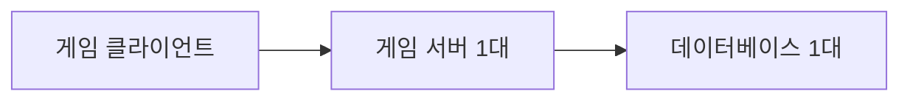
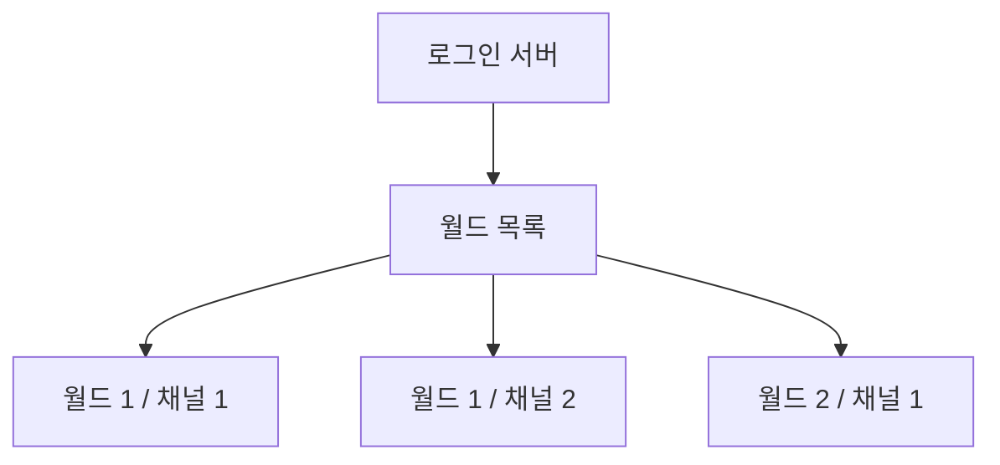
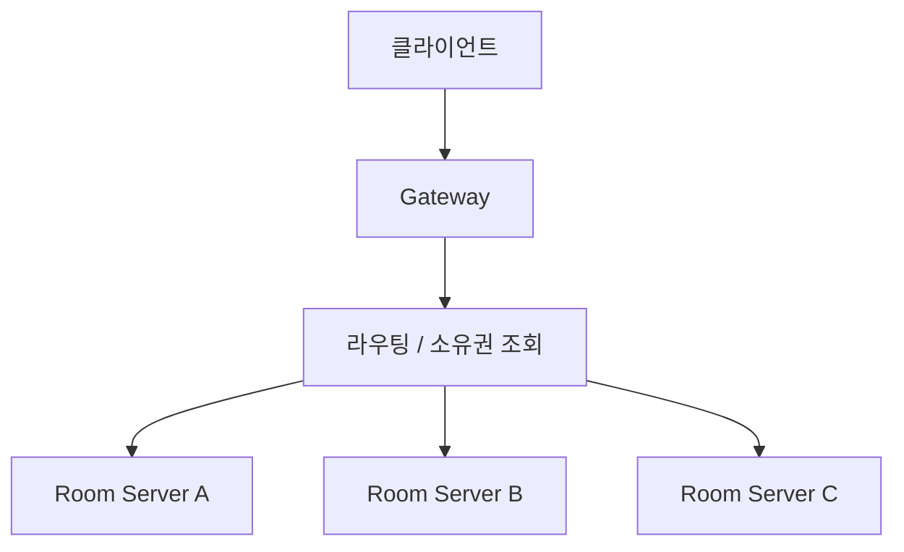
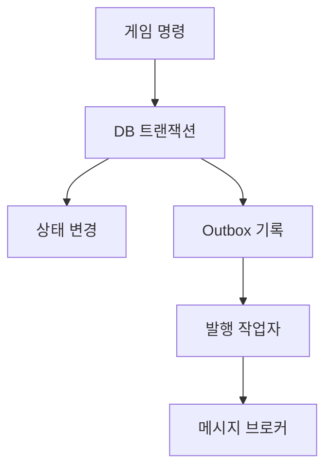

# 분산 서버 구조

## 학습 부분

- 수직 확장과 수평 확장의 차이를 설명

- 고전적인 채널, 월드 분산과 논리적 단일 서버구조 비교

- 데이터 분산과 기능 분산을 구분

- 동기 RPC, 비동기 메시지, 복제 기반 로컬 처리 장단점을 판단

- 데이터를 어디에 모아야 통신과 일관성 비용이 줄어드는지 설명

- 부분 장애, 중복 메시지, 순서 바뀜을 전제로 서버 설계

- 고가용성과 데이터베이스 분산의 기본 원칙을 이해

## 분산 시스템을 보는 네 가지 질문

서버를 나눌 때 먼저 다음 질문에 답해야 한다

1. **누가 이 데이터를 소유하는지**

2. **요청은 소유자를 어떻게 찾는지**

3. **소유자가 실패하면 누가 이어받는지**

4. **중간에 실패하거나 같은 요청이 두 번 오면 결과는 어떻게 되는지**

---

## 수직 확장과 수평 확장

### 수직 확장

수직 확장(scale up)은 한 서버의 CPU, 메모리, 네트워크, 디스크 성능을 높이는 방법

장점:

- 앱 구조를 크게 바꾸지 않아도 된다

- 프로세스 내부 호출과 메모리 접근을 그대로 사용할 수 있음

- 분산 트랜잭션, 원격 호출, 노드 검색 문제가 적음

한계:

- 장비가 제공할 수 있는 최대 사양에 한계가 있음

- 고사양일수록 가격이 급격히 비싸질 수 있음

- 서버 한 대의 장애 영향이 크다

- 확장과 축소에 재시작이나 작업 중단이 필요할 수 있음

### 수평 확장

수평 확장(scale out)은 서버 인스턴스 수를 늘리는 방법

장점:

- 부하에 따라 인스턴스를 추가하거나 제거할 수 있음

- 장애 범위를 여러 노드로 나눌 수 있음

- 범용 장비나 클라우드 인스턴스를 활용하기 쉬움

비용:

- 메모리를 공유할 수 없어 상태를 나누거나 복제해야 한다

- 네트워크 호출과 부분 장애가 생긴다

- 요청을 올바른 노드로 보내는 라우팅 계층이 필요

- 배포 버전이 잠시 섞여도 호환되어야 함

Node.js 프로세스 하나는 기본적으로 한 이벤트 루프에서 JavaScript를 실행. 네트워크 I/O 동시성에 강하나 CPU를 많이 쓰는 게임 로직은 한 코어를 포화시킬 수 있음.

- 프로세스 내부 Worker Threads로 CPU 작업을 분리

- 한 머신에 여러 프로세스를 실행

- 여러 머신이나 Pod로 서비스를 수평 확장

첫 번째와 두 번째는 머신 한 대의 장애를 제거하지 못한다. 고가용성이 목표면 장애 도메인이 다른 여러 노드가 필요하다

### 확장 판단에 사용할 지표

- 이벤트 루프 지연

- CPU 사용률과 CPU throttling

- 메모리와 GC 일시정지

- 동시 연결 수

- 요청 지연

- 네트워크 송수신량

- 데이터베이스 연결 풀 대기와 쿼리 지연

- 게임 틱 초과 횟수

평균값만 보면 짧은 과부하를 놓치기 쉽다. 플레이 경험에 지연이 더 직접적인 경우가 많다

---

## 서버 분산이 없으면?

게임 서버와 데이터베이스가 각각 한대 뿐인 구조는 명확하다



초기 개발, 프로토타입, 인원이 적은 게임에 단순성이 큰 장점이다. 문제를 한 프로세스에 재현하기 쉽고, 네트워크를 건너는 데이터 일관성 문제도 적다.

다음 한계가 있을 수 있음

- 서버 사양이 최대 동시 접속자 수의 상한이 된다

- 서버 한 대가 고장 나면 전체 게임이 중단된다

- 업데이트를 하기 위해 전체 접속자를 끊어야 할 수 있음

- 한 기능의 메모리 누수나 CPU 폭주가 모든 기능에 영향을 준다

> 분산이 없다는 이유만으로 잘못된 구조는 아니다. 측정 결과 한 대로 충분하면 단순한 구조가 더 안정적일 수 있음. 분산은 실제 한계가 확인될 때 비용 대비 효과를 계산해 도입한다

---

## 고전적인 서버 분산

고전적 온라인 게임은 월드, 서버, 채널을 미리 나누고 플레이어가 접속 대상을 선택하도록 했다



각 월드나 채널은 자기 플레이어와 필드 상태를 독립적으로 관리

장점:

- 데이터와 로직 경계가 명확

- 한 월드의 장애가 다른 월드에 미치는 영향을 줄일 수 있음

- 서버 간 실시간 통신이 적어 구현하기 쉬움

단점:

- 인기 월드는 혼잡하고 다른 월드는 비어 있을 수 있음

- 서로 다른 월드의 플레이어가 만나기 어려움

- 친구, 길드, 거래 같은 전역 기능이 복잡해짐

- 월드 통합이나 캐릭터 이전이 큰 운영 작업이 됨

고전적인 구조는 여전히 유효. 플레이어가 분리된 세계를 자연스럽게 받아들이는 장르면 복잡한 논리적 단일 서버보다 비용이 적을 수 있음

---

## 논리적 단일 서버 분산

논리적 단일 서버는 내부적으로 여러 서버가 동작하나 플레이어에게 하나의 서비스처럼 보이는 구조이다. 클라이언트는 특정 물리 서버의 주소나 데이터 위치를 직접 알 필요가 없다



보통 다음 요소가 필요하다

- Gateway: 연결 인증, 속도 제한, 프로토콜 검증

- Service discovery: 살아있는 서버와 주소 검색

- Ownership registry: 방, 존, 플레이어 상태를 어느 서버가 소유하는 지 기록

- Router: 요청 키를 바탕으로 소유 서버를 선택

- Load balancer: 새 세션이나 새 방을 적절한 서버에 배치

### 상태 없는 라우팅과 상태 있는 게임 서버

Gateway는 가능한 한 상태 없이 여러 대로 늘리는 편이 좋다. 반면 방의 전투 상태는 서버 메모리에 있을 수 있다. 이때 모든 Gateway가 roomId로 같은 방 서버를 찾을 수 있어야 한다

```ts
export type RoomOwner = {
  roomId: string;
  serverId: string;
  endpoint: string;
  leaseExpiresAt: number;
};

export interface RoomDirectory {
  findOwner(roomId: string): Promise<RoomOwner | null>;
  claim(roomId: string, serverId: string, ttlMs: number): Promise<boolean>;
  renew(roomId: string, serverId: string, ttlMs: number): Promise<boolean>;
}
```

소유권에 lease 만료 시간을 두는 방식이 흔하다. 서버가 죽어 갱신하지 못하면 다른 서버가 방을 복구할 수 있다. 단, 이전 서버가 잠시 멈췄다 다시 살아나는 경우 두 서버가 자신을 소유자로 믿는 split-brain이 생길 수 있음

세대 번호나 fencing token을 저장 쓰기에 포함해 오래된 소유자의 갱신을 거부해야 한다

```ts
type Ownership = {
  roomId: string;
  serverId: string;
  generation: number;
};

// 저장 시 roomId뿐 아니라 generation도 확인
// 더 오래된 소유자가 보낸 쓰기는 거부
```

### 일관된 라우팅

단순히 hash(key) % serverCount를 사용하면 서버 수가 바뀔 때 대부분의 키가 이동한다. 상태 이동 비용이 크다면 일관 해싱, 랑데부 해싱, 명시적 디렉터리 중 하나를 검토

- 일관 해싱: 서버 변화 때 일부 키만 이동

- 랑데부 해싱: 키마다 가장 높은 점수를 받은 서버 선택

- 디렉터리: 데이터 위치를 저장소에서 직접 조회

---

## 데이터 분산과 기능적 분산

### 데이터 분산

같은 기능을 여러 서버가 수행하되 담당 데이터가 다르다.

- 플레이어 서버 A: playerId 범위 1

- 플레이어 서버 B: playerId 범위 2

- 월드 서버 A: zoneId 집합 1

- 월드 서버 B: zoneId 집합 2

데이터 분산은 처리량을 키우기 좋으나 두 파티션의 데이터를 동시에 변경하는 기능이 어려워진다

### 기능적 분산

서버마다 담당 기능이 다르다

- 인증 서비스

- 매치메이킹 서비스

- 게임 룸 서비스

- 채팅 서비스

- 랭킹 서비스

- 저장 서비스

기능 분산은 독립 배포와 장애 격리에 유리하나 하나의 사용자 요청이 여러 서비스를 연쇄 호출하여 지연과 실패 확률이 증가한다

| 구분        | 데이터 분산               | 기능적 분산                    |
| ----------- | ------------------------- | ------------------------------ |
| 기준        | 플레이어, 방, 존, 길드 키 | 인증, 채팅, 매치, 전투 등 책임 |
| 목표        | 같은 기능 처리량 확대     | 책임, 배포, 장애 범위 분리     |
| 이슈        | 파티션 간 상호 작용       | 서비스 간 호출과 데이터 일관성 |
| 대표 라우팅 | shard key, ownership      | 서비스 이름, API/메시지 타입   |

실제 시스템은 둘을 함께 쓰는 경우가 많다

---

## 로직 처리의 분산 방식들

분산된 서버끼리 협력하는 방식은 크게 동기 호출, 비동기 메시지, 복제 데이터의 로컬 처리로 볼 수 있다

### 동기 분산 처리

서버 A, 서버 B에 요청을 보내고 응답을 기다린 뒤 다음 로직을 진행한다. HTTP, gRPC, NestJS request-response 메시지가 여기에 해당한다

```ts
// inventory.client.ts
import { Inject, Injectable } from "@nestjs/common";
import { ClientProxy } from "@nestjs/microservices";
import { firstValueFrom, timeout } from "rxjs";

@Injectable()
export class InventoryClient {
  constructor(
    @Inject("INVENTORY_SERVICE") private readonly client: ClientProxy,
  ) {}

  reserveItem(command: {
    requestId: string;
    playerId: string;
    itemId: number;
    count: number;
  }) {
    return firstValueFrom(
      this.client
        .send<{ reservationId: string }>("inventory.reserve", command)
        .pipe(timeout(800)),
    );
  }
}
```

```ts
// inventory.controller.ts
import { Controller } from "@nestjs/common";
import { MessagePattern, Payload } from "@nestjs/microservices";

@Controller()
export class InventoryController {
  @MessagePattern("inventory.reserve")
  reserve(@Payload() command: ReserveItemCommand) {
    return this.inventoryService.reserve(command);
  }
}
```

장점:

- 호출 흐름을 이해하기 쉽다

- 즉시 결과가 필요한 판정에 자연스럽다

- 클라이언트에 성공, 실패를 바로 반환할 수 있음

이슈:

- 호출 대상의 지연이 호출자에게 그대로 전파

- A -> B -> C처럼 연쇄 호출하여 실패 지점과 꼬리 지연이 늘어난다

- 타임아웃 뒤 실제로 명령이 수행되었는 지 모호할 수 있음

- 무분별한 재시도는 중복 처리와 재시도를 만든다

동기 호출에 항상 시간 예산, 취소, 제한된 재시도, 멱등성, 회로 차단, 동시 요청 제한을 고려한다. 공격 판정처럼 프레임 시간 안에 끝나야 하는 로직을 먼 서비스 호출에 의존시키지 않는 것이 좋다

### 비동기 분산 처리

송신자가 이벤트나 명령을 큐에 넣고 응답을 기다리지 않는다

```ts
type PlayerLevelUpEvent = {
  eventId: string;
  occurredAt: string;
  playerId: string;
  previousLevel: number;
  currentLevel: number;
};

await this.eventBus.emit("player.level-up", event);
```

장점:

- 생산자와 소비자의 처리 속도를 분리할 수 있다

- 일시적인 소비자 장애를 큐가 흡수할 수 있다

- 로그, 통계, 알림처럼 즉시 응답이 필요 없는 기능에 적합하다

주의점:

- 메시지가 중복되거나 순서가 뒤바뀔 수 있음

- 최종 반영까지 시간이 걸리는 최종적 일관성이 생김

- 처리 실패 메시지와 독성 메시지를 다뤄야 한다

- 큐 적체와 재처리 도구가 필요

현실적인 목표는 흔히 정확히 한 번 전달이 아닌 **최소 한 번 전달 + 멱등한 소비자**이다.

```ts
async handleLevelUp(event: PlayerLevelUpEvent): Promise<void> {
  const inserted = await this.processedEventStore.tryInsert(event.eventId);

  if (!inserted) {
    return;
  }

  await this.achievementService.evaluateLevel(event.playerId, event.currentLevel);
}
```

데이터베이스 저장과 이벤트 발행을 따로 하면 둘 중 하나만 성공할 수 있음. outbox 패턴은 비즈니스 변경과 발행할 이벤트를 같은 로컬 트랜잭션에 저장, 별도 발행자가 outbox를 브로커로 전달



### 데이터 복제에 기반을 둔 로컬 처리

다른 서비스 데이터를 읽기 전용으로 복제해 자기 서버에 처리하는 방법

예:

- 매치 서버가 플레이어 등급과 차단 상태를 로컬 캐시에 보유

- 채팅 서버가 길드 멤버 목록의 읽기 모델을 유지

- 게임 룸이 아이템 정의와 맵 설정을 메모리에 적재

장점:

- 원격 호출을 줄여 응답 시간이 짧고 장애 전파가 적다

- 읽기 처리량을 각 서비스가 독립적으로 확장할 수 있음

비용:

- 원본과 복제본 사이에 지연이 있다

- 이벤트 누락이나 순서 역전으로 복제본이 잘못될 수 있음

- 초기 전체 동기화와 증분 갱신이 모두 필요

복제 데이터에 version이나 sequence를 두어 오래된 이벤트가 최신 상태를 덮어쓰지 못하게 한다

```ts
type PlayerRatingChanged = {
  playerId: string;
  rating: number;
  version: number;
};

async function applyRating(event: PlayerRatingChanged): Promise<void> {
  await ratingReadModel.updateOne(
    {
      playerId: event.playerId,
      version: { $lt: event.version },
    },
    {
      $set: {
        rating: event.rating,
        version: event.version,
      },
    },
    { upsert: true },
  );
}
```

어떤 지연까지 허용 가능한지 기능별로 정해야 한다. 결제 잔액과 차단 여부는 오래된 데이터를 허용, 추천 목록이나 통계는 수 초 지연을 허용할 수 있음

---

## 데이터 응집도

데이터 응집도는 함께 사용되고 함께 변경되는 데이터가 얼마나 가까이 모여 있는지 뜻한다. 응집도가 높은 데이터를 같은 프로세스나 같은 파티션에 두면 원격 호출과 분산 트랜잭션이 줄어든다

한 전투 방의 플레이어, 투사체, NPC 상태 매 틱 서로 영향을 준다. 각각 다른 서버에 나누면 틱마다 네트워크 동기화가 필요. 방 전체를 GameRoomServer가 소유하여 대부분의 판정을 메모리에서 끝낼 수 있음

### 좋은 분산 키

- roomId: 세션형 액션 게임, FPS, MOBA 한 경기

- zoneId: 넓은 월드의 공간 구역

- playerId: 개인 성장과 인벤토리

- guildId: 길드 채팅, 길드전 준비, 공동 자원

- matchId: 매치 기록과 실시간 판정

### 서로 다른 응집 경계의 충돌

플레이어는 인벤토리 관점에서 playerId에 응집되나 전투 판정 관점에서 roomId에 응집된다. 모든 데이터를 한 키로 완벽히 나눌 수는 없다. 그래서 다음과 같이 책임을 나눈다

- 영구 인벤토리의 권위는 PlayerService 갖는다

- 전투 중 사용할 장비 스냅샷은 RoomService가 보유

- 전투가 끝나면 결과 명령을 PlayerService에 전달

- 보상 명령은 requestId로 멱등 처리

데이터를 복사할 수 있으나 **쓰기 권위자는 하나**로 정하는 편이 좋다

---

## 기능적 분산 처리

기능별 서비스를 나눌 때 이름보다 변경 이유와 운영 특성을 본다

| 서비스      | 책임                    | 확장 기준                |
| ----------- | ----------------------- | ------------------------ |
| Gateway     | 연결, 인증, 패킷 검증   | 연결 수, 네트워크 대역폭 |
| Auth        | 로그인, 토큰, 제재 확인 | 로그인 요청 수           |
| Matchmaking | 대기열과 매치 생성      | 큐 길이, 매치 계산량     |
| Room        | 실시간 게임 로직        | 활성 방 수, 틱 CPU       |
| Chat        | 채널, 귓속말, 필터링    | 메시지 수, 동시 구독자   |
| Player      | 인벤토리, 성장, 재화    | 플레이어 명령 수         |
| Ranking     | 점수 집계, 조회         | 쓰기 이벤트, 읽기 트래픽 |

서비스를 지나치게 잘게 나누면 간단한 요청도 여러 네트워크 호출을 거친다.

- 독립적으로 확장해야 하는지

- 장애를 격리해야 하는 지

- 데이터 소유권이 명확히 다른지

- 배포 주기나 보안 요구가 다른가

- 팀이 독립적으로 운영할 가치가 있는지

처음에 모듈식 모놀리스로 책임 경계를 코드에서 분리, 프로세스로 떼어내는 방법도 있음

---

## 분산 처리를 엄선해야 하는 이유

분산은 용량 문제를 해결하나 새로운 실패 방식을 만든다

### 분산 시스템에 생기는 비용

- 네트워크는 지연되거나 끊길 수 있음

- 응답이 없다고 요청이 실행되지 않은 것은 아님

- 메시지는 중복되거나 순서가 바뀔 수 있음

- 서버마다 시간이 조금씩 다름

- 동시에 배포되지 않아 여러 API 버전이 공존

- 로그가 여러 서버에 흩어져 한 요청을 추적하기 어려움

- 일부 서비스만 성공하는 부분 실패가 생김

- 로컬 트랜잭션으로 전체 일관성을 보장하기 어려움

서비스 하나를 분리하면 배포, 관측, 경보, 보안, 데이터 마이그레이션, 대응의 경계도 늘어난다

### 분리하지 말아야 하는 것

- 실제 성능 지표 없이 미래 트래픽만 상상

- 데이터 소유권이 겹치고 여러 서비스가 같은 테이블을 직접 수정

- 로컬 함수 호출을 원격 RPC로 바꾼 것 외에 독립성이 없음

- 서비스별 운영 담당과 장애 대응 방법이 없음

- 통합 테스트와 추적 도구 없이 호출 단계만 늘어난다

---

## 분산 처리 전략

분산은 한 번에 완성하는 구조가 아닌 병목과 위험을 하나씩 분리하는 과정

### 권장 순서

1. 부하 테스트와 운영 지표로 실제 병목을 찾음

2. 알고리즘, 쿼리, 인덱스, 메모리 사용을 먼저 최적화

3. 상태 없는 API를 여러 인스턴스로 늘린다

4. 세션 상태를 외부 저장소로 옮기고 명시적 소유권을 둔다

5. roomId, playerId 등 응집도가 높은 키로 데이터와 로직을 나눈다

6. 독립적인 부하와 장애 특성이 있는 기능을 분리

7. 자동 배치, 재조정, 장애 복구를 추가한다

### 분산 단위 선택표

| 상황                              | 단위                                 |
| --------------------------------- | ------------------------------------ |
| 매치 상호 작용 매우 많음          | matchId, roomId                      |
| 넓은 월드에 근처 객체만 상호 작용 | zoneId 또는 공간 셀                  |
| 개인 성장 데이터가 대부분         | playerId                             |
| 길드 단위 변경이 많음             | guildId                              |
| 로그인만 순간적으로 폭증          | 기능 분리, 상태 없는 Auth 인스턴스   |
| AI 계산만 CPU를 사용              | 방/존 단위 작업자 또는 Worker Thread |

### API 메시지 계약

- 필드를 추가하는 변경은 이전 소비자가 무시할 수 있게 한다

- 필드 의미 변경이나 삭제는 버전 전환 기간을 둔다

- 시간 제한, 최대 메시지 크기, 오류 코드를 계약에 포함

- requestId, traceId, schemaVersion을 표준 메타데이터로 둔다

- 이벤트 이름은 명령형보다 이미 일어난 사실을 표현

---

## 분산 서버의 또 다른 장점

분산의 목적은 처리량만이 아니다.

### 장애 격리

채팅 장애가 전투 서버까지 중단시키지 않도록 자원과 프로세스를 나눌 수 있다. 다만 호출 의존성이 강하면 분리했어도 장애가 전파되고 타임아웃과 대체 동작이 필요하다.

### 독립 배포

매치메이킹 알고리즘만 업데이트하거나 특정 지역 서버만 점진적으로 배포할 수 있고 구버전과 신버전의 프로토콜 호환이 중요하다

### 보안 경계

인터넷에 노출되는 Gateway와 내부 데이터 서비스를 다른 네트워크 권한으로 분리할 수 있고 서비스 계정마다 최소 권한을 적용한다

### 자원 특성에 맞는 배치

네트워크 연결이 많은 Gateway, CPU를 많이 쓰는 Room, 메모리가 중요한 캐시를 서로 다른 인스턴스 유형에 배치할 수 있음

### 팀 소유권

기능과 데이터 경계가 명확하면 팀이 독립적으로 개발하고 운영할 수 있고, 반대로 소유권이 없는 서비스가 많아지면 장애 대응이 더 느려진다.

---

## 고가용성

고가용성 서버를 두 대 띄우는 것만으로 완성되지 않음. 장애 감지, 트래픽 전환, 상태 복구, 데이터 일관성 등이 모두 필요하다

### 핵심용어

| 용어         | 의미                                         |
| ------------ | -------------------------------------------- |
| RTO          | 장애 후 서비스를 복구해야 하는 목표 시간     |
| RPO          | 복구 시 허용 가능한 데이터 손실 범위         |
| 도메인       | 함께 실패할 수 있는 범위                     |
| Health check | 인스턴스가 요청을 받을 수 있는 지 확인       |
| Failover     | 장애 노드의 역할을 다른 노드가 이어받는 과정 |

### NestJS 종료

배포나 종료 신호를 받을 때 새 연결과 새 매치를 받지 않고 진행 중인 작업을 정리

```ts
// main.ts
async function bootstrap() {
  const app = await NestFactory.create(AppModule);
  app.enableShutdownHooks();
  await app.listen(3000);
}
```

```ts
import { BeforeApplicationShutdown, Injectable } from "@nestjs/common";

@Injectable()
export class RoomDrainService implements BeforeApplicationShutdown {
  private draining = false;

  isAcceptingNewRooms(): boolean {
    return !this.draining;
  }

  async beforeApplicationShutdown(): Promise<void> {
    this.draining = true;
    await this.waitForRoomsToFinishOrCheckpoint(25_000);
  }
}
```

Kubernetes readiness는 새 트래픽을 받아도 되는지, liveness는 프로세스를 재시작해야하는지를 표현. 둘을 같은 조건으로 만들면 일시적인 의존성 장애 때 모든 Pod가 동시에 재시작되는 문제가 생길 수 있다.

### 장애 복구에서 확인

- 같은 랙이나 가용 영역에 모든 복제본을 두지 않음

- 새 리더가 정해질 때 이전 리더의 쓰기를 차단

- 진행 중인 방을 복구할 체크포인트나 재접속 정책을 정한다

- 클라이언트 재접속에 지수 백오프, 지터를 사용

- 장애 조치 시간을 부하 테스트와 게임으로 검증

- 자동 복구가 실패할 때 수행할 절차 문서화

---

## 데이터베이스 분산

앱 서버를 늘려도 모든 요청이 데이터베이스 한 대에 몰리면 데이터베이스가 병목이 됨

### 읽기 복제

읽기 복제본은 조회 부하를 분산하나 복제 지연이 있다.

### 샤딩

플레이어 ID나 길드 ID로 데이터를 여러 데이터베이스에 나눈다. 앱은 키로 샤드를 계산하거나 디렉터리에 위치를 찾는다

```ts
export class PlayerShardRouter {
  constructor(private readonly shards: readonly PlayerRepository[]) {}

  forPlayer(playerId: string): PlayerRepository {
    const hash = this.stableHash(playerId);
    return this.shards[hash % this.shards.length];
  }

  private stableHash(value: string): number {
    let hash = 2166136261;
    for (const char of value) {
      hash ^= char.charCodeAt(0);
      hash = Math.imul(hash, 16777619);
    }

    return hash >>> 0;
  }
}
```

나머지 방식은 샤드 수가 바뀌면 대부분의 플레이어가 다른샤드로 이동한다는 단점이 있음

### 캐시

Redis 같은 캐시는 읽기와 임시 상태를 빠르게 처리하나 기본 데이터의 권위자를 불분명하게 만들면 안 된다

- cache-aside: 없으면 DB에서 읽어 캐시에 넣는다

- write-through: 쓰기 경로에 DB와 캐시를 함께 갱신

- invalidation: 변경 이벤트로 관련 캐시를 지운다

캐시 장애 때 데이터베이스로 트래픽이 한꺼번에 몰리는 cache stampede에 대비해 요청 병합, TTL 지터, 동시 재생성 제한 사용

### 분산 트랜잭션 대신 경계 재설계

서로 다른 샤드의 재화를 한 트랜잭션으로 바꾸는 기능은 비싸고 복잡하다.

- 거래 명령을 한 소유 서비스가 직렬화

- 에스크로 문서를 두고 단계별 상태 전이를 기록

- Saga와 보상 동작을 사용

- outbox와 멱등 소비자로 이벤트 전달을 보장

---

## 요약

- 수직 확장은 단순하나 상한과 장애 범위가 있고, 수평 확장은 처리량을 늘리나 분산 비용을 만듦

- 채널, 월드 분리는 명확하고 실용적인 분산 방식

- 논리적 단일 서버에 Gateway, 서비스 검색, 소유권, 라우팅이 필요

- 데이터 분산은 같은 기능의 처리량을 늘리고, 기능 분산은 책임과 장애 범위를 나눈다

- 동기 호출은 즉시 결과에, 비동기 메시지는 느슨한 결합과 부하 흡수에 적합

- 복제 기반 로컬 처리는 빠르나 오래된 데이터를 허용하는 범위를 정해야 한다

- 상호 작용이 많은 데이터와 로직을 같은 소유자에 모으면 원격 호출이 줄어듦

- 최소 한 번 전달을 전제로 소비자를 멱등하게 만들고, 중요한 이벤트는 outbox로 다룬다

- 고가용성은 중복 배치뿐 아닌 장애 감지, 전환, 복구, 훈련까지 포함

### 복습 질문

### 수직 확장과 수평 확장은 각각 어떤 복잡성을 만드는 지

수직 확장은 구조를 비교적 단순하게 유지할 수 있고, 장비의 물리적 한계와 단일 장애 지점 문제가 생긴다. 수평 확장은 여러 서버로 처리량과 가용성을 높일 수 있고, 상태 분산과 요청 라우팅, 네트워크 장애, 데이터 일관성 같은 분산 시스템 복잡성이 생김

수직 확장(Scale Up)은 서버의 CPU, 메모리, 디스크, 네트워크 성능을 높이는 방식

수평 확장(Scale Out)은 서버 프로세스나 Pod의 수를 늘리는 방식

NestJS API 서버가 상태를 보유하지 않으면 Pod로 확장하기 쉽다. 전투 방 상태를 프로세스 메모리에 보관하면 단순히 Pod 수만 늘려서는 안 된다. roomId를 담당 Room Server를 찾는 라우팅과 소유권 관리가 함께 필요

### 월드, 채널 분산이 유효한 경우

플레이어가 서로 분리된 월드나 채널을 자연스럽게 받아들일 수 있고, 서버 간 실시간 상호 작용이 많지 않으면 고전적인 월드, 채널 분산은 여전히 유효하다

Node.js, NestJS -> 각 월드 서버를 별도의 앱이나 배포단위로 구성, 월드 내부의 방과 플레이어 상태를 해당 월드가 관리할 수 있음. 인증이나 공지 같은 전역 기능만 별도 서비스로 두면 서버간 실시간 호출을 줄일 수 있음

### 데이터 분산과 기능적 분산의 차이

데이터 분산은 같은 기능을 여러 서버가 수행하되 담당 데이터 범위를 나누는 방식, 기능적 분산은 인증, 매칭, 채팅, 전투처럼 서로 다른 책임을 별도 서비스로 나누는 방식

데이터 분산: Player Service의 기능은 같으나 playerId에 따라 담당 서버가 달라지는 구조

기능적 분산: Auth Service는 로그인, Matchmaking Service는 매칭, Room Service는 실시간 전투를 담당

함께 사용하는 구조

실제 서비스에 두 방식을 함께 사용. Matchmaking Service를 기능적으로 분리, Region과 gameMode를 기준으로 다시 데이터 분산

### 최소 한 번 전달과 멱등 소비자

분산 시스템에 메시지 처리와 처리 완료 응답 사이에 장애가 발생, 송신자가 메시지가 처리됐는지 알기 어렵다. 메시지 손실을 막기 위해 재전송하면 중복 가능성이 생겨, 최소 한 번 전달과 멱등한 소비자를 조합하는 방식이 현실적

레벨업 보상 메시지가 중복 전달되었을 때 eventId를 확인하지 않으면 보상이 두 번 지급될 수 있어 processed_events 테이블에 eventId를 고유하게 저장, 최초 처리만 보상을 지급하도록 한다
