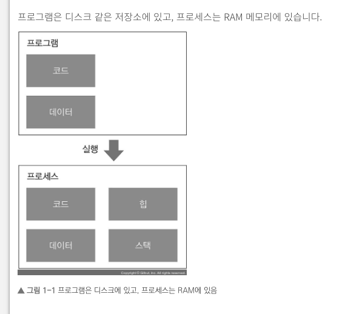

## 1장 멀티스레딩

- 게임 서버를 개발하면 필연적으로 멀티스레드 프로그래밍을 하게 된다.
- 싱글스레드로만 작동하는 비동기 함수 콜백(asynchronous callback)이나 코루틴(coroutine)을 쓰더라도 멀티스레딩을 이해하면 유용하다.
- 멀티스레드가 무엇이고, 왜 써야하는 지 알아본다.

---

### 1.1 프로그램과 프로세스

- 프로그램이란 컴퓨터에서 실행되는 명령어 모음이 들어있는 데이터 덩이리를 의미한다. 코드(code)와 데이터(data)로 구성되어 있다.
- 프로그램 자체는 아무런 의미가 없다. 그것을 더블클릭하여 실행시키기 전까지는
- 프로그램을 실행하면 프로그람 안에 들어있는 명령어가 한줄 씩 실행되며 프로그램은 뭔가 활동을 하는 상태가 되고 이를 **프로세스(process)**라고 한다.

- 프로그램에 있는 코드와 데이터는 프로세스 메모리로 불러들인다. 즉 로딩된다.
- 프로세스 메모라에 프로그램 코드와 데이터는 물론 힙(heap)과 스택(stack)도 공존한다.
- 스택에는 현재 실행 중인 함수들의 호출 기록과 사용 중인 로컬 변수들이 들어 있다.

- 윈도 운영체제에서 실행된 프로그램을 작업관리자로 확인할 수 있다.
- 기기 안에서 실행 중인 프로세스는 여러개이다.
- 같은 프로그램을 여러 개 동시에 실행할 수 도 있다.

- 프로세스가 여러 개 실행되고 있는 것을 멀티프로세싱(multi-processing)이라고 한다.

### 1.2 스레드

- 프로세스에 독립된 메모리 공간이 있다. 기본적으로 서로 다른 프로세스는 상대방의 메모리 공간을 읽고 쓸 수 없다.

- 운영체제는 대부분 스레드(thread)라는 기능을 제공한다.
- 스레드 역시 프로세스 처럼 명령어를 한 줄 씩 실행하는 기본 단위이다. 스레드와 프로세스 차이점은 다음과 같다.
  - 스레드는 한 프로세스 안에 여러 개가 있다.
  - 한 프로세스 안에 있는 스레드는 프로세스 안에 있는 메모리 공간을 같이 사용할 수 있다.
- 스레드마다 스택을 가진다. 각 스레드에서 실행되는 함수의 로컬 변수들이 스레드마다 있다는 의미이다.

- 프로그램이 실행되는 기본 단위는 스레드이다.
- **프로그램을 실행하면 프로세스가 생성된다. 프로세스 안에는 유일한 스레드가 있고 그 안에서 프로그램이 실행된다.**

- 하나의 스레드만 실행되는 프로그램, 즉 지금까지 우리가 알던 '동시에 하나만 실행되는 프로그램'을 싱글스래드 프로그램이라 한다.
- 싱글스레드로만 작동화도록 프로그램을 설계하고 구현하는 것을 싱글스레드 모델(single threaded model)이라고 한다.

- 기본으로 존재하는 스레드를 메인 스레드(main thread)라고 한다.
- 대부분 메인 스레드에서 프로그램을 실행했던 것이다.
