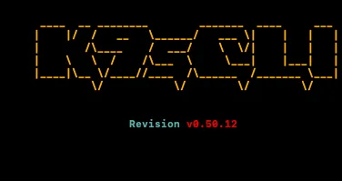

# 🌐 K9s - 쿠버네티스 관리

- kubectl에서 K9s는 터미널에서 쿠버네티스를 쉽고 빠르게 관리할 수 있게 하는 편한 도구다.

## 🎯 K9s는?

K9s는 터미널 기반의 쿠버네티스 대시보드이다.

- kubectl의 복잡한 명령어들을 단축키 몇개로 결정한다.
- **실시간 모니터링**과 **즉석 작업** 가능하다.
- **마우스 없이도** 모든 작업을 할 수 있다.
- **색상과 하이라이트**로 한눈에 확인할 수 있다.

### 설치하기 💻

macOS

```bash
# Homebrew로 설치
brew install k9s

# 설치 확인
k9s version
# 출력: v0.27.4
```

Linux

```bash
# 직접 다운로드
curl -sS https://webinstall.dev/k9s | bash

# 패키지 매니지
sudo snap install k9s

```

Windows

```bash
# Chocolatey로 설치
choco install k9s

# 또는 Scoop으로
scoop install k9s
```

---

### 기본 실행하기 🚀

K9s 시작

```bash
# kubeconfig의 클러스터에 연
k9s

# 특정 네임스페이스로 시
k9s -n kube-system

# 특정 클러스터 지정
k9s --context my-cluster
```

k9s를 처음 실행하면 나오는 화면이다.


#### 핵심 단축키 ⌨️

1. **네임스페이스 관련**
   | 키 / 명령어 | 기능 | 설명 |
   | --- | --- | --- |
   | **`0`** | 모든 네임스페이스 보기 | `kubectl get pods -A`와 동일한 효과로, 모든 네임스페이스의 리소스를 한번에 봅니다. |
   | **`:ns`** | 네임스페이스 목록 보기 | 네임스페이스 목록을 열어 특정 네임스페이스로 이동합니다. |
   | **`Ctrl+a`** | 모든 네임스페이스 토글 | 현재 선택된 네임스페이스 ↔ 전체 네임스페이스 보기를 빠르게 전환합니다. |

2. **리소스 이동**
   | **명령어** | **리소스** | **설명** |
   | --- | --- | --- |
   | `:pod` | Pod | 파드 목록을 봅니다. (기본 화면) |
   | `:svc` | Service | 서비스 목록을 봅니다. |
   | `:deploy` | Deployment | 디플로이먼트 목록을 봅니다. |
   | `:ing` | Ingress | 인그레스 목록을 봅니다. |
   | `:node` | Node | 노드 목록을 봅니다. |
   | `:pv` | PersistentVolume | PV(영구 볼륨) 목록을 봅니다. |
   | `:pvc` | PersistentVolumeClaim | PVC(영구 볼륨 클레임) 목록을 봅니다. |
   | `:secret` | Secret | 시크릿 목록을 봅니다. |
   | `:cm` | ConfigMap | 컨피그맵 목록을 봅니다. |

3. **상호작용키**
   | 키 | 기능 | 설명 |
   | --- | --- | --- |
   | **`Enter`** | 상세 보기 | 선택한 리소스의 핵심적인 요약 정보를 봅니다. |
   | **`d`** | Describe | `kubectl describe`를 실행한 것과 동일한 상세 정보를 봅니다. |
   | **`l`** | **로그 보기** | **(가장 중요!)** 선택한 파드의 실시간 로그를 스트리밍합니다. |
   | **`e`** | 편집 | 리소스의 YAML 설정을 직접 편집합니다. |
   | **`Ctrl+d`** | **삭제** | **⚠️ 주의:** 선택한 리소스를 삭제합니다. (확인 창이 뜹니다) |
   | **`y`** | YAML 보기 | 리소스의 전체 YAML 정의를 봅니다. |

4. **검색과 필터링**
   | 키 | 기능 | 설명 |
   | ------------------------- | -------------- | ---------------------------------------------------- |
   | **`↑`**/**`↓`** | 항목 선택 | 목록에서 위/아래로 이동합니다. |
   | **`Ctrl+u`**/**`Ctrl+d`** | 페이지 이동 | 목록이 길 때 페이지 단위로 빠르게 스크롤합니다. |
   | **`g`**/**`G`** | 처음/끝으로 | 목록의 맨 위(g) 또는 맨 아래(G)로 즉시 이동합니다. |
   | **`Esc`** | 뒤로 가기 | 로그 보기 등 하위 화면에서 이전 화면으로 복귀합니다. |
   | **`:q`** | 종료 | K9s 프로그램을 완전히 종료합니다. |
   | **`/`** | 검색 모드 | 입력하는 텍스트로 리소스 이름을 실시간 필터링합니다. |
   | **`n`**/**`N`** | 다음/이전 검색 | (일반 텍스트 검색 시) 검색 결과 간 이동합니다. |

---

### k9s, kubectl 비교 ⚔️

1. kubectl의 명령어

```bash
#파드 목록 확인
kubectl get pods -A

# 특정 파드 로그 보기
kubectl logs -f my-pod -n my-namespace

# 파드 상세 정보
kubectl describe pod my-pod -n my-namespace

# 서비스 목록
kubectl get svc -A

# 리소스 삭제
kubectl delete pod my-pod -n my-namespace
```

2. k9s:

```bash
k9s 실행 -> 0 -> 방향키 -> l (로그)
k9s 실행 -> 0 -> 방향키 -> d (describe)
k9s 실행 -> :svc -> Enter
k9s 실행 -> 방향키 -> crtl+d (삭제)
```

### 자주 쓰는 명령어 순서 💡

```bash
k9s 실행 -> 0 -> /검색어 -> 방향키 -> l

1.:pod(pod 목록)
2.:svc(서비스 확인)
3.:deploy(배포 상태)
4.:node(노드 상태)
5.ns(네임스페이스)

```
